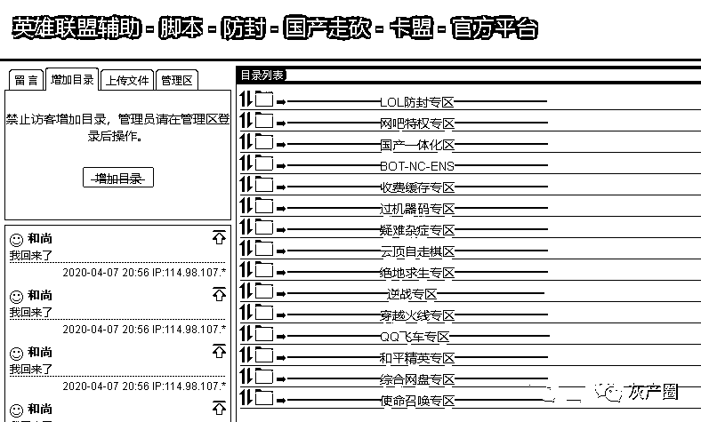

# 外挂销售“金字塔”，卖“挂”的为何如此猖狂！？

> 原文：[`mp.weixin.qq.com/s?__biz=MzIyMDYwMTk0Mw==&mid=2247499311&idx=2&sn=25555b2869f37f576e1dc0fa6ccb04ec&chksm=97cb3517a0bcbc011221306e945da0a1a4a1d2c7616b6793dfc5f563a9a8e493741930927501&scene=27#wechat_redirect`](http://mp.weixin.qq.com/s?__biz=MzIyMDYwMTk0Mw==&mid=2247499311&idx=2&sn=25555b2869f37f576e1dc0fa6ccb04ec&chksm=97cb3517a0bcbc011221306e945da0a1a4a1d2c7616b6793dfc5f563a9a8e493741930927501&scene=27#wechat_redirect)

**点击上方蓝色字体免费订阅“灰产圈”**

1

众所周知，如今卖外挂的人似乎越来越猖狂， 以前都是在各种群里兜售，现在已经发展到“直播卖挂”，更夸张的是到网吧里面“线下卖挂”。

比如你正在网吧玩着吃鸡，突然身边过来一个人，张嘴就问题“兄弟，要挂吗”？

千万不要以为这是我们在编故事或者危言耸听，而是很多玩家根本不了解这些卖外挂的到底有多疯狂，以及他们为什么如此猖狂？

2

**庞大的销售“金字塔”**

前段时间，COD 战区一次封禁了几万个作弊玩家的帐号，很多人不禁会纳闷这么多人开挂？

他们都是从哪买的？

今天，我们就要给大家揭示一下外挂团伙庞大的“金字塔销售”模式。

也正是在这样的模式下，无数外挂销售人员才会如此肆无忌惮的卖挂。

**最底层的“零售人员”**

这些人外挂销售团队中的最底层，同时也是最猖狂的一批人，因为他们拿到的外挂价格已经是最高的了，所以为了能把手中的外挂贩卖出去。

上到直播卖挂、游戏喊话，下到到处炸群、社区刷广告。

那些在线下网吧中兜售外挂的人就是他们中的一员。

这些人拿到的外挂因为价格高，所以一旦不能马上贩卖出手，就会砸到手里。

再加上无论游戏更新还是外挂更新，这些人往往是最“后知后觉”的，为了把手中的外挂尽快出手，他们当然是无所不用其极。

**各种直播卖挂的 Up 主**

3

**苦逼的加盟商**

相比那些零售人员，加盟商的待遇似乎好上很多？

其实也不尽然，他们也不过是“中间商，赚个差价”罢了。

而且想要成为加盟商，最关键的一点就是要在平台“交押金”。

所以上面的平台一旦有个风吹草动，他们交的押金很可能就打水漂了。

而且这些加盟商虽然可以拿到“批发价”，但同时也是有拿货数量要求的。

必须要一次买够多少量的货，才能享受到最低价优惠。因为大量的外挂囤货在手中，他们不但要疯狂的发掘那些能够帮助他们“散货”的零售人员，自己也要想办法出货。

所以那些个手中有“大群”直接叫卖，甚至干脆就买“互联网广告”，比如某宝、某度，利用他们的大数据把外挂广告精准的推荐给玩家。

4

**心惊胆战的卡盟平台**

曾经那些卖外挂的卡盟还是很潇洒的，甚至干脆就直接雇几个外挂作者养着就行。

但是随着厂商反外挂能力越来越强，一般二般的外挂作者早就不能快速的做出赢得“挂逼”喜爱的外挂了，最后还得靠那些“大牛作者”。

另外以前的大牛作者往往初期要自己投入大量的研发成本来开发外挂，现在这些大牛直接就跟平台索要“研发费用”，哪家平台给的多，哪家平台可以享受到最低货源价。

当然现在很多平台都是一起凑钱给大牛确保“公平竞争”。

而这些平台正是因为自己成了外挂的“投资人”，当然更是急于贩卖外挂在最短的时间里把投入挣回来。

外挂的“有效期”谁也不知道，一旦卖的慢了，或者出货少了，他们的先期投入就会赔掉。

5

**外挂作者也心虚**

最近几年各大游戏公司和平台对于外挂的打击力越来越大，国家相关的法规政策虽然还未健全，但是整治力度却是一年比一年强。

所以这些外挂作者也是很心惊胆战的，他们也害怕被游戏公司查到，因为一旦被抓到公安和法院介入之后，不但要赔偿游戏公司一笔巨额损失费，还免不了要去“蹲一段时间”。

所以这些作者往往都是抱着“挣一笔快钱，钱到手就收手”这样的心理。

6

**写在最后**

整个外挂团伙的关系是这样的：

作者急于套现闪人----平台被套住大笔“研发费用”----加盟商被平台套住大笔押金和“货款”----零售人员被套住少量货款。

整个利益链条自上而下，环环相扣，复杂程度堪比传销，每一个环节中的每一个人都急于“变现”，所以最终落实到零售人员和加盟商这两个直接销售的环节。

**他们怎能不肆无忌惮？**

**怎能不疯狂？**

最后我们个人认为，无论是游戏公司还是政府层面想要解决这个“外挂”问题，光靠“整治玩家”是不够的。

因为开挂的玩家需求始终摆在那里，就跟考试作弊一样，想要整治除了正确的舆论引导和教育，更多的还是需要在外挂销售层面去“降维打击”，要从电商、搜索引擎、游戏公司、法规政策、媒体、社交平台等多个方面共同努力。

从根本上断掉这个外挂销售金字塔的传播渠道，才有可能从根本上扼制如今愈演愈烈的外挂浪潮。

当然，最终用不用外挂，决定权还是取决在玩家自己手里。

我们真心希望每个玩家都能守好自己的道德底线，坚决对外挂说：

**No！打击外挂，人人有责！**

← 向右滑动与灰产圈互动交流 →

**点击****阅读原文****加入灰产圈高端社群**

