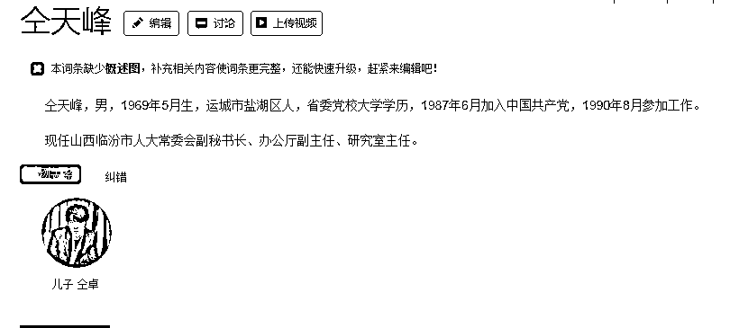

# 仝卓坑”爹”了？还是爹“坑”仝卓了？

> 原文：[`mp.weixin.qq.com/s?__biz=MzIyMDYwMTk0Mw==&mid=2247499311&idx=3&sn=20720338a28ef50eb863a482eac7478c&chksm=97cb3517a0bcbc01a82ea7015a9427797106bf1efaef34444393f30e236e77d8cde700588f7b&scene=27#wechat_redirect`](http://mp.weixin.qq.com/s?__biz=MzIyMDYwMTk0Mw==&mid=2247499311&idx=3&sn=20720338a28ef50eb863a482eac7478c&chksm=97cb3517a0bcbc01a82ea7015a9427797106bf1efaef34444393f30e236e77d8cde700588f7b&scene=27#wechat_redirect)

**点击上方蓝色字体免费订阅“灰产圈”**

**艺人仝卓的高考身份问题广受关注，有网友注意到，仝卓父亲仝天峰任职于山西临汾市人大常委会。**

△来源百度百科 

艺人仝卓在直播中自曝高考时将往届生身份改为应届生，被质疑高考舞弊。因仝卓父亲仝天峰被指任职于山西临汾市人大常委会，6 月 1 日，临汾人大常委会综合办公室工作人员表示，对于仝天峰是否参与修改儿子仝卓学历身份一事，临汾相关部门已介入调查。

***往届变应届，仝卓直播自曝变“自爆”***

5 月底，艺人仝卓在直播中自曝，高考时将往届生改为应届生身份。他称，由于当时自己心仪的高校要求应届生身份，于是“通过一些手段”修改了自己的往届生考生的身份。

此言论一出随即引发舆论关注。有网友认为，这一行为涉嫌“高考舞弊”。

仝卓在此后的一场直播中也曾再度谈及这一话题。他称，“应届生”是自己考学失利后复读时的自我暗示。期间，他还数度“哽咽”，称当艺人说话不自由。

仝卓直播时的画面。视频截图

[`v.qq.com/iframe/preview.html?vid=k0974grurmw&auto=0&width=500px&height=375px`](https://v.qq.com/iframe/preview.html?vid=k0974grurmw&auto=0&width=500px&height=375px)

▲实探自曝高考舞弊艺人仝卓老家，村主任称其父为山西一地市人大官员。

新京报我们视频出品

***舆论发酵，仝卓被迫道歉***

此事引发舆论关注后，多部门先后发声。教育部表示，对弄虚作假等违规行为零容忍，此事虽时隔多年，但会坚决追查到底。

仝卓的母校中央戏剧学院也回应称，密切关注此事，配合教育部开展调查。 

山西省教育厅发布声明称，已经联合有关部门和市政府全面开展调查核实。彻查到底，坚决维护教育公平公正。如发现违规违纪问题，严肃追责问责。 

5 月 29 日，“沉默”一段时间后的仝卓通过社交平台发布道歉信称：十分羞愧，申请撤销学籍，愿意承担一切后果。

***其父被质疑，临汾市人大介入***

网友对仝卓的道歉并不买账，大家认为仝卓的道歉是“避重就轻”，此事件的关键问题还没有答案，篡改高考身份有何后果？“一些手段”是哪些手段，背后有何“帮凶”？

此后，有网友指出，仝卓的父亲任职于山西临汾市人大常委会。有人怀疑仝卓的父亲或参与仝卓“高考时将往届生改为应届生身份”一事。

据新京报消息，据仝姓文化研究会两名负责人介绍，仝姓文化研究会每两年举办一次联谊会，**仝卓的父亲仝天峰为仝姓联谊会的全国副会长、山西分会会长。此外，仝天峰在山西临汾市人大常委会任职。**

临汾市人大官网显示，临汾市人大常委会一名副秘书长、研究室主任名为仝天峰。

[`v.qq.com/iframe/preview.html?vid=a0975j0175b&auto=0&width=500px&height=375px`](https://v.qq.com/iframe/preview.html?vid=a0975j0175b&auto=0&width=500px&height=375px)

▲仝卓自曝学籍造假引教育部门跨省调查：延安市教育局参与协查。

新京报我们视频出品

6 月 1 日，临汾人大常委会综合办公室工作人员表示，对于仝天峰是否参与修改儿子仝卓学历身份一事，临汾相关部门已介入调查。

***若想人不坑，除非己莫为***

该事件很容易引发“儿子坑爹”的讨论。

但跳出个案看，就“坑爹”问题而言，所谓坑爹往往是自得其果：先有爹坑儿，再有儿坑爹，这是通行规律。

现实中，有的人过着被命运安排的人生，而有的人过着被上一辈安排的人生。对于后者来说，往往是“成也萧何，败也萧何”，追根溯源，责任可能更多的在上一辈。

在电影《老炮儿》中，吴亦凡饰演的高官之子，是个纨绔子弟，绰号“三环十二郎”。因为不小心泄露了自己父亲的贪腐材料，他只能和“六爷”斗智斗勇。最后，那份材料还是被交给了中纪委。看到类似的故事，我们都会下意思地想到一个流行词：坑爹。

▲电影《老炮儿》剧照。

但基本逻辑应该是这样的：如果没有父亲的违法犯罪行为，又哪来的儿子泄露资料呢？

坑爹的案例，可谓不胜枚举，其中最广为人知的非“我爸是李刚”莫属。这类行为，更多的是出于一种倚傍特权的炫耀。

此前，在今年 2 月份，有一湖北的年轻网民何昊发布微博称，在湖北因疫情全省封路的情况下，自己通过官员父亲的关系，从湖北天门回到荆州。

随后，舆情激愤，荆州市纪委监委就此问题展开调查，最终查明其父何炎仿，系荆州市商务局市场运行科科长。

2 月 14 日，何昊在天门完成规定隔离期后，通过其父何炎仿的私人关系，联系一辆采购物资的顺风车返回荆州。最终，荆州市商务局党组对何昊的父亲何炎仿作了停职处理。

***这是实力坑爹的典型***

做父亲的，没有好好教育儿子，更没有以身作则；做官的，对不起国家和民众，搞一些作奸犯科的勾当，这分明是坑了儿子和民众，哪来被坑一说？

这就和一个个“红颜祸水”的典故是一样的道理。自己犯下的错，根本责任却要归咎到他人身上，如果这就是所谓的反思，那么类似的错误就不可避免。

一句话：若想人不坑，除非己莫为。

目前，就仝卓这次事件，5 月 29 日，临汾市教育局回应，已汇报省教育厅；仝卓的母校中央戏剧学院党委宣传部回应，招生办已经核实，也跟教育部学生司进行了报备；教育部发布通报称，将对此事追查到底，对此我们不妨拭目以待。

当年的那期“违规修改身份案”里究竟掺杂了多少权力的魅影，究竟有多少人牵涉其中，谁疏通了关系谁进行了暗箱操作，又是否存在“爹坑儿”问题，公众在等着答案揭晓。

来源丨长沙晚报、中国新闻网、新京报、人民网 编辑丨刘天乐 值班主任丨黄飞武

← 向右滑动与灰产圈互动交流 →

**点击****阅读原文****加入灰产圈高端社群**

