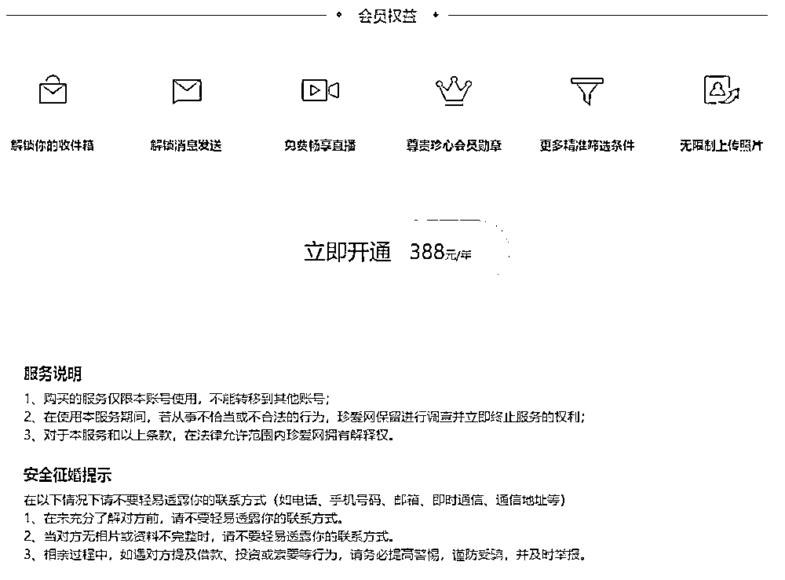
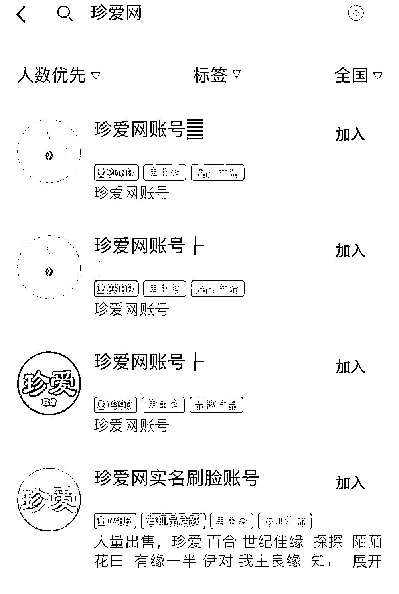
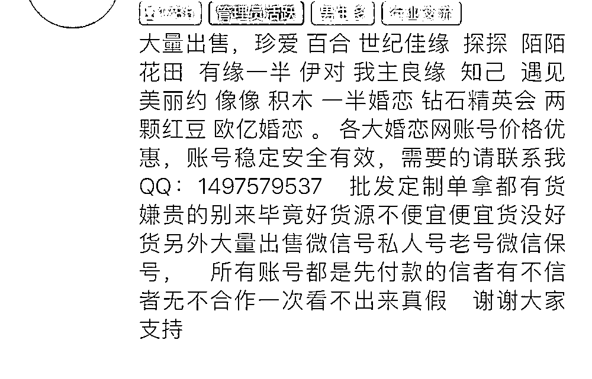
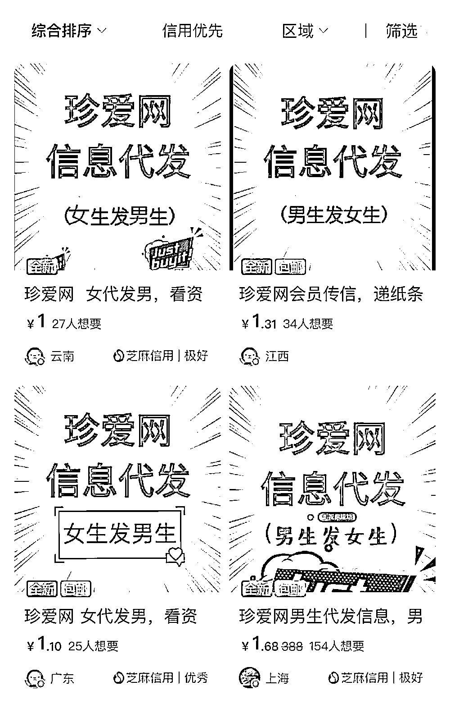
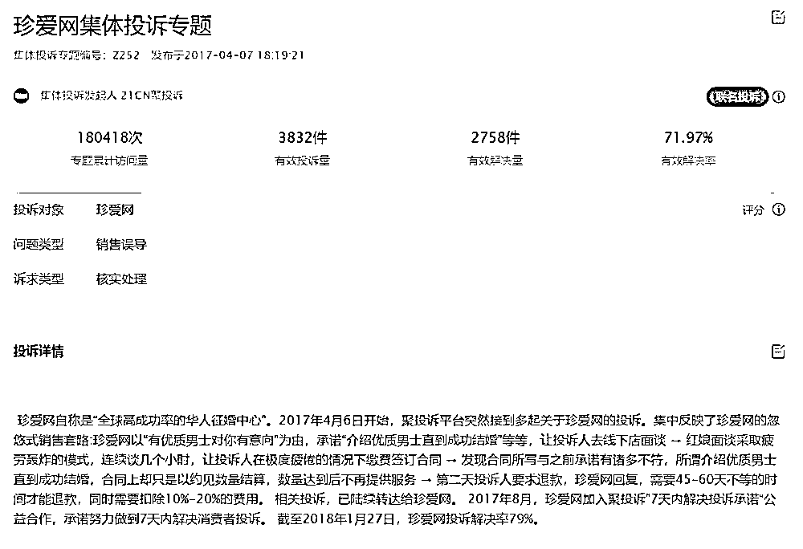

# 起底珍爱网“杀猪盘”骗局

> 原文：[`mp.weixin.qq.com/s?__biz=MzIyMDYwMTk0Mw==&mid=2247499333&idx=2&sn=603ed615709767e69ead897d7c88f997&chksm=97cb357da0bcbc6b8136f49d386daee56e5795c90fd8a66c201e98a314fe082f46bef9eda175&scene=27#wechat_redirect`](http://mp.weixin.qq.com/s?__biz=MzIyMDYwMTk0Mw==&mid=2247499333&idx=2&sn=603ed615709767e69ead897d7c88f997&chksm=97cb357da0bcbc6b8136f49d386daee56e5795c90fd8a66c201e98a314fe082f46bef9eda175&scene=27#wechat_redirect)

**点击上方蓝色字体免费订阅“灰产圈”**

打着“寻找真爱”的幌子，伪装身份，结交女性，再一步步诱骗女性陷入博彩投资等陷阱，得手后拉黑失联……

近日，涉珍爱网多起“杀猪盘”骗局，让被骗情骗钱的女性走上维权之路，也引发对珍爱网审核缺位的质疑。

就此，记者亲测发现，珍爱网确实存在注册门槛低、认证账号被转卖等问题。

网友指出，犯罪分子正是利用这些“bug”，制造了一起又一起的“杀猪盘”骗局。

***“杀猪盘”屡禁不止 多人血本无归***

创始于 2005 年的珍爱网，据称是国内头部相亲平台之一，其官方介绍称，由专业红娘提供服务，以网络征选+人工红娘的婚配服务模式，为城市白领省时省心地成就姻缘。**现实真如此美妙吗？**据报道，今年 3 月，来自温州的小莉在珍爱网认识了一名自称本科毕业、做投资的“精英”男士杨某。赢取好感后，杨某便开始请小莉帮忙购买比特币，并推荐小莉自己注册账户“赚点零花钱”。按杨某的“指导”，小莉买入了一些比特币，但提现时发现还需缴纳保证金。随后小莉接连向平台缴纳了包括保证金、激活金、比特币等在内的 40.7 万余元。意识到这是一个无底洞后，小莉上网查询发现，这是典型的“杀猪盘”骗局，当即报警。**所谓“杀猪盘”，是指诈骗分子利用网络交友，诱导受害人投资赌博的电信诈骗方式。诈骗分子准备好人设、交友套路等“猪饲料”，将社交平台称为“猪圈”，在其中寻找被他们称为“猪”的诈骗对象。通过建立恋爱关系，即“养猪”。最后骗取钱财，即“杀猪”。**近年来各地警方加大了对“杀猪盘”骗局的打击力度。克拉玛依警方侦破了一起特大境外电信诈骗案中，一女子通过珍爱网交友陷“杀猪盘”，仅一周被骗 636 万。岳麓警方日前通报称女市民被珍爱网结识的“男友”诈骗了 53 万元。长沙警方随后也启动了反“电诈”清查专项行动。为遏制“杀猪盘”乱象，多部门制定并下发了《关于进一步做好青年婚恋工作的指导意见》，要求推动实名认证和实名注册在婚恋交友平台的严格执行，加强对个人用户信息保护的监督执法，依法整顿婚介服务市场。

然而，即使有关部门加大力度重拳出击，类似案件仍屡禁不止。

***记者亲测“相亲”：***

***“老号”交易、1 元代“撩”、无需实名***

记者查询发现，在有关投诉平台上，涉及珍爱网的投诉累计超 3000 余条，除“要求退款”“虚假宣传”“诱导消费”等问题外，用户资质“审核不严”的问题成为客诉焦点。

随后记者亲测发现，**珍爱网确实存在用户注册门槛低、认证账号被倒卖等问题，一些不法分子还通过购买他人账号逃避监管。****——无须实名，照片随意换。**记者在中国裁判文书网查询发现，去年以来，珍爱网因多起侵权责任纠纷和合同纠纷被起诉，原告都提出珍爱网公司没有对用户资料尽到审查义务的质疑。日前，记者在珍爱网尝试注册账号并进行认证，发现只需填写性别、年龄、工作地区、婚姻状况等个人资料，输入手机号和密码就能完成注册验证。不仅如此，个人照片也可随意设置。

**珍爱网提供了“诚信认证”的选项，但并未强制实名认证。**注册完成后，记者可以直接向附近女性打招呼。**但要进一步发送和接收消息，还需开通 388 元一年的“珍心会员”服务。**

只有会员才可享受解锁收件箱、解锁消息发送等权益。而会员服务说明中也并没有要求实名，交钱就可一键开通。但界面下方，珍爱网设置了“安全征婚提示”，让消费者提高警惕，谨防受骗。

**——“老号”交易，帮忙代“撩”。**

**记者在多个 QQ 群暗访发现，大量的珍爱网账号正在被交易。有的群人数达到了 2000 人，十分庞大。**

而群成员大多以男性居多，标称“大量出售婚恋网账号，价格优惠”等。有的内部人士还附带出售微信号，并称是“私人号”“老号”“可信度高”。

要想取得对方信任，甚至还出现了灰产。记者暗访发现，一些珍爱网信息代发服务的广告出现在了一些二手交易平台上。

只需提供对方的珍爱网 ID 资料，卖家便可以帮忙代“撩”。卖家表示，只要有回复，就会将信息转发给记者。

**——交费不退，注册后骚扰不断。**许多消费者反映称，虽然珍爱网对用户信息审核并未上心，但对收钱却煞费苦心。

据投诉平台显示，厦门林女士表示自己注册珍爱网后，持续接到客服电话，要求到线下门店体验。

而当她进入珍爱网厦门分店后，**三个“红娘”轮番“轰炸”，劝其签订上万元的合同，还支持花呗、借呗。**而林女士签订合同后，才发现很多男士真实情况与宣传不符，“提供优质对象”等承诺成云烟。

记者调查发现，珍爱网“诱导消费”“虚假宣传”“交钱不退”等问题也成为许多消费者投诉的重点。

“珍爱网诱导购买红娘服务，前后说法不一致。”“强烈要求珍爱网退还 16800 元，拖了快 4 个月了。”

“未购买会员之前，收到很多用户打招呼，但购买后，就再无人理，纯属是虚假宣传！”而有的消费者由于“误触”开通了珍爱网会员，但平台不经确认就直接扣款 388 元，联系客服也不予退还。

记者注册珍爱网账号后，就有自称“红娘”的客服多次来电，希望为记者推荐“优质会员”，邀请记者进一步深入了解 VIP 服务。记者多次拒绝后，截至发稿前，记者仍不断受到“红娘”的骚扰。

***婚恋网站违规乱象频发引发信任危机***

中国消法研究会副秘书长陈音江表示，网络安全法和《互联网用户账号名称管理规定》均对网络实名制提出了具体硬性的要求。

消费者权益保护法也规定，消费者在购买、使用商品和接受服务时享有人身、财产安全不受损害的权利。经营者应当保证其提供的商品或者服务符合保障人身、财产安全的要求。

**“婚恋网站违规乱象频发已经遭遇了信任危机，有的知名征婚网站，因监管不力等突出问题，成了不法分子行骗的温床。”**

陈音江说，这种只顾收费而不严格履行审核和风险提示义务，导致消费者付费购买会员服务后遭受人身和财产损失，明显涉嫌损害消费者的人身和财产安全权。

河北冀华律师事务所律师李莎认为，虽然“杀猪盘”最终犯罪实施环节并不在珍爱网，但总体来看，利用虚假信息进行诈骗，相亲社交平台作为重要“入口”，平台也应承担因不严格推行实名制以及未尽到风险提示义务相对应的责任。

李莎表示，对于“杀猪盘”等网络安全侵权事件，相关部门应严格审查，对不严格履行审核和风险提示义务，以及放任用户做出违法行为的平台，做出责令改正、罚款、暂停项业务、停业整顿、关闭网站甚至吊销营业执照等相应处罚。

同时，她也建议平台，要从技术层面提高平台识别“假号”的能力，符合实名制的技术要求，切实履行好自身的监督责任。消费者也应保持警惕、提高自己对骗局的辨别能力，不给不法分子可乘之机。

编辑：单镜宇 责任编辑：寒冬 来源：新华社

****

← 向右滑动与灰产圈互动交流 →

**点击****阅读原文****加入灰产圈高端社群**

