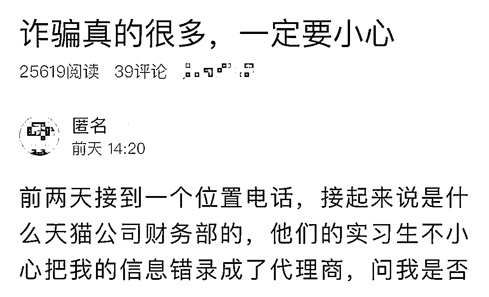
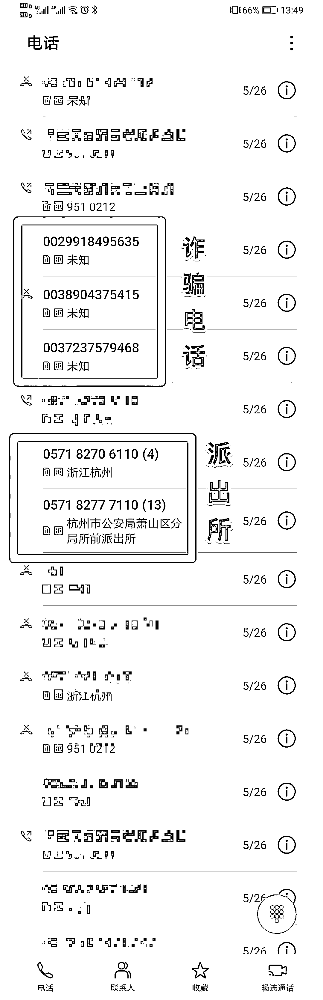
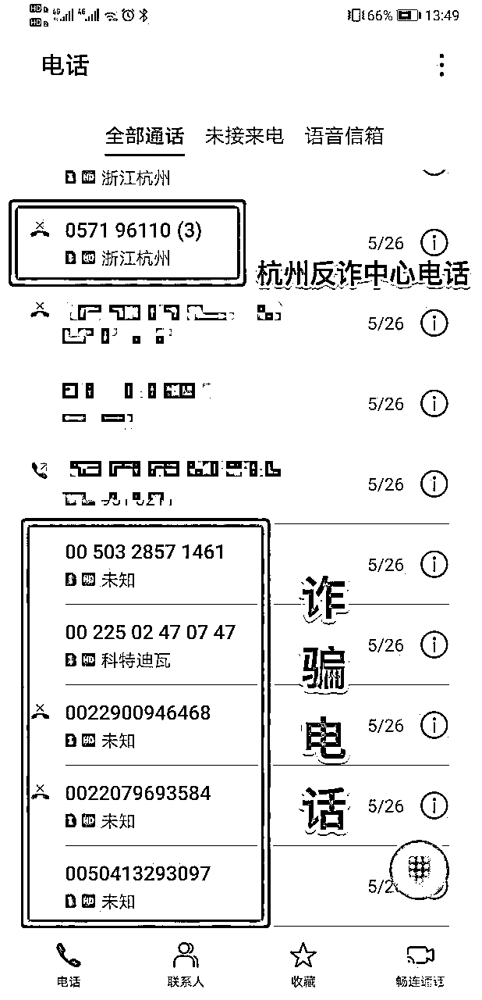
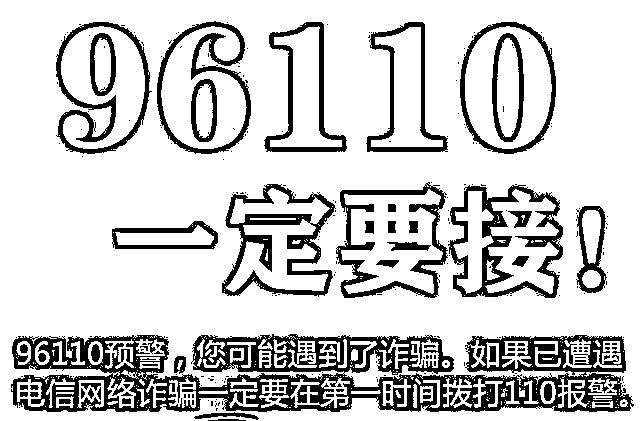
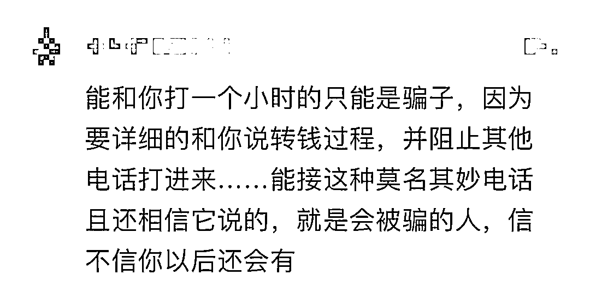
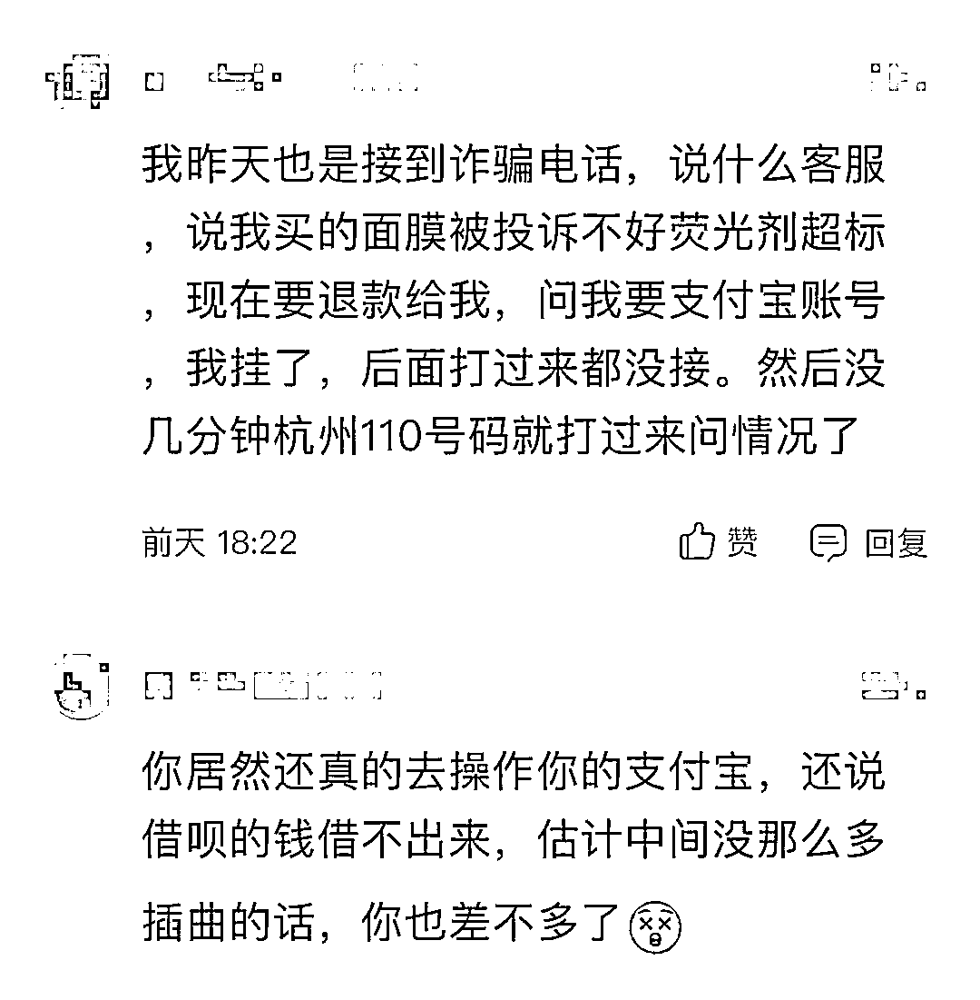
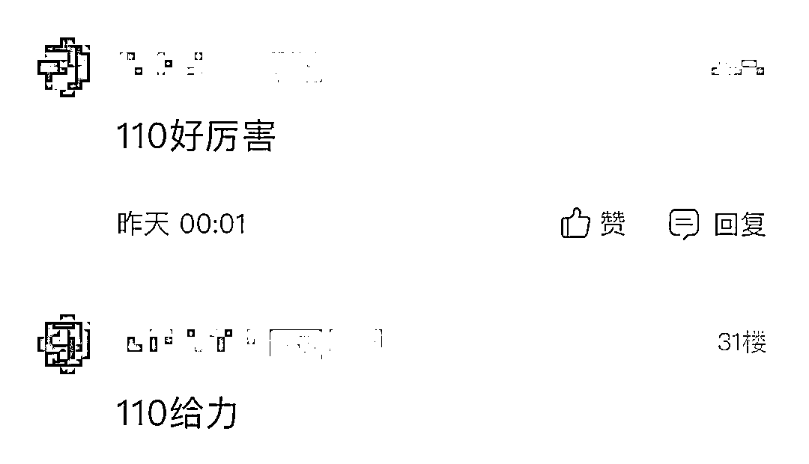
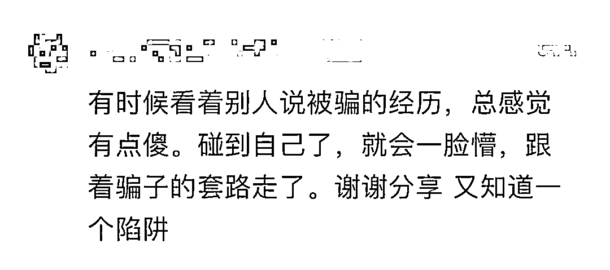

# 紧急提醒：这两种电话，一个不能接！一个必须接！

> 原文：[`mp.weixin.qq.com/s?__biz=MzIyMDYwMTk0Mw==&mid=2247499333&idx=3&sn=190e4739050cc974431923dc8e7a3875&chksm=97cb357da0bcbc6b9452fa36205c574262fbaf3973aae6660b0716214e2f86a520b7eb0991c6&scene=27#wechat_redirect`](http://mp.weixin.qq.com/s?__biz=MzIyMDYwMTk0Mw==&mid=2247499333&idx=3&sn=190e4739050cc974431923dc8e7a3875&chksm=97cb357da0bcbc6b9452fa36205c574262fbaf3973aae6660b0716214e2f86a520b7eb0991c6&scene=27#wechat_redirect)

**点击上方蓝色字体免费订阅“灰产圈”**

**近日，一女子发帖，**

**讲述了自己被诈骗的经历。** 

**她说，没发生在自己身上，**

**总感觉那些被骗的人挺傻的。**

**当自己遇上的时候，**

**骗子会有各种办法让你相信他们。**

**注意，这种骗局近两年多发！**

**去年温州一女子 4 小时被骗 62 万多元，**

**大家一定要警惕！**

**姑娘网帖截图**

5 月 26 日，在网上发帖的姑娘接到一个电话，对方自称是某电商平台财务部的，**说他们的实习生不小心把姑娘的信息错录成了代理商，如果不取消的话，每个月会从她账户上扣 800 元，一年就是 9600 元。**

听到这，姑娘直接挂了电话，没一会又一通电话打进来，说他们不是店铺，是电商平台官方的，姑娘还是没信，又挂了电话，同时还打了该电商平台官方的消费者服务热线。

在等待客服回拨的期间，电话又打进来了，姑娘当时以为是电商平台的客服回拨电话，就没挂。

**这次没挂的电话，姑娘和对方打了一个多小时：“**

**对方说帮我转接到银行那边去办理一个证明，然后所谓的银行 VIP 工作人员一开始就和我确认我资金超过 800 元的银行卡、理财和信用卡、花呗、借呗的余下额度，说是这些超过了 800 元的账户都可能被扣款，要记录，这样如果发生了扣款之后就会尽快返回。****然后就让我把我的钱从支付宝提到我的银行卡里，还想让我把借呗里的钱全部借出来提现，但不知道为什么我借呗借不出来。然后突然说我们电话时长超过一个小时了很可能会自动挂掉，而且由于是外接电话，后续也没办法回拨给我，说加我 QQ 联系，然后一分钟左右我都没有收到 QQ 添加的消息，同时讲话对方也没有任何回复，我就挂了电话。**

从一开始的不信，到一步一步被「套」进去，最终还是因为对方暂时「失联」，这通长达一个多小时的电话才挂断。

**挂断电话，**

**姑娘发现在这一个多小时期间，**

**杭州反诈中心和当地派出所**

**给她打了 24 通电话！**

姑娘随后回拨了 110 的未接电话，被警察叔叔教育了一通。后来姐姐告诉她，110 因为联系不上她，还打了她姐姐的电话，让姐姐联系她不要被骗。

这之后，骗子又打来四五个电话，姑娘没再理会。

**帖子的最后，姑娘这样说：**

**没发生在自己身上，感觉那些被骗的人挺傻的，但发生在自己身上的时候，发现其实在诈骗过程中，在你各种否定对方的时候，骗子会有各种办法让你再相信他们。**

事情过去之后发现其实过程中有各种可疑点，只是当时莫名被忽视了。

同时非常感谢我们的派出所民警，因为不想让我被骗而打的那么多个电话。

**谨记，这种电话不要接**

谨记，境外电话号码全部以 00 或+开头！

按照工信部有关规定，境外电话进入我国通信网络时，必须在主叫号码前添加国际长途字冠「00」，且严禁在传送过程中删除该字冠。

因此，如果你收到的电话号码以 00（部分手机会在号码显示时将 00 翻译为+）开头，说明此电话来自境外。

此类电话，无论对方自称是国内任何部门的工作人员，都不要信。

2019 年 7 月，温州女子阿梅接到一个号码为 00881961303924 的陌生电话，对方自称某电商平台一家旗舰店的工作人员，问她对曾购买的一条连衣裙是否满意。

接下来的一系列操作和上文萧山姑娘遇到的差不多。

阿梅依照对方提示一步步落入圈套，总计被骗 62.21 万元，整个过程持续 4 个小时，其间通话不时中断，对方随即又不停打来，号码几乎都是 00 开头的，总共有 17 个号码。

据温州都市报此前报道，2019 年 6 月 26 日，温州市反诈中心曾发布紧急通告称，近期该市发生多起类似的新型网购退款诈骗类案件。经统计，仅 2019 年 6 月，温州市就发生此类诈骗案件 57 起，被骗金额达 101 万元。

谨记，这个电话必须接

如果你接到这个电话——来电显示为「公安反诈专号」或「96110」的电话，一定要接听。

96110

是公安机关反诈劝阻专线，

当你遇到电信诈骗时，

96110 就会向你发起报警，

请你务必接听！

网友评论

最后，再划一次重点： 

00 或+开头的电话**慎接**

96110**必须接**

**一定要记住！**

来源：FM93 交通之声、萧内网萧山论坛、青岛日报

← 向右滑动与灰产圈互动交流 →

**点击****阅读原文****加入灰产圈高端社群**

