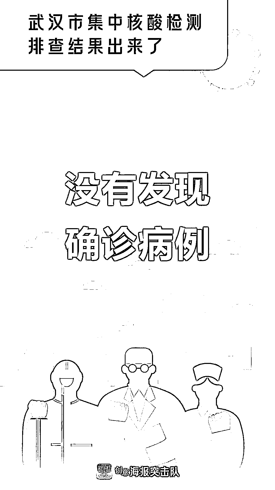
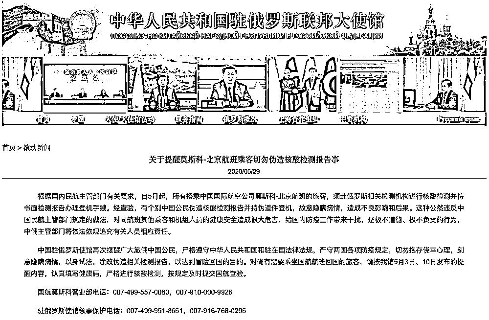
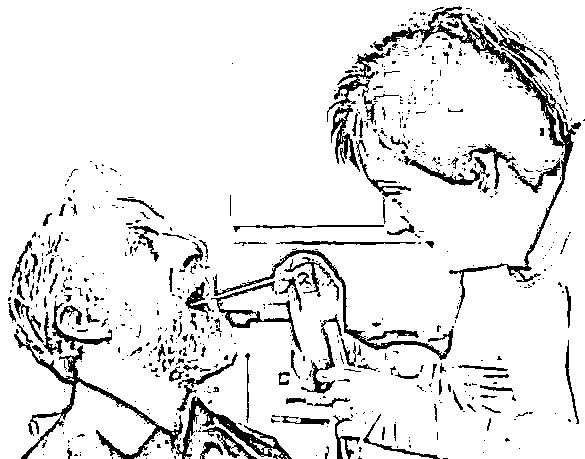
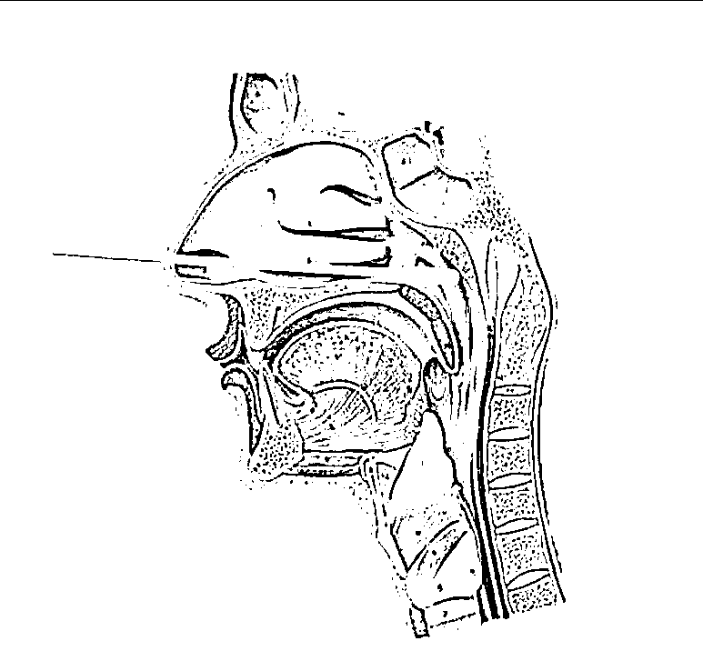
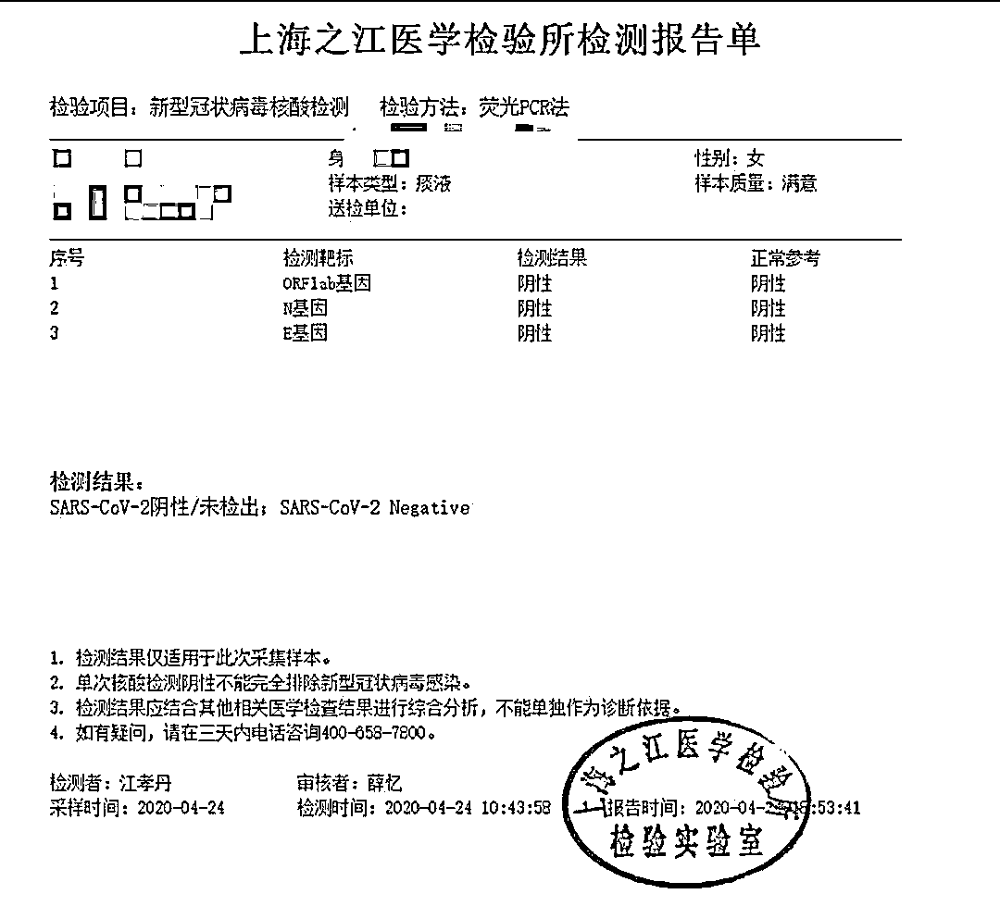
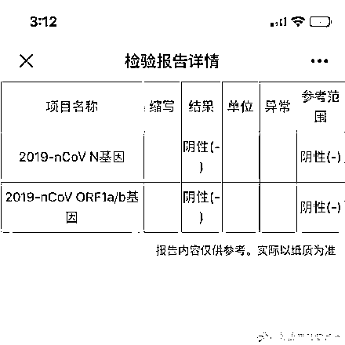
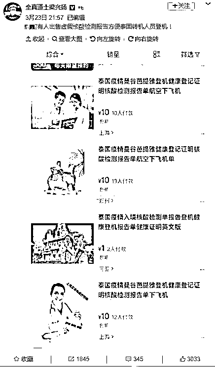
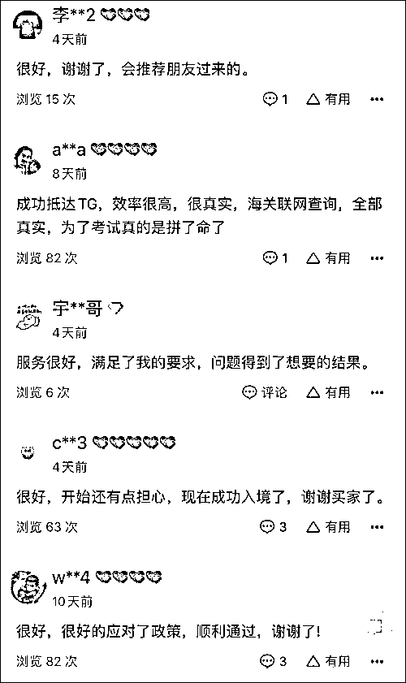
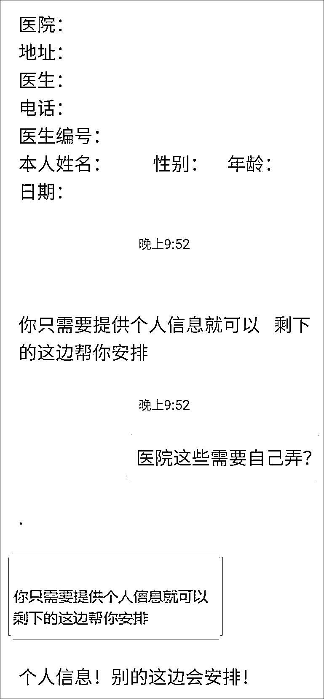

# 警告！伪造核酸检测报告已出现，请注意识别

> 原文：[`mp.weixin.qq.com/s?__biz=MzIyMDYwMTk0Mw==&mid=2247499355&idx=3&sn=4840eaf801cf9214fcf1bd5a9205049b&chksm=97cb3563a0bcbc75405c9a8e4bb2a8d9d4e60cd78960043b2fcf8ad288fabc8dd8d295de1d7d&scene=27#wechat_redirect`](http://mp.weixin.qq.com/s?__biz=MzIyMDYwMTk0Mw==&mid=2247499355&idx=3&sn=4840eaf801cf9214fcf1bd5a9205049b&chksm=97cb3563a0bcbc75405c9a8e4bb2a8d9d4e60cd78960043b2fcf8ad288fabc8dd8d295de1d7d&scene=27#wechat_redirect)

**点击上方蓝色字体免费订阅“灰产圈”**

6 月 2 日，有一个好消息，武汉集中核酸监测的排查结果出来了。

从 5 月 14 日 0 时至 6 月 1 日 24 时，武汉近 990 万人接受了核酸检测，没有发现确诊病例。

**疫情下，核酸检测是检测新冠病毒的金标准。****一份结果为“阴性”的核酸检测报告，就像一张通行证，能让你在登机、复工、开学、出行、入住酒店时畅通无阻。**

然而，有人却瞄准这张通行证，趁机钻空子，**企图使用伪造的核酸检测报告蒙混过关。**

“

5 月 29 日，中国驻俄罗斯使馆发布声明称，在搭乘中国国航莫斯科-北京航班的旅客中，经查验，有个别中国公民伪造核酸检测报告，并持该伪造件登机，故意隐瞒病情，造成不良影响和后果。中国驻俄使馆表示，中俄主管部门将依法依规追究有关人员相应责任。

图片来自网络

”

鹅师傅今天就给大家深扒一下，**黑产团伙伪造核酸检测报告的主要手法，以及伪造、使用虚假核酸检测报告的法律后果。**

1

**核酸检测报告到底长啥样？**

虽然鹅师傅也没有做过核酸检测，但在各种知识平台一顿操作后，也算是基本摸清了核酸检测的套路。当然，也欢迎真实做过核酸检测的各位小伙伴现身做法，批评指正。

**核酸检测目前一般有两种采集方式，一种是咽拭子采集，另一种是鼻咽拭子采集。**

咽拭子采集示意图，图片来自网络

做核酸检测到底是啥感觉呢？看看图应该会有了解。

鼻咽拭子采集示意图，感觉应该挺酸爽的

那采集了样本后，核酸检测报告要怎么获取？这份报告到底是长啥样呢？

首先肯定是医院，受验者可以到相应的医疗机构获取检测报告单，不同医疗机构出示的报告单会有一定差别。

比如，上海这家医院的纸质核酸检测报告单是长这样的：

图片来自于网络

这份报告上有检测项目、检验方法以及受检人的个人信息等内容，当然最重要的就是检测结果这项了。

报告结果显示为阴性就可以松一口气啦，证明受检者没有感染新冠病毒。

还有另一种获取方式，受检者可以到“国务院客户端”小程序中，输入姓名及身份证号信息即可查询结果，简单又便捷。

电子版核酸检测报告

2

**黑产是如何伪造核酸检测报告的？**

据鹅师傅观察，目前黑产团伙伪造核酸检测报告主要有两种手法：

**第一种是移花接木篡改型：**拿到买家的个人信息，然后将某个人真实的核酸检测报告进行信息修改，把受检者信息改成买家的。

**第二种是无中生有伪造型：**伪造医疗文书中的印章和医生签名，个人信息部分由买家提供，彻头彻尾地伪造一份虚假的核酸检测报告。

早在 3 月底就有网友爆料，有人在某电商平台出售虚假核酸检测报告，用于泰国转机人员登机。

图片来自网络

此前，泰国民航管理局（CAAT）发布了一份公告声明，自 3 月 22 日起，所有前往泰国或在泰国进行转机的旅客在办理登机手续时，须出示航班出发前 72 小时内开具的医学健康证明，以确保该旅客未感染新冠病毒。

正因如此，不少黑心商家仿佛看到了商机，在网络上推出伪造核酸检测报告单的服务。

从早前网友的截图看来，此类“商品”卖家众多，买家也不少，其中一家店铺的买家评论如下：

图片来自网络

为了摸清黑产的背后流程，观察者网“风闻社区”里，一位署名为“瓜老师”的网友，特地联系了其中一名卖家。

这位网友表示：卖家首先要求他添加社交软件账号进行沟通，并称买家只需要提供个人信息即可，当天就能收到 PDF 扫描版的健康证明及化验报告。

图片来自网络

试想一下，假如有人用伪造的核酸检测报告通过防疫检查，而这个人有可能跟你乘坐同一航班，可能跟你出入同一栋办公楼，可能在学校、车站等公共场合出没......

万一，手持伪造核酸检测报告的人，不幸是病毒携带者、新冠肺炎患者者或密切接触者，那后果可不堪设想。

所以，与隐瞒旅行史等早期出现的欺诈行为相比，核酸检测造假不仅更具有欺骗性，而且后果也更为严重。

3

**伪造核酸检测报告有啥后果？**

先说结论：不管是持虚假核酸检测报告的，还是帮助伪造核酸检测报告的，一个都不能放过，**严重者甚至还可入刑！**

一般来说，需要伪造核酸检测报告证明自身健康状况的，有两种人：

**一种是由于受检测能力限制，无法做到应检尽检，而当事人又急需这一证明以满足进入公共场所或者公共交通工具等目的的。**

此时当事人对自身健康状况如何并不知晓，如果最后证明其身体健康而持伪造核酸检测报告证明的，可能面临**治安管理处罚或其它行政处罚**；

如果最终检测证明其是新型冠状病毒感染肺炎病人、病原携带者，其行为属于拒绝执行卫生防疫机构依照传染病防治法提出的预防、控制措施的，引起疫情传播或者有传播严重危险，会被以**妨害传染病防治罪**定罪处罚。

而此时帮助其伪造核酸检测报告的机构或个人，视上述不同情况，可能被处以治安管理处罚或其它行政处罚，也有可能涉嫌构成**妨害传染病防治罪**。过程中如果有伪造医院等检测机构印章的，还有可能构成**伪造企业、事业单位印章罪**，此时属于牵连犯，应与妨害传染病防治罪从一重罪论处。

**另一种是已经确诊是新型冠状病毒感染肺炎病人、病原携带者，或者属于疑似病人，持虚假的核酸检测报告证明进入公共场所或者公共交通工具的。**

其明知其行为极有可能造成新型冠状病毒传播，危害公共安全，构成**以危险方法危害公共安全罪**。

此时帮助其伪造核酸检测报告的机构或个人，应视其对病人身体状况明知的不同情况予以区分，如果其明知对方已经确诊是新型冠状病毒感染肺炎病人、病原携带者，或者属于疑似病人仍为其伪造核酸检测报告的，应以**以危险方法危害公共安全罪的帮助犯**定罪处罚无疑。

**如果其不明知，是否只构成妨害传染病防治罪呢？**

鹅师傅对此持不同观点，虽然其不明知对方已经确诊是新型冠状病毒感染肺炎病人、病原携带者，或者属于疑似病人，但其应该意识到在全球疫情如此严重的情况下，对方让其帮助伪造此证明文件，对方属于新型冠状病毒感染肺炎病人、病原携带者，或者属于疑似病人的情况是有相当可能性的，而其仍为对方伪造伪造核酸检测报告，放任危害公共安全结果的发生。

因此也应成立**以危险方法危害公共安全罪的共犯**，属于妨害传染病防治罪与以危险方法危害公共安全罪的想象竞合，应以重罪以危险方法危害公共安全罪论处。

4

**切勿抱存侥幸心理，以身试法**

鹅师傅想说，**核酸检测的不只是病毒，还有做人的底线****。**

核酸检测试剂盒已经不像疫情爆发初期那样“一盒难求”，现在要去做个核酸检测并不是什么难事。人们只需要花费一百多元的价格，就可以预约附近的医院进行检测，检测结果大约 8 小时就能拿到。

持伪造核酸检测报告这种投机取巧的做法，公然违反法律法规，对他人的健康安全造成很大危害，给国内防疫工作带来干扰，是极不道德、极不负责的行为。

鹅师傅再次提醒大家，**为了自身与他人的安全健康，有需求的朋友请一定前往正规检测机构进行核酸检测，切勿抱存侥幸心理，贪图一时方便，涂改、伪造核酸检测报告，以身试法！**

← 向右滑动与灰产圈互动交流 →

**点击****阅读原文****加入灰产圈高端社群**

