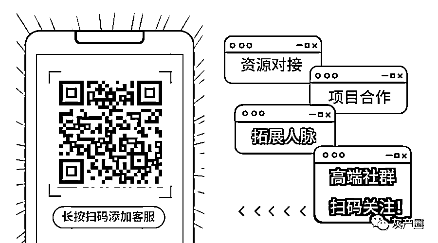

# 解封账号，获利百万被抓！你也间接参与了！

> 原文：[`mp.weixin.qq.com/s?__biz=MzIyMDYwMTk0Mw==&mid=2247499398&idx=1&sn=cb7cc04478b2ef4f8eb03cba5c5146cd&chksm=97cb35bea0bcbca8eeffd3eb558ffe7c879e590490459f0f23de89507c9da42a03c40ae029cb&scene=27#wechat_redirect`](http://mp.weixin.qq.com/s?__biz=MzIyMDYwMTk0Mw==&mid=2247499398&idx=1&sn=cb7cc04478b2ef4f8eb03cba5c5146cd&chksm=97cb35bea0bcbca8eeffd3eb558ffe7c879e590490459f0f23de89507c9da42a03c40ae029cb&scene=27#wechat_redirect)

**点击上方蓝色字体免费订阅“灰产圈”**

面对通讯网络诈骗案件高发，国家为了打击日益猖獗的通讯网络诈骗违法犯罪活动，封停了一大批涉嫌通讯网络诈骗的微信、QQ、支付宝等账号。

题图：资料图

封号这一强力举措，如同卸掉了骗子们行骗的左膀右臂，真可谓大快人心！然而，一些心术不正、急功近利的人，竟然从中发现了商机，助纣为虐，专门为一些诈骗、赌博等犯罪团伙解封微信，殊不知他们自己的这一行为也已经触犯了法律。

今年 2 月，杭州市公安局江干分局网警在侦查一起网络诈骗案件时，通过深度研判分析，发现作案的微信号登陆地均在境外，而且该微信号存在被多次封号又解封后再实施诈骗的行为。

***封号后，又是如何解封的？***

侦查员们决定顺藤摸瓜，一个专门为诈骗团伙解封微信号的犯罪团伙逐渐露出水面。这背后，也是一个 95 后小伙走到岔路上的人生。

经过民警调查，这个团伙的组织者是山西大同人 95 后的高某，如果不是民警找上门，今年他就要大学毕业了。

家境一般的高某，在大学表现不错，是班里的班长。

在网上找兼职的他，接触到了“微信辅助解封”这一灰黑产业。2019 年 6 月，他帮助解封后，没有收到钱，后来辗转联系了一个上线，告知他现在急需人来做微信解封的“业务”。

听到这个消息，高某有些纠结，又有些动心，解封一个账号能有不少收入，高某决定冒次险。

诈骗团伙的解封业务量不小，高某拉来了自己的朋友和同学。2019 年 11 月，他还组建了自己的工作室，业务就是为诈骗团伙解封账号。

该团伙通过诈骗团伙提供的微信号，预先安排专门人员进行加好友、实名认证、人脸认证保号。一旦诈骗微信号被封禁后，立即实施解封操作。为了确保保号的成功，团伙还在网上招募了不少大学生、宝妈等，帮助诈骗微信号解封。

***高某所做的事，是典型的帮助信息网络犯罪活动。***

办案民警王警官介绍，高某团伙帮助诈骗团伙解封一个账号的价格为 300 元左右，而网上招募来的帮助解封的人可以拿到 30 元左右，剩下的差价都被高某和团伙成员拿走，短短几个月，他们获利上百万元。其中，高某自己获利几十万元，不少钱已经被他挥霍。

王警官说，高某其实对自己所做之事也是十分纠结，“高某每天都会给成员开会，每天会写一篇日记，在他的日记本上，写着：贷款、诈骗、公安、腾讯、买卖微信号等，还用笔圈了起来。”高某本来对自己的人生有着很清楚的“规划”：30 岁之前买一套房，50 岁之前 500 万存款...本来想着做解封账号做个两年就不做了，但是没想到民警这么快就找上门了。

江干网警在上级部门的支撑下，专案出击，于 4 月 8 日下午在山西大同抓获以高某为首的团伙成员 10 人，摧毁了这一专门为被封诈骗微信号解封的灰黑产团伙。

警方提醒：网上找兼职一定要擦亮眼睛，不要轻信所谓的“无风险”，大多数被封的微信、QQ 号都是涉嫌色情、赌博、虚假、诈骗等违规行为才会被官方封号，为这些微信、QQ 号提供解封服务，相当于为违法犯罪提供帮助，已经触犯了法律底线。

同时，辅助解封对自己的微信或 QQ 号使用也存在一定的风险，倘若你辅助解封的帐号是因为违规被封，解封后再次违规被封，那你也将受到连带惩罚，账号被限制甚至封号。

4 月 27 日，微信安全中心官方账号发布“针对利诱用户参与虚假辅助注册行为的治理公告”，针对街边常见的“以小礼品诱惑，辅助进行微信注册或解封”的现象做了提醒。

不少网友都表示在街上遇到过被诱导注册微信，或帮他人解封微信号进行辅助验证的情况。微信方面表示，此类行为属于违规行为，“恶意为他人注册、解封微信帐号进行辅助验证”也属于违规行为。对于多次为恶意帐号提供辅助者，一旦核实二者存在关联，微信也将对该帐号进行限制使用部分或全部功能、短期或长期封号处理。

***以下为公告全文 ↓↓***

针对利诱用户参与虚假辅助注册行为的治理公告

诱导普通用户来完成各种安全辅助验证，进而达到批量注册微信帐号的目的。

为了给广大用户带来绿色、安全的上网环境，微信高度重视对平台内违法违规行为的打击：我们启动了多项安全策略，对各类违规行为进行及时发现与处理，并对确认违规帐号进行严格封停；同时，为了防止坏人大批量注册微信帐号用来作恶，我们在帐号注册等环节上线安全辅助功能，加强行为审计。

多种措施综合治理之下，坏人用来作恶的微信帐号数量越来越少，于是他们将目光转向了普通用户，诱导普通用户来完成各种安全辅助验证，进而达到批量注册微信帐号的目的。

扫码免费送礼 实为虚假诱导行为

近期，我们发现不少“地推扫码团队”，在路边摆摊宣传，声称自己是“微信团队”在举办安全辅助功能的推广活动，以免费送口罩、咖啡、气球、水杯等小礼品的方式利诱普通用户参与扫码，辅助他们进行微信注册或解封。

路边假冒“微信团队”进行扫码送礼的虚假辅助注册行为。图据微信安全中心

还有一些“线上网赚平台”，将辅助注册、解封包装为兼职、任务分派等多种有偿形式，蒙骗普通用户参与其中。

微信官方在此声明，我们从未举办过此类活动。这是不法分子为了躲避微信安全打击衍生出的虚假诱导行为。这些新注册、解封的帐号衍生出欺诈、垃圾营销、虚假广告等多种恶意行为，严重破坏了平台绿色健康的生态环境，影响了正常微信用户的合法权益。对于此类行为，我们将予以严厉打击。

***微信严厉打击违法违规行为 ***

***请规范使用安全辅助功能***

为保护用户权益、肃清平台环境，微信团队将继续加强对违法违规行为的打击，并在《微信个人帐号使用规范》中明确规定，不仅“诱导或欺骗他人为自己注册、解封微信号进行辅助验证”属于违规行为，“恶意为他人注册、解封微信帐号进行辅助验证”也属于违规行为。

1.2.3 用户不得实施恶意注册、使用微信帐号的行为，如频繁注册、批量注册微信帐号、滥用多个微信帐号、诱导或欺骗他人为自己注册微信号进行辅助验证、买卖微信帐号及相关功能、恶意为他人注册微信帐号进行辅助验证等。

1.3.3 解封异常：对于在申请自助解除封号过程中异常行为，如批量申请解封、通过机器指令申请解封、提交虚假资料、虚构好友关系以及利用第三方网赚平台解封、诱导或欺骗他人为自己辅助解封等行为，腾讯将根据情节对解封帐号进行再次封号或永久封号处理；对违规辅助他人解封的帐号限制使用微信全部或部分功能、进行短期或长期封号处理。

对于明确违反上述规定的微信帐号，依据国家相关法律法规及《腾讯微信软件许可及服务协议》《微信个人帐号使用规范》，在核实用户投诉提交的证据后，我们将对恶意帐号进行封号或永久封号处理。

同时，对于多次为恶意帐号提供辅助者，一旦核实二者存在关联，微信也将对该帐号进行限制使用部分或全部功能、短期或长期封号处理。

以下为部分违规帐号情况公示：

部分被处理“微信帐号”示例

帮助他人进行安全辅助验证时

请仔细核实对方身份

微信上线安全辅助功能是为了遏制平台上的违法违规行为，保护广大用户的合法权益，维护平台绿色健康的生态环境。

正常朋友之间进行安全辅助验证，属于正常合规行为。

同时微信安全提醒广大用户，帮助他人进行安全辅助验证时，请仔细核实对方身份：

如果遇到用免费送礼、兼职、网赚等名义让你为陌生人提供扫码帮助的，应提高警惕，不要操作验证。

避免在不知情的情况下协助不法分子完成注册或解封，使自己和他人遭遇欺诈、赌博、色情传播、垃圾营销等违法违规行为的风险大大提高。

拒绝帮助陌生人扫码，也是在保护自己的帐号安全，微信对于多次违规辅助他人的帐号也将进行相应处理。

不少网友都表示在街上遇到过被诱导注册微信，或帮他人解封微信号进行辅助验证的情况。为了给广大用户带来绿色、安全的上网环境，微信高度重视对平台内违法违规行为的打击：我们启动了多项安全策略，对各类违规行为进行及时发…

来源：钱江晚报，利箭在行动

← 向右滑动与灰产圈互动交流 →

**点击****阅读原文****加入灰产圈高端社群**

