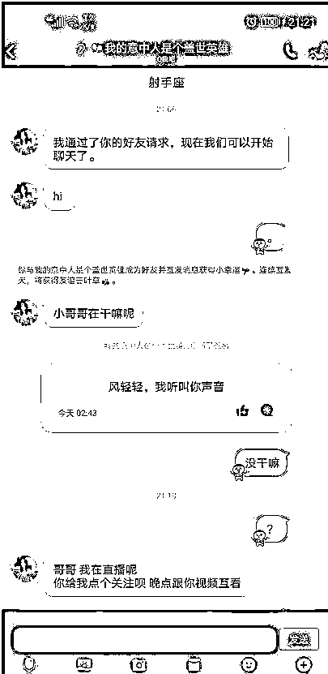
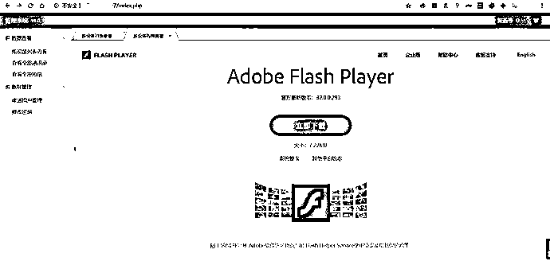

# 一次对果聊诈骗的分析：那些你不知道的套路诈骗

> 原文：[`mp.weixin.qq.com/s?__biz=MzIyMDYwMTk0Mw==&mid=2247499398&idx=2&sn=224b8cbe97f8162b61097c82255ba113&chksm=97cb35bea0bcbca8ec577dd5422f9e92f632f18461741280965013af5bd353656ffbd7a4d138&scene=27#wechat_redirect`](http://mp.weixin.qq.com/s?__biz=MzIyMDYwMTk0Mw==&mid=2247499398&idx=2&sn=224b8cbe97f8162b61097c82255ba113&chksm=97cb35bea0bcbca8ec577dd5422f9e92f632f18461741280965013af5bd353656ffbd7a4d138&scene=27#wechat_redirect)

**点击上方蓝色字体免费订阅“灰产圈”**

> 突然有陌生“美女”加你微信
> 
> 你第一反应是啥？

更要命的是热聊没几天对方竟然要求果聊……殊不知其实早已落入陷阱

近日，市反诈中心接到市民报警，被人通过**诈骗数千元，且该案全国多地高发，请广大市民引起注意！！！

## 事情经过

家住某市的 X 先生（化名）在 QQ 上结识了一名女孩，头像中的女孩面容姣好，聊天中 X 先生对她心动不已。

刚加好友，对方要求跟 X 先生互看果聊，X 先生一听心中窃喜。

X 先生打开了视频，视频对面出现了一个激动的画面，时间很短，对方就挂断了视频，发来一个二维码，让 X 先生下载一个视频软件，要求关注，殊不知这个软件是伪装成视频软件的病毒软件，获取了 X 先生所有的通讯录信息，于是，对方就把 X 先生的通讯录信息以及刚才**的视频发来，问 X 先生要不要处理，索要 3000 元，才会删除…

## 揭秘骗子的步骤

第一步：骗子用小号加了我的 QQ 好友，开始异性诱惑，以“互看”为名，征询是否可以果聊？（不可以的，直接删除好友，不会浪费时间。）

第二步：然后骗子以各种理由让我关注他的直播，发了一张直播软件（实际上应该是安卓远控）的下载二维码图片过来

第三步：扫码下载了直播到本地电脑上，QQ 电脑管家直接报毒。（为了大家的人身财产安全，我就豁出去了….）

把直播软件安装至夜神模拟器打开

第四步：打开 APP 后，APP 会请求获取各种权限，获取通讯录、获取短信记录等，全部设置允许后才能打开首页界面。然后随便填了个手机号和他发的邀请码点下一步抓包，这里我用 proxfier 将夜神模拟器的流量代理至 burp 中。

抓到的报文见下图：

按照注册流程走下去，点了下一步之后，APP 界面一直处在刷新界面。此时骗子发来信息问问有没有注册成功，告诉骗子 APP 卡了刷不出直播，骗子迅速发来 QQ 视频，播放了某段不可描述的画面。（老套路，使用 vcam 虚拟视频进行操作）

先不管 APP 了，现在抓到了 Http 包，而且是真实 IP，来看一下网站信息，访问 ip xx.xx.xx.xx，直接来到后台界面

随手一个 admin/123456 便进到了后台，运气较好

进到后台，果不其然，手机里面的短信，位置信息，通讯录，设备型号全部已经被上传至服务器，手机号数据有几千页：

前段时间吐司有大神发帖渗透这种果聊诈骗集团的文章，我也来碰碰运气找 xss 钓鱼。在用户备注功能发现能插入 xss 代码

前段时间刚好看到了 flash xss 钓鱼的文章，于是找了代码放进去，效果如下：

只要骗子点击渠道用户管理，就会弹出更新 flash 提示

在 vps 上准备好 cs 免杀马，简单捆绑处理一下，参考文章：

> https://blog.csdn.net/god_zzZ/article/details/104192518

处理好的文件，然后放到 vps 上

打开安装程序，cs 马就会运行。此时已经过了 12 点，明天还得上班，果断关机等待鱼儿上钩。

第二天早上惊奇的发现真的有鱼儿上钩了，最终由于没做权限维持，上钩的鱼儿跑了

好吧，对果聊诈骗的分析到此结束….

## 提醒广大网友

网络交友套路深，小心谨慎才是真！奔着婚恋交友去的广大单身男女青年，要选择正规渠道交友，尽可能通过熟人、有资质的婚介、婚恋网等渠道结识朋友。

谨慎添加陌生好友！当你遇到临时会话、附近的人打招呼时，建议不要草率的通过验证，一定要在清楚对方的意图后在通过好友请求。

注意保护个人信息！网络空间里鱼龙混杂，骗子很有可能就在暗处注视着你，等着对你下手，添加好友验证、朋友圈权限就显得很有必要了。

绿色上网很重要！俗话说，色字头上一把刀，要保持健康上网、交友心态，做到文明上网。

> 文明上网
> 
> 陌生“好友”谨慎添加
> 
> 避免被不良分子利用
> 
> 遭受损失！

作者：Jdicsp，来自 FreeBuf.COM

← 向右滑动与灰产圈互动交流 →

**点击****阅读原文****加入灰产圈高端社群**

