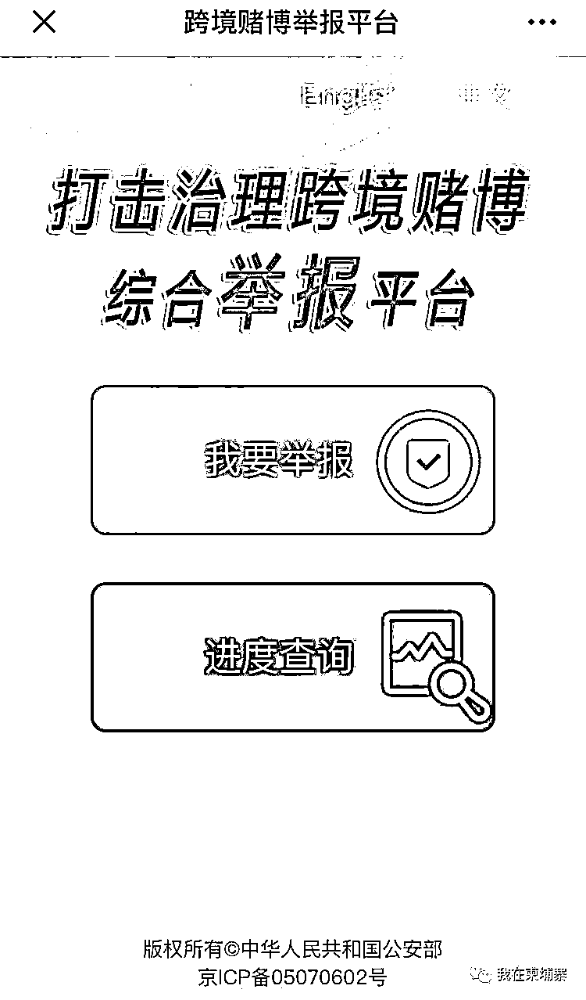
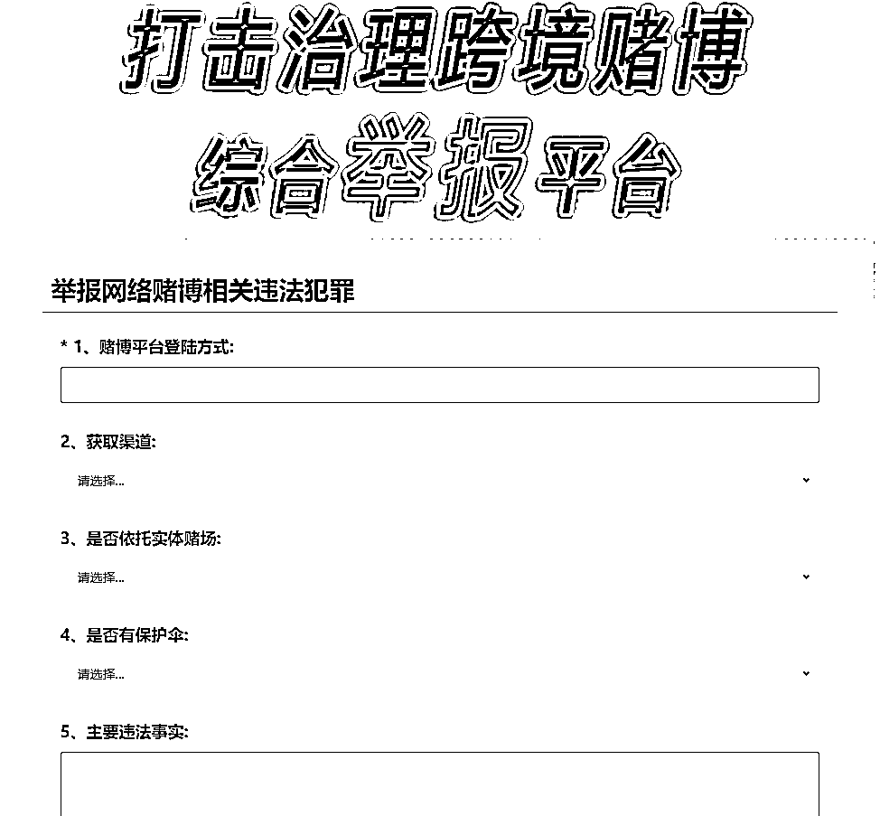

# 公安部开通跨境赌博举报平台！

> 原文：[`mp.weixin.qq.com/s?__biz=MzIyMDYwMTk0Mw==&mid=2247499398&idx=3&sn=5e8e134512eb6f13f67f90d4d9496063&chksm=97cb35bea0bcbca8bd59cece5713ce22f6785090b559f7af74b8a010b1edd0211fd0f63d8506&scene=27#wechat_redirect`](http://mp.weixin.qq.com/s?__biz=MzIyMDYwMTk0Mw==&mid=2247499398&idx=3&sn=5e8e134512eb6f13f67f90d4d9496063&chksm=97cb35bea0bcbca8bd59cece5713ce22f6785090b559f7af74b8a010b1edd0211fd0f63d8506&scene=27#wechat_redirect)

**点击上方蓝色字体免费订阅“灰产圈”**

据公安部 6 月 5 日消息，为严厉打击治理跨境赌博违法犯罪活动，方便广大群众举报，打击治理跨境赌博综合举报平台将从即日起启用。

群众可以**扫描专用二维码**！

或从公安部政府网站等链接登录**dbjb.mps.gov.cn**，快捷举报相关线索。

同时开通举报邮箱（**110@interpol.gov.cn**）和传真（**010-66261404**），欢迎广大群众积极检举。 

同时鼓励涉赌人员揭发相关违法犯罪，争取依法宽大处理。

← 向右滑动与灰产圈互动交流 →

**点击****阅读原文****加入灰产圈高端社群**

