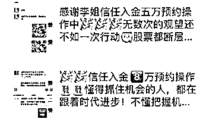

# “杀猪盘”套路升级，专门瞄准有钱人

> 原文：[`mp.weixin.qq.com/s?__biz=MzIyMDYwMTk0Mw==&mid=2247499398&idx=4&sn=d584d40472a92fca6f730ecf08834d37&chksm=97cb35bea0bcbca85bff6eaf49ecf763deaa6711b02b75fd549dd5cec5135c0de81149a34874&scene=27#wechat_redirect`](http://mp.weixin.qq.com/s?__biz=MzIyMDYwMTk0Mw==&mid=2247499398&idx=4&sn=d584d40472a92fca6f730ecf08834d37&chksm=97cb35bea0bcbca85bff6eaf49ecf763deaa6711b02b75fd549dd5cec5135c0de81149a34874&scene=27#wechat_redirect)

**点击上方蓝色字体免费订阅“灰产圈”**

“**出租房屋，租金没挣着居然倒赔 50 万！**”这么匪夷所思的事情，你敢信吗？

然而，这却是“房东王阿姨”的真实经历👇

**借口“租房”实施欺诈**
**新型骗局专盯“房东”**

湖北省武汉市的房东王阿姨在某房屋交易平台上发布了“**招租信息**”，并留下了联系方式。没多久，一个自称“小张”的女子加她为好友，说想租房。但年前比较忙碌，双方便约好年后再来看房。

年后因为疫情的缘故，看房时间未定，但小张一直跟王阿姨保持线上联系，嘘寒问暖，提醒她注意身体，还提供了很多“防疫贴士”，让她倍感亲切。

王阿姨还发现，小张是一个上进的孩子，经常给自己加油打气，在本职工作之外还在**钻研“投资理财”和“炒外汇”**，经常晒一些自己盈利的截图。

想着疫情在家能挣点闲钱，王阿姨主动向小张咨询起项目情况。小张也毫不吝惜地分享了自己的经验，她在学习和使用“**数据程式化盈利**”的技能，也就是通过前沿技术捕捉各投资平台的“漏洞”来赚取利润，有程序员一对一服务，可以稳挣投入金的 3-5 倍，3 万起投，24 小时后即可提现。

她还把项目背景、公司简介的资料也发给了王阿姨。看过介绍的王阿姨，再也按耐不住激动的心，当即在小张的指导下，通过扫码下载了这款 APP，完成了账号注册、程序员预约，并**充值了 3 万元**。

果然，在程序员的协助下，王阿姨账户里的余额，不到 2 天就翻了 3 倍，变成了 9 万。但是，当她想“提现”时却遇到了麻烦，平台系统一直显示“银行卡号”信息错误，程序员告诉她，想要修改银行信息则需要再**充值账户余额的 30%作为保证金**。王阿姨问了小张，被告知她也遇到过，就放心再充值了 3 万。

但再次申请提现时，程序员却告知，因“保证金充值时未备注，系统未能记账，需要再次缴纳保证金”。为了尽快提现，王阿姨又**接连充值了 2 次保证金**。

可是这一通操作下来，钱不仅没到账，反而被系统提醒，“因为操作太频繁，账号被系统评估为‘风险用户’，需要再**缴纳 20%盈利的个人所得税**。”见王阿姨着急，小张“好心”地安慰，并表示自己也会帮忙凑点钱。

可惜，这笔钱缴完后提现还是没能到账。小张主动帮王阿姨联系了平台，得到的答复是：平台进行人工审核需要 3 日，如需加急只需要账户累计**充值 50 万成为 VIP**，这样系统自动审计就可实时到账。一心想拿回本金的王阿姨，再次选择了信任。

但这一次，转完钱后的王阿姨发现已经被小张拉黑了，平台的电话也一直无人接听。**至此，王阿姨才发现自己被骗，55 万落入了骗子手中**。

看到这里，大家应该明白了。

“**求租找房**”只是小张接近王阿姨的借口，“**嘘寒问暖**”或是“**提出帮忙凑钱**”仅是博取信任的伪装，“**数据程式化盈利**”也不过是诱惑王阿姨“入局”的诱饵，而所谓的“**保证金**”、“**升级费**”、“**会员费**”更通通都是忽悠王阿姨“掏钱”的幌子。 

而王阿姨并不是近期遭遇此类骗局的唯一受害者，内蒙古呼和浩特市的“业主罗先生”也遇到了类似事情👇

罗先生在网络上发布了“**售房信息**”，便有一个女生以“咨询房源”为由添加他为好友，随后两人谈天说地，聊得意外投机，只是迟迟没有谈及房子交易之事。不久后，罗先生被对方晒出的大量“**炒外汇赚钱**”截图吸引，便进行了咨询。

对方声称他们是一个专业的外汇团队，有成熟的导师带领用户买卖外汇挣钱，收益至少达 3 倍。罗先生信以为真，便在对方的引导下先后往指定平台充值了 5 万，可是眼见账户内的余额越来越多，却根本取不出来。罗先生还因为“**系统漏洞补缴押金**”、“**身份证信息错误支付修改费**”、“**资金遭冻结得解封**”等理由不断充值，**最终被骗超 10 万元**。

一位突然找上门来的陌生人，一段误以为真诚的“交友经历”，一个自称暴利的“躺赚项目”，在王阿姨和罗先生遭遇的事件中，都不约而同集合了这三大元素。

事实上，他们遇见的正是**专门针对“房东、业主”等人群的“新型杀猪盘”**。

**找猪、养猪到杀猪**
**新型“杀猪盘”换汤不换药**

早在去年，守哥就曾给大家介绍过“杀猪盘”👉[一周被骗近 200 万！让你人财两空的“杀猪盘”](http://mp.weixin.qq.com/s?__biz=MzI0MTMyMTY5Mg==&mid=2247490534&idx=1&sn=d5d76884def58ff4c1f26203de22075a&chksm=e90c0855de7b814305511ce9236263486968fff8942e88fb09ee234564eeec1333188e89da96&scene=21#wechat_redirect)。

> 在这类骗局中，骗子将受害者称之为“**猪**”，寻找目标的过程叫做“**找猪**”、培养感情的过程则为“**养猪**”，最终拉入“赌博或投资平台”进行收割就是“**杀猪**”。同时，用于搜索受害者的网站、APP 等被称为“猪圈”，聊天工具视为“猪食槽”，以及用来获取信任的“剧本”被称为“猪饲料”。

 而最近兴起的“新型杀猪盘”，也是利用“猪圈”、“猪食槽”、“猪饲料”，围绕着“找猪、养猪、杀猪”这三步骤来实施诈骗的。

**1.****找猪：利用各类网络平台寻找目标**

首先，诈骗团伙里的“资料组”，会通过非法渠道先大量获取用户的个人信息，或者在网络上搜索合适的“目标人群”。

 “新型杀猪盘”主要的“托客阵地”是在一些“房屋租赁网站”或“房产交易平台”上，以寻找**个体户、出租、出售房屋**等身份的受害人为主。

这类有闲置房屋出租、出售的群体一般手头比较宽裕，又会“公开自己的信息”来寻找租客或买家，这就相当于帮骗子圈出了一份“高净值”的目标名单。选择这类人群实施犯罪，即**减少了骗子寻找目标的时间和人力成本**，也为**有针对性的设计更加精准的诈骗话术提供了条件**。

**2.****养猪：按照不同人群量身打造骗局**

接着，就到了“养猪”的环节，这个环节的“决胜秘诀”在于，**要根据不同受害者的属性来包装“对接人的身份”**。例如，如果受害者是名空巢老人，那就伪装成与其子女相仿的年龄，来博取受害者的“爱心”。

在“新型杀猪盘”里，面对房东类人群，不法分子一般都打着“**租房、买房**”等业务往来的需求为由来添加受害人，之后又以其他藉口拖延与受害人进行业务洽谈。如此一来，因为“理由合理”，受害者往往不会抗拒与不法分子的接触，也难以第一时间发现对方“目的不纯”。

一旦成功靠近受害者，下一步不法分子就会利用“小恩小惠”、“嘘寒问暖”、“频繁聊天关怀”等来慢慢获取受害者的信任，培养爱情、友情或者亲情等感情。

  **3.****杀猪：编造“发财假象”不断薅光钱财**

最后，也就是最关键的一步——“杀猪”。怎样“快、准、狠”的让受害者“乖乖掏钱”？那就得利用前期了解到的受害者信息、以及通过感情培养出得信任，先给受害者**编织出一个“发财的美梦”**。

在“新型杀猪盘”里，不法分子通常不会直接在聊天中透露“赚钱”信息，而是选择在自己的社交平台上分享“**利用技术漏洞进入投资盈利**”的信息，使用大量虚假的“收益截图”来吸引受害者主动咨询，随后再诱导受害者“入金参与”。

如此一来，不仅可以同时吸引到多人，节省一对一的“推广成本”，而且因为受害者是“主动上门”，也会降低警觉性。

当然，在受害者成功上钩，**并且盈利尝到甜头想要提现时**，平台就会持续以“受害人银行卡号错误要求缴纳保证金”、“未按要求备注”、“账户冻结”、“税收”、“开通会员”等理由**阻止提现**、**骗取钱财**。

**识别 3 大骗局迹象**
**提高警惕防范上当**

无论是捏造出“以爱为名”的交友假象，还是编造出“房屋买卖”的交易幌子，不法分子为了谋取利益，**会不断变化话术与花样来实施诈骗**。

他们的“诈骗对象”可能是“求偶心切的大龄男女”、可能是“急于租售的房东”，还可能是“正在求职的应届生”、“想要兼职的待业宝妈”、“空闲在家的老人”等等，**任何人都可能成为他们的目标**。

因此大家，如果在“网络交友”的过程中，发现具有以下几个典型特征，那么注意了，你很可能已经成为了“杀猪盘”不法团伙的目标猎物！

> **1****、双方相识于网络，没有任何的现实接触，特别是突然找上门来的“陌生人”。**
> 
> **2、****认识不久，对方表现出过度的积极与热情，但拒绝提供可以核实真实身份信息的行为，例如视频、见面。**
> 
> **3****、相处过程中，对方提及到“博彩、系统漏洞、赚钱、外汇”等相关信息，并且存在邀请你进行投资、做副业等一切需要“掏钱”的行为。**

 最后，守哥还有几点建议要告诉大家，希望每个人都可以“守护住自己的钱袋子”，避免上当。

一方面，切记**保护好自己的个人信息**，不随意透露给他人，例如在发布“招租信息”时，可以使用化名或者专门的联系电话，不在非正规、非官方的渠道发布。

另一方面，网络交友有风险，**对陌生人要保持警惕**，来往中“提及金钱”千万小心。不随意轻信陌生人的话，不随便扫描、点击来路不明的二维码和链接。

同时，还是那句话——“**天降馅饼要谨慎**”，世上没有轻松躺赚、以小博大的美事，哪怕真的让你尝到了一点甜头，那也是因为有更大的陷阱在背后等着你！

← 向右滑动与灰产圈互动交流 →

**点击****阅读原文****加入灰产圈高端社群**

