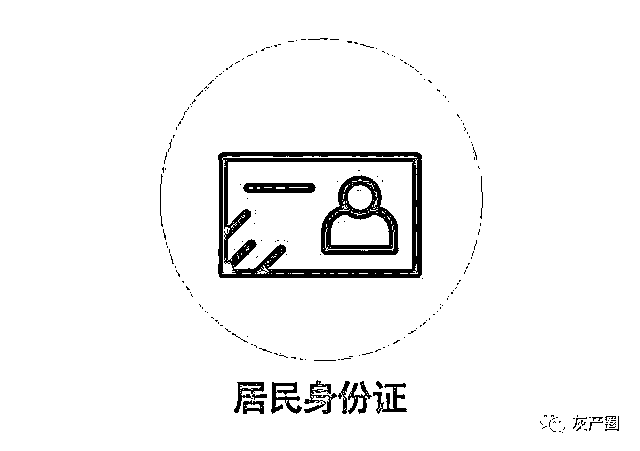
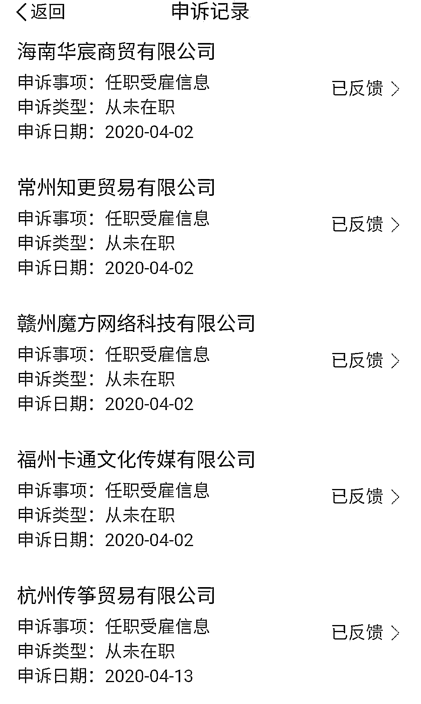
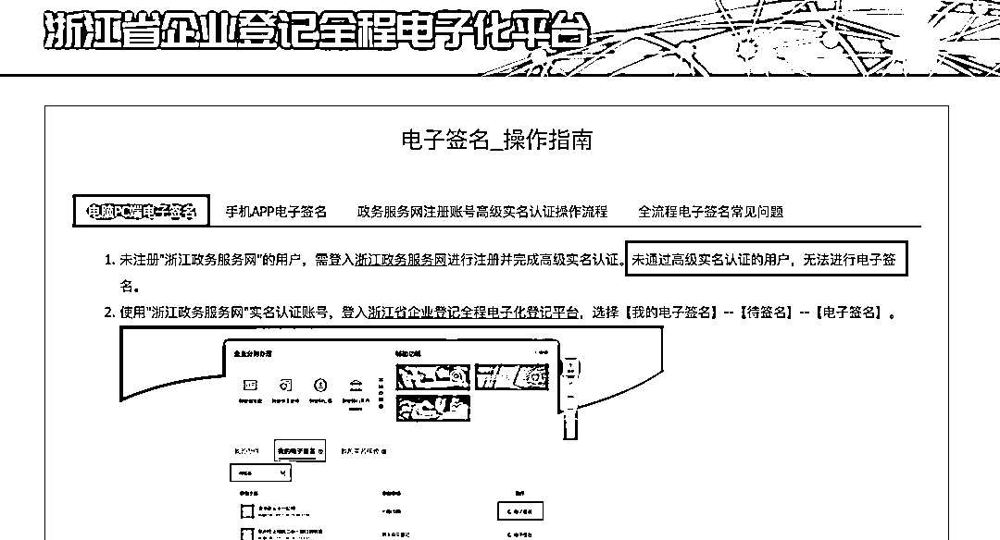
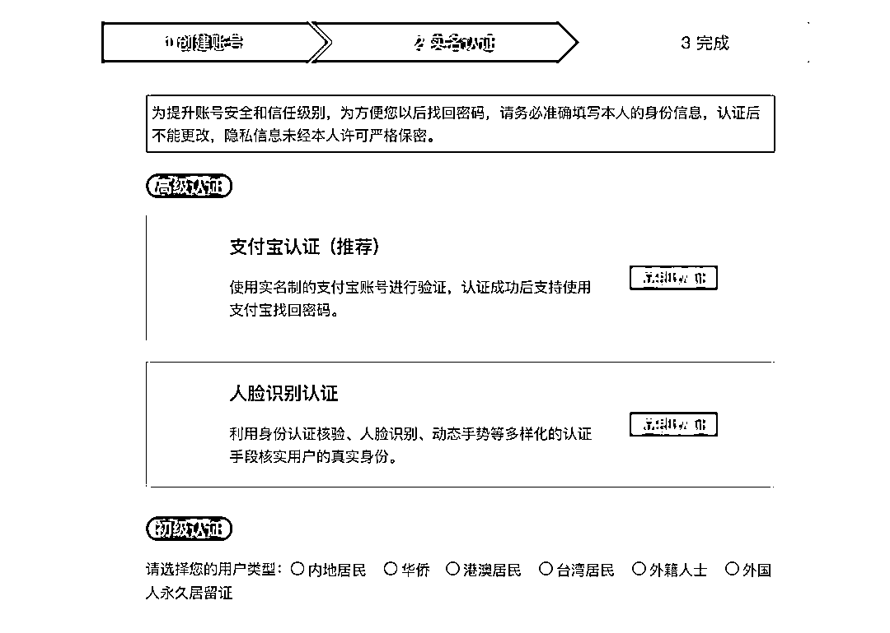
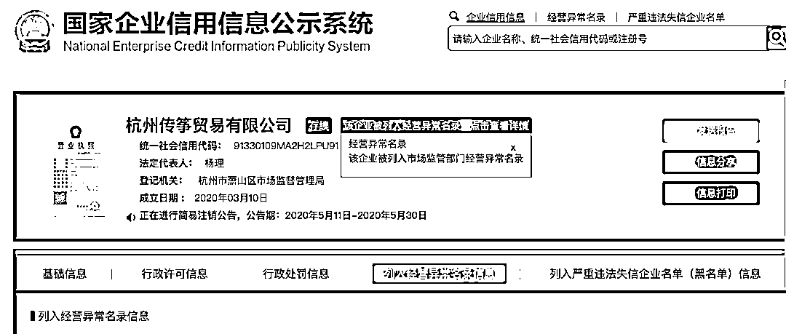

# 九年前丢身份证，一男子被当老板、“被”入职数十家公司！

> 原文：[`mp.weixin.qq.com/s?__biz=MzIyMDYwMTk0Mw==&mid=2247499455&idx=2&sn=94399720617f835be0cb65bd0327eb66&chksm=97cb3587a0bcbc91113fc6e286cc861f2251e1a5e920e6aae358cbcfa77903cffa53ea038208&scene=27#wechat_redirect`](http://mp.weixin.qq.com/s?__biz=MzIyMDYwMTk0Mw==&mid=2247499455&idx=2&sn=94399720617f835be0cb65bd0327eb66&chksm=97cb3587a0bcbc91113fc6e286cc861f2251e1a5e920e6aae358cbcfa77903cffa53ea038208&scene=27#wechat_redirect)

**点击上方蓝色字体免费订阅“灰产圈”**

**因九年前丢了一张身份证，来自贵州的王伟（化名）近来饱受个人信息泄露的困扰。** 

**不久前，他在个人所得税 App 上发现，自己“被入职”了数十家公司，还是其中一家杭州公司的法人代表。按照当地市场监管部门的说法，登记注册公司需经过人脸识别验证，基本不存在身份被冒用的可能。**

**那么问题到底出在哪里？就在王伟忙着为被冒用身份注册公司的事情奔走时，6 月 3 日晚，他又发现自己被登记成为另一家杭州公司的监事。**

*****“被入职”数十家公司，还是一家企业法人*****

****年初，王伟在申报 2019 年度个税时发现，个人所得税 App 上出现数十家未入职的陌生公司给他发放工资的记录。为了解除关系，他在个人所得税 App 上发起异议申诉。之后，这些公司所在地的税务部门陆续跟王伟核实“被入职”情况，并对此进行了处理。****

************“被入职”“被老板”涉及的部分公司。****

****王伟提出异议申诉后，在他名下的税务申报记录基本被撤回，但他与一家杭州公司却很难撇清关系。当地税务部门反馈，他是杭州传筝贸易有限公司的法人代表、实际控制人，还兼任公司执行董事和总经理。****

****国家企业信用信息公示系统显示，这家公司的核准日期为 2020 年 3 月 10 日，登记机关为杭州市萧山区市场监督管理局。公司主要经营体育用品及器材零售等。****

****随后，王伟在浙江省政务服务网站发起申诉并与萧山区市场监督管理局取得联系。萧山市场监督管理局的工作人员告诉他，传筝贸易公司由第三方代办注册，整个过程均是电子化操作，中途必须经过人脸识别认证。因此基本不存在冒用身份信息完成登记公司的可能。****

****据隐私护卫队了解，早在 2017 年，浙江省依托政务服务网推出企业登记全程电子化平台。登记公司者在该平台选择“全流程网上登记”方式时，系统会一键生成申请书、公司章程、股东会决议等文书，并最终由法人等进行电子签名。****

************未通过高级实名认证，无法进行电子签名。********按照相关提示，用户在进行电子签名操作时，必须提前注册浙江政务服务网并完成高级实名认证。认证的方法有两种，一种是借用支付宝授权的方式，允许“浙里办”应用访问用户的姓名、性别、支付宝账户名、手机号、证件号码等信息；另一种是在“浙里办”App 进行人脸识别认证，需按提示进行张嘴、眨眼等活体认证操作。************

****高级认证方法。****

****但王伟告诉隐私护卫队，自己从未进行过上述操作，更不曾刷脸认证过。那么他又是如何成为一家公司的法人代表呢？****

*********市场监管部门回应：*********

*********注册公司需人脸识别验证，可申请注销*********

****不甘心被冒用身份注册公司的王伟为了查清楚事实，随即注册了浙江政务服务网的账号。在企业登记全程电子化平台中，他发现一份“公司登记（备案）申请书”详细记录了传筝贸易公司的登记信息。该公司的法人，董事、监事、经理及股东信息栏中，均有他的身份证正反面照片、尾号为 7807 的手机号及电子签名等信息。****

****经确认，这张申请书中的身份证照片原件出自 2011 年王伟丢失的身份证；尾号为 7807 的手机号并非他申请开办，注册地为陕西西安；此外王伟强调电子签名也是伪造的。****

****在进一步调查中，王伟发现尾号为 7807 的手机号同时注册了支付宝账号和“浙里办”App 账号。他联系支付宝客服获悉，该支付宝账号在 2017 年已冻结。****

****针对冒用他人身份线上注册公司一事，6 月 4 日，隐私护卫队致电杭州市萧山区市场监督管理局，工作人员重申，全流程网上登记公司在进行电子签名时需要经过支付宝认证或人脸识别认证，不可能存在问题。****

****直到今日，王伟还在苦恼自己名下是如何多出一家公司。尾号 7807 注册的支付宝三年前已经冻结了，自己使用的支付宝也未曾被盗、授权“浙里办”应用，在此情况下，是否意味着有人盗用了王伟的人脸信息，并顺利破解了系统的识别功能？种种疑惑，目前尚不得而知。隐私护卫队会继续追踪。****

****按照萧山市监局工作人员的说法，如果这家公司确实不是王伟自行注册登记的，那么他可以申请注销。在王伟持续申诉下，目前传筝贸易公司已被市场监管部门列入经营异常名录，且正在进行简易注销公告。****

************传筝贸易公司目前的情况。********本以为个人信息泄露的麻烦可以暂告一段落，但结果并不如人意。6 月 3 日晚，王伟告诉隐私护卫队，在调查过程中又发现自己还在另一家“杭州橙以贸易有限公司”担任监事一职。他直言“快疯了”！****

*********延展：*********

*********防不胜防，破解人脸识别认证已形成产业链*********

********隐私护卫队注意到，类似王伟被冒名注册公司的情况多有发生。********

********国家市场监督管理局相关负责人曾表示，截至 2019 年 6 月，各级市场监管部门接到的冒用他人身份信息办理登记的举报数量约为 2.9 万件。为此，国家市场监管总局专门发布《关于撤销冒用他人身份信息取得公司登记的指导意见》，规定对于被冒用身份信息取得公司登记的人民群众撤销冒名登记的反映，各级市场监管部门应积极应对负责。********

********此外，为解决冒用身份登记公司的问题，依托国家政务服务平台统一身份认证系统，国家市场监管总局推进“全国企业登记身份管理信息实名验证系统”建设，并于 2019 年 3 月正式上线运行，随后全国各省市陆续接入其中。在该系统登记公司时，法人、股东、公司董事、监事等需完成身份认证，并进行人脸识别，确保“人证一致性”。********

********但人脸识别认证真的万无一失吗？********

********需要警惕的是，随着近年来人脸识别认证的广泛应用和推广，相应的黑灰产链条也慢慢出现并逐渐成熟。在产业链中，下游提供身份证号、人脸照片、电话卡等身份信息；中游提供“代过人脸识别认证”的技术支持，以及售卖人脸认证软件；上游则借助下层的帮助，注册各种支付软件、社交软件、婚恋软件等平台的账号，通过“薅羊毛”、电信诈骗、倒卖实名账号等进行谋利。********

********令人惊讶的是，即使是活体检测也能被破解。黑灰产人员利用动画软件可将静态人脸照片动态化，赋予照片眨眼、张嘴、点头等动作；随后导出视频并放在需要验证的手机或电脑摄像头前面，即可通过人脸识别认证。********

********《网络安全法》规定，任何个人和组织不得从事非法侵入他人网络、干扰他人网络正常功能等危害网络安全的活动。********

********南京信息工程大学法政学院教授蒋洁告诉隐私护卫队，如果冒用者采用技术手段破解了相关系统的人脸识别功能，则违反上述规定。并且，冒用者使用伪造、变造的或者盗用他人的居民身份证等依法可以用于证明身份的证件从事不法活动，涉嫌构成盗用身份证件罪。当事人可向市场监督管理局申请撤销登记，向公安机关报案或向人民法院提起民事诉讼。********

********她还表示，登记部门使用线上系统，则属于个人信息处理者范围，应对身份信息的真实性和安全性进行审查。“系统可以外包，但责任不能外包。”她强调说，除非平台能证明完全尽到安全保护义务，否则有必要要求因漏洞造成当事人损失的平台承担连带责任。********

********文|尤一炜 李玲 编辑|石莹 来源：隐私护卫队********

****************

****************

********← 向右滑动与灰产圈互动交流 →********

**************************点击****阅读原文****加入灰产圈高端社群**********

****************