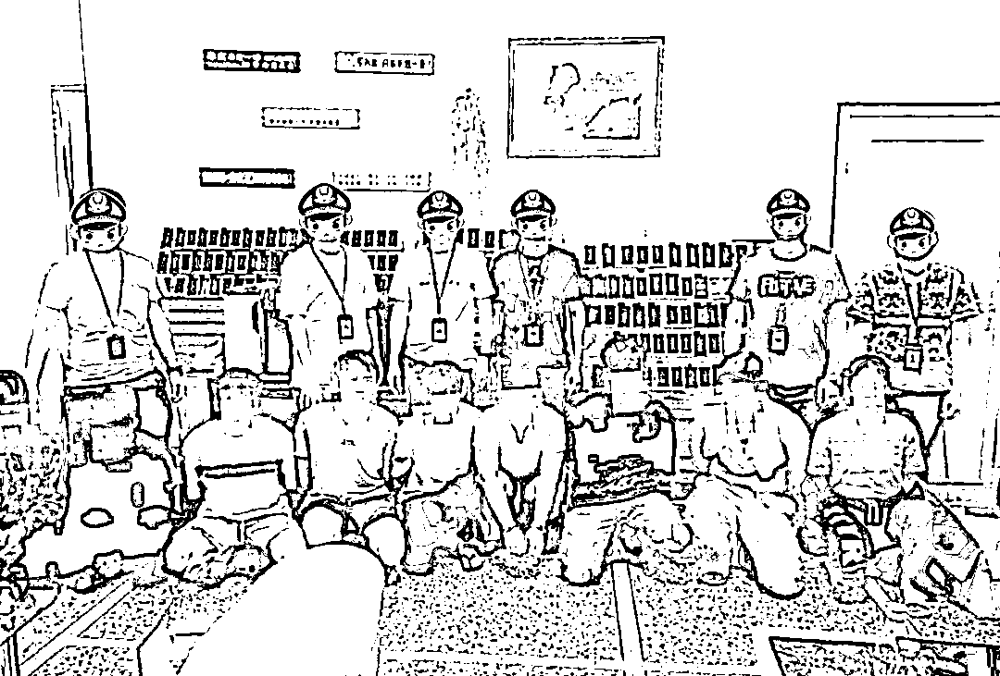
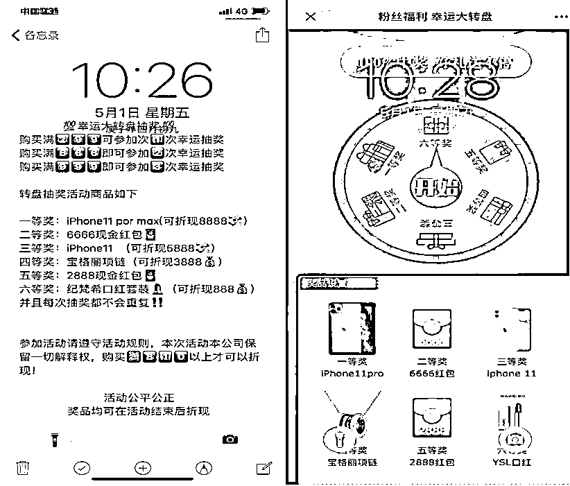
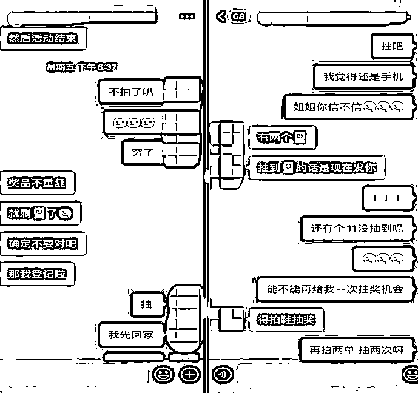
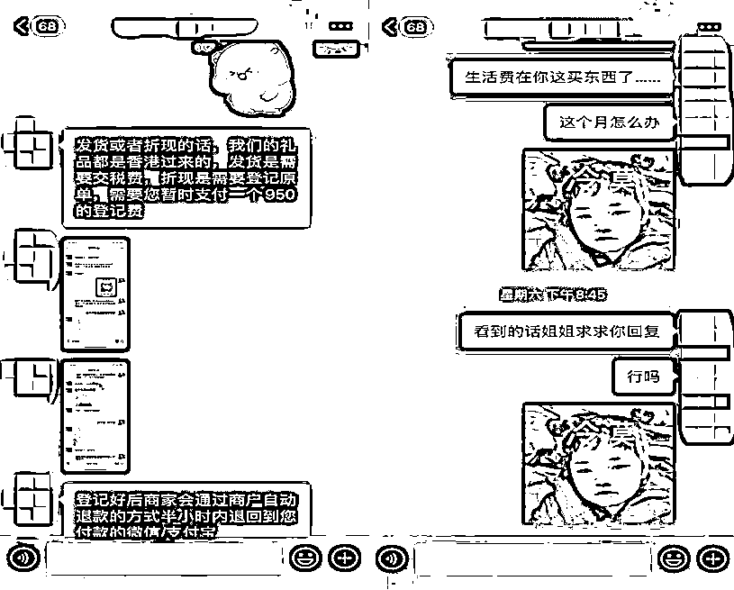
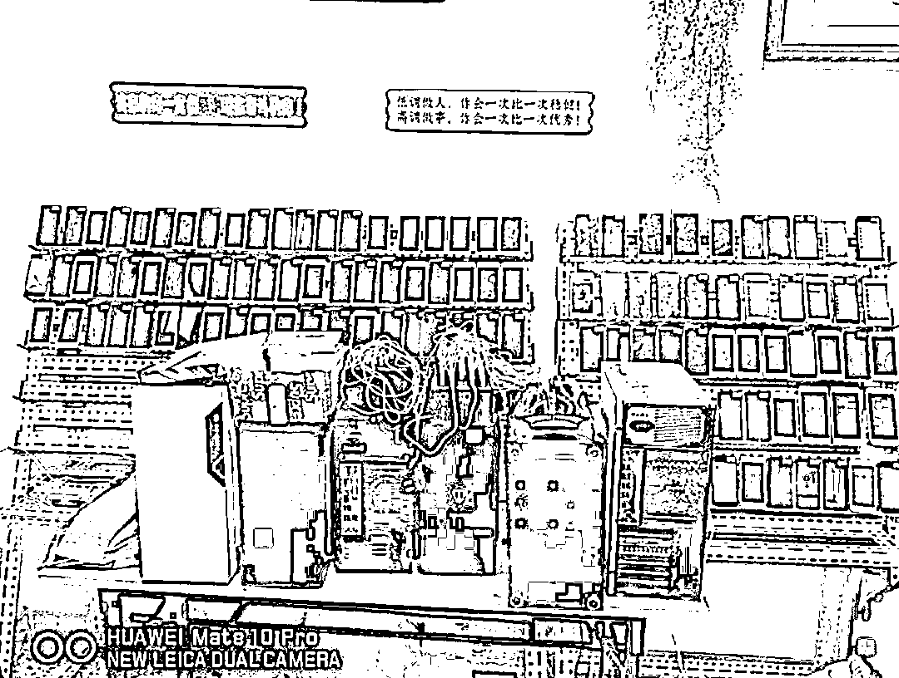
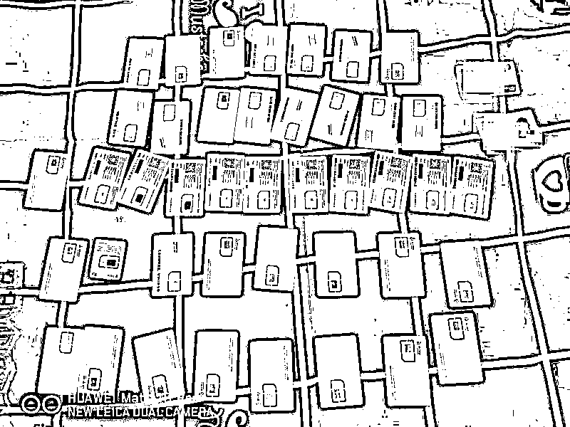

# 抽奖连环骗！网络购物诈骗团伙你遇见过吗？

> 原文：[`mp.weixin.qq.com/s?__biz=MzIyMDYwMTk0Mw==&mid=2247499455&idx=3&sn=02d450312dee0022fb1cff53c95a05bf&chksm=97cb3587a0bcbc91f4bb74368b193554857838c91a3256f3dc9080205e16a5cfa0ab53c1a563&scene=27#wechat_redirect`](http://mp.weixin.qq.com/s?__biz=MzIyMDYwMTk0Mw==&mid=2247499455&idx=3&sn=02d450312dee0022fb1cff53c95a05bf&chksm=97cb3587a0bcbc91f4bb74368b193554857838c91a3256f3dc9080205e16a5cfa0ab53c1a563&scene=27#wechat_redirect)

**点击上方蓝色字体免费订阅“灰产圈”**

购物满 299 就有资格抽奖 

奖品有苹果手机、宝格丽项链

还有超级大红包等你拿

中奖率百分之百

哎呀妈呀，天上咋又掉馅饼了 

商家脑子里也没进水

为啥要做这赔本生意

谁信谁可真就傻了

日前，广东佛山警方成功破获全市首例**以网购抽奖为幌子**实施诈骗的案件。

成功端掉两处作案窝点，抓获**12 名犯罪嫌疑人，**扣押涉案手机**325 台、**电脑**9 台**、手机卡**3100 多张**以及**话术剧本**等一批作案工具。

***微信购物抽大奖 诱骗买家上钩***

今年 18 岁的小张（化名）没事儿就喜欢抱着手机刷抖音。4 月下旬，网友小黑（化名）发布的网购抽奖的广告信息吸引了小张的注意，于是他**添加了小黑在抖音上备注的微信号。**

小黑的朋友圈里经常会发布“点赞送红包”的活动，并声称只要下单购物满 299 元就可以参与抽奖，且**中奖率百分百**，奖品都是**高档手机、奢侈品牌首饰**等。

看到如此丰厚的奖品，小张不由得动了心，但对方如此“壕气”也不禁让他产生些许怀疑，**“当时也担心过会是个骗局，但看到有不少‘网友’都兑奖成功，我就相信了。”**

难以抗拒的诱惑最终使小张打消了疑虑，他立刻购买了一双价值 299 元的鞋子，并在小黑发来的抽奖链接上幸运抽中了四等奖——一条项链。

尝到甜头的小张不满足，但要想再抽奖，则需再买满 299 元的商品。

欲罢不能的小张又买了 798 元的东西，而这次他成功抽中了一台苹果手机。

此时，小黑告诉小张，称奖品可以折现，但是**需要登记小张的个人信息，而且还需要交 950 元的登记费，**但登记费是可以事后返还的。

被飞来横财冲昏了头脑的小张依然觉得自己做着稳赚不赔的买卖，于是立即**向对方转账 950 元登记费**。

很快，他收到了对方发来的退款截图，对方向其承诺资金将在五天内到账。

然而五天过去了，**小张并没有收到苹果手机和退款，且无法联系对方。**

小张这才惊觉被骗 2047 元，匆忙到公安机关报案。

***警方速破案 揭密新型诈骗套路***

接报后，佛山网安部门立即对近期高发的网购诈骗类案件进行集中研判，成功锁定两个网络购物诈骗团伙。

经过分析研判，警方很快查清了该犯罪团伙的组织架构、活动轨迹及犯罪手段。

5 月 9 日，收网时机成熟。当晚 23 时许，佛山网安部门联合佛山市公安局南海分局成功打掉两个诈骗犯罪团伙，端掉作案窝点两处，**抓获犯罪嫌疑人 12 名，扣押涉案手机 325 台、电脑 9 台、手机卡 3100 多张以及话术剧本等一批作案工具。** 

办案民警介绍，这些诈骗分子主要是利用一些群众贪小便宜、崇尚大牌奢侈品、期望短期内获得高额报酬的心理进行诈骗。

经初步侦查，犯罪嫌疑人是**通过抖音等平台**发布广告，吸引受害人**添加微信**，之后在微信朋友圈**发布购物抽奖的虚假信息**，来引诱受害人购物，继而编造各种借口实施诈骗。 

目前，王某聪等 12 名犯罪嫌疑人已被公安机关依法刑事拘留。 

警方提醒

当前，直播带货、微信网购十分火爆，引得部分不法之徒动起了“歪脑筋”，他们打着网购的外衣，以参加抽奖活动为诱饵，实施网络诈骗活动。

**广大网民切记，勿贪小便宜！**

对于号称百分百中奖和超低价格的，一定要多留个心眼，以免上当受骗。  

图片 | 网络截图 素材 | 广东网警 编辑 | 梁小斌 来源：公安部网安局

← 向右滑动与灰产圈互动交流 →

**点击****阅读原文****加入灰产圈高端社群**

