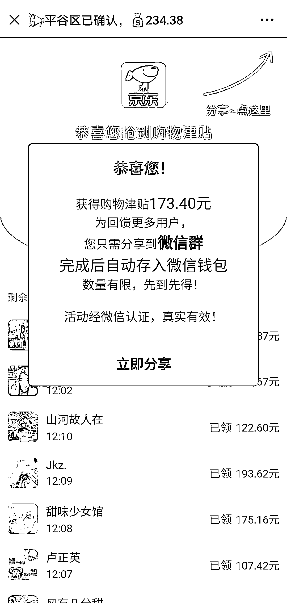

# 警惕！微信群里的这些“红包”链接不要信！

> 原文：[`mp.weixin.qq.com/s?__biz=MzIyMDYwMTk0Mw==&mid=2247499477&idx=2&sn=a3358cb66dc79f70b3387c13703fc548&chksm=97cb35eda0bcbcfb2aeb3572428728ac6ad55169e24f4ad21db4e1a34e914e7d46ba8f4ff720&scene=27#wechat_redirect`](http://mp.weixin.qq.com/s?__biz=MzIyMDYwMTk0Mw==&mid=2247499477&idx=2&sn=a3358cb66dc79f70b3387c13703fc548&chksm=97cb35eda0bcbcfb2aeb3572428728ac6ad55169e24f4ad21db4e1a34e914e7d46ba8f4ff720&scene=27#wechat_redirect)

**点击上方蓝色字体免费订阅“灰产圈”**

日前，微信群里出现一则名为“京东集团为回馈社会全民派发购物津贴”的链接，该链接中打出“该活动经过微信官方认证，抢到的购物津贴可提现”的广告。

对此，记者和京东、腾讯分别进行了核实，证实该链接系传播虚假内容。 

**△微信上的“假红包”**

微信平台表示，诈骗嫌疑人会把“假红包”链接的封面，包装成各种容易让人上当的形式。

如一条逼真的语音消息、邀请加群提示、“我已经领到了”等，以各种正规名目吸引用户点击，并伪造页面内容，欺骗和诱导用户再次转发。

“假红包”利用微信的好友关系链传播，容易让用户降低警惕性，用户收到由自己好友转发的“假红包”链接，出于对好友的信任，容易点击而上当。

**△微信上的“假红包”页面**

微信提醒用户一定要提高警惕，**在点击领取微信红包时，如果需要输入个人信息的都是假红包，尤其是要求用户分享给好友或者是分享到微信群、朋友圈的均为假红包。**

编辑：单镜宇  责任编辑：马涛  来源：央视新闻

← 向右滑动与灰产圈互动交流 →

**点击****阅读原文****加入灰产圈高端社群**

