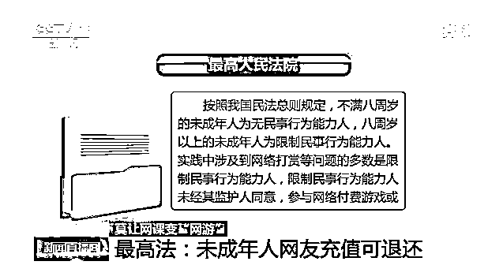
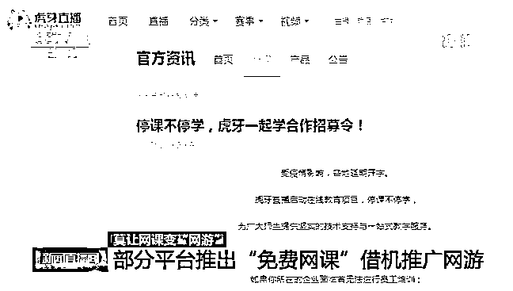

# 网课变“网游” ！虎牙推出“免费网课”借机推广网游

> 原文：[`mp.weixin.qq.com/s?__biz=MzIyMDYwMTk0Mw==&mid=2247499587&idx=1&sn=9908f2bfe1a6b126f32c80e21d9ef7f1&chksm=97cb347ba0bcbd6dfdbe23dd1a2543fe5c2d26cae8c4fce34f471e6ffc02ad7b91f5db6c0d6d&scene=27#wechat_redirect`](http://mp.weixin.qq.com/s?__biz=MzIyMDYwMTk0Mw==&mid=2247499587&idx=1&sn=9908f2bfe1a6b126f32c80e21d9ef7f1&chksm=97cb347ba0bcbd6dfdbe23dd1a2543fe5c2d26cae8c4fce34f471e6ffc02ad7b91f5db6c0d6d&scene=27#wechat_redirect)

**点击上方蓝色字体免费订阅“灰产圈”**

***导语***

现在各地的大中小学已经陆续复学复课，在过去的这个假期里，上网课是学生们学习的主要方式，但也出现了不少未成年人在网课期间沉迷网游，甚至是高额网络消费的情况。

[`mp.weixin.qq.com/mp/readtemplate?t=pages/video_player_tmpl&action=mpvideo&auto=0&vid=wxv_1375948542485086208`](https://mp.weixin.qq.com/mp/readtemplate?t=pages/video_player_tmpl&action=mpvideo&auto=0&vid=wxv_1375948542485086208)

前不久，十堰市公安局茅箭区分局武当路派出所接待了一位有史以来年级最小的“投案自首”者——一位只有九岁大的小女孩。 

据这位小女孩的父亲介绍，女儿今年小学二年级，她利用近期上网课的时间，偷偷玩手机游戏，还悄悄充值了一百多块钱。被家长发现后，小女孩也承认了错误，表示之后不会再犯。可没过几天，她的爸爸发现自己的微信钱包又少了三十元钱。为了让孩子记住教训，爸爸就让小女孩自己去投案“自首”。 

上网课却玩起网游，好在十堰的这位家长及时制止了孩子的不当行为，而下面的案例中，家长就没那么“幸运”。5 月初，江苏南通的陈女士在消费时发现自己的账户余额不足，查询后才发现近期自己的支付宝交易记录中有数十笔都是转账给一个名为“虎牙直播” 的账户。 

> **陈女士：**支付宝里面（交易记录）显示，“虎牙”就这个抬头公司，然后我就专门算了这笔钱，好像是 3 万多。

在陈女士的追问后才得知，这 3 万多元的消费被孩子购买了“虎牙直播”平台上的游戏装备和打赏。陈女士的孩子今年读七年级，这段时间以来她把自己的手机给孩子上网课，没想到孩子就借机在直播平台上消费。 

陈女士说，**尽管虎牙平台的客服人员表示可以进行核实是否为未成年人消费，但最终想要拿回退费，还需要她答应一个条件。 **

陈女士前后多次与“虎牙直播”平台进行沟通，但截至记者发稿前，她还没有收到虎牙平台任何的退费。 

***最高法：未成年人网友充值可退还***

据记者梳理，近期安徽、吉林、河北、广东等地都出现了类似的案例，针对这些案例和纠纷，最高人民法院出台指导意见，明确疫情期间未成年人在家长不知情的情况下进行的网游消费，可以申请退费。

据最高人民法院介绍，按照我国民法总则规定，不满八周岁的未成年人为无民事行为能力人，八周岁以上的未成年人为限制民事行为能力人。实践中涉及网络打赏等问题的多数是限制民事行为能力人，限制民事行为能力人未经其监护人同意，**参与网络付费游戏或者网络直播平台“打赏”支出与其年龄、智力不相适应的款项，监护人请求网络服务提供者返还该款项的，人民法院应予支持。 **

***部分平台推出“免费网课”借机推广网游***

记者在采访中也发现，一些网络平台利用免费提供的上网课渠道，向未成年人推广网络游戏。

据“虎牙直播”网址的信息显示：“虎牙直播”是以游戏直播为主的弹幕式互动直播平台，累计注册用户 2 亿。 

以游戏类、社交类服务为主的“虎牙直播”，在今年 2 月初发布公告称：“停课不停学，为广大师生提供坚实的技术支持与一站式教学服务。” 

今年 4 月初，**记者在没有注册的情况下登录“虎牙直播”平台的手机 App，进入页面的第一步便弹出了各种网游的兴趣选项。**该平台页面上方的栏目版块，被冠以诸如王者荣耀、和平精英等网游、二次元、颜值、交友的版块，而名为“一起学”的栏目被放置在了最后。也就是说，**想要在虎牙平台进行网络学习，先要浏览大量游戏、交友的信息。 **

记者进入“一起学”栏目中“在线课堂”的子栏目，找到了其免费提供的网络课堂，内容涵盖初高中和小学各年级，点击便可以观看。**在这些所谓免费的网课中，记者却发现大量被精心包装的游戏广告。**

在一个名为“学而思网校二年级”的直播间，虎牙直播了提供的网友互动版，名为 “主播动态”，其中名为“三千牧神记”的网游广告十分醒目，点击页面就被跳转到游戏的界面，该游戏直接使用微信、QQ 等方式便可快速登录，页面还提供了大量游戏道具的消费选项。在“虎牙直播”的电脑网页版中记者发现，在其提供的网课栏目的页面中，网游广告更是比比皆是。 

同样是以游戏直播为主的“斗鱼平台”，记者也发现了几乎一致的情况，该平台提供了“教育”栏目，但在面向未成年人提供的网络课堂中，网游广告、网络小说等被放置在页面中醒目的位置，用户点击就可以跳转。

编辑：单镜宇 责任编辑：孟夏  来源：央视新闻

← 向右滑动与灰产圈互动交流 →

**点击****阅读原文****加入灰产圈高端社群**

