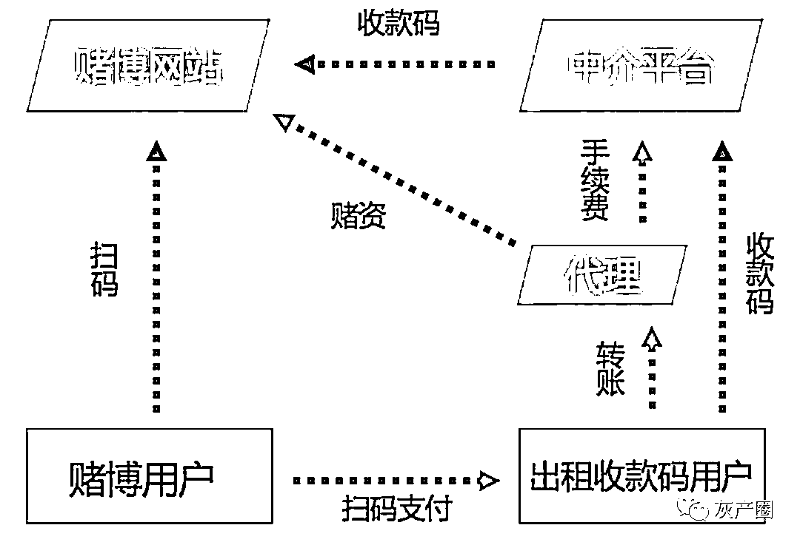
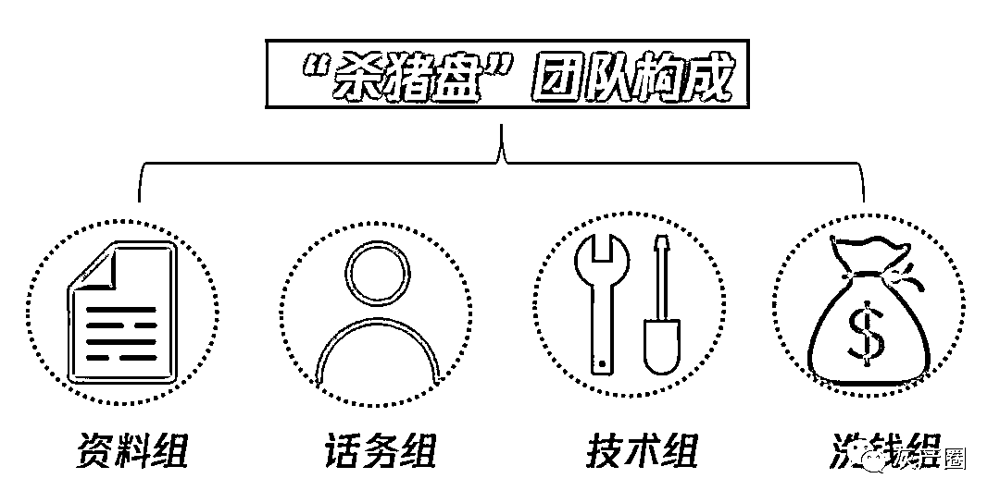
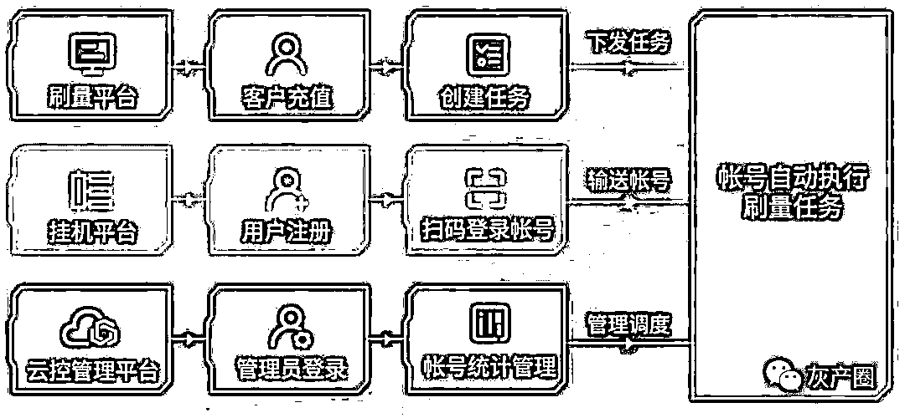
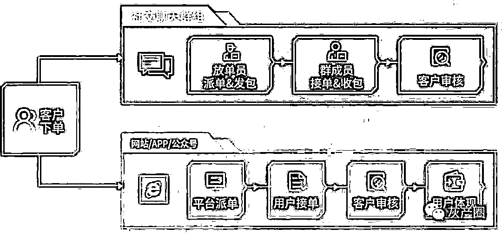

# 什么是狗推？盘点五大新型黑产

> 原文：[`mp.weixin.qq.com/s?__biz=MzIyMDYwMTk0Mw==&mid=2247499587&idx=2&sn=6576b8f8d5cc7fadb9fc8d110041e190&chksm=97cb347ba0bcbd6d90a19c3f76b4cd050361266c91ee1e7bc4b6d72a47bbd896432df1fc3af2&scene=27#wechat_redirect`](http://mp.weixin.qq.com/s?__biz=MzIyMDYwMTk0Mw==&mid=2247499587&idx=2&sn=6576b8f8d5cc7fadb9fc8d110041e190&chksm=97cb347ba0bcbd6d90a19c3f76b4cd050361266c91ee1e7bc4b6d72a47bbd896432df1fc3af2&scene=27#wechat_redirect)

**点击上方蓝色字体免费订阅“灰产圈”**

诈骗运作模式正在呈现专业化、公司化的趋势,犯罪手段也变得更加智能，并且已经逐渐形成了**“恶意注册—引流—诈骗—洗钱”**等各环节精细分工的完整链条，形成了网络诈骗的“新范式”。

今天，小编带着大家一起来

“盘一盘”5 大新型网络黑产案件

希望大家识别套路

不再陷入不法分子的陷阱！

1 出租收款码轻松“躺赚”？实则在为黑产洗钱

所有人都希望能找到一份钱多、活少、离家近的工作，可惜打着这种广告的通常不是诈骗就是传销。

近年来，网上突然流传起一种**“出租收款码”**的赚钱方式，据说只需要提前交付对方一定数额的押金，再按照对方要求输入收款金额，然后把收款码截图发送给对方，就能按照收款金额拿到一定比例的佣金。

但其实，这套“出租收款码”的模式原来是非法赌博网站精心研究出的新型洗钱路径，利用互联网上的庞大用户把他们的赃款分散，最终漂白。

在这条洗钱路径中，赌博网站通过中介平台和代理商把赌博用户充值的赃款下发给“出租收款码”的用户，这部分用户在扣取自己的收益后把剩下的钱再通过代理商返还给中介平台，中介平台和代理商收取各自的利益后再把钱打给赌博网站。

这样一来，非法赌博网站数以亿计的赃款就能通过这些私人账户分批分量地运作，最终把钱赃款漂白，并且由于洗钱路径隐蔽分散，也加大了警方的侦查难度。

这个案件里最可怕的还在于，这一次参与者并不仅是受害者，还在不自觉中沦为了违法犯罪活动中的工具，可能需要承担法律责任！

所以，各位小伙伴们在面对“天上掉馅饼的好事”时，一定要注意提高警惕！想占小便宜的人，很可能会被别人占了大便宜。

2 谈恋爱误入“杀猪盘”？这种爱情在为黑产引流

如果说，你是一名大龄单身青年，现在突然有个“灵魂伴侣”降临到你身边，他的一切都符合你的“幻想”；为了两个人的未来，他打算利用公司的系统“漏洞”带你发大财，你会不会心动？

**小心了，不仅赚钱是假的**

**这份爱也是假的！**

**这其实是令无数受害者**

**“伤心伤财”的“杀猪盘”**

“杀猪盘”是业界的一种俗称，实际上它是指一种打着交友名义，通过培养感情获取信任，再诱惑受害者至博彩网站投资，从而实施敛财的新型情感投资类诈骗。

此类骗局最早兴起在 2017 年，以男性同志和单身大龄女青年等感情寂寞的人士为主要目标，而操盘者的大本营大多设在东南亚，尤其是在菲律宾、柬埔寨、泰国、马来西亚等允许线上赌博的国家。

一支完整的“杀猪盘”团队，通常会分为资料组、话务组（钓鱼）组、技术组，以及洗钱组。

**资料组**是实行犯罪的基础，他们的工作就是快速筛选用户，找到那些容易上当受骗的人；

**话务组**是直接与受害者接触的“前线”，主要任务就是利用目标人群对于美好生活的渴望、精神的空虚和对爱情的向往，打造一个“完美的恋爱人设”；

**技术组**的主要工作内容是为资料组及话务组提供技术支持，就包括获取受害者信息、制造假的照片音频视频等身份证据以及最重要的搭建博彩网站、控制博彩中奖概率、直接修改胜负概率等；

而**洗钱组**，顾名思义就是要将骗来的钱“漂白”成可用于流通的正常款项。

与其他纯粹圈钱敛财的骗局不同，在“杀猪盘”这样的情感类诈骗中，受害者往往曾认真付出过感情，而当他发现自己被欺骗后，失去的就远不止是金钱，还有爱情的毁灭，人财两空的打击会对其身心造成巨大损害。

因此，我们在网络交友时，一定要留心查证对方身份，不随便轻信陌生人。

3 出国务工“高薪梦”，成为“狗推”被困海外

海外办公、包吃包住、工资高而且还有许多福利？这么好的机会，还不速来把握？！

在很多招聘平台上，我们时常能看到这样极具诱惑力的类似广告。但奇怪的是，无一例外，对方的“门槛”都很低，不会有工作经验、学历、专业的要求，大伙觉得这是怎么回事呢？

真相就是，这可不是一份“正经工作”，而是担任“网络博彩”行业推广业务员！

**“狗推”**是网络博彩行业推广业务员的简称，让受害者人财两空的“杀猪盘”就是他们的杰作之一。“狗推”上要对老板负责（也被称为“狗庄”），服从管理，为老板赚钱，拿微薄的提成；下要寻找作案对象，把那些期待爱情、期待激情、期待志同道合的人，发展为待宰的“大肥猪”。

在外人面前他们留给大家印象大多是光鲜亮丽，一个个非富即贵。但实际上，却过着猪狗不如的生活。在这些员工之中，很多人是在不知真相的情况被忽悠而来的，还有一部分人是专门付了中介费出国务工的，没做满半年的话就得给公司赔付。**同时，如果没有完成公司制定的业绩，就会遭到公司的警告、记错、罚款甚至是毒打、软禁。**

值得一提的是，这些“狗推”一方面是受害者，被不法分子忽悠而进入这行业，同时在这过程中不仅挣不到钱还可能受到生命威胁；而另一方面，还有一些“狗推”由于公司的“文化宣传”、“激励制度”最终利欲熏心，被“洗脑”成一个实打实的“职业狗推”，成为了“庄家”的帮凶，四处坑骗同胞。 

想要提醒大家，在网上寻找工作时，一定要核实公司与职务的真实性，不要被“诱惑”蒙蔽了双眼，最终陷入无尽深渊。

4 动辄千万的“数据神话“，背后完整的“刷量”黑产

“十秒卖出上万件产品，2 小时销售额超千万”

“日均视频播放量 50 万人次，坐拥全网百万粉丝”

……

在各大平台上

KOL（网红、大 V 等意见领袖）

正在创造一个又一个的“数据神话”

然而，这些数据都是真的吗？不，这里头，水分可是真不少。

据 “2019 中国文娱金数据年中发布会”数据显示：2019 年上半年全网无效声量再创新高，达到了 71%，无效用户的占比高达 49.4%。也就是说，在全网范围内可能有近一半的用户都是“僵尸粉”，是假人。

从粉丝数、互动量、播放量……任何数据都可以轻易飙升，都可以造假，“刷量”服务随着技术的日益升级，已然形成了一条专业化、体系化、分工明确的黑色产业链。

那究竟是如何在短期内“创造”出庞大的网络流量数据的呢？这就得提到虚假流量运作手法和庞大的刷量工作人员了。

第一种最低级的做法就是单纯依靠机器进行自动刷量，刷量者通过代理 IP 和模拟登陆态势的形式制造虚拟用户，并引入“群控”技术，实现由一台电脑控制多台手机、多个账号的批量操作。

第二种高级一些的，刷量方通过各大网络社交平台，雇用了大批的网友来充当“投手”组团完成刷量任务，例如当有一篇文章需要刷点击率时，需求方就会将文章链接发布到由数百位“投手”组成的任务群，并要求每个人点击。

最新的刷量手法，则是依靠“人工+机器组合刷量”，它将人工刷与机器刷巧妙的结合在一起，先通过网络社交平台搜集、雇佣和租赁大量的真实账号，接着将“挂机平台”作为一个中台，链接账号和下游的机器刷量平台，通过“挂机平台”自动进行刷量服务。

其实，凭借“制造出来的虚假流量”营造的数据狂欢不仅难以持续，而且还可能引发多种危害，我们所有人都应该自觉抵制数据流量的造假行为！

5 不断翻新的”网络赌博“，已形成完整产业链

随着网络科技的不断发展，一些不法分子也乘上了互联网的快车；他们利用网络的强互动性、支付方便、流量庞大等特点，将从前四处躲藏流窜的地下赌庄，变成了如今可以实时下注的赌博网站、赌博 APP。

并且，如今的“网络赌博”，从搭建平台的技术人员、负责推广的推广人员、后台操控的技术人员到负责洗钱的后台人员等已然形成了一条分工明确、公司化、制度化运作的完整产业链👇

首先，随着近年来移动通信的发展，网络赌博逐渐发展出移动化的 APP 形式，不法分子在建立赌博平台时就会利用“强伪装”使其更具有迷惑性和隐蔽性。

其次，为了扩大“客流”，这些赌博平台都会使用线上线下双重推广来宣传引流。线下推广方式除了雇佣大量的临时工，张贴小广告、发小卡片外，主要是通过利诱会员发展下线，实现“人拉人”，而线上则通过网络域名劫持、盗取信息群发消息、利用社交平台、网站等方式引流。

最后，如今的网络赌博已经衍生出了除专业赌博网站、赌博 APP 外的”丰富“参赌形式，例如借网络游戏抽装备“开赌场”、开发直播软件“设赌局”等等。

"

**在此，要警示大家，组织和参与“网络赌博”都是违法行为；我们既要做到自觉抵制赌博，另一方面若有发现相关赌博情况，也应该第一时间进行举报投诉哦！**

"

各类骗局层出不穷，每年都在变换花招

针对人性弱点层层下套、步步设局

但是，只要我们保持警惕，提高自身防范意识

增强反诈知识，就不会落入骗子的陷阱！

← 向右滑动与灰产圈互动交流 →

**点击****阅读原文****加入灰产圈高端社群**

