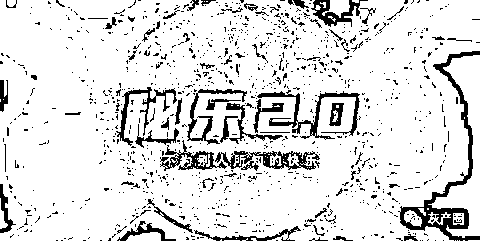
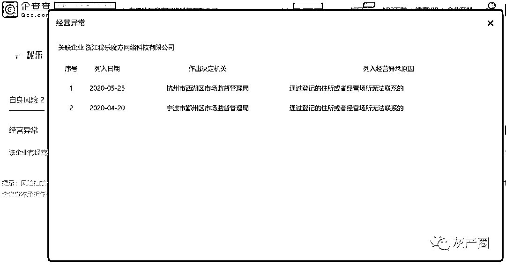
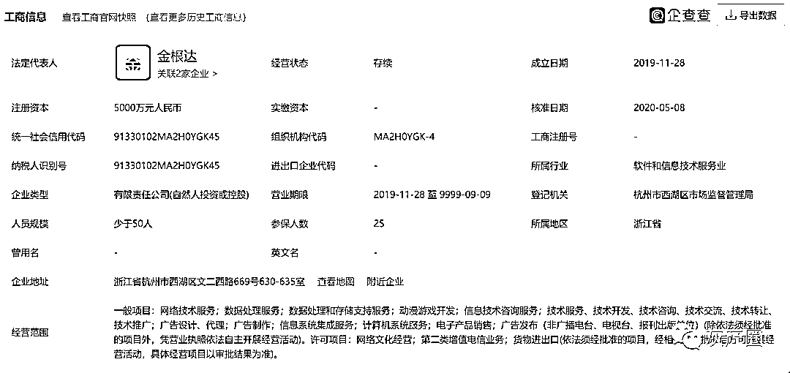
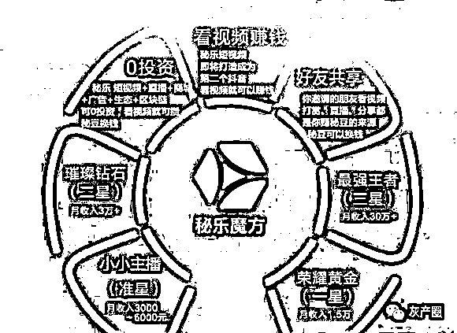
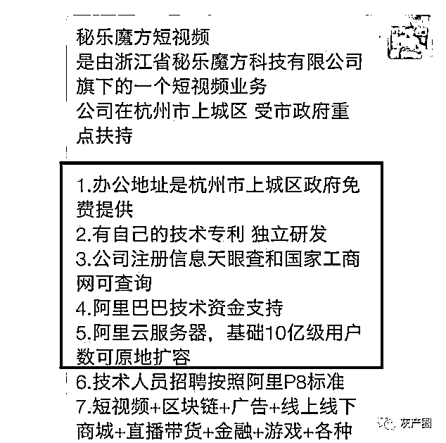
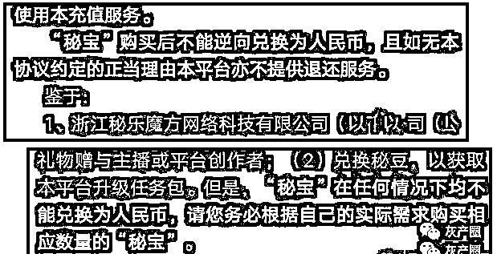
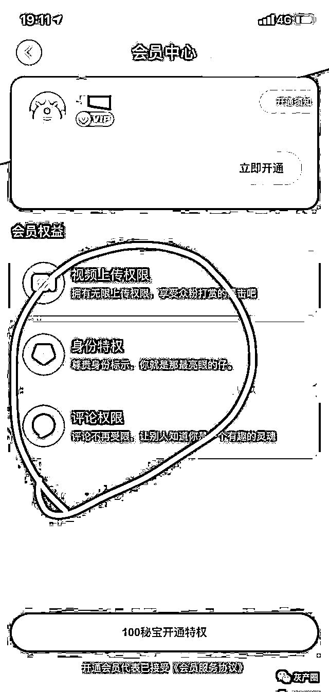
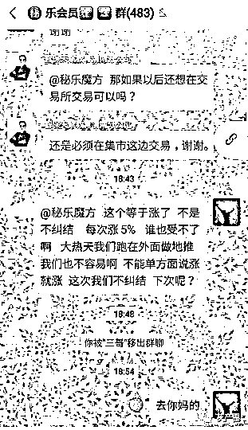
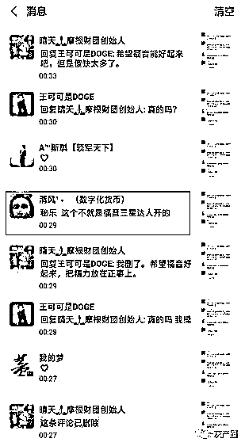
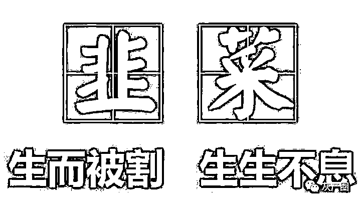

# 论韭菜的自我修养：秘乐短视频，看了能赚钱？

> 原文：[`mp.weixin.qq.com/s?__biz=MzIyMDYwMTk0Mw==&mid=2247499637&idx=1&sn=cf05ee1db09c86ac8df6033091c58be2&chksm=97cb344da0bcbd5b46f602d09c1326359bd6c26e12bcc90a63f27d9fdc6e096d4ebc9a363e42&scene=27#wechat_redirect`](http://mp.weixin.qq.com/s?__biz=MzIyMDYwMTk0Mw==&mid=2247499637&idx=1&sn=cf05ee1db09c86ac8df6033091c58be2&chksm=97cb344da0bcbd5b46f602d09c1326359bd6c26e12bcc90a63f27d9fdc6e096d4ebc9a363e42&scene=27#wechat_redirect)

**点击上方蓝色字体免费订阅“灰产圈”**

1

最近有粉丝咨询“秘乐魔方”， 在我们了解到该平台的相关情况后，发现“秘乐”实际上就是套用了趣步的模式。

和之前已经跑路的福音短视频和遇见短视频一样，都是利用传销模式零撸噱头来吸引投资者参与，等到会员基础量大了那么也就到了玩各种套路的时候了。

2

现在秘乐已经开始了它的表演，你们准备好了没有？

有投资者说大部分人相信它能挣到钱，是看到秘乐有个公司主体才敢去做的。可真有有一家公司主体真那么让人信服吗？

19 年 p2p 集体爆雷，多少个上市公司，多少位亿万富翁。还有前不久的原油宝事件。这么大的企业都不能保证你的资产？

为什么你要相信才成立半年之久花几千块钱注册的浙江秘乐魔方网络科技有限公司，且有可能是一个皮包公司，又有什么信用背书呢？

还有就是实名认证，支付宝授权，还有扫脸认证，其实这些都是你的隐私，你现在打开软件看看秘乐能不能注销，你去找下客服看看他搭理你不，千万不要因小失大。

官网介绍，秘乐魔方成立于 2019 年，是国内首家将区块链技术应用于移动互联网场景的科技企业，秘乐魔方号称注册资金 5000 万，实缴资金只有 29 万元。

而且是在公司注册后的一个月左右时间才有 2 个股东各投了 20 万元和 9 万元。可想而知之前是如何虚假宣传的。

如今秘乐魔方的官方主体已被列入经营异常名录，原因是住所无法联系。如果只是更改了住所，又为何不去报备。

3

  

秘乐魔方号称“零投资，看视频就可以赚钱”。

在市场推广中，该项目主动对标“走路就能赚钱”的趣步，相较趣步宣传的“走路就能月赚十几万”，该项目的宣传更加疯狂：“零投资，看视频就能月赚三十万”、“月入百万甚至上不封顶”。

据调研得知：除了标榜“零撸、高收入”之外，秘乐平台还打出“短视频+直播+商城+广告+生态+区块链”的旗号，并宣扬和某云已签订战略合作。

在秘乐吹嘘自己获得阿里云技术资金支持不久，有网友向阿里公司打电话求证了这一说法，该网友向支付宝客服求证后得到的答案是：

秘乐平台只是支付宝的普通用户，并告知该网友秘乐已涉嫌金融诈骗切勿投资。

4

对于变现，就是秘乐限制你出金让你入金的套路。

现在秘乐更新到 2.0，如果你想卖豆需要将秘豆换成秘宝，然后用秘宝打赏你自己发布的作品，然后收到礼物后扣除 25%手续费才能提现到自己银行卡。

你想打赏给你自己，你必须有上传视频的权限，这个权限需要开通 VIP 服务，也就是要花 10 人民币，钱还没挣，就要先给平台充钱。

大家可以算一下，注册会员 2000 多万，一人 10 块钱，这是多少钱，一个小小改动就要圈钱数亿。操盘手的野心真大。

秘乐不邀请需要扣除 50%手续费，然后又要充会员费，现在据投资者说秘乐单方面又要加 5%手续费，套路越来越多，投资者想撸钱已经没那么容易了。

据知情者爆料称：秘乐是福音短视频三星达人开的盘，也就是所谓的金某。

5

  

如今，各种旗号的传销，招摇过市，从已经崩盘跑路的“福音”短视频，到已经被定性为传销的“趣步”，再到如今的“秘乐”短视频，骗局一个接着一个，很多是换汤不换药，这些打着“区块链”、“躺赚、零撸”、“虚拟货币”等等为噱头的传销层出不穷。

多了也不用多说，投资者自己把控就好了，别到时没撸到钱，反而被平台撸了。

“秘乐魔方”最后的结局也会像趣步一样，慢慢的走向消亡。公司没有产品，那么主要的收入来源就是那些买糖果人的钱，糖果价格也是操盘手来决定的。最后手里只剩下一堆无用虚拟的糖果，没有任何价值。

← 向右滑动与灰产圈互动交流 →

**点击****阅读原文****加入灰产圈高端社群**

