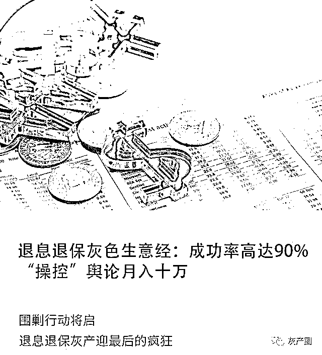
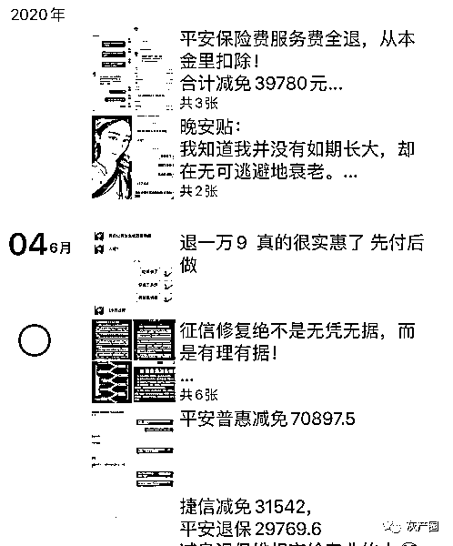
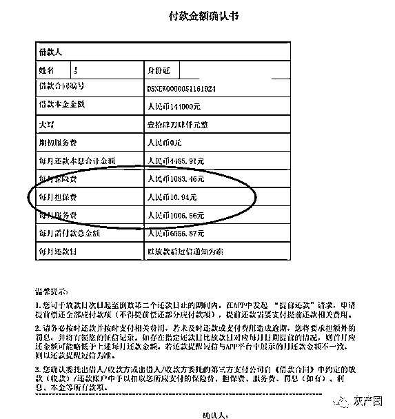
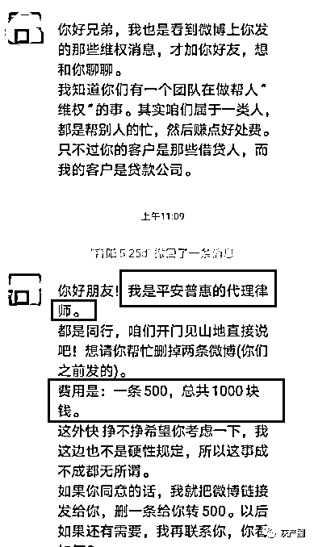

# 退息退保灰色生意经：成功率高达 90%，“操控”舆论月入十万

> 原文：[`mp.weixin.qq.com/s?__biz=MzIyMDYwMTk0Mw==&mid=2247499637&idx=3&sn=f72c11862ea086ba437c97c554c0e8e5&chksm=97cb344da0bcbd5be2fdc9e1af5bc4687061d5801d28fe9e41e1080e69eb8c8d7cb2ec9b1bf6&scene=27#wechat_redirect`](http://mp.weixin.qq.com/s?__biz=MzIyMDYwMTk0Mw==&mid=2247499637&idx=3&sn=f72c11862ea086ba437c97c554c0e8e5&chksm=97cb344da0bcbd5be2fdc9e1af5bc4687061d5801d28fe9e41e1080e69eb8c8d7cb2ec9b1bf6&scene=27#wechat_redirect)

**点击上方蓝色字体免费订阅“灰产圈”**

文 | 木子

自 2020 年初以来，新冠肺炎疫情影响之下，不少企业、个人收入受到冲击，放款机构逾期走高，处于风口浪尖上。 

在此背景下，暗流涌动，“代理退息退保”中介肆意猖獗，他们在各类社交、视频平台疯狂造势，推动了一波退息退保大潮，并发展出一条全新的产业链，有中介靠提供退息退保服务，月入超十万。

这个灰色产业链的活跃，已经引起了监管部门的注意，但中介仍想瞅准时机，上演一把最后的疯狂……

***疫情下的退息退保潮***

“全额退保，专业团队指导，提供一对一咨询服务”、“网贷退保退息，不要白不要的钱”……在各大信用卡论坛、贴吧、微信公众号，到处都是退息退保中介的广告。

“客户这边只需提供借款合同，我们来做前期工作，给你准备话术，你只要配合我们打个电话，我们是包退的。”中介吴帆告诉消金社，**按照客户付出的成本计算，他们一般能给客户带来十倍以上的收益。**

“今年以来，蓄意投诉明显增加，**最近半年要求退息的客户，起码是过去的 5 倍。**”北京某金融机构工作人员陈晨告诉消金社，疫情影响了一部分客户的还款能力，当他们还不起钱，就想找办法，“有需求就有产品，中介就充当了这个角色。”

除了退息之外，追回商业保险保费的退保业务也火了起来。

“全额退保，不成功不收费”一位退保中介称，他们会在成功后向消费者收取退保金额 20%-50%不等的手续费。

“如果自己去退，很难退，或只能退很小的保险现金价值（投保人退保时，保险公司向投保人退还的那部分金额），大概 10%。”吴帆向消金社表示，“保险公司肯定不会从明面上告诉能退大部分，因为这个口子一旦撕开了，他们损失就不是几千几百了。”

**“我们这是帮人维权，专业的人做专业的事。”**吴帆告诉消金社，他们目前已帮数百人提供了退息退保服务，成功率高达 90%，每笔平均收取 30%的服务费，靠着这个，单月收入能超 10 万。

“我们除了帮人退息退保，还可以提供中介技术服务。”吴帆表示。消金社了解到，退保退息已衍生了一个灰色产业，这些领头人或中介，正在发展下线代理商，以提成算业绩，每笔业务可以收取 5-10%的代理费。

消金社从退息退保中介的朋友圈看到，有多条退费成功的截图。然而，这个看似暴利双赢的退保业务，事实真的如此吗？

退息退保中介朋友圈，由吴帆提供

李丽在微博上看到可以帮忙退息的消息，然后加了中介微信，中介表示可跟她定制方案，收费 1288 元，并承诺不成功退款。李丽犹豫后还是决定尝试一下，付款后，中介发给她一个二维码，然后让下载一个叫做“易答在线”的 APP。

李丽注册后，发现 APP 里都是一些关于退息退保相关的金融类培训内容和视频。“中介让我在平台上选一位老师一对一教我，老师给我发了一堆话术过来，就是所有人都能用的那种，让我按照话术给贷款公司打电话。”李丽此时发觉并不是定制方案，想申请退费，却被告知充值的会员费不能退，老师也变得爱答不理……

一位受害人表示，“**网上全额退息退保的，十有八九是骗子**，交保证金后就教点话术让用户自己操作，成不成他们也不管了，保证金也不给退了。”

***中介的生意经：操控舆论退保退息***

除去那些骗一个算一个的骗子，退息退保中介到底是如何做到让金融平台吃进嘴里的肉再吐出来的？

消金社了解到，商业保险的退费，主要是根据保险销售环节的漏洞而定的退款比例，如果是通过业务员销售误导，保险销售环节有明显漏洞的业务，大额退费的机会很大。如果正常购买的保单，保费一般可以退一半。

当然，这其中的关键便是：**找出金融机构的“漏洞”，再以协商+投诉的方式要求对方退还利息和保费。 **

一位借款人给消金社出示的平安普惠《付款金额确认书》显示，借款总额 144000 元，除每月还本付息外，每月保险费、担保费和服务费分别为 1083.46 元、10.94 元和 1006.56 元。

平安普惠《付款金额确认书》

**“退息，其实就是退利息超过法定利率红线 36%的部分，只要有证据，有合理的方式方法那皆可处理退息退费。”**中介吴帆介绍道，除此之外，便是退合同中的保险费，服务费，管理费等。

根据中国人民银行针对金融消费者保护实施办法第二十条规定：金融机构在提供金融产品和服务的过程中，不得通过附加限制性条件的方式要求金融消费者购买协议中未作明确要求的产品和服务。

“平安普惠业务员办理贷款业务时为了客户更容易接受，他们一般也只会说利息是 8 厘到 1 分 2，绝口不提服务费和保费，**而这些费用是隐藏在合同里面的，绝大部分客户都是不知情的情况下就签了合同。**”吴帆表示，按照法律专业术语讲，这种方式存在捆绑销售保险，和欺瞒消费者之嫌，这也就是他们能帮客户协商追回服务费和保费的一个重要依据。

**若放款平台不同意协商，那么投诉就派上用场了。**

吴帆介绍，他们目前拥有专门研究各家银行、网贷、消费金融公司及金融监管部门投诉规则的法务团队。

“先处理后撤诉，不见钱就不要撤诉。”吴帆表示，投诉对放款机构还是具备相当的杀伤力。

一个重要原因是，近年来金融监管的收紧。

从 2018 年开始，金融就走上了“去杠杆、降风险”之路，监管趋严。去年“3·15”之后，公安部门频频出手，金融科技行业不断传出有公司被调查、相关人员被抓捕的消息。

2019 年 10 月 21 日，全国扫黑办发布了关于办理非法放贷刑事案件的政策文件，指出年利率 36%为非法放贷认定标准。

此时，金融行业倍感压力。

在金融机构工作的陈晨表示，**在过去，他们基本不会妥协，但现在，面对来投诉或者“撒泼”的客户，他们宁愿息事宁人，退钱了事。**

为了进一步给放款机构增加压力，中介及他们组织的客户，除了去投诉网站和微博、微信等新媒体平台重复投诉，还会通过抖音、快手等当下热门的短视频平台来进行曝光，而这类以智能化大数据方式推荐内容的平台聚客能力更强。

**“这叫做充分利用媒体，操控舆论”**，业内人士袁建州告诉消金社。

袁建州表示，目前有中介通过免费送退费教程的方式建群，聚集了一大帮用户，然后在微博、微信、抖音、快手等新媒体平台上进行投诉，随后再组织群内成员一起抱团“出击”，不断刷量，甚至付费上热搜，疯狂造势。

在今年 315 之前，关于“捷信退息教程”在网上流传，第三方投诉平台聚投诉关于该公司的投诉量单日暴增 3 万多件，内容许多为统一模板。

袁建州表示，这是中介们趁着 315 的敏感时期，进行的一次有组织、有策划的大规模投诉活动，而随后聚投诉平台对这样一批集中投诉采取了退诉处理，活动目的并未得逞。

**“在这个过程中，包括退息退保中介、卖群控的商家、推广渠道、代理一并参与造势，大家一起疯狂捞钱。”**袁建州表示。

金融企业为了降低影响，对一些对企业声誉有着较大负面影响的内容就会直接联系删除。

某位自称是平安普惠的代理律师与中介微博私信沟通，由吴帆提供

一位自称是平安普惠代理律师的人曾给吴帆团队发微博私信，表示如果删掉微博，可以给到一定的费用，赚一笔外快，并称“他们与退息中介都是帮人‘维权’的一类人，只不过退息中介的客户是借贷人，而他的客户是贷款公司。”

***“碰瓷”的代价***

在疫情影响下，借款人还款能力和还款意愿走低，放款机构坏账率大幅提升，催收也遇到了一定难度，对于机构而言，与其形成坏账，不如减免部分利息让借款人一次性还清来得划算，所以可能会答应与部分投诉用户协商利息。

在袁建州看来，**“除了监管趋严，中介也正是摸准放贷机构的这种心态，才会出现所谓的退息潮及退息退保生意的‘红火’。”**

“也有一部分机构会比较硬气，比如平安保险，不怕监管投诉，他们家哪怕是退保，比例最多也就 80%，另外 20%由购买保险者承担。”袁建州表示，**“这个事情要看，公司自己打擦边球，手脚不干净，怕，那就花钱买平安消灾。”**

4 月 9 日，中国银保监会消费者权益保护局提醒广大保险消费者：要警惕“代理退保”的风险隐患，根据自身需求谨慎办理退保，注意保护个人信息，同时也要依法理性维护自身合法权益不受侵害，通过正规渠道依法合理维权。

5 月底，广东银保监局下发文件要求辖区内重点排查集中退保的风险和业务，包括可能存在的大额保单续期困难、“黑产代理投诉”等，并限时上交风险排查报告。

由此可见，目**前的退息退保灰产已经引起了监管部门的注意**。“退保退息”是消费者的合法权益，如发现放款平台确实存在高息或乱收各种附加费等违规行为，可依法合规表达诉求，但若通过蓄意“碰瓷”的方式获取利益却是违法行为，不仅会扰乱正常的行业秩序，还会损害到消费者自身的权益。

袁建州表示，**中介这种通过短期损害资金方利益，长期破坏信贷、保险体系来获利方式，危害性极高。**

一方面对那些进行过大量“抄作业”的虚假投诉和强行违规退息退保的用户来说，以通过包装话术、网络发文抹黑等手段达到不还款或少还款的目的，一旦协商不成，却因少还钱致信用受损，将得不偿失。

另一方面，因金融机构为避免损失只能减少放款，更加“惜贷”，提升借款成本，让很多真正更需要借款的人借不到钱。

一位金融机构从业人员表示，**面对金融市场退息退保黑中介乱象，有关部门应该强化打击“代理退息退保网络黑产”违法犯罪行为，整治网络乱象，净化网络空间。**

此外，各级监管部门应当加大打击黑产力度，银保监局、地方金融监督管理局等监管部门应建立联动处置机制，成立专项打“黑”打“恶”联动工作小组，共同抵制“黑中介”，坚决抵制为谋私利的要挟投诉，在维护金融消费者合法权益的同时，坚决支持金融机构维护自身正当权益。

**监管将强化打击退息退保灰产，中介们似乎也嗅到到了一些风声。**

吴刚表示，退息高峰预计会在 6 月初结束，之后已还款的部分不可追回，只能做后续减免，“**不管是退保险搭售还是利息，都是有窗口期的**，希望大家抓紧这个窗口期退款。”吴刚在朋友圈里这样写道。

一场围剿退息退保灰产，维护金融市场秩序的行动即将开始，但中介仍想瞅准时机，上演一把最后的疯狂。

注：文中部分受访者为化名。

← 向右滑动与灰产圈互动交流 →

**点击****阅读原文****加入灰产圈高端社群**

