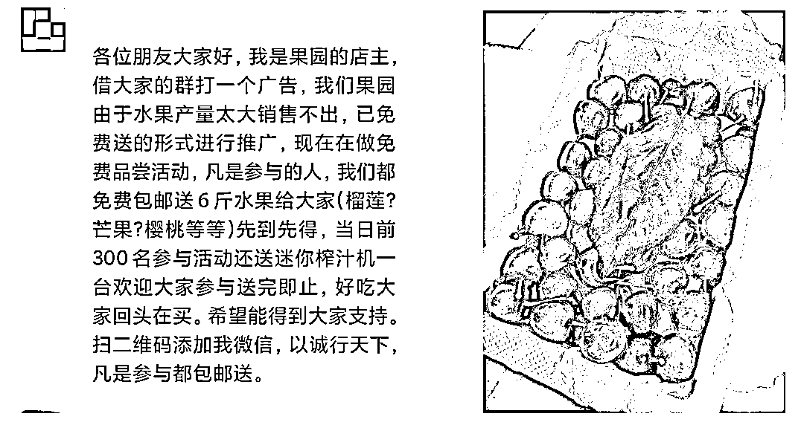
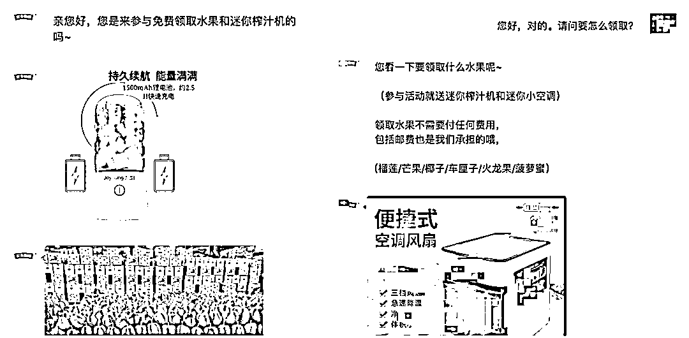
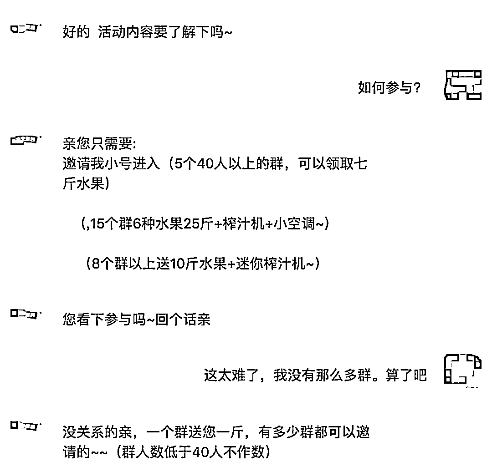
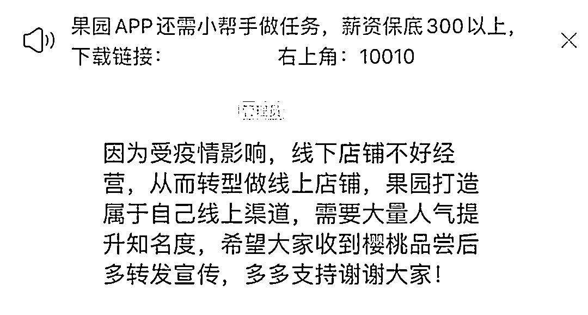
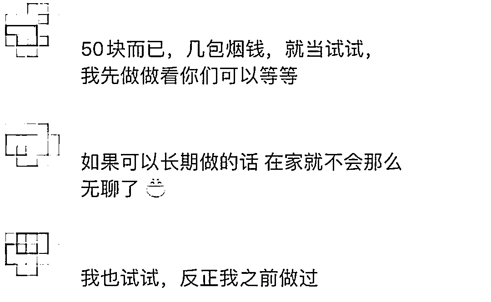
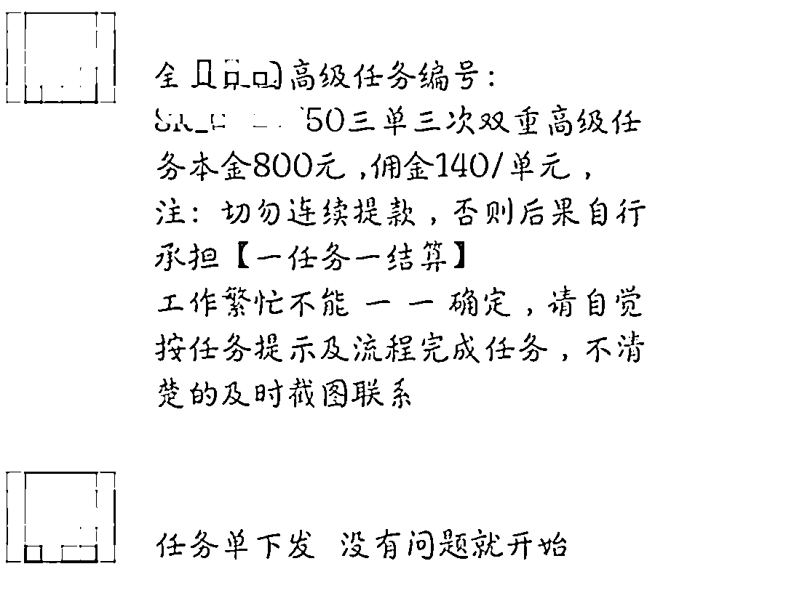
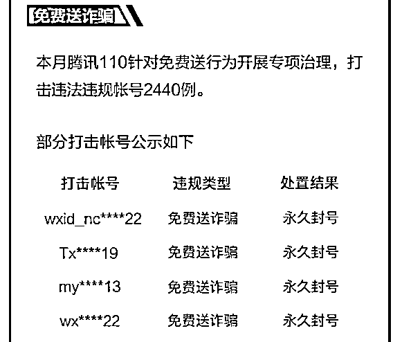
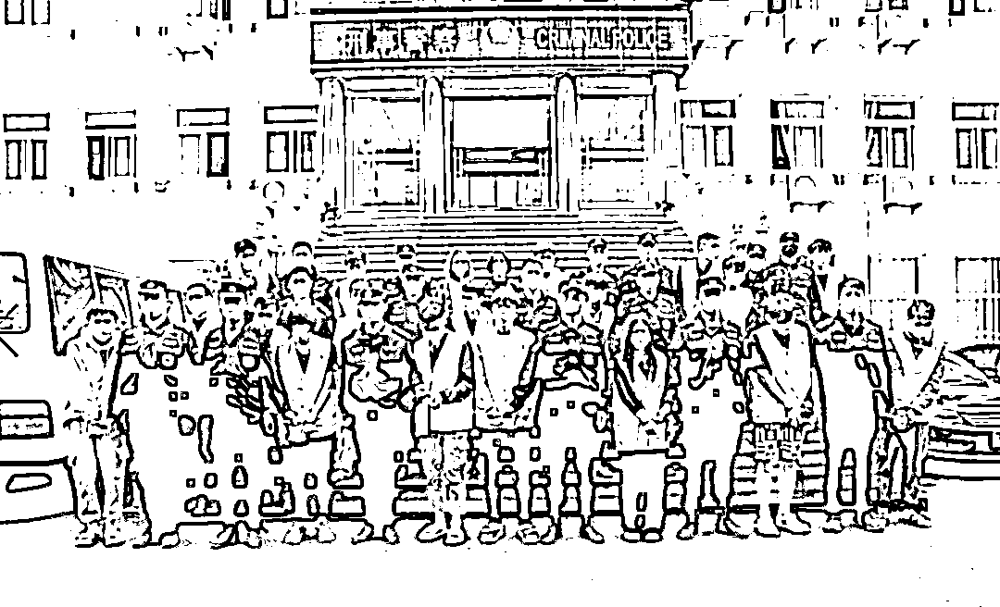
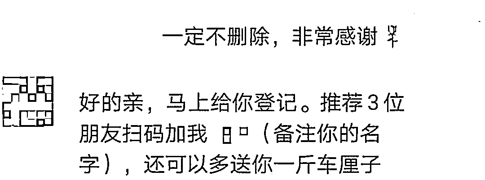
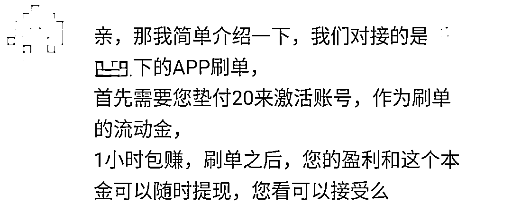

# 杀伤力翻倍！融合了“免费送”及“刷单”的新型骗局已出现

> 原文：[`mp.weixin.qq.com/s?__biz=MzIyMDYwMTk0Mw==&mid=2247499660&idx=2&sn=39a59cf1a0c860b94af79219084cad9f&chksm=97cb34b4a0bcbda2b7dc881564446093acad11b2c6d83b89a48cb9aa3f6987a36b7b827b4d8f&scene=27#wechat_redirect`](http://mp.weixin.qq.com/s?__biz=MzIyMDYwMTk0Mw==&mid=2247499660&idx=2&sn=39a59cf1a0c860b94af79219084cad9f&chksm=97cb34b4a0bcbda2b7dc881564446093acad11b2c6d83b89a48cb9aa3f6987a36b7b827b4d8f&scene=27#wechat_redirect)

**点击上方蓝色字体免费订阅“灰产圈”**

炎炎夏日，伴随着日益攀升的气温，各类新鲜可口的**应季水果**上市了。甜美的西瓜、诱人的葡萄、好吃的山竹，还有杨梅、荔枝、芒果、樱桃……光在脑子里想一想，守哥就要控制不住口水了！只好摸摸口袋里的钱，冷静冷静。

不过，上市的可不只是“水果”们，**打着低价尝鲜、免费赠送的“水果骗局”带着全新升级的“圈钱陷阱”也来了**👇

**敛财形式变化多端**
**“水果骗局”套路升级**福建省厦门市的肖肖同学前两天在某个群里，看到有位自称“果园店主”的网友发布了“**水果滞销免费赠送做推广**”的活动，还配上了多张水果靓照；看着又红又大的樱桃，心动的肖肖添加了对方账号。加上好友后，对方非常热情的先发来了几张果园实拍照和无线果汁机、便捷空调风扇的产品图，表示参与活动就可任选水果和产品，并一再强调“**领取水果不需要任何费用，包括运费也是他们承担**”。这彻底打消了肖肖的疑虑，当即表示要参与活动。随后，对方介绍道，“因推广需要，参与活动者要协助邀请店家账号至 40 人以上的群组内，**邀请的群组越多可以获得的奖励就越丰厚**，哪怕只拉入一个群也可以换一斤水果”。肖肖心想，“一斤水果怎么也得几十元，拉个群不过举手之劳”，于是便将店家拉入了 5 个 40 人以上的群组内，并将入群成功的截图发送给了对方。收到截图后，对方表示肖肖已成功获得领取资格，并向肖肖索要了“**姓名、电话、身份证号、收件地址**”等详细的信息以便邮寄水果。同时，对方还以“后续还会有其他优惠活动”为由，将肖肖拉入了一个名为“**果园福利派送**”的群组。在等待快递的日子里，肖肖发现，“果园福利派送”群内每天都在派发“**做兼职返佣金**”的活动，简单来说就是协助店主进行“刷单”，先行“垫付款项模拟下单”，待店家“虚假发货”完成订单后，就可以得到佣金。并且，群里不少小伙伴都在参与，积极地抢单，**每天都有很多人在“晒收益”**。蠢蠢欲动的肖肖在观察 2 天后，终于忍不住了。在“群内客服”的指导下，扫码下载了指定的“**刷单 APP**”，并先尝试做了 2 个小任务，**果然很快便收到了返款及佣金**，尝到甜头的肖肖开始接连刷起了大单。但没想到，随后的任务要求一次性“连刷单数”越来越多，先后支付了**8000 余元**，却没有得到任何返款，询问客服或群里的其他伙伴，也只是被以“系统故障”、“下单冲突”等为由**要求继续刷单**。直到垫付了 3 万元，肖肖才起了疑心，当她怒气冲冲准备在群内指责“店主”时，发现自己**已被踢出群组并拉黑**，肖肖才意识到自己上当了！而当初说好的那 7 斤水果也早已“查无音讯”……

近期，类似肖肖这样被“水果低价品尝、免费赠送”噱头吸引，而陷入骗局的案例不在少数。根据“**腾讯 110**”违规账号打击公示数据显示，2020 年 5 月，腾讯 110 针对“免费送行为”开展专项治理，打击违法违规账号**2440 例**。而就在 3 月 21 日， **安徽省宣城、宁国警方**破获了一起涉及全国各地、案值高达**800 余万元**的特大网络投资外汇诈骗案，33 名团伙成员被抓。据了解，该团伙正是以“9.9 元优惠购水果”为诱饵，再用“投资赚钱”的朋友圈信息吸引被害人，通过虚假的投资平台来骗取钱财。

**串联上下游黑产****混合骗局套路连连**
关于“水果低价购、免费送”骗局，守哥已不是第一次解析了，在过往的文章中也曾多次提及。指路 1👉[“免费送商品”活动举报量持续上涨！请警惕营销骗局](http://mp.weixin.qq.com/s?__biz=MzI0MTMyMTY5Mg==&mid=2247493608&idx=1&sn=1e6dab7095e054ff4c85a32ded67aa65&chksm=e90ff45bde787d4d267cd1f46ea9f13f53166f7f7c69ee96079d132189097cee8d83a2c4cb92&scene=21#wechat_redirect)，指路 2👉[低价试吃水果，重拾水果自由？更大的麻烦在后头......](http://mp.weixin.qq.com/s?__biz=MzI0MTMyMTY5Mg==&mid=2247490190&idx=1&sn=6e3c672d9d8165224f3e45a646129870&chksm=e90c093dde7b802b0b933eb5e859de9765966861cc0284785a8aa680ad5532861448ecae1c27&scene=21#wechat_redirect)这类型的骗局，实质上就是**以免费赠送一些看似高价值的物品为诱饵，吸引参与者上钩，从而达到骗取隐私信息、谋取钱财或为其他黑产引流等目的**。这里赠送的东西不只有水果，还可以是名牌手表、高档化妆品等任何吸引人的物品。

在近期的案件中，我们还发现，如今的“免费送骗局”敛财形式已不仅仅满足于一次性骗取少量的“快递费”，而是形成了**串联上游“引流拓客”、下游“诈骗敛财”，集“免费送”、“投资理财”、“兼职刷单”等为一体的混合骗局**。整个诈骗的运作套路大致是这样的： 

**套路一：收割流量 **

不法分子利用社交平台，打着“**水果滞销**”、“**商家促销**”、“**免费推广**”等看似合理的噱头，推出“水果、商品包邮免费赠送”的活动，吸引受害者主动上门。随后要求受害者协助将自己的账号拉入各大群组等，以此不费吹灰之力就**拓展了“获客渠道”**，有机会骗到更多人。

**套路二：盗取信息**

待利用完受害者的“宣传力”后，不法分子就会以邮寄商品需要为名，要求参与者提供详细的个人信息，这些资料转头就可能被不法分子**通过非法渠道进行转卖牟利**，或者被用于针对“信息主”实施的**精准诈骗**。 

**套路三：转移战场**

随后，不法分子更会借口“有其他福利活动”，将受害者拉入事先准备好的诈骗群组。在这样的群组内，潜藏着“**从事其他诈骗的骗子们**”，主要以“兼职刷单”、“炒股诈骗”、“投资理财圈套”、“网络赌博”为主；无一例外，他们都会先编造出一个“发财美梦”，让受害者以为“有利可图”想要参与，而实际上却是进入了更大的陷阱。 

**套路四：实施欺诈**

费尽心思地吸引用户、转移用户，最终的目的就是为了“**变现牟利**”。在这些群组内，通常还安排了许多“托”，他们会配合出演“普通用户”，疯狂的晒自己的收益，营造“赚钱假象”。当受害者完全相信后，不法分子就会将受害者引入指定的“平台内”**进行刷单、投资或者赌博等一切“掏钱”的举动**。 前期先返还小额利润，降低受害者的戒备，等受害者逐步加大投资后，再不断设置“提现、返款困难”，最后关闭平台，将受害者踢群拉黑。在不法分子的连连套路之下，骗局中的受害者可能遭受以下几大损失：

1.  **被动成为“宣传工具”**，为了获得领取资格，受害者通常得配合不法分子进行转发点赞、邀请好友、拉入群组等行为，在无形中为不法分子进行了宣传，扩大了他们的诈骗范围。

2.  **个人隐私信息遭泄漏**，姓名、电话、身份证号、家庭住址等本都是比较重要的个人隐私信息，但在“商品免费赠送”的诱惑下，受害者往往会将这类信息如实“送给”不法分子。

3.  **遭受一定的经济损失**，升级后的“免费送混合骗局”，由于融合了多重套路，危害力更大，相比过往单纯的“免费送骗局”诈骗邮资而言，受害者的损失更为惨重。

▼

**“免费的馅饼”，往往是“昂贵的陷阱”。**  “免费送”类型的骗局，之所以可以成功实施，就在于不法分子利用了人们“爱贪小便宜”以及“想要不劳而获”的心理，并且紧跟时事热点，通过大众感兴趣的事物来实施欺诈。在这，守哥要提醒大家：1.不要相信网络上，任何天上掉下馅饼的“免费送、低价尝试”活动；2.拒绝参与任何“兼职刷单”、“网络赌博”、“炒股理财”等“小投入高回报”的活动；3.如果遇到货到付款的快递，可以选择先验货后付款；4.注意个人隐私的保护，不随便透露包括身份证、银行卡号、家庭住址等信息给他人。

← 向右滑动与灰产圈互动交流 →

**点击****阅读原文****加入灰产圈高端社群**

