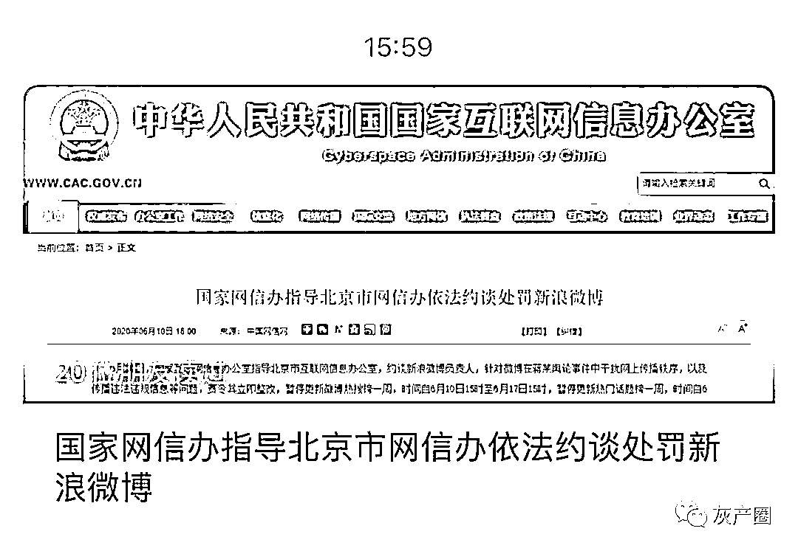
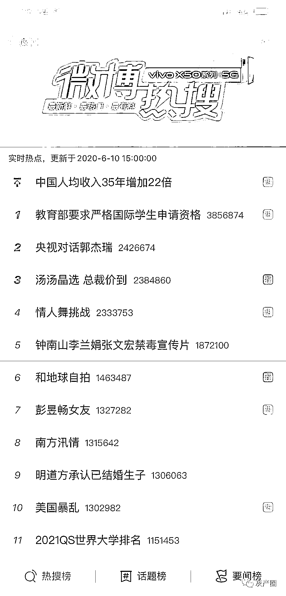
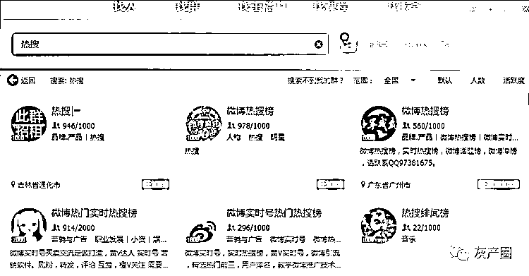
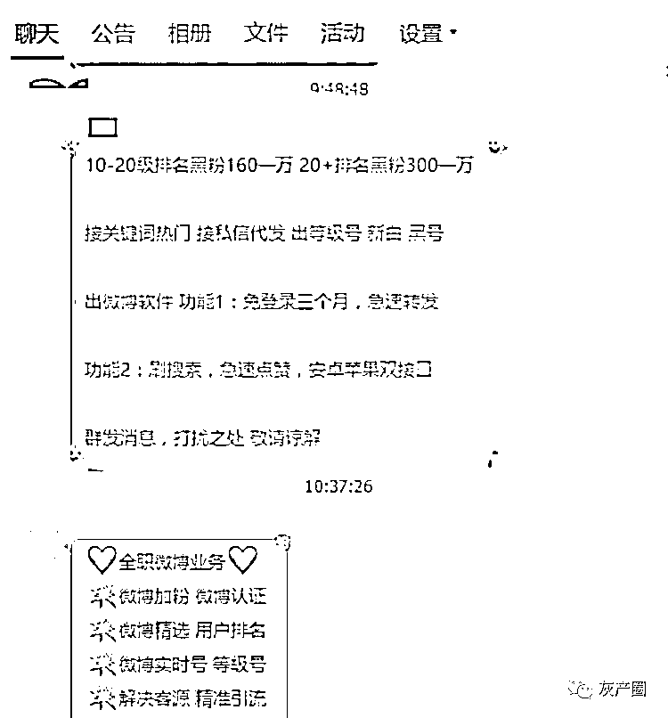

# 被暂停的微博热搜背后，有媒体调查发现，热搜还是门生意！

> 原文：[`mp.weixin.qq.com/s?__biz=MzIyMDYwMTk0Mw==&mid=2247499778&idx=1&sn=aa7ecd75c74b654e466b49166b19dad2&chksm=97cb0b3aa0bc822c692cbe92c67f29c22df4a957d5c21ca5b99d9c4c967cccc3a5d27a52ff02&scene=27#wechat_redirect`](http://mp.weixin.qq.com/s?__biz=MzIyMDYwMTk0Mw==&mid=2247499778&idx=1&sn=aa7ecd75c74b654e466b49166b19dad2&chksm=97cb0b3aa0bc822c692cbe92c67f29c22df4a957d5c21ca5b99d9c4c967cccc3a5d27a52ff02&scene=27#wechat_redirect)

**点击上方蓝色字体免费订阅“灰产圈”**

据国家互联网信息办公室官微消息，6 月 10 日，国家互联网信息办公室指导北京市互联网信息办公室，约谈新浪微博负责人，责令其立即整改，暂停更新微博热搜榜和热门话题榜一周。

实际上早在 2 年前，微博也曾被指“用户发布违法违规信息未尽到审查义务”等，启动热搜领域为期一周的下线整改。彼时，微博发布公告称，将加大对热搜榜、热门话题榜刷榜行为的处理力度。

南都记者发现，饱受争议的微博热搜背后，悄然做“热搜生意”却不在少数。据南都此前调查，从购买热门关键词、广告推荐位到修改认证、购买粉丝、转评赞等，每项数据生意都有着明码标价，甚至还有专门的课程传授这项“技术”。

更新至 10 日 15 时的新浪热搜榜 

***微博热搜榜被暂停更新一周***

**2 年前也曾启动热搜领域整改**

据国家互联网信息办公室官微消息，6 月 10 日，国家互联网信息办公室指导北京市互联网信息办公室，约谈新浪微博负责人，针对微博在蒋某舆论事件中干扰网上传播秩序，以及传播违法违规信息等问题，责令其立即整改。

具体要求为，暂停更新微博热搜榜一周，时间自 6 月 10 日 15 时至 6 月 17 日 15 时，暂停更新热门话题榜一周，时间自 6 月 10 日 15 时至 6 月 17 日 15 时，严肃处理相关责任人，同时，要求北京市互联网信息办公室对新浪微博依法从严予以罚款的行政处罚。

国家互联网信息办公室有关业务局负责人强调，网站平台应当切实履行主体责任，健全管理制度，明确内部审核处置流程，既不得为违法违规信息提供传播平台，又不得随意干预信息正常呈现、干扰网上传播秩序。国家互联网信息办公室将进一步强化日常监管，督促相关网站平台加强内部管理和自律，依法依规开展服务。

新华社发布微评称，**网络空间不是法外之地，需要和现实世界一样受到法律监管。加大监管执法力度，及时精准规范社交媒体运营，是保障和促进新兴社交媒体良性发展的必要之举。**

南都记者发现，2 年前，微博也曾启动热搜领域为期一周的下线整改。

2018 年 1 月 27 日，新浪微博相关负责人被北京市网信办约谈，被指“用户发布违法违规信息未尽到审查义务，持续传播炒作导向错误、低俗色情等违法违规有害信息”等多项问题。随后，微博启动热搜领域为期一周的下线整改。

从 2018 年 1 月 27 日 21 时至 2 月 3 日 21 时，微博热搜榜、热门话题榜、微博问答功能、热门微博榜明星和情感板块、广场头条栏目情感板块等将暂时下线整改。

被约谈次日，新浪微博发布公告称，为了更好地遏制和打击刷榜行为，微博将加大对热搜榜热门话题榜刷榜行为的处理力度，并对直接受益者进行处罚：对于存在刷榜行为的热门话题及主持人，对于流量异常搜索词及指向对象进行连带处置。公告还列举了 2018 年 1 月以来“刷榜行为突出的话题和热搜词”。

南都记者统计发现，当时有共 30 个热门话题和 8 个热搜词被点名，涵盖明星、节目、事件等方面。

新浪微博对上述账号与话题进行了“冷却”处罚：相关明星、节目、事件名称，3 个月不能再上热门话题榜和热搜榜；相关账号 3 个月不能主持话题。

***热搜榜背后黑灰产业链发达***

**2 万元就能上热搜前十**

热搜榜和热门话题榜，能够快速、准确反映出微博用户对于热点内容的关注程度和方向，逐渐成为微博中显著的曝光位被高度关注。

因此，有一些企业及娱乐业者为获取关注和流量，开始进行有组织的刷榜行为，社会上也出现了一些相关的互联网黑灰产。

2018 年年初，南都记者调查发现，在微博运营体系中，做“热搜生意”的不在少数。从购买热门关键词、广告推荐位到修改认证、购买粉丝、转评赞等，每项数据生意都有着明码标价，甚至还有专门的课程传授这项“技术”。**有卖家宣称，热搜前十的售价仅为 2 万元，而关键词广告位等均可购买。**

南都记者以“热搜”为关键词，搜索出近百个 QQ 群，部分群表示提供实时热搜榜、热搜打 CALL、搜索下拉位清理、转发推广、购买粉丝等服务。

微博的不同细分业务，售价不同。卖家“XX 新浪微博推广”提供给南都记者的报价单显示，微博实时热搜的报价为前三 5 万、前五 4 万、前十 3.5 万、前二十 3 万、前三十 2.5 万、前五十 2 万。卖家表示，不保证在榜时间，但一般会在榜几小时，按照在榜期间的最高排名收费。而热门话题的价格略低，前三售价 4500 元，前五 3500 元，前十 2500 元。话题还可以单独刷数据，阅读量 20 元可以刷 100 万，讨论量 200 元 1 万，话题粉丝 200 元 1 万。

另一位卖家“XX 接单”则向南都记者表示，热搜前十售价 2 万元，如果是长期合作，价格可降到 1 万。热词将在热搜榜保持 1 个月，付款后 3-4 小时即可上榜。

什么样的词可以上热搜？卖家“XX 新浪微博推广”向南都记者表示，“**没有词是不能做的，但要看这个词有没有上榜的几率。**”

该卖家介绍，一般来说，娱乐类的词比较好上热搜，如果是商业类的词，建议做下拉框关键词或者购买广告位，而二者的价格分别为下拉框关键词 1500 元一个，广告位 3500-5000 元一星期。

除了热搜，在微博搜索框内输入任意词汇，下拉搜索框中出现的关键词及搜索结果都可以被操纵。一名卖家告诉南都记者，**购买了关键词热门前三服务后，在搜索框输入你的关键词，你的微博就能出现在前排。**

这名卖家表示，不同的关键词有不同的价格，如果词很热就贵，没竞争对手就比较便宜。以“在线教育”为例，购买价格 3000 元的包月服务后，一个月内广告都在前三。而买家只需要向其提供关键词和图片。

“关键词很重要，要好好确定，要不然没有效果白花钱。”该卖家告诉南都记者，他的任务是保证一个月内都在关键词热门前三，但引流效果不能保证。卖家表示，之前有卖出很多“论文代笔”的单子，效果不错。

***微博数据代刷课程 398 元出售***

**称学会可月入过万**

那么，对这些专门做热搜生意的人们来说，支撑其登上热搜的大量数据从何而来？据南都此前调查，市场上甚至存在专门的课程培训，教你如何在微博做数据和引流。

2018 年年初，南都记者联系上一位名叫“热门 XX”的卖家，他表示，可以提供两种售价不同的课程，售价 398 元的教授基本引流技术，包括养实时号、认证黄 V、热门引流、热门评论、用户排名、霸屏技术等，售价 498 元的课程在 398 元的基础内容之外还包括微博永久会员、粉丝、下拉框、认证资料等的代理。

这位卖家向南都记者表示，教学通过语音教程完成，只要 1-2 个小时就可以学会，手机就可以操作。

“这个很赚钱，可以卖技术、卖号、卖粉丝。”这名卖家向南都记者展示了本月的进账，高达 5 千余元。其称，做微博引流不需要花很多时间。

“那些上热门热搜的，就是靠咱们引流。”这名卖家告诉南都记者，关键词热门可以自己“做”，而热搜需要“蹭”，“如果自己有产品，可以学习技术给自己引流，如果没有，可以教别人技术，帮人发广告。”

**热搜之外，买粉、更改认证等灰色手段同样存在。**

南都记者在淘宝网以“微博粉丝”为关键词搜索出近百家店铺，一名卖家将微博粉丝分为初级、高级、顶级和精品等各种级别，其中顶级和精品均为真人微博，自带粉丝和博文，高级微博只有头像，初级则仅为凑数。最贵的顶级粉丝售价 4 元 300 个，该卖家告诉南都记者，在微博的自动清粉中，这些粉丝不会被清理。卖家表示，平均 24 小时可刷粉 2000-8000 个。

微博加 V 和认证也可以通过购买实现。一名卖家向南都记者表示，只需 550 元，即可认证摄影师、网络工程师、心理咨询师等多个职位，认证显示格式为“XX 传媒+职位”，3 小时到 1 天即可认证完成。

除了微博，其他平台也可以通过代刷业务人为操作数据，形成热度。南都记者在一家名为“代刷 XX”的网站发现，该网站提供微博以及多类短视频、游戏网站或 App 粉丝及播放量数据代刷服务，以微博粉丝为例，100 个初级粉丝仅需 5 毛钱。

来源：南方都市报（ID：nddaily）

记者：封聪颖、詹晨枫、毛淑杰  监制：陈知春  编辑：王朝、徐祥达 实习：雷雯雯、赫秋晨

← 向右滑动与灰产圈互动交流 →

**点击****阅读原文****加入灰产圈高端社群**

