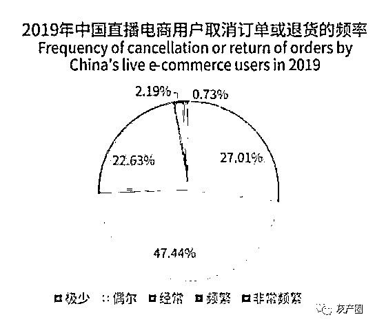

# 直播电商运营黑幕曝光：我们实在太好骗了!

> 原文：[`mp.weixin.qq.com/s?__biz=MzIyMDYwMTk0Mw==&mid=2247499778&idx=2&sn=18731f9c13aef38a59161f6c5cec8d33&chksm=97cb0b3aa0bc822ca0f060f7f83fb57914fc98e30500c7dac0a6bdcd5ca88e7dc5984d8c72b0&scene=27#wechat_redirect`](http://mp.weixin.qq.com/s?__biz=MzIyMDYwMTk0Mw==&mid=2247499778&idx=2&sn=18731f9c13aef38a59161f6c5cec8d33&chksm=97cb0b3aa0bc822ca0f060f7f83fb57914fc98e30500c7dac0a6bdcd5ca88e7dc5984d8c72b0&scene=27#wechat_redirect)

**点击上方蓝色字体免费订阅“灰产圈”**

1

　　2020 年，电商直播一夜成了全民狂欢的热门行当。

　　一场直播，往往观看人数高达几千万，成交额更是高达数亿。

　　真有这么多人一天到晚拿着手机看销售直播吗？

　　你能想象出真相是怎样的吗？

　　最近，跟几位业内高手聊了聊，初步调查到了的一些行业黑幕。

2

**真相一：虚假数据的刷法。**

    　高手说，刷数据一直是直播标配，但现在的玩法跟以前大不一样了。

　　早期，电脑程序控制。通过软件在一台电脑上不断切换账号去买东西，由于这很容易被平台风控发现，于是就招募大量的刷单手，借用他们的电脑安装一个软件，不需要他们自己操作，当他们使用电脑的时候，软件就会在后台自动下单。

　　中期，手机集群。比较常见的是通过一个大铁架子，上面堆着几百上千台带 sim 卡手机，都用数据线连到集线器上；另一端连着电脑，一个指令可以让所有手机进行操作，比如自动打开直播间，搜索某某主播点赞评论送礼物下单。

　　现在，直接上“云手机”。这是 sim 卡实名制以后的先进手法。通过服务器，可以“伪造”出成千上万的手机，你通过一台电脑直接向服务器传数据，下指令，服务器控制这些手机集体操作，连实体手机都用，彻底解放了刷单“生产力”，没有了后顾之忧，数据想刷多少刷多少，不怕品牌方不买账。

　　国内的数据造假已经形成了一条黑色产业链，有各类直播平台的涨粉、刷在线人数、刷播放量、刷直播点赞、刷各种礼物，甚至有的还可以直接将该直播刷上当日直播热门。

　　其实，这算是比较客气的玩法，更疯狂的手段在淘宝店里，1 元就能实现 1 万、2 万的播放量，优惠的价格也让这种数据造假流行成风。

**　　真相二：一场电商直播的交易数据怎么刷？**

　　高手说，当然，商家也不傻。如果没有真正买单，刷数据的骗局不就暴露了嘛。

　　早年粉丝数和直播间人气，确实因为掺假的不多，品牌商们也都愿意接受。

　　但后来，MCN 野蛮生长，据不完全统计，2016 年尚不足 500 家，到 2017 年飞速增至 1700 家，2018 年突破 5000 家，2019 年，有数字说我国 MCN 数量达到 20000 家！

　　野蛮生长就意味着良莠不齐。

　　很快，商家们就发现了 MCN 数据不靠谱，对其逐渐丧失了信任，而 MCN 也很鸡贼的发觉了这一点，升级了新的骗术。

　　当电商平台商家要做市场推广，会提出 “现在播放量、粉丝量这些我都不关注，我只关注最终的带货结果。”

　　MCN 就会拍着胸脯签下对赌协议，保证直播有固定额销售额。

　　搜狐号大王真曾就这问题有专文讨论《MCN 机构直播带货避坑指南,1 比 3 保底 ROI 也能被骗?》。

　　简单举个 1:1 的例子，商家先付 5 万元的坑位费，合同会承诺，如果卖货达不到 5 万，5 万元全额退款不收取佣金；而如果达到要求，佣金比例为 20%，这样 MCN 可以获得 6 万。

　　这份条款是非常公平的，商家为了冲销量，所以，很乐意去签这种合同。

　　但很可惜的是，很多 MCN 的流量都是假的，是卖不动货的，所以合同拿下来之后，他们就找自己的刷单商，直接下单刷 5 万元，完成任务。

　　赚到 1 万佣金后，开始以各种理由分批次分时间的退货，比如退货 2 万。剩下的退不掉的货怎么办呢？通过团购、拼购、二手交易，或者直接批发给电商平台，直接变现。

　　当然，如果有不明真相的吃瓜群众贸然下手，销售额增加，于是商家、MCN、平台，等等大家皆大欢喜，真正上当的，就是冲动购物的消费者。

　　有时候大一点的主播也会主动造假，主播会跟自己粉丝勾结起来，到了直播的时候，集体下单，等到销售量差不多了，粉丝可以取消订单或者退货。

　　商家学聪明了后，就会要求提高销售额，而服务费不变。这样带来的结果就是退货率更高。所以我们看到直播电商退货率常常会高达 30-50%。

　　有些 MCN 玩的更绝，直接进入金融领域。张笑容发现，一些有名的 MCN 会跟一些大商家合作，签下对赌，服务费则从 10 万提升到 50 万、100 万不等，业绩完不成，承诺全额退款。商家费用打过来之后，就拿去购买理财，更有甚者搞过桥贷款吃利息，每个月总有安稳的收益，全然不用考虑直播销量。

　　据说有上市的 MCN，直接资本运作，通过连续不断的刺激股票涨停在高点抛出赚钱，赚钱后继续刷业绩，如此循环不断。

3

**真相三：一场可信的电商直播的真实营业收入多少？**

　　为了提高销售额，很多商家会请头部大网红，粉丝多价格贵，从而提高可信度。

　　但是，这会带来一个新的问题，价格低利润薄。

　　大主播们会要求商家给出全网最低价，道理很简单，如果价格不满意，粉丝凭什么来看这个直播呢？

　　在这种情况下，商家利润就相当低，甚至能否赚钱都是个问题。

　　虎嗅文章近期报道，御泥坊母公司御家汇，2019 年与超过 1500 位网红主播合作，直播总场数累计超 8000 场。财报显示，御家汇 2019 全年总营业收入为 24 亿，直播电商收入占公司营业收入的 4.02%，约 1 亿元。平均每场收入不过 1.2 万元。

　　头部主播的费用由坑位费+抽成组成。以李佳琦为例，一份去年年底的报价显示，零食类坑位费为 4 万，抽成为 20%左右，美妆口红生活类坑位费 8-10 万，抽成为 30%左右。商家的利润能否承受住，只能各自掂量。

　　另据第一财经报道，朴西电商和李佳琦合作了 5 次亏了 3 次,双十一当天更是亏了 50 万。

　　或许这些出的钱大价钱的商家，本来就是赔本赚吆喝，无非打打知名度，直播带货并没有带来更多的消费和服务增值，也没有带来产业和消费升级，仅仅是渠道做了 。

4

**　　真相四：向小商家下手。**

　　现在直播带货被宣传成为是主流，能请得起头部网红的品牌毕竟是少数，更多尾部主播怎么生活？

　　MCN 开始通过廉价的坑位费把手伸向中小微企业。

　　比如一个坑位 500-1000 元，请客一顿饭的价格，谁不想去试试呢？

　　于是，MCN 可以签下（或者自己孵化）100 个小主播，每个主播账号可以给刷上十万粉丝，就可以元气满满的去赚取坑位费。

　　假设一个小主播每晚上可以介绍 20 个产品，每个产品收取坑位费 500 元，那么一晚上就可以收入 1 万元。

　　因为自知“一分钱一分货”，这些付费入了坑的小商家，即使直播之后的反响平平，也不会有所怨言。

　　克劳锐公布的报告显示，MCN 机构签约的账号数量有逐年上升的趋势。2019 年有 5.1%的 MCN 机构签约账号超过 1000 个，14.8%的 MCN 机构签约账号超过 500 个，个别机构的签约量甚至超过 3000 个。

　　可以想象这些机构，会怎样地请君入坑。

　　上述黑幕还仅仅是冰山的一角。

　　这一角所揭示出来，直播电商的产业发展逻辑明显出了差错。

　　所谓人带货，对商家起到的作用有限。

　　就算是头部主播，也不过是给一部分商家开辟一个新渠道，不外乎是打品牌、冲销量、清库存，往往利润得不到保障。

　　属于腰部尾部的，作用就更有限了，它们要活下去，不得不滥竽充数。

　　于是乎，在直播带货中，就滋生出虚假流量、虚假交易的网络黑产。

　　这些网络黑产已经涉嫌违法，我国的《电子商务法》明确规定，经营者要保障消费者的知情权和选择权，不得以虚构交易或者是编造用户评价的方式欺骗、误导消费者。

　　同时，网络黑产又破坏了产业生态，让商家受到损害。

　　直播电商合理的发展逻辑是什么呢？

　　不是靠低价、不是靠网红，而是要靠商品质量本身，靠社会监督和严格规范。

　　作为一个新领域，电商直播快速发展，但到目前为止，针对 MCN 机构、红人等网红经济主要参与者的各种法律规范、管理制度都还处于缺位状态。

　　在法律制度条件到位前，还是要尽快的刹一刹这股歪风，回到以品质带货的轨道上来，让厂商自己为商品背书，多鼓励社会监督，多加强平台自律。

　　只有如此，才能为电商直播涵养良好生态，才能带动更多消费，才能维持行业理性发展，让它成为扩大内需的动力。

文/张笑容   来源：张笑容（ID：fxszxr）

← 向右滑动与灰产圈互动交流 →

**点击****阅读原文****加入灰产圈高端社群**

