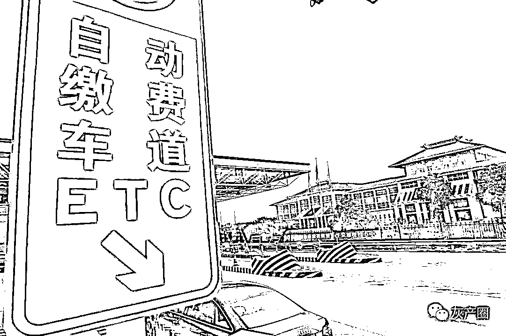

# 一百代办！三百包教！ETC“代注销”成了灰色产业

> 原文：[`mp.weixin.qq.com/s?__biz=MzIyMDYwMTk0Mw==&mid=2247499778&idx=3&sn=e5d568409de09f01706b4a324aaea128&chksm=97cb0b3aa0bc822c04386e2b127ffb9e406036286c4a40f4349bf3ef8016b7f15f8557a57818&scene=27#wechat_redirect`](http://mp.weixin.qq.com/s?__biz=MzIyMDYwMTk0Mw==&mid=2247499778&idx=3&sn=e5d568409de09f01706b4a324aaea128&chksm=97cb0b3aa0bc822c04386e2b127ffb9e406036286c4a40f4349bf3ef8016b7f15f8557a57818&scene=27#wechat_redirect)

**点击上方蓝色字体免费订阅“灰产圈”**

1

S 先生开车去银行办理 ETC，却被告知自己的车牌已办理过 ETC，无法重复捆绑。自己从未办理过 ETC，怎么会显示已经办理了呢？

S 先生的遭遇并非孤例，一些车主有着与他一样的困惑。二手车、背户车、抵押车、租车牌等情况下，都易出现车牌被占无法重复办理 ETC 的提示。

S 先生在网络电商平台键入“ETC 注销”，一些卖家打出“快速消除车牌信息占用”“只需提供行驶证，一分钟解除 ETC”的宣传语招揽客户。

调查发现，这些卖家不仅做着代注销的生意，甚至还将注销技术作为噱头，培训买家，并通过伪造照片蒙混过关完成解除车牌占用。

2

首次办理 ETC 却提示车牌被占

行驶证、驾驶证、信用卡、身份证，S 先生带来了能想到的所有证件，但是当工作人员核验后却告知“无法办理”。原因则是该车牌号已经被占用，意味着这块车牌曾经办理过 ETC。

ETC 的办理原则是“一车一卡一标签”，一个车牌号只能对应办理一套 ETC 车载装置，已在系统上注册过的车牌无法再次办理。

这让 S 先生一头雾水，自己此前从未办理过相关业务，怎么会莫名其妙已经有了 ETC。

银行工作人员告诉 S 先生，他并非第一个遇到此种情况的车主。一般是因为前车主申请过 ETC 但未注销，办理过程中录入有误，或者曾经在线上平台申请过 ETC 但未注销。

在 ETC 重新申办的整个流程中，设备注销是其中重要一环。目前 ETC 办理要求，车主在车辆报废、交易、更新等原因销户时必须去原发卡单位注销重新办理。

“曾有银行的朋友跟我要过行驶本照片，帮忙注册给个小礼物，当时自己并没有在意。”S 先生怀疑，自己是当时在不知情的情况下完成了线上申请。

与 S 先生一样，一些车主也在办理 ETC 时有此遭遇。根据交通运输部官方消息，全国 ETC 服务监督热线 95022 开通一个多月的时间，就累计受理客服咨询投诉近 50 万人次，这其中占比最高的事项就是申请办理 ETC 时发现车牌被占用。

一名常为车主提供验车服务的“车虫”表示，一些车辆为二手车、非车主车、抵押车、背户车，在办理中便可能出现车牌被占用的状况。“还有的人把车牌租出去了，收回来之后自己去办理的时候办不了，因为以前的租户办理过。”

S 先生最先想到的是如何将此前的 ETC 解绑，从而可以顺利办理。而查询后，他却发现车牌被占用往往涉及到外省的发卡单位，注销时还需提供更多的本人信息资料，流程也繁琐。车牌信息大量被占用也加剧了 ETC 注销时的难度。

调查发现，根据各省高速公路发卡公司的规定，车主要将设备和 ETC 卡片邮寄至指定网点，发卡方收到设备后 30 到 45 天左右才能完成注销。而在实际注销过程中，这个时间往往会更长。在“黑猫投诉”、“聚投诉”等第三方投诉平台发现，关于 ETC“换卡难”“注销难”的投诉屡见不鲜。车主们纷纷反应称，ETC 注销时等待时间过长，“有时候半年还未办好”。

3

主打无资料注销 每单收费一两百

有网友在解决方案中建议，可通过电商平台的“代注销”服务来解绑 ETC。S 先生在淘宝网、闲鱼等电商平台中键入“ETC 解除”、“ETC 注销”，便出现大量提供相关服务的卖家。一些卖家在商品描述中称，“可以为大车、小车注销 ETC，无需提交车主信息，立等可取，1 到 3 分钟搞定，注销后能随时重新绑定。”

淘宝网一位卖家客服人员承诺，他们可以提供“单独注销”和“注销后新办”两种服务，“单独注销”只需要提供所要办理车辆的行驶证正副页图片，5 分钟左右办理注销完毕，解除不了全额退款。“单独注销”和“注销后新办”价格分别为 120 元和 239 元。“我们一个月销量 300 多件，来办理的车辆有本人车辆、抵押车，也有之前车牌号被占用的车主。注销完毕后，设备不用退还，自动解除。”

闲鱼 App 平台的一位卖家则介绍称，客户只需要提供行驶证图片信息，1 到 3 分钟即可办理。他同时强调，“实在提供不了行驶证资料，告诉我们姓名和行驶证号等信息也可以。”该客服人员表示，他们是在高速公司内部专门软件系统操作办理，全国客车和货车都可以注销，注销完后随时重新注册。不过该客服人员表示，客户注销完后不能在原发行省和渠道办理新的设备，“有些省份发行单位有挂失期，我们解除后设备都没退还，原系统会有缓存，在新办理前可以拨打 95022 电话查询下办理情况。”

调查发现，在闲鱼和淘宝网等平台中，大部分推出“代注销”服务的卖家标价在 60 至 300 元之间，要求客户提供的资料大部分仅需行驶证正副页，无需车主信息；一些卖家甚至称无需任何资料。

闲鱼平台一位卖家告诉，客户中一部分是因为去发卡公司注销 ETC 需要邮寄设备，办理时间比较长，程序相对繁琐，他们不愿意等。还有一部分是抵押车、二手车、背户车等车主，他们没有 ETC 注册时原车主的身份信息，无法通过正规途径注销掉重新注册，只能选择“代注销”服务。

4

卖家推“神秘技术” 官方程序存漏洞

一些卖家则同时做起了“ETC 代注销”技术推销的生意。卖家在提供“代注销”服务同时还专门出售相关的软件后台，招收学员代理，包教包会。在商品介绍中他们表示“招聘代理、打包出售软件技术”，售价在 300 元至 888 元之间。

这些卖家到底通过什么途径来办理这种“代注销”呢？对多个卖家进行沟通，这些卖家对此三缄其口，只是表示“代注销”技术是保密的。

几经周折，从一位卖家手中购买了所谓的“技术”。

购买后他发过来一个微信小程序的二维码，打开二维码显示的是交通运输部的小程序“中国 ETC 服务”。小程序的主界面上有“解除车牌占用”“预约通行”“ETC 发票”等选项。

“解除车牌占用”栏目中，页面显示为“自助解除车牌在 ETC 系统被他人占用”的功能。点击该选项后，发现该功能需要申请人分别提供身份证和行驶证的主副页资料，而且身份证与行驶证还必须对应。

该卖家开始“指点”，在页面选择“解除车牌占用”选项，身份证填写本人身份证信息，可以使用其他人的行驶证，用图片软件将行驶证资料改为自己的名字即可。在“中国 ETC 服务”微信小程序上提交经过编辑的资料，系统能够顺利识别，经过人脸识别等步骤后便可顺利解除行驶证上关联车辆的 ETC。

他坦言，其实就是利用了“中国 ETC 服务”小程序的软件图像识别漏洞，作为其渔利的手段。

5

**提醒:**官方小程序 无注销服务

“中国 ETC 服务”官方信息显示，由于此前一些地区出现强制或者变相强制安装 ETC 现象，为及时解决客户车牌占用问题，交通运输部路网检测与应急处置中心在 2019 年 12 月份正式上线了“中国 ETC 服务”小程序。

其中“自助解除车牌占用”功能可自助解除车牌占用。通过“中国 ETC 服务”申请解除车牌占用的，发行服务机构未在 24 小时内提出异议，将强制解除。

全国 ETC 服务监督热线“95022”客服人员表示，未听说有利用系统漏洞来强制注销 ETC 投诉现象。会将该情况上报给交通运输部路网检测与应急处置中心等主管部门，并提醒如果个人 ETC 设备被别人非法注销，可到当地发卡机构进行投诉咨询。

“‘中国 ETC 服务’小程序仅可用来自助解除车牌占用，不能用来进行注销服务。ETC 注销业务需要到正规发卡机构申请办理，出具开户人有效身份证件原件，并邮寄相关设备。”

北京海润天睿律师事务所李瑞律师表示，经营这类的“ETC 代注销”服务人员明显违反了相关电商平台的管理规范，应由平台予以取缔。

同时由于违反了交通运输部等主管部门和各发卡机构的 ETC 办理和注销程序规定，还可能要受到相关行政处罚。另外，如果不法利用他人个人信息，还涉及到民事侵权责任，需承担民事责任。

来源：北京日报客户端| 赵喜斌 胡德成  编辑：匡峰  流程编辑：吴越

← 向右滑动与灰产圈互动交流 →

**点击****阅读原文****加入灰产圈高端社群**

