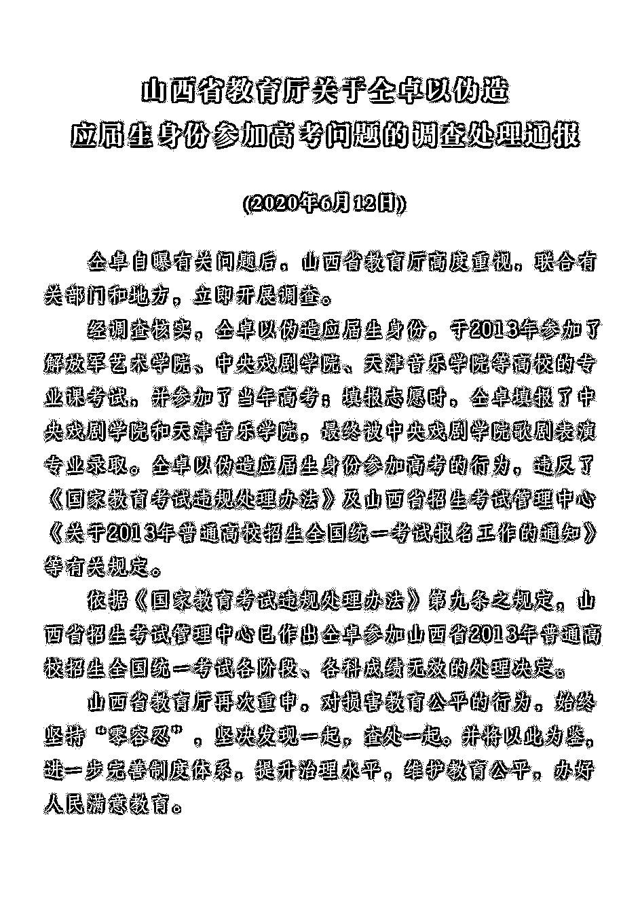
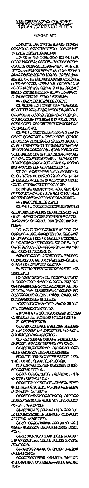
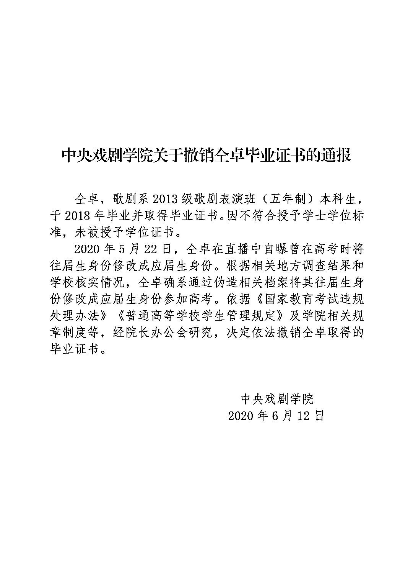
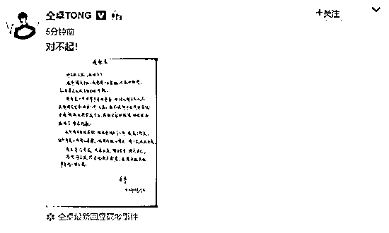

# 高考成绩无效！继父被撤职！中戏也回应了！

> 原文：[`mp.weixin.qq.com/s?__biz=MzIyMDYwMTk0Mw==&mid=2247499778&idx=4&sn=77383227321b533d453bec0ff69269a4&chksm=97cb0b3aa0bc822ce092700eb4e846a9a7ec89581b63d56aaeb285833419ad7cf09c3b9560a1&scene=27#wechat_redirect`](http://mp.weixin.qq.com/s?__biz=MzIyMDYwMTk0Mw==&mid=2247499778&idx=4&sn=77383227321b533d453bec0ff69269a4&chksm=97cb0b3aa0bc822ce092700eb4e846a9a7ec89581b63d56aaeb285833419ad7cf09c3b9560a1&scene=27#wechat_redirect)

**点击上方蓝色字体免费订阅“灰产圈”**

**前情回顾：**

**[仝卓坑”爹”了？还是爹“坑”仝卓了？](http://mp.weixin.qq.com/s?__biz=MzIyMDYwMTk0Mw==&mid=2247499311&idx=3&sn=20720338a28ef50eb863a482eac7478c&chksm=97cb3517a0bcbc01a82ea7015a9427797106bf1efaef34444393f30e236e77d8cde700588f7b&scene=21#wechat_redirect)**

**最新消息：**

今天（12 日），山西省教育厅发布关于仝卓以伪造应届生身份参加高考问题的调查处理通报。

通报表示，经调查核实，仝卓以伪造应届生身份参加高考的行为违规，山西省招生考试管理中心已作出仝卓参加山西省 2013 年普通高校招生全国统一考试各阶段、各科成绩无效的处理决定。

**通报全文如下↓↓**

同时，临汾市纪委监委发布关于仝卓以伪造应届生身份参加高考等问题调查情况的通报。

通报称，仝卓原名李振华，2013 年参加高考是由其继父仝天峰托人伪造应届生身份。**仝天峰已被给予留党察看一年、政务撤职处分，其余涉事人员包括临汾市教育局局长等也受到处分。**

**通报全文如下↓↓**

  

6 月 12 日，中央戏剧学院网站发布《中央戏剧学院关于撤销仝卓毕业证书的通报》：

仝卓，歌剧系 2013 级歌剧表演班(五年制)本科生，于 2018 年毕业并取得毕业证书。因不符合授予学士学位标准，未被授予学位证书。2020 年 5 月 22 日，全卓在直播中自曝曾在高考时将往届生身份修改成应届生身份。根据相关地方调査结果和学校核实情况，全卓确系通过伪造相关档案将其往届生身份修改成应届生身份参加高考。依据《国家教育考试违规处理办法》《普通高等学校学生管理规定》及学院相关规章制度等，经院长办公会研究，决定依法撤销仝卓取得的毕业证书。

**此前报道：** 

歌手、演员仝卓 1994 年出生，本科毕业于中央戏剧学院，2018 年，因参加声乐演唱节目《声入人心》开始被观众熟知。 

此前，他在直播时称，因为当年心仪的高校只招收应届生，复读的他“通过一些手段”修改了自己的考生身份。

此话一出，舆论哗然。面对质疑，仝卓没有第一时间正面回应，而是在翌日直播中诉苦，坦露自己复读时的心酸。

但网友并不买账，相关部门也开始采取行动。

5 月 29 日，山西省招生考试管理中心工作人员称，教育部已介入调查此事，山西省招生考试管理中心正协助调查。

中央戏剧学院回应称：招生办已核实，已报教育部学生司。

教育部新闻办公室官方微博@微言教育 也回应网友关切：已要求山西省教育厅、有关高校和中学开展调查。对弄虚作假等违规行为零容忍，此事虽时隔多年，但会坚决追查到底。

5 月 29 日 21 时 37 分，@仝卓 TONG 通过微博发布手写信道歉。信中，仝卓称自己已向母校中戏申请撤销学籍学历，并愿意承担由此带来的一切后果。

← 向右滑动与灰产圈互动交流 →

**点击****阅读原文****加入灰产圈高端社群**

