# 我们是直播刷单人：在 YY 语音培训，25 元换 2 万播放量

> 原文：[`mp.weixin.qq.com/s?__biz=MzIyMDYwMTk0Mw==&mid=2247499786&idx=1&sn=30e28b7c654588e4304aa77601c66c2c&chksm=97cb0b32a0bc822414a628afc5fe55923c51c4e495ab9132257acdfcb2edfed6fe6f96f4588e&scene=27#wechat_redirect`](http://mp.weixin.qq.com/s?__biz=MzIyMDYwMTk0Mw==&mid=2247499786&idx=1&sn=30e28b7c654588e4304aa77601c66c2c&chksm=97cb0b32a0bc822414a628afc5fe55923c51c4e495ab9132257acdfcb2edfed6fe6f96f4588e&scene=27#wechat_redirect)

**点击上方蓝色字体免费订阅“灰产圈”**

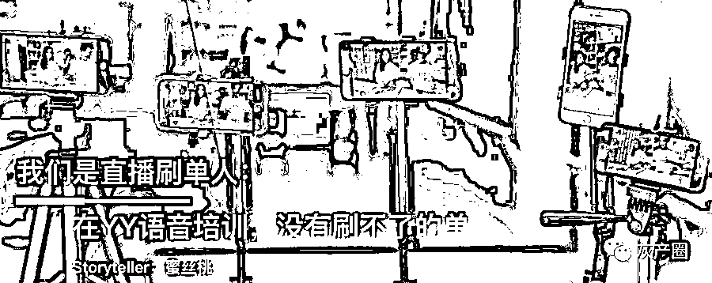

在数据为王的世界里，大家都在买数据，不买你就比不过别人。

直播带货经济带来的泡沫，让数据流量成为衡量主播人气的唯一标准。

涨粉、刷直播人数、刷销售数据，买流量，上热门，甚至平台也变相售卖数据。

本期显微故事是来自四位与刷单造假行业的相关人士口述：

他们当中有职业主播，在屡次被品牌主拒绝合作之后，也走上了买粉丝造假之路；有职业的刷单人，在各大直播平台和电商平台，“肆无忌惮”地“优化”数据……

以下是他们的真实故事：

**文 | 蜜丝桃**

**编辑 | 木蒙、腾讯科技孙实**

**没我帮你刷单，**

**你连腰部主播都做不了**

丁李，全职刷单人我接触刷单行业两年，月入万元，每天找我刷单的客户有几十家，很稳定。我们是一家数据公司，为了更好的服务客户，会分为两种方式：**机器快刷和人工刷量**。
机刷设定好数量就可以了，比较便宜。人工相对就贵一些，毕竟需要人工成本。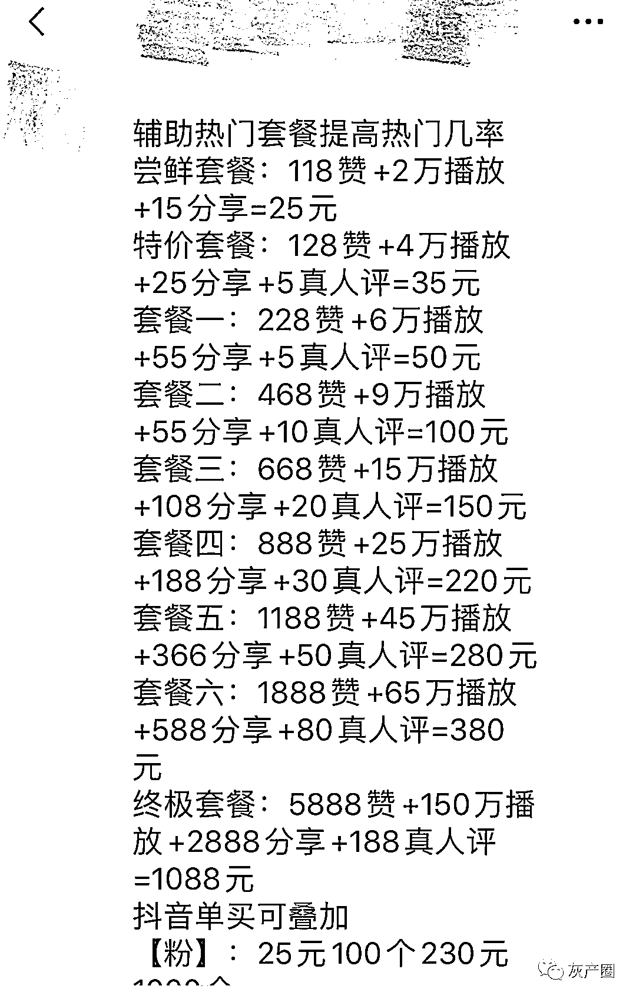

根据不同平台，我们提供不同的刷单套餐服务

不同的平台我们提供不同的服务，例如抖音粉丝均价在**100 元/25 个，25 元则可以享受基础套餐（2 万播放+118 赞+15 个分享）**。

我们会和很多工会合作。平均每个工会至少上百号人，多则上万人，基本上一呼百应，我们对他们发布任务即可。

此外，我们公司也有针对各个平台的业务拓展，比如**映客、花椒、一直播、抖音、快手、淘宝、京东、陌陌、小红书、大众点评**等等。纵向发展越多，就越能满足客户需求。

相比很多购买软件刷量的公司，我们也算是很认真的做数据了，我们有自己的工程师。

业务拓展方面，主要就是各种加好友私信。虽然刷量已经不是什么秘密，但是对于各个平台来说，还是要稍微避讳些。

毕竟是造假，会对他们真实的生态坏境数据采集有影响，但他们也离不开我们，**虚假数据让平台看起来繁荣**。

一些平台可能暂时完全无法刷量或者有刷量限制的，平台还会在觉得刷量过分的情况下收紧管理的，并且严禁平台外部刷量，一旦被发现，会有相应处罚。  

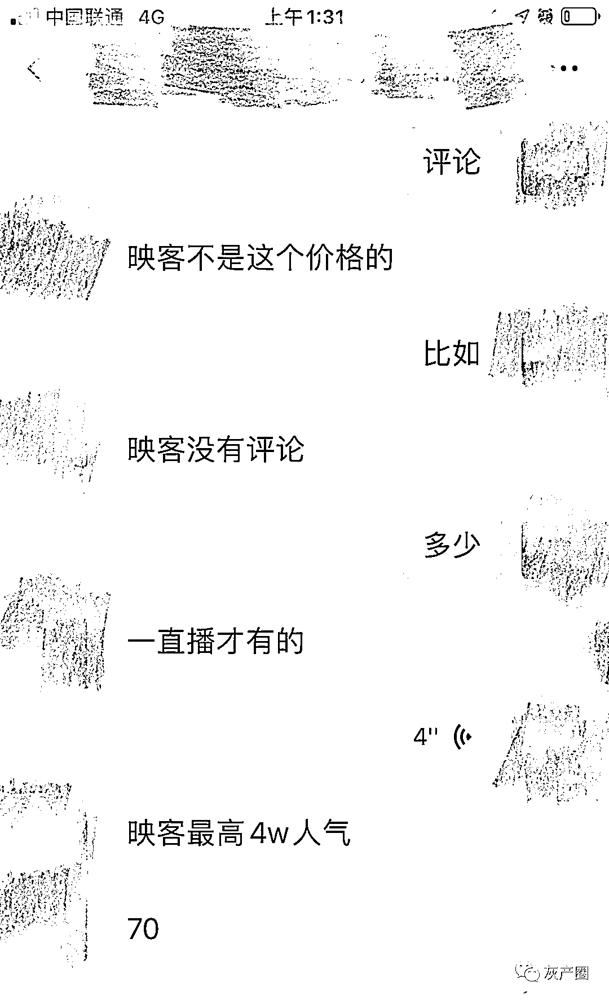每个平台要求和“潜规则”不同，在不同阶段刷量难易度也不同

但我觉得，这是平台舍不得把这部分功能外包给我们赚钱，他们自己也会在直播间放成比例的机器人。

说句不好听的话，在平台买热门，你知道平台推送的粉丝是真是假？比如抖音的 dou＋和上热门，不过是为了刺激大家在平台消费。

我们为什么会存在？因为有需求，并且便宜。我们和平台的区别就是：平台是自己明面作假“合理”化，而我们是背后的影子，没法见光。

很多签约的主播都是我的老客户，还有一些小的 mcn 机构，当平台没有给到更多支持时也会刷一些。  

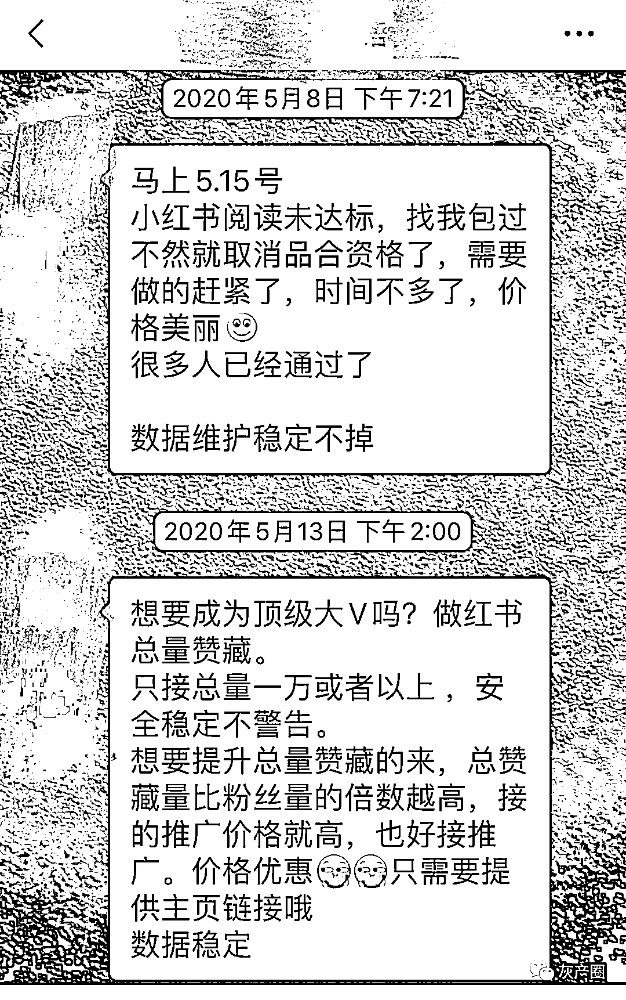有很多商家活动，不刷单根本没法看，阅读量不达标也会影响主播未来收入

有个叫佳佳的主播，从粉丝寥寥无几通过数据优化成为受欢迎的腰部主播，其中离不开“优化”的功劳。

毕竟是自己的职业，我们只会说是“优化”。

**直播销量、小米手机预售，**

**没有我们刷不了的单**

陆小爽，兼职刷单人我兼职刷单半年，赚了四千多块。我只有中专文化，家里主要收入靠老公工作，我全职带娃，但也想知道有哪些可以赚钱的私活，刷单就是我一个全职妈妈的闺蜜推荐我入行的。
刷单群不能白白共享资源，你进群还是要交点“入会费”。进来后有派单主持给大家分配任务的。**入会费大概在 200 多元**，能够保证你源源不断的单可接，也算值了。
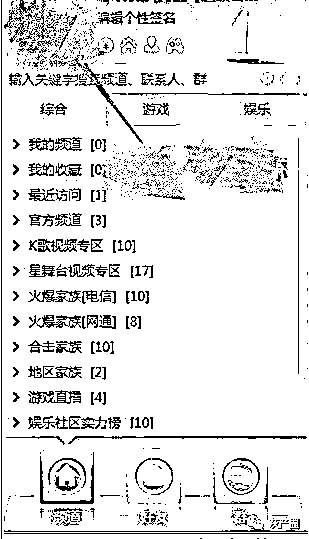做刷单的兼职要找到组织，刷单群就是最庞大的组织之一现在淘宝刷单需求量太大，每天都有无数个店开张，刷流量、刷收藏、加购、补单等都是我们能做的。
每天有人在群里分配，我们只需要申领接活就好了。时间自由，不耽误带孩子。
但刷单群本身也存在真假，有的群在骗取大家入会费之后就进行了账户注销，因此一定要通过熟人介绍，才会比较靠谱。我们大多刷的都是淘宝、天猫、阿里、美团的单。
入会也分几个等级：普通会员入会培训是 99 元，黄金级会员是 158 元，还有钻石级别的 258 元。
不同级别的会员，福利不同：
 1、99 元是公会的永久员工，主要发单一平台的小广告，引导注册拉新，每单 5 元算起，没有固定薪资，多做多得。**2、**158 元除了 99 元的内容，增加了一个刷单平台，还要负责在放单的平台刷店铺的评论、好评，然后还可以 5 折办理 VIP 进入高佣金做单群。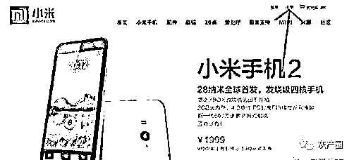 高佣金做单群里，可以做一些小米手机预售抢购的单子（倒手机做黄牛）**3、258 钻石会员，除了以上两个等级的内容，**可以任选平台负责任意 6 种刷单工作，一个月刷超过 600 单还能有 2000 底薪保障。
优秀员工每周还会有两三百的奖励，加上就是差不多 3000+了，以我们这个小城市来说，兼职就有可能拿到我老公一个月的工资，很有诱惑力了。刷单是不被各大电商平台允许的，所以都是私下悄悄进行。我们会隐秘地在 YY 平台进行刷单的语音培训，内容大致是一些刷单规则。一开始我还兴致冲冲，后来就遇到了瓶颈。
注册拉新的刷单佣金最划算，可以把入会会员的本金赚回来。风险最大的直播购买刷单，很多商户直播带货的销量也是靠我们刷单的，虚假购买。
大部分是商家垫付，不需要我们自己垫付。但商家需要我们提供身份证正反面，如果刷太多了，商家也不会给你派新单，因为淘宝号会根据身份证信息识别出我们是职业刷单的。
我们也可以转型为放单人，但放单人也主要是靠拉人头，吸引新人入群来赚钱，我总感觉像搞传销。

**刷单买粉，我是现实所迫**

## **潇潇，时尚博主&主播**

我有几十万粉丝，其中有一大半是刷的。
一开始直播是为了兴趣，但粉丝实在涨得太慢了。辛苦了半天，一天只涨几个的数量，我感觉很沮丧，不知道何时是个头。
这边有很多比我入行晚、内容质量也一般的博主和 KOL，忽然一夜之间有了百万粉丝。反观我自己，只有区区不到 5 万，让我羡慕嫉妒恨。
在一次 KOL 主播的聚会上，一个博主说漏了嘴，他透露了自己的百万量级都是做出来的。其他主播也都不见怪的，反而因此打开了话匣子。
她们谈起自己的经验，认为适当的刷量可以刺激到粉丝。就连一些直播平台的负责人都承认在直播间里加入机器人只是为了优化，带动氛围效果。
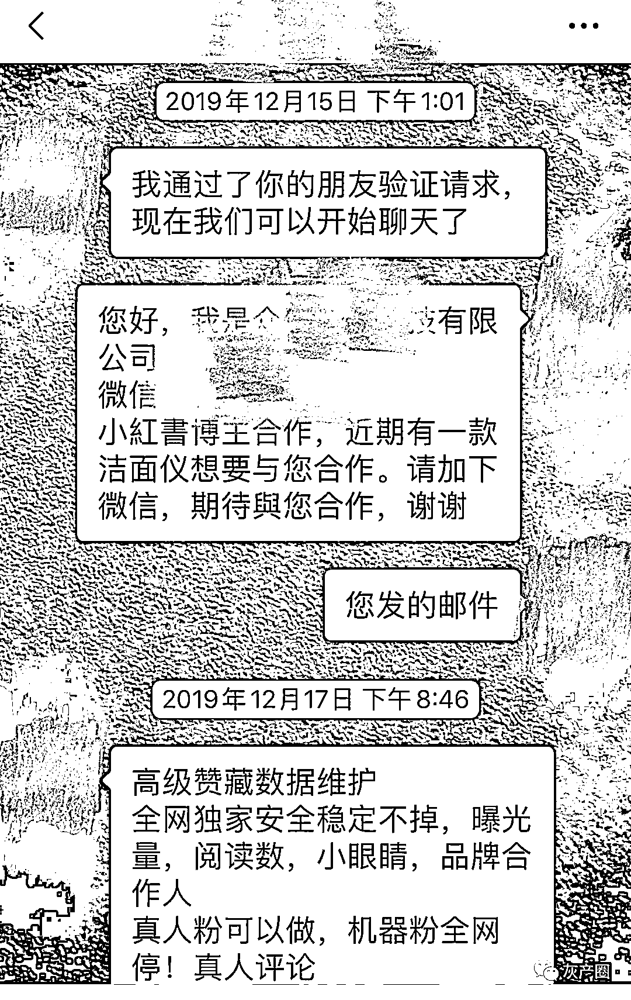在直播行业里，这叫“提高孵化效率”、“优化”如果天天直播没人看，我们自己也觉得没动力。但我依然想按照自己的速度坚持发展下去，因为自己都是实打实的真粉，互动量也比那些“百万量级”要活跃得多。
后来一件事情让我备受打击。一个美妆品牌要求现场直播加发一条微博，据说是每小时 1.5 万元的报价，直播时间一小时，对我来说，简直是个 “大肥差”。
好朋友赶紧把我推荐上去，又拉到公关群里，但是没过多久却又被“踢”了出来。
他们解释说，品牌方要求只和**50 万以上粉丝的博主**合作，我当时真的特别委屈和愤怒，觉得她们太不尊重人了。当着那么多时尚圈子里的主播的面前被踢出群，太丢脸了。
朋友也着急，要求我刷点数据，又花不了多少钱，你的内容可比他们强。
虽然我之前固执地相信“是金子总会发光”，但经过了几次这样的乌龙后，我咨询了曾经私信过我的刷单人。为了数据刷得不那么“假”，我循序渐进地下了几十万粉丝数据的单。  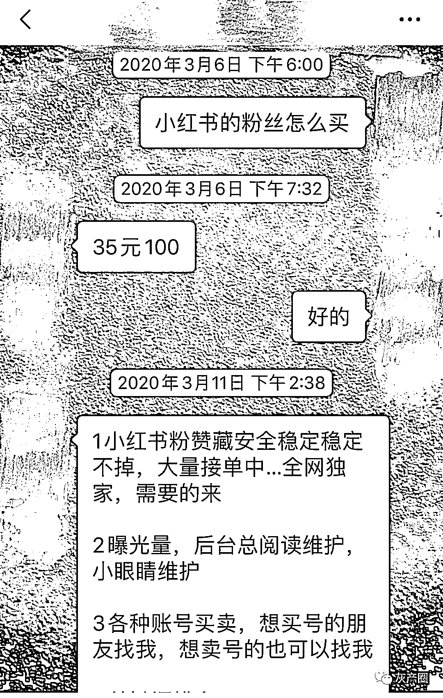每次直播开始前，我都会先打好招呼，安排好自己进直播间的水军们，看起来热闹多了。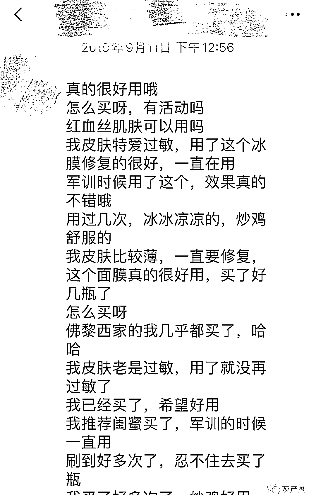我自己设置水军和主播的对话内容一开始还挺尴尬，后来就习惯了，感觉直播就是一场表演。
从那以后，找我的合作方源源不断，我从此走上了开挂的道路。这也并不影响我去直播间带货，因为毕竟真粉是基础，也足够了。
虽然我在心里仍然暗暗唾弃那些势力的商家和品牌方，但我获得的实惠却是实实在在的。我时常在想，如果不是他们急功近利，也就不会有人去刷单刷量了。
现在，我接触很多的品牌公关，包括国外很多大牌的代理，连她们自己也都承认，刚开始的时候都是需要“优化”（刷量）效果：
**让大家看到貌似很不错的基础，慢慢的量就会被带动起来了，这是一种心照不宣的战“术”。**

**世界就是这么残酷，**

**不刷单你就会被淘汰**

## **曹葳，淘宝店主、主播**

我最近刚开始尝试淘宝直播。
最开始我和一位主播做搭档配合，直播两个小时，边吃边卖，薏米代餐、鱿鱼仔、鸭脖子、葡萄酒……凡是吃的，我们都卖。
但我们发现，我们热闹吆喝着一晚上也就十几单生意，不过销量却真实。短时间还行，长期做这种不赚钱的活，生活运营都难以保证了。
**如果店里显示没有多少单，顾客也不会信任你。**
为了想办法提高购买力，我就针对直播的产品做了刷单的决定。我开始发动自己的亲戚朋友刷单，先转他们钱，刷完店里的产品钱又回到自己账户。
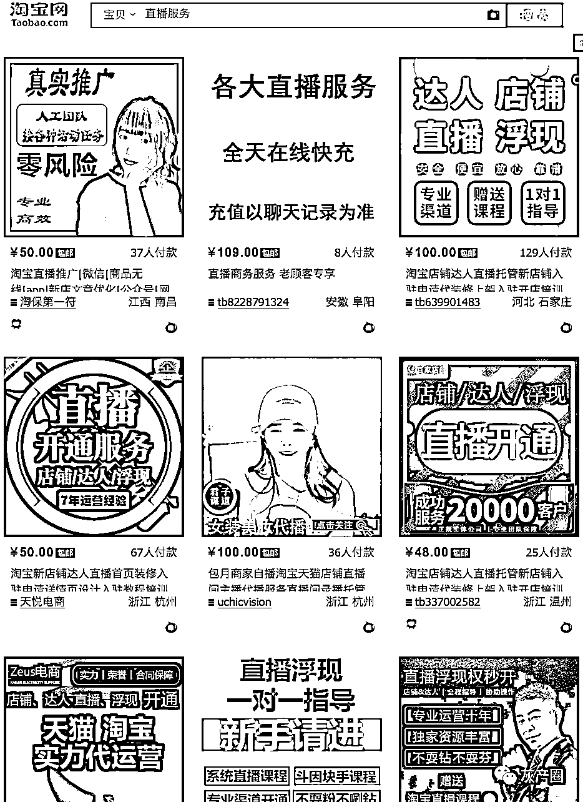通过咨询优化店铺等宣传内容，我意外发现还有专业的刷单业务我联系了网上的刷单人。这些刷单人都很谨慎，生怕我是“卧底”来试探的，刚开始说话都跟接头暗号似的。
**经过咨询平均价格 4-8 元／单，细节价格是跟着等级变化的。比如：1 心 4 元；2 心 5 元；3 心 6 元；4 心、5 心、7 钻都是 8 元／单。**
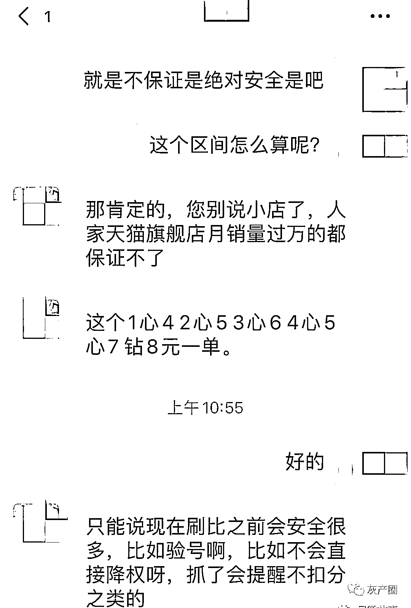刷单人和我说，天猫旗舰店月销量过万的都保证不了安全性，但他们还不是一样刷单？
我忐忑不安的尝试了第一次刷单，一共 3 款产品，每款 50 个评论，不到 1000 块钱。为谨慎起见，评论内容还是我自己写的。
评价一上去，生意立刻就火热得不得了，买家可能感觉不买就会脱销了。
被刺激的购买者蹭蹭上涨。刷单好评创造了信任值，有时候还会被推荐，的确是个非常迅速的捷径。我心想，只要卖的火，刷出去的钱也会赚回来的。
不光如此，刷单我还学会了货比三家，找到更便宜的刷手。但是之前合作过的刷手也会用，更让人放心。
眼看着销量渐渐不错了，我又进了新品，最近却遇到了直播刷量的苦恼事情。
因为淘宝针对刷单管控严格，很多刷手都不敢给刷单。现在真得是骑虎难下，直播起来如果少了，购买数据量真得很尴尬，现在只能期盼着过段时间管控松一点。
真的不要怪我们商家浮躁，因为**社会竞争就是这么残酷。你不刷量，也会有别人刷。**
时间没有人会等得起。
（应受访者要求，文中均为化名）

← 向右滑动与灰产圈互动交流 →

**点击****阅读原文****加入灰产圈高端社群**

