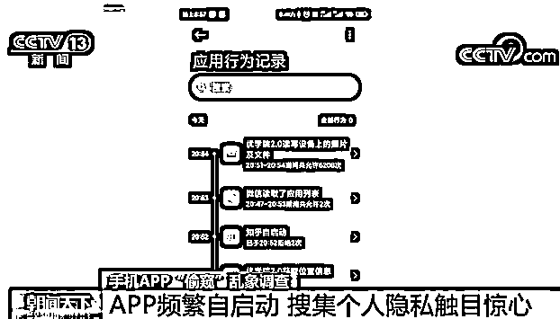
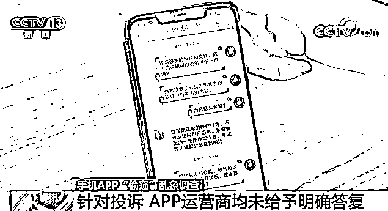
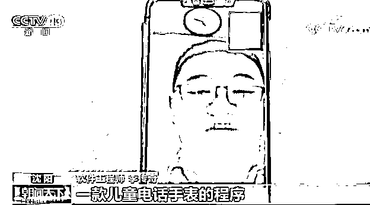
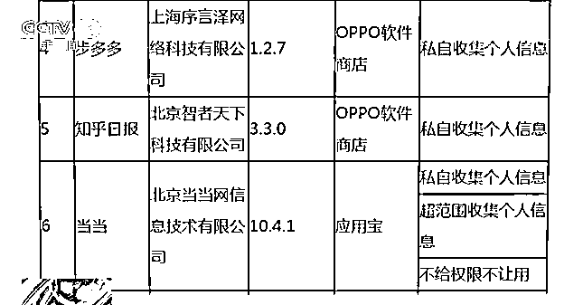
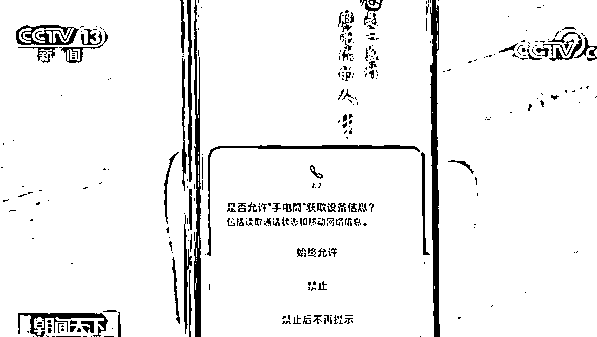

# 被“偷窥”的我们：手机 App 频繁自启动收集隐私信息

> 原文：[`mp.weixin.qq.com/s?__biz=MzIyMDYwMTk0Mw==&mid=2247499786&idx=3&sn=0b4845f747cb70c8e338a496743aafd0&chksm=97cb0b32a0bc8224e291e6f2afcc2a1611e19672d681b33b627a139f79e4baa5c0163f066ea6&scene=27#wechat_redirect`](http://mp.weixin.qq.com/s?__biz=MzIyMDYwMTk0Mw==&mid=2247499786&idx=3&sn=0b4845f747cb70c8e338a496743aafd0&chksm=97cb0b32a0bc8224e291e6f2afcc2a1611e19672d681b33b627a139f79e4baa5c0163f066ea6&scene=27#wechat_redirect)

**点击上方蓝色字体免费订阅“灰产圈”**

工信部官网 6 月 12 日发文《工信部信息通信管理局就媒体报道 App 侵害用户权益问题开展问询约谈》：

6 月 10 日，针对近期有媒体曝光手机 APP 侵害用户权益的问题，我部依据《网络安全法》《电信条例》《电信和互联网用户个人信息保护规定》等法律法规，组织第三方检测机构对手机应用软件进行检查，并对发现存在问题的企业进行了集中约谈，要求相关企业于 6 月 17 日前完成整改，逾期不整改的，我部将依法依规组织开展相关处置工作。

工业和信息化部信息通信管理局

2020 年 6 月 12 日

**此前报道：**

“优学院”十几分钟访问手机照片文件近 25000 次；“TIM”一小时内自启动近 7000 次频繁读取通讯录；“全民 K 歌”“王者荣耀”“新浪微博”可唤醒手机里其余十几个 App 一起在后台偷偷运行……

[`v.qq.com/iframe/preview.html?width=500&height=375&auto=0&vid=p0979cjpkxt`](https://v.qq.com/iframe/preview.html?width=500&height=375&auto=0&vid=p0979cjpkxt)

1

**手机 App 频繁自启动**

**收集个人隐私触目惊心**

大三学生小刘是一个科技发烧友，他有机会作为体验用户，将自己的手机操作系统升级到该手机厂家推出的最新测试版本，在这个测试版本中，新增加了一个功能，该功能可以记录自己手机上安装的 App 启动和使用过程。

使用几天后让小刘大吃一惊，他发现，自己手机上安装的很多 App 存在频繁自启动，访问、读取手机信息的现象。其中一款移动教学软件“优学院”十几分钟访问手机照片和文件近 25000 次，此外还有很多常用的社交、办公、娱乐软件也都存在后台高频率读取手机信息行为。

之后，小刘登录了一些社区论坛，发现有网友用另一款手机操作系统也侦测出大量 App 在后台频繁访问的“小动作”。有网友发现，“美图秀秀”等频繁尝试自启动；还有部分 App 唤醒了手机里十几个 App 偷偷在后台运行。 

**手机用户 李小睿：**有一些 App 我是很想装它，但是装的时候它就要求授权，你不同意就没法装这些 App，但是后台我个人信息它到底知道多少我也是不清楚的。

**手机用户 刘倩：**我跟同事聊给宝宝办理证件的一些问题，我的购物软件和浏览器会给我推宝宝证件套这类商品，我甚至没有上网搜过宝宝证件套这些，我感觉挺恐怖的。

2

**针对投诉 App 运营商均未给予明确答复**

针对这一问题，记者也采访了几家手机 App 运营商。记者通过线上方式将“优学院”App 访问手机信息及启动情况发给他们的客服人员。他们给出的解释是，“系统里的考试和作业都会涉及图片和文件等”。

但当记者追问“在没有登录、没有授权、并非在考试和上课等使用状态下”，为何优学院就可以自由访问读取手机信息，这是否侵犯了个人隐私。他们给出的回复是，**可能是手机中了病毒，并始终并未回答为何如此频繁地访问手机个人信息。**随后，记者在专业机构证实，手机并未中毒。 

记者还联系了多家自启动程序、后台收集用户信息行为频繁的 App 运营商，直到记者发稿，**没有一家运营商针对记者的投诉给予明确完整的答复，记者投诉的问题依然存在，并没有改变。 **

记者就相关问题咨询了业内人士

他表示 App 之所以要广泛地

尽可能地收集用户信息实际是为了

**实现精准营销**

**软件工程师 李传奇：**比如你手机里安装了儿童电话手表的程序，并且使用频度较高，那么你家里应该是有学龄儿童了，给你投放儿童相关产品成功率会比较大。在这个基础上，App 获得你的定位信息就可以分析你的活动范围和活动习惯，通过分析数据来做精准广告。 

有专业人士也表示，**App 频繁地启动，可以使 App“日活跃用户”等流量数据变多，这是其获得融资和广告投放收入的重要参考。**

**互联网广告投放业内人士 陈名兴：**我们在某大型短视频平台，它日活大概是 4 个亿左右，我每天在它上面的广告投放预算是 3 万到 5 万，在某个音频平台，它的大概日活是 3000 万左右，我们每天在它平台上面投的广告预算是 3000 到 5000。

3

**App 过度收集用户信息** 

**相关部门出手制约**

针对这一问题，国家相继出台《信息安全技术个人信息安全规范》和《网络安全实践指南——移动互联网应用基本业务功能必要信息规范》，对 App 超范围收集、强制授权、过度索权等个人信息安全问题进行了明确规定。

**北京市京师律师事务所律师 郭延虎：**相关部门明确规定了网络运营者收集个人信息要向用户告知相关规则，并征得对方同意后才能收集。然后要遵循“最少够用原则”，也就是只收集满足自身业务功能需要最少类型、最少数量的信息就可以了，不得收集与其提供的服务无关的信息。另外，收集个人信息要明确方式和范围，除因安全目的外不得强制收集。 

针对手机 App 过度收集用户信息、用户隐私泄露隐患等问题，今年 5 月中旬，工信部通报了一批侵害用户行为的 App，“当当”“知乎日报”等 App 被通报，并被责令在 5 月 25 日之前完成版本更新整改。 

**工业和信息化部赛迪研究院副所长 陆峰：**国家互联网应急中心监测分析发现，在目前下载量较大的千余款移动 App 中，每款应用平均申请 25 项权限，其中申请与自身业务无关权限的 App 数量占比超过 30%，App 采集用户信息的情况是不容乐观的。 

陆峰介绍，比如这款“手电筒”App，用户必须授权位置信息、储存空间和设备信息才能使用，而位置信息和存储空间与手电筒的使用毫无关联，这就涉嫌过度收集用户信息行为。

**工业和信息化部赛迪研究院副所长 陆峰：**App 应用上架之前，就加强对应用 App 的监测，一旦发现超范围获取用户隐私行为则不予上架。同时提高用户对自我隐私保护的意识，手机操作系统可以对 App 进行可视化的监测，安装时操作系统可以提示这些 App 要采集哪些用户信息。再者，要加强 App 网络执法能力建设。

**App 频繁自启动，**

**刚聊到的产品就被购物软件推荐**

**......**

**类似的情况你有遇到过吗？**

编辑：单镜宇 责任编辑：孟夏  来源：工信部官网、央视新闻

← 向右滑动与灰产圈互动交流 →

**点击****阅读原文****加入灰产圈高端社群**

