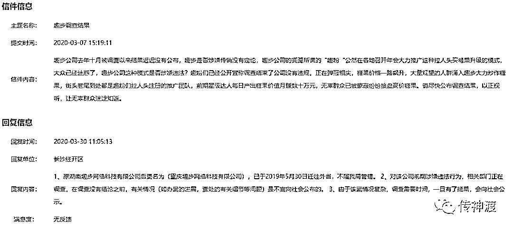
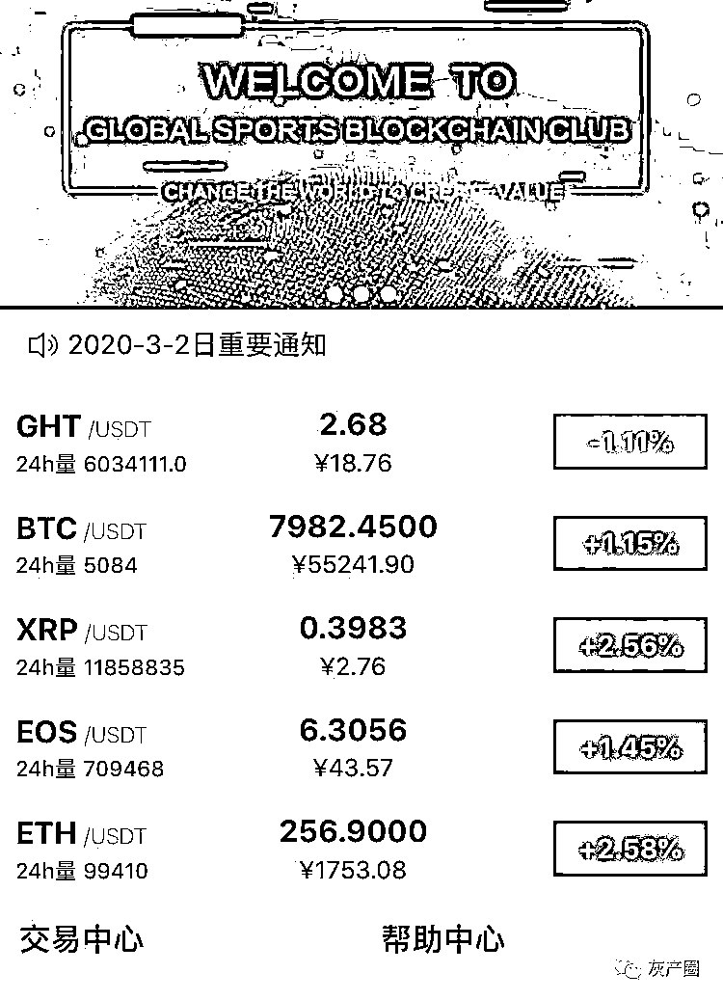
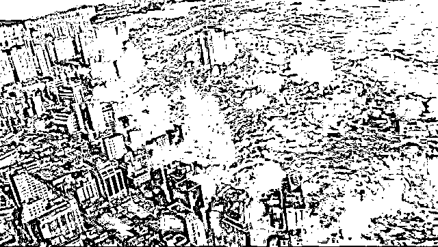
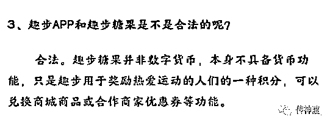

# 趣步没死？未定传销，遗憾的背后......

> 原文：[`mp.weixin.qq.com/s?__biz=MzIyMDYwMTk0Mw==&mid=2247499833&idx=1&sn=7f066ec3fc576b4d84202ad2e0b4846b&chksm=97cb0b01a0bc8217ad84b7c89eae21378446405fcc7a2539d00e01e641aa12144cf814ac0de4&scene=27#wechat_redirect`](http://mp.weixin.qq.com/s?__biz=MzIyMDYwMTk0Mw==&mid=2247499833&idx=1&sn=7f066ec3fc576b4d84202ad2e0b4846b&chksm=97cb0b01a0bc8217ad84b7c89eae21378446405fcc7a2539d00e01e641aa12144cf814ac0de4&scene=27#wechat_redirect)

**点击上方蓝色字体免费订阅“灰产圈”**

最近很多人一直在问趣步为什么还活着，确实，趣步还活着!

不是传销？不是，还没定性......很尴尬，被无数媒体集中轰炸的趣步，还没有定性传销。我找了一堆“传销受害者”聊天，但他们的回答，如洗脑般的整齐：“做趣步会赔钱，你傻吧”，卧槽，这感觉我太熟悉了.......作为一个一年注册用户八千万的 APP，巨大的社会影响力本身就招来了各界各圈的人评论，可依旧是未能通透，如果谈到模仿趣步而形成的趣步系，则相关因素太多更是混沌。

> 已知的趣步系名单：秘乐短视频、福音、趣睡、趣走、趣问、夸克、慈音、影粉世家、爵金、亦跑、闪步、智慧晶、爱打卡、吉柚、速问短视频、蚂蚁短视频、妙音短视频、练练短视频、本色世界、水天共享、运动链 sports chain 等等，其中秘乐注册用户过三千万，福音夸克也应该过千万。

第三次网络传销高峰期，已经来到我们身边，与以往不同的是，不是传销的“传销”变成了主角，传销和庞氏以及币圈交集越来越大，界限越来越模糊，内容越来越玄乎，为了应对局面变化，我们的课程也必须越来越八卦了。**官方信息，趣步目前仍未被定性**  通常，涉嫌传销被查多数会定性，不定性也会有行政处罚，但趣步例外了，被查后不仅毫发无损，反而还“逆风飞扬”了大半年，这样的神奇故事还真的发生了，这也意味有精彩的故事给吃瓜群众。**关于趣步被查，长沙经开区市监局回复**被查时趣步糖果最低价格￥8.4，现在￥20 上下徘徊，交易量也“稳步增长”，下图是今年 4 月 27 日交易，据此数据一日交易金额高达 1.1 亿，按其官方手续费 50%到 20%日抽水不止千万，这不就是印钞厂了吗。未定性的信息很低调，但这个消息在桌面下的泛传销江湖中广为扩散，不仅刺激了已有的仿盘，又催生出一大堆新仿盘，波及面已经接近 2015 年网络传销第二顶峰。**本文目的**这次网络传销巨浪，是对我研究传销社会心理总结的一次验证和完善，趣步本身是当下问题，趣步系是未来问题，目前看似乎还未到顶峰值，精彩就在眼前。我强调逻辑引导独立思考，不打鸡血且附送八卦狗血；用传销思维、币圈思维、风投思维三种思维推导趣步的同时，写一个融资基因的资金盘**模式分析、内外变量分析教科书**。《资金盘教科书》正文：模式分析先从 3.0 版 APP 之前的早期趣步开始说起，表面上看起来是传销，但又不是，从整体上看似乎是庞氏，但也不尽然，确实是个非常精致的玲珑局，用模式设计规避法律的小聪明发挥到了极致，甚至其中多有画蛇添足的细节。**不是传销** 趣步不是传销其实就一句话，趣步把团队计酬变成团队计糖果，多层次的是积分不是钱，这两个东西不能直接换钱。**不是庞氏**传销在逻辑上从属于庞氏，只是局限于多层次团队计酬，用新人头费填旧人头收益；庞氏是借新还旧模式，第一轮借 1 块钱时吹牛挖下 10 块钱的坑儿，第二轮借 10 块填坑后又吹出来 100 块的坑儿，一轮轮滚动下去直至崩盘。**一坑连一坑，大坑套小坑**用庞氏逻辑来描述趣步是这样的：用卷轴填糖果的坑儿，用手续费填卷轴的坑儿，然后下一批用户按这个流程再滚一轮，循环往复；趣步前面收注册费（这个钱勉强够塞牙缝），中间卖卷轴（相当于糖果罐子），后面收交易手续费，而交易是 C2C 状态，以质疑经济犯罪的角度来看资金往来，就有点扑朔迷离了。**糖果是什么？**糖果，趣步明面上只承认是积分，连虚拟币都没承认，更不可能承认是钱了，既然不是钱，或者不能直接兑换为钱，在法律层面当然不可能定传销了。但现实中参与者对此也毫不介意，因为对他们来说，糖果是随时可以套现。流程是糖果在太平洋对面一个所谓的硅谷网站里，变成虚拟币 GHT，然后随着 GHT 的涨跌和 C2C 交易变现，其间趣步抽取高低不等的手续费，这个抽水收益的来源令模式产生了质的变化。也就是说，糖果跨太平洋洗了一遍，交易所里抽了一遍，才能变成钱，总之这钱来的是水灵灵的。**不是血淋淋，是水灵灵**自国内转移至境外时脱离了传销，自 APP 内交易转移至境外暗网交易所时脱离了庞氏，模式中传销、庞氏都变成弱逻辑，最高 50%手续费令交易所变成消泡沫的强逻辑，此时已经是币圈的交易所打法了。但懂比特币和区块链的人，发现这个交易所的金融逻辑，是个伪金融逻辑。**为什么是个伪金融逻辑**糖果肯定是趣步的，糖果变 GHT 币是，俱乐部交易所也是，交易数据币价走势当然更是，在这里趣步不仅仅是球员，还是裁判，还是唯一的规则制定者。糖果不仅不是区块链技术，趣步里外里赤果果的就是中心化，那个半透明遮羞布若拿来仔细一看，商标“区块链”生产厂家**依托**贴牌。币圈第一信仰去中心化的区块链技术都不存在，当然是伪金融逻辑，趣步只是用炒虚拟币的方法来炒积分，或者说，不是割韭菜，是假装在割韭菜。从这个视角来看，定个金融诈骗我觉得都比传销罪要相对靠谱点，蛋疼的是虚拟币交易所还处于灰色地带。**趣步模式理论上不会崩盘** 传销崩盘时，是没人了， 庞氏崩盘时，是没钱了，诈骗盘崩盘时，是没盘了，趣步崩盘时呢？

> 熊哥哥和熊弟弟在路上捡到了一块奶酪，高兴极了。可是，他们不知道怎么分这块奶酪。这时有只狐狸跑了过来，“小家伙们，你们吵什么呀？”“我们有块奶酪，不知道该怎么分。”熊弟弟对狐狸说。“这事好办，我来帮你们分吧！”狐狸笑了笑，把奶酪拿过来掰成了两半。“你分得不匀！”小哥儿俩嚷着，“那半块大一点儿。狐狸便在大的这半块上咬了一口。“可是现在没咬过的那半块又大了一点儿！”咬着咬着，奶酪全被他吃光了，一点儿也没剩下。

这个故事是告诉我们交易所这只狐狸，顶多是没人交易没奶酪；哪怕是玩不转，用虚拟币的归零币套路来兜底也不用崩盘，活标本夸克链信和福音的现状就是如此。你以为他们玩不动骗不到人了，其实早就圈够了钱主力退场，留个烂摊子只是寄托韭菜哀思的心理战术，别傻了。有人看这里会心急：不崩盘那就放心的玩？这当然是很傻的想法，有人愿意每天三千步得一毛钱吗？有人没完没了的送你钱吗？操盘和玩盘的是零和博弈关系，不是共赢关系，你若有这种想法，找个朋友来捶自己一顿吧。**趣步模式的公式** 

*   用传销的模式吸引羊毛党，
*   用庞氏骨架将用户筛选分层，
*   造一个自己的交易所（www.91666.cloud），
*   在交易所里交易自己的股票（GHT），
*   而且是可以无限增发的股票（积分糖果）；
*   圈不住的羊产生的流量收益，变成互联网创新的包装，
*   圈住的羊则用手续费反复收割，
*   不套现的大羊变成了交易所压舱石，
*   总之，养听话的绵羊，种自己的韭菜。

用币圈组合拳降维收割羊毛党，用模式证明什么叫做法律漏洞，用存在嘲笑“传销和崩盘跑路”，看起来很酷吧，下面的趣步描述，更酷。**趣步的坦坦荡荡，令人赞叹不止** 趣步在自己 APP 和官网中，也反复表达糖果是积分不是虚拟币，但是变现流程延伸到境外暗网交易所后，又完全是虚拟币的玩法和套路，不懂虚拟币基本概念的人，不知道这是什么级别的无耻和坦荡。 我的话术词库里，我会用“我们借鉴区块链”来解释糖果本质，趣步的话术是：**依托区块链技术开发的糖果**，文法修辞稍不注意就理解错了，我来模仿一句：“依托联合国宪章制定趣步 APP 用户守则”，什么感觉？最高 50%提现手续费这种吃相，趣步被各路媒体公认为吃相天下第一，而且一直以来旁若无人不做任何解释，坦坦又荡荡。手上、身上坦坦荡荡，就是鼻子怪了点 还有，趣步从未解释硅谷那个只能炒作 GHT 币的网站，为何只能交易他这个非区块链的假虚拟币，连句场面话都没有，极致的装傻，服了，真的服了。以我在传销江湖正反双方阵营厮混上十年的经验，没见有人这么无耻的。  **币圈和趣步，剪了不断，理了全毛** 模式**依托**于区块链，自然要牵扯上币圈的事儿，有时候想想，以币圈作风将心比心，趣步这些坦荡和无耻还只是小儿科，衣冠禽兽看多了，趣步不值得...... 模式第一层皮传销，第二层皮庞氏，第三层币圈烂仔，第四层是假交易所，币圈人一眼就能识破是假区块链，这不重要，重要的是“**趣步用假区块链假装在割韭菜，我就用真区块链来真的割**”，于是币圈里趣步仿盘一地鸡毛。诸多仿盘都有人宣称自己是真区块链，以此对标趣步的假区块链，趣步从不解释自己是假割韭菜，丫却非要说自己是真的割韭菜，这价值观很有深度，人生观极有城府，怪不得我一直没有完全通透这个群体心理，此处行拱手礼。**趣步模式没有受害者？**模式前排是羊毛党，温水煮一煮羊儿才能变青蛙，预热到第二排时再诱导投资，而所谓投资的卷轴多数情况下不贵，几百万人是轻轻松松的。这其中把羊毛党煮成青蛙的套路并不新鲜，云联惠之类线下消费返利盘的打法也是如此，普通会员不投资不投钱就会体现为稳赚不赔。传统传销的各层级参与者属性，与趣步截然不同 从多层次的角度来说，羊毛党站位第一排会稀释大量的负面舆论，受害者后移一排产生极大的隐蔽性，施害者后移一排则代表着利益受损者的比例比传统金字塔格局少很多，这预示着传销江湖整体未来的走向。

> 传销、庞氏、币圈破壁融合后，传销米糊、静态羊毛党、币圈韭菜三者烩成一锅，是十年一遇的级别，而最罕见的是新冠病毒这块背景板之下，社会心理的演化轨迹。

看到这里，会有人憋不住插嘴问：还能做趣步吗，趣步还赚钱吗？3.0 之前的 APP 看趣步归零套路，之后有意外因素介入复杂很多，下一篇趣步各种外界意外因素就纷纷登场了。 **教科书第一课稳着点，免得信息量过大弃课，留个思考题：**传销罪，万能之罪的背面趣步系盘子多，媒体总是嚷嚷什么 XX 盘 XX 项目模仿趣步涉嫌传销，然后会步趣步的后尘、会崩盘、会跑路，吧啦吧啦一大堆，可趣步现在还在活蹦乱跳。 。 这顶帽子，扣错了没人在意，顶多放只兔子掩饰下尴尬，扣对了就是首先揭发一个全民公敌。错了无责任、对了赚流量的惯性，从自媒体恶习变成媒体常态了，于是涉嫌传销的指责在舆论的非黑即白里，接近于万能之罪。

*   拉人头嫌疑的都是传销，
*   激情演讲打鸡血的也是，
*   听课有点强制动作的也是，
*   人失踪找不到也怀疑是，
*   产品夸大宣传的肯定是，
*   能治癌症的百分百是，
*   吹牛一夜暴富的也是，
*   关起来限制自由也是，
*   连朋友圈里炫耀装逼过头了，也是......

很脑残的逻辑，很活色生香的乌合之众，传销罪在舆论里从一个智商鉴定用刑法罪名，转变成一个诸多“无解嫌疑”的扣帽子工具，实现了其社会职能的升华。精彩，刚刚开始 趣步带给我们的史诗级惊喜，还多着呢，下一篇分析趣步模式复杂的外部环境、最史诗级的“操盘思维创新”、史诗级的狗血。彩蛋：趣步模式娱乐版

1.  大哥免费出租甘蔗地，农民去耕种 45 天后产出白糖，
2.  农民去大嫂的中介里，把糖换成二哥钱庄的银票；
3.  银票换银子要抽水 50%，但有多种降低抽水的方法；
4.  一是介绍新的农民来免费种甘蔗地，这是拉新方式；
5.  二是去赌场赌博几天后提现，这是套现方式；
6.  我们需要注意，赌场是二嫂开的；
7.  赌场配套钱庄规则是：介绍新赌客后，抽水可降低，而且有 VIP 赌房；
8.  赌场配套中介规则是：不想种地的职业赌客，要去大嫂哪里买大小糖罐，然后收购农民的白糖后，才能换银票进赌场；
9.  于是，免费农民变成免费赌客，免费赌客带来更多职业赌客；活了，全链条打通......
10.  大嫂收白糖 90 万，卖糖罐收了 10 万现金银子，二哥对应支付一百万银票，这就有 90 万的泡沫；
11.  农民赌客要兑换 50 万银子，可钱庄只有十万，四人急议；
12.  大哥：甘蔗加工的时间只留一天，让他们来不及换银票；
13.  大嫂：每百亩地一个保长位置，卖 1 万银子，大嫂收 20 万，
14.  二嫂：不用怕，输家没银票无法换银子，赢家想一直赢就只能拿银票继续赌，也不会挤兑，此乃赌客之天性；
15.  二哥：套现人多时十两银票换一两银子，人少时一两银票换十两银子，银票多少我说了算，众人大喜；一根杠杆，可以撬动地球，何况.......
16.  有精明的赌客套现离场，说钱庄银票发的太多很难兑现，众赌客心慌；
17.  大哥登高一呼：我家大门口广告位很赚钱的啊，拼少少、斗樱、谈谈磨磨、京西都来做广告的啦，日进广告费十万！（其实只有一千银子）；
18.  大嫂也跟着喊：我在门口摆地摊卖鞋，卖摊位搞电商，很赚钱啦！（其实顶多两千银子）；
19.  二嫂更狠：忽悠赌客变股东，再圈一笔钱来填坑儿；这就是疯长的野生金融......
20.  众赌客见如此多盈利手段，一阵狐疑，又看银票价格大跌不甘心割肉，于是在二嫂连推带搡加魅惑勾引之下，回到赌场继续赌博；
21.  两家四人喘过这口气，修改赔率调整兑换率，赌场也搬家至山里，好一通忙活；有人报官......
22.  六扇门收到信息，来询问两兄弟； 
23.  二哥高声辩解：这些人是农民，换糖换银票都是他们自己自由兑换，与我二人无关，山里赌场也于我们无关，而且我门上贴着告示大字写着：银票不是筹码，您别赖我。
24.  六扇门撇撇嘴，大哥一看不行，又小心翼翼拿出一张秀才写的摆摊儿模式论证书，六扇门接过来，看的直翻白眼；
25.  就这盘问功夫，XXXXXX，XXXXXX，XXXXXX，二哥脸上虽然愁眉苦脸，心中狂喜的脸都快绷不住了； 
26.  六扇门出得门来贴个告示：“此兄弟二人姓庞，出自硅谷子门下庞氏家族，诸位......且听下回分解.........

来源：传神渡 作者：易铁

← 向右滑动与灰产圈互动交流 →

**点击****阅读原文****加入灰产圈高端社群**

