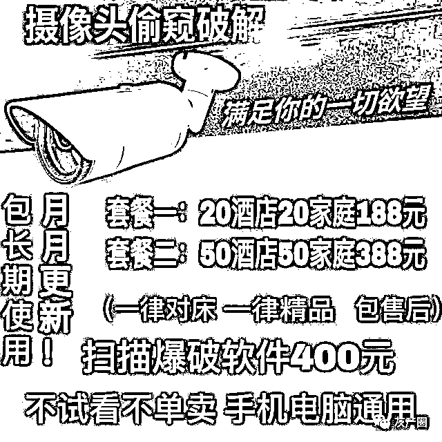
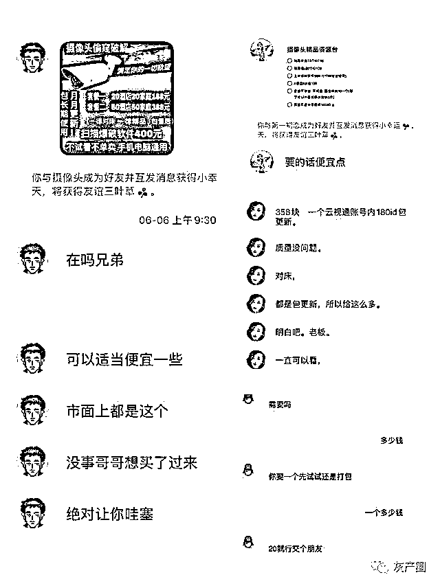
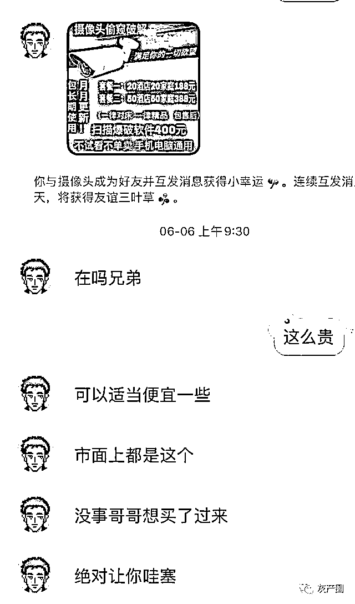

# 色情偷拍黑色产业曝光！家用摄像头遭破解入侵，偷窥被卖“白菜价”！

> 原文：[`mp.weixin.qq.com/s?__biz=MzIyMDYwMTk0Mw==&mid=2247499833&idx=2&sn=3219e3550feb28c8d5d22198a1578b82&chksm=97cb0b01a0bc8217af8bfbd8c78c38c7e12804fcab2994e4e8c18281b166fe746dd889565deb&scene=27#wechat_redirect`](http://mp.weixin.qq.com/s?__biz=MzIyMDYwMTk0Mw==&mid=2247499833&idx=2&sn=3219e3550feb28c8d5d22198a1578b82&chksm=97cb0b01a0bc8217af8bfbd8c78c38c7e12804fcab2994e4e8c18281b166fe746dd889565deb&scene=27#wechat_redirect)

**点击上方蓝色字体免费订阅“灰产圈”**

1

**网上的售卖广告**

通过安装针孔摄像头窃取酒店房客性爱画面，在衍生的色情偷拍黑色产业链之外，澎湃新闻调查发现，这条黑色产业链还衍生出一条“支线”：

一些掌握破解设备、程序及手段的不法分子，通过入侵破解家用摄像头，获取受害人性爱画面，将观看权低价、批量售卖。甚至有人低价售卖其他不法分子安装在酒店客房内的摄像头观看权，使得原本数百元的邀请码跌成“白菜价”。

在中国裁判文书网公布的一起类似案例中，河北男子王某帅破解并入侵了 30 余台摄像头，以 88 元的价格教授他人观看方法。他最终被法院以提供侵入、非法控制计算机信息系统程序、工具罪，非法控制计算机信息系统罪，犯贩卖淫秽物品牟利罪判处有期徒刑一年四个月。

更有甚者，陕西男子巫某成在不到一年时间里，破解了中国、日本、韩国、美国、比利时等多个国家的 18 万个家庭摄像头，非法获利 80 万余元。

这种非法获利手段时至今日依然存在。在一个专门售卖破解摄像头的 QQ 群中，不法分子打出“20 酒店 20 家庭 188 元”及“50 酒店 50 家庭 388 元”的广告，批量售卖观看权。

这种被用于偷窥他人隐私的软件经专人指导后，只需两三分钟就能上手，而观看权的价格也有商量，单个摄像头的观看权最低可砍至 5 元。

2

批量入侵摄像头窥探隐私，打包售卖观看权

一名只有初中文化的 85 后男子，在网上获取入侵家庭摄像头的方法及软件后，先后入侵 30 个摄像头，并建立多个 QQ 群，教授观看方法售卖观看权及淫秽视频。

浙江省丽水中院在 2018 年 7 月 4 日终审宣判的这起非法控制计算机信息系统、犯贩卖淫秽物品牟利案，曾揭开了这一类通过破解、入侵家用摄像头，获取受害人隐私，非法获利案件背后利益链的冰山一角。

判决书显示，王某帅在 2017 年 7 月初通过网络社交平台获取了能够侵入家庭摄像头的方法及软件，并利用另一款软件破解他人家庭摄像头的 IP 账号和密码信息。他以此方式对家庭摄像头后台信息系统进行控制、观看摄像头画面。

王某帅通过自学很快掌握了相关技巧，并通过上述方式侵入并控制了 30 余台家庭摄像头的信息系统。

为获取利益，王某帅在网上组建了 5 个 QQ 群，将侵入、控制他人家庭摄像头信息系统的软件、教程及 IP 打包，以每包 88 元的价格出售给他人，先后向 50 余人次提供上述侵入、控制家庭摄像头信息系统的软件和方式，并从中获利。

此外，侦查机关还查明王某帅通过 QQ 聊天、以 QQ 红包付款的方式，将其云盘账号、密码以 30 元人民币销售给朱某等人，让其分享该网盘内的 28 个淫秽视频。王某帅为吸引 QQ 群成员向其购买入侵家庭摄像头的软件及观看权，在 QQ 群内向群成员发送淫秽视频和图片，以这种方式传播淫秽物品来“刺激消费”。

据一名群成员讲述，他在加入王某帅的 QQ 群后，看见其中有一些偷拍的淫秽图片，是摄像头拍摄的。王某帅在群内发广告称有“精品 IP”和“激情视频”售卖。

上述群成员在与王某帅私聊后发现，所谓“精品 IP”需要配套软件才能看，王某帅也坦言摄像头拍摄的激情视频并不多，但称有淫秽视频可以卖，购买后发现王某帅的云盘账号里存有淫秽视频数十部。

2018 年 6 月 1 日，浙江省景宁畲族自治县人民法院以提供侵入、非法控制计算机信息系统程序、工具罪，非法控制计算机信息系统罪及犯贩卖淫秽物品牟利罪，数罪并罚，判处王某帅有期徒刑一年六个月，王某帅上诉后，丽水中院将刑期改判为一年四个月。

实际上，像王某帅一样，通过侵入、破解摄像头窃取他人隐私画面，非法牟利的现象在近几年并不鲜见。澎湃新闻在中国裁判文书网检索出的另 10 份相似判例显示，其中的破解偷窥事件最早从 2017 年开始，大部分人通过购买或检索等方式学得破解方法，而后批量破解入侵摄像头获取隐私画面非法获利。其中最少的破解 22 台摄像头，最多的则入侵十余万台，非法获利 80 余万元。

3

一人破解 18 万摄像头，可供偷窥世界多地

在众多破解者中，陕西男子巫某成的“业绩”尤为突出，他在不到一年时间里，通过租赁服务器，搭建 APP，创建网站，组建 QQ 群等方式，将破解的摄像头遍布了中国、日本、韩国、美国、比利时等多个国家，窃取他人隐私，以淫秽视频截图吸引网民，发展注册用户一万余人，他甚至用非法得来的钱购买了一辆奔驰轿车。

据巫某成供述，他从 2018 年 4 月开始经营一个可控制他人摄像头的 APP，很快形成规模和影响。这款 APP 里有一个数据库，其中的数据是他从其他人的 APP 里通过反编译软件获取的。在这个基础上，巫某成搭建了自己的 APP，通过指令调取数据里的用户名和密码就能实现入侵控制相关摄像头。

不到一年时间里，巫某成控制了 18 万个摄像头，位置遍布世界各地。他自称，只要他有用户名和密码的，都能被他控制。

此后，巫某成花了 1000 元找人帮他建立网站，用于推广、下载安装和收费。他深知很多“客户”是为了通过摄像头观看裸体或性爱画面，并为此专门建了一个 QQ 群，将一些含有淫秽画面的录制视频和截图发在群里用于吸引用户，并很快取得成效。

2018 年 11 月，因这款 APP 服务器挂在国外，费用偏高，且这款软件在国内影响较大，曾被多人破解，巫某成重新开发了一款手机软件，并将此前的数据全部转移到新的软件当中，服务器也转到了国内。

利用这款手机软件，巫某成先后发展了一万多名注册用户，并按照充值金额分为 68、368、668 三个层次，普通会员一次只能看到 4 个画面，高级点的能看到 8 个画面，最高级的一次能刷出 16 个画面。这些用户为他带来了巨额利润，他自称，除去租赁服务器等其他费用外，他有 50 多万元纯利。

非法获得巨额利润后，巫某成为自己购买了一辆“奔驰”牌 E300L 轿车。2019 年 3 月，巫某成被警方在深圳抓获，这辆轿车随后被查封，他的银行账户也被冻结。办案机关查出该账户自 2018 年 9 月开始，陆续收款 76 万余元，到案发时，仅剩 12 万余元。

法院经审理认为，巫某成无视国法，对他人计算机信息系统实施非法控制，情节特别严重，其行为构成非法控制计算机信息系统罪。

此外，巫某成非法控制的摄像头多达 18 万余个，地区涉及中国、日本、韩国、等多个国家，非法获利 80 万余元，亦可认定其系情节特别严重。鉴于巫某成归案后能够如实供述所犯罪行，当庭自愿认罪，对其依法从轻处罚。法院据此以非法控制计算机信息系统罪，判处巫某成有期徒刑 5 年。

4

破解目标涵盖家庭及酒店，最低 5 元可看

实际上，违法犯罪分子售卖的遭破解的摄像头并不只有家用摄像头，他们批量出售的摄像头观看权中，涉及酒店客房内画面的也不在少数。

6 月 6 日上午，澎湃新闻搜索到数十余个包含“摄像头 ID”“摄像头分享”等关键字的 QQ 群，这些 QQ 群多以色情图片或包含了“酒店精品”“监控破解”字样的图片为群头像，群成员均在 150 人以上，对话框均为“全员禁言”状态。管理员会不定期发布广告语或广告图片吸引群成员购买摄像头观看权，如需购买则须添加群主为好友详谈。

据其中一名群主介绍，其所售卖的监控内容均为破解他人摄像头获取，并承诺摄像头方向一律对床，视频质量一律精品，不满意包退换。群主随后发出一张广告图片，其中显示，20 个酒店摄像头和 20 个家庭摄像头观看权套餐打包售价 188 元，50 个酒店摄像头和 50 个家庭摄像头观看权套餐打包售价 388 元。

其他几个群主的报价大致相仿，其中一名卖家甚至提出若不放心，可以 20 元试看一个摄像头，经过一番讨价还价，这枚摄像头的观看价格最终被砍至 5 元。经群主指导后，相关软件的下载及操作仅需三分钟便可上手，澎湃新闻成功连接摄像头发现，正如卖家所言，镜头正对着床，房内物品拍摄效果清晰。

网络尖刀安全团队创始人曲子龙告诉澎湃新闻，通过摄像头侵犯用户隐私进行售卖，这几年已经成为了一条产业链，他们通过在敏感场所进行偷拍、发行和售卖观看权非法获利。而与此同时，有另一群不法分子也盯上了贩卖摄像头观看权的生意，他们通过暴力破解管理平台密码的方式，获取摄像头浏览权并进行售卖。

曲子龙说，由于家用摄像头用户对隐私安全常识的缺失，很多人使用类似 123456/888888/666666 这样的弱口令密码，甚至从未更改过初始密码，除了通过弱口令密码猜解密码外，很多攻击者也会自己通过密码组合的方式，创建一套几万甚至几十万条的常用密码字典用以提高破解率，通过暴力破解的方式破解摄像头其实并没有太高的门槛。

据曲子龙介绍，在酒店安装摄像头进行偷拍，和通过暴力破解获取观看权的两个违法体系正常情况下并没有交际，暴力破解这些偷拍摄像头的情况也并不多见，但他们在某些方面会有一些“合作”。

随着色情偷拍产业链愈发“成熟”，更隐蔽及成本更低的针孔摄像头出现，此前安装的改装摄像头却并不会被偷拍者们回收，部分人会将这些老旧摄像头的管理权限专卖给破解摄像头“从业者”进行套现，后者批量售卖的酒店客房摄像头观看权，很大一部分来源于这里。

来源  :  澎湃新闻  

← 向右滑动与灰产圈互动交流 →

**点击****阅读原文****加入灰产圈高端社群**

