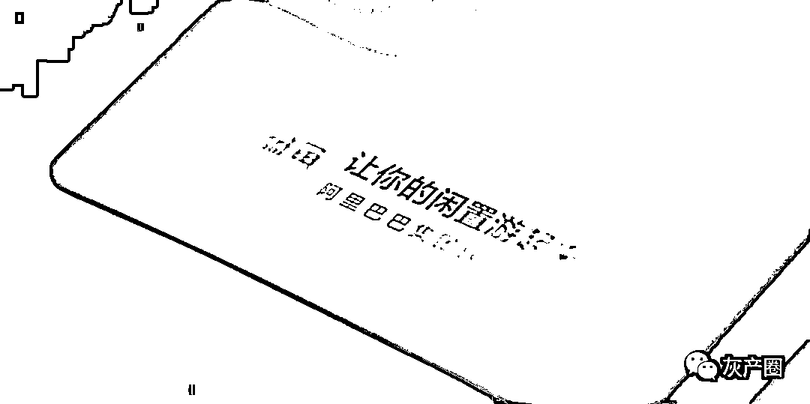
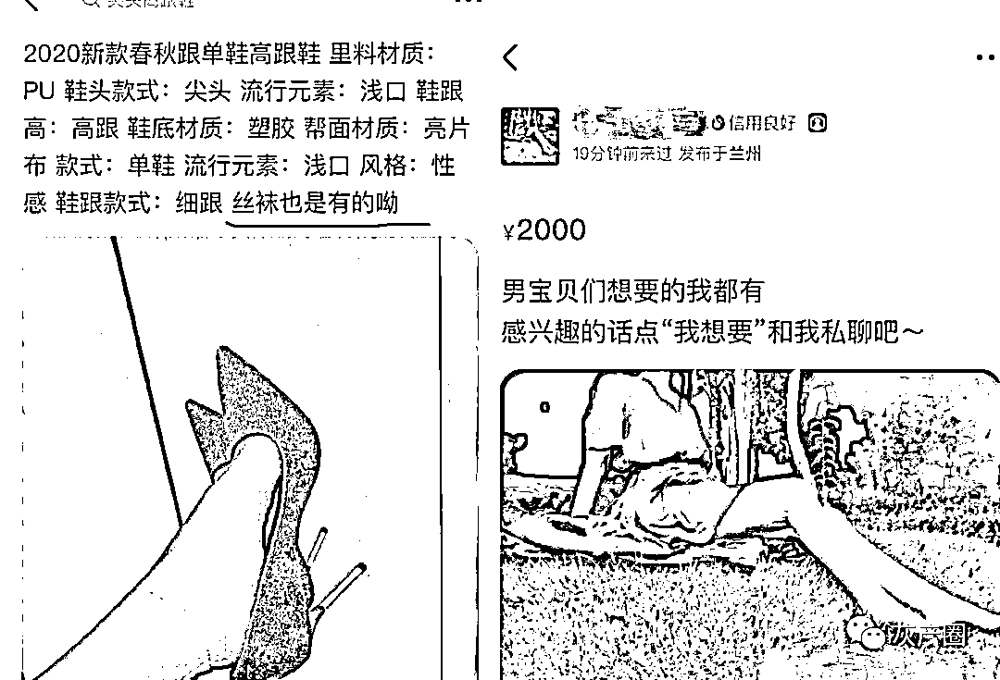
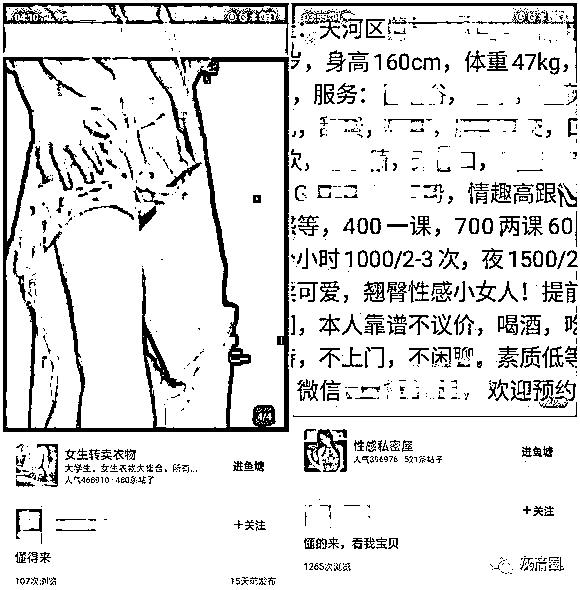
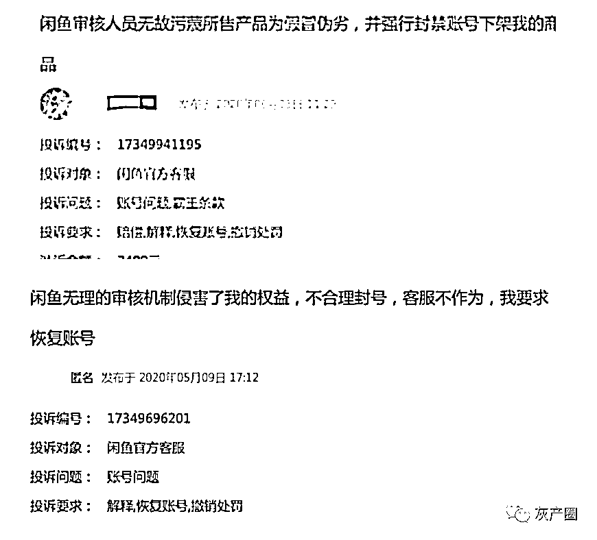
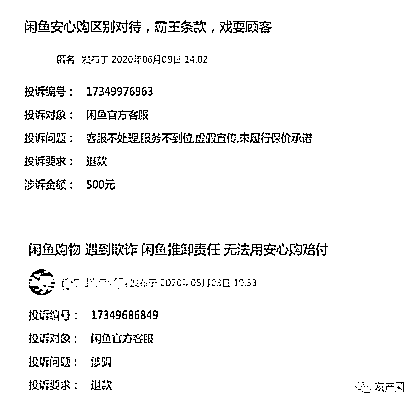
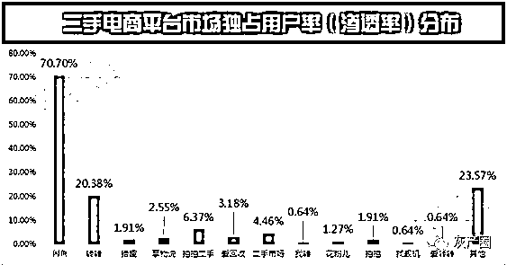
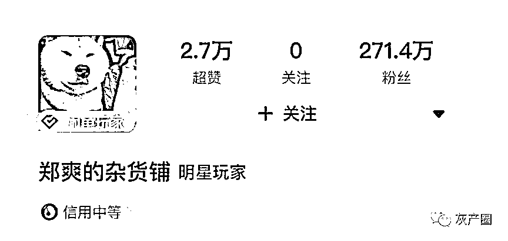
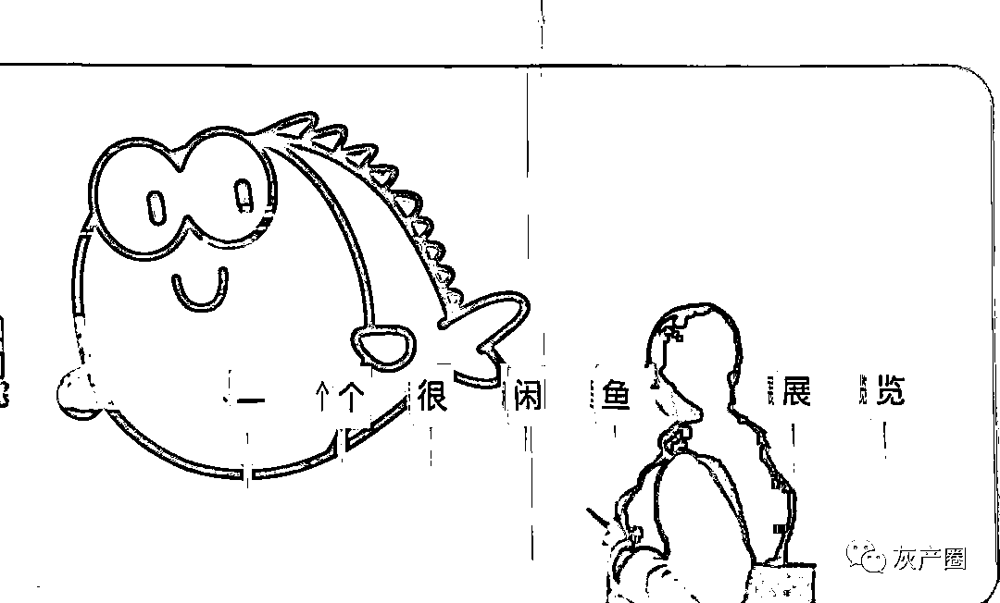

# 闲鱼 2000 亿的另一面：盗版网课、禁药和“原味丝袜”

> 原文：[`mp.weixin.qq.com/s?__biz=MzIyMDYwMTk0Mw==&mid=2247499884&idx=2&sn=68c361b1137f9c1233f49ebfbc46ea7e&chksm=97cb0b54a0bc824258d76b99fd719c0a55ffa6317353f57fcdb56ef3d4ee3f87329b7d450857&scene=27#wechat_redirect`](http://mp.weixin.qq.com/s?__biz=MzIyMDYwMTk0Mw==&mid=2247499884&idx=2&sn=68c361b1137f9c1233f49ebfbc46ea7e&chksm=97cb0b54a0bc824258d76b99fd719c0a55ffa6317353f57fcdb56ef3d4ee3f87329b7d450857&scene=27#wechat_redirect)

**点击上方蓝色字体免费订阅“灰产圈”**

00

**“在闲鱼，只有你想不到，没有你买不到。”**

脱胎于 2012 年成立的淘宝拍卖，闲鱼近年来一直在肉眼可见地淡化“电商”元素转而向“社区”属性发起进击；在闲置经济日益升温的当下，主打二手交易的闲鱼无疑在上升市场中撷取了一块外部对手难以攻克的高地。

**中国互联网经济研究院日前发布的数据显示，到 2020 年二手交易市场规模预计达到 1 万亿；**然而平静的海面之下也有重重暗礁，在社交玩法层出不穷的同时，闲鱼背后的灰色生意也屡禁不止—职业卖家、假货 A 货、盗版及色情交易泛滥，二手电商市场乱象丛生，审核机制更是难言完善。**“闲鱼失去了分享二手好物的初心，变成了一个充斥着利益交换的商业工具。”**有媒体指出。

**“闲鱼从诞生第一天的内核就是‘社区‘，而不是单纯的二手交易平台。”**闲鱼 CEO 谌伟业并不吝于在公开场合表达自己对“社区”属性的追求。那么，过分强调“社区”的闲鱼真的“变味”了吗？

**01**

*****入场的“职业卖家”、猖獗的盗版视频、语焉不详的色情信息*****

******在闲鱼 App 上，似乎很难再找到只做二手闲置流转的卖家了—随着“社区”属性的不断渗透，它也从一个单纯的二手交易市场脱胎变成了一个充斥着各种势力、各色产业的电商江湖。******

******除了实体商品，虚拟产品和服务甚至也是闲鱼上的主流售卖商品。“生日那天给朋友点了个唢呐师傅，请进我们的闺蜜群，吹了一首《生日快乐》。”一位叫柒月的网友在社交平台上分享了自己奇特的下单经历；此外，任天堂旗下游戏《动物森友会》的火爆也带动了平台上出现不少售卖“铃钱”、“旅行券”、“全套家具”等游戏装备的卖家，“岛上的一切用现金都是买得到的，跟卖家事先沟通好需要的道具，下单之后他们就会直接‘送货上岛’。”任天堂游戏玩家小阳告诉凤凰网财经。******

******但据媒体此前报道**，除了出售闲置物品的二手玩家之外，闲鱼上也进驻了不少所谓的“职业卖家”**，他们出售的都是自有的全新商品，大到空调、冰箱、扫地机器人等家电，小到猫砂、宠物零食甚至名声大噪的盲盒，无一例外都打上了“全新”、“包邮”等字样。“现在进闲鱼，很难刷到真正的二手物品了。”一位资深闲鱼玩家告诉凤凰网财经，“职业卖家和普通卖家相比更专业，聊起来还省事，他们中绝大部分都是线下经销商，线下流量小，于是就转到闲鱼上卖。”******

******巨大的线上流量和低准入门槛无疑在这个二手交易市场撕开了一道口子，令众多玩家趋之若鹜，厂家直销、零售商售卖、个人代销等职业卖家纷纷涌入，利用平台规则热火朝天地获取曝光量和利润。**在知乎和 B 站等平台搜索闲鱼相关内容，教二手玩家们“带货”、“引流”和“兼职赚钱”的攻略比比皆是**—“无货源模式如何在闲鱼赚得第一桶金？”根据不少赚钱攻略的指引，所谓的“无货源模式”其实就是代销，只需搬运商品信息，有买家付款后再从拼多多、1688 或微商手里拿货；**“说白点其实就是‘二道贩子’。”一位专门做猫粮代销的闲鱼卖家告诉记者，“对于没有货源的卖家来说，什么东西火我们就卖什么，好的文案就是销量的保证；成交量一提升，流量和活跃度也会上来，账号的权重也会变高。”********

******在公众号文章《闲鱼月入 1 万的 9 个操作步骤》中，作者直言闲鱼赚钱的原理就是“做中间商赚差价，俗称‘倒爷’”，而赚钱的操作流程一共分注册、养号、选品、货源、上架等九个步骤。“在闲鱼做生意的优势就是门槛低、零押金、流量大。”一位闲鱼职业卖家向凤凰网财经透露，**“最重要的是闲鱼的流量分配相对比较公平，没有差评机制，也不需要像淘宝那样日日刷单或像微商那样求着七大姑八大姨购买。”********

********和成批职业卖家一起进场的，还有各种讳莫如深的灰色生意。**日前阿里巴巴发布的 2020 财年第四财季财报显示，2020 财年闲鱼的 GMV（商品交易额）超过 2000 亿元，同比去年增长超过 100%—从各项数据看，闲鱼俨然就是一只光速成长的巨兽，不断在二手交易市场收割流量、开疆拓土；但成立至今将近六年，盗版、色情甚至违禁品交易等灰色地带也在平台的暗处滋生。******

******凤凰网财经查询发现，各大视频会员、知识付费课程、百度云盘共享等资源在闲鱼上只需几块钱就能获取，这些资源通过正常的关键词搜索均无法找到，为了规避审核风险，卖家往往将文案包装成类似“U 酷”、“滕迅”等谐音词进行发布；同样，在闲鱼上以“网课”或“视频课程”为关键词搜索，会被提示该相关内容违规，但如果搜索“wang 课”等字眼，依然会出现大量盗版网课视频。**“盗版商们通过闲鱼等渠道，吸引用户付费进群，以网盘的形式提供资源及更新服务。”一家企业级视频云服务商曾向媒体透露，“只要一个群里有一个人买了盗版课程，就意味着起码 200-300 个人不会为课程付费。”********

******图注：闲鱼上通过“U 酷”、“滕迅”等关键词谐音字搜索出来的视频会员产品，价格几块到几十块钱不等（来源：闲鱼 App）******

******屡禁不绝的还有各种软色情产品及服务—记者注意到，此前闲鱼就因平台上暗藏黄片网盘账号、禁药、原味丝袜甚至陪过夜的“特殊服务”等商品饱受诟病，一度被外界称作“中国暗网”；**“除了常规的二手交易之外，闲鱼还有一个‘里世界’。”**一位曾在无意间搜索到色情服务的闲鱼买家告诉记者。据她介绍，此前在闲鱼上搜索“原味”、“私物”、“SPA”等关键词时，页面都会跳出各种大尺度照片和暗示性话语；去年三月，闲鱼上甚至有商家公然售卖“妇科真人检查”相关视频；和前述售卖视频会员的套路一样，这些“不可描述”的产品或服务都清一色将商品信息包装成隐晦的文字内容进行发布。******

******凤凰网财经再次用上述关键词进行查询，页面提示相关商品均已无法获取；但仍有买家向记者反映，目前在闲鱼上搜索“高跟鞋”，页面展示的商品信息中注明“丝袜”字眼的一般都是提供“特殊服务”的卖家。记者尝试点开一个售卖高跟鞋并附赠“丝袜”的卖家主页发现，其中有一项语焉不详地写着“男宝贝们想要的我都有”的商品。******

********“卖家在闲鱼上发布这类信息，都是绞尽脑汁在规避平台审核，之后他们会引导买家添加微信或 QQ，然后在上面推销黄色视频或提供裸聊服务。”来**自青岛的闲鱼卖家小阎向凤凰网财经表示；据她透露，此前她在平台上发布了一条高跟鞋的售卖广告，随后就收到了不少挑逗性的私信，“清一色全是问我有没有‘原味’丝袜的，”小阎告诉记者，“由于‘原味’两字已经被闲鱼设置成了违禁词，一些买家会直接用类似‘ww’（‘袜袜’）这样的缩略词代替。”******

******图注：闲鱼上售卖高跟鞋并注明附赠“丝袜”的卖家主页充斥着各种隐晦的软色情信息（来源：闲鱼 App）******

******02******

*********有漏洞的审核机制*********

******那么，闲鱼缘何成为灰色产业野蛮生长的重灾区？******

******分析人士表示，闲鱼这么多年来之所以灰产难禁，一方面是因为卖家的准入门槛低，只需一个手机号、淘宝或支付宝账号就可以注册并登录；另一方面是由于平台的审核和处罚机制存在不足。**“线上平台审核机制分机器审核与人工审核，大部分都是人工审核，但存在数据量大、审核时效性慢、审核人员成本高的问题。”一位互联网公司 IT 从业人士告诉凤凰网财经，“所以一般会通过算法辅助人工，给出一些信息；但目前算法做不到 100%准确，对于有些网站来说，存在先发后审的机制，也是冒着一定风险的。”****

****背靠阿里这棵大树起家，闲鱼在成立之初就被外界冠以“富二代创业”的标签，发展的路径也相对顺遂；然而传统电商多年来建立的完善审核机制似乎未能成功复刻到二手交易平台上，无论何时，对闲鱼审核机制的质疑在投诉平台和媒体报道中都屡见不鲜。****

****凤凰网财经查询发现，**诸多闲鱼用户对审核机制的投诉主要集中在误判发布商品违规、交易环节和违禁内容审核不严等方面**，前述提到的灰产生意很多仍在平台上大行其道，“闲鱼的审核机制一直在加强，但是‘道高一尺魔高一丈’，只要稍微绕个弯子，这些东西就又会重新出现在平台上。” 一位服务行业互联网平台从业人士曾表示，闲鱼官方对商品的审核原则是“发现违法违规的就尽快处理，发现不了的就等用户和媒体反馈”，用关键词做非法内容管制的难度高，只要稍微使用谐音词或“黑话”就能绕过监管。****

****图注：曾被媒体曝光的闲鱼社交版块”鱼塘”充斥着各种色情信息（来源：IT 时报）****

****对于审核机制存在的漏洞，闲鱼客服此前也向媒体回应称，**平台一直通过后台关键词屏蔽和人工搜索来全面过滤低俗信息，但因确实“精力有限”，并不能纠察出全部有害内容；**对于一些不法分子有意打擦边球，使用敏感度比较低的涉黄词汇，不管是机器还是人工，都很难一眼识破，工作难度较大。****

******除了对违禁内容疏于管理之外，闲鱼审核机制饱受外界诟病的另一点就是误判卖家发布的商品违规。**“软色情、电子烟等违禁物绕个弯子就能发布，合法渠道购买的正品反而被当成假冒伪劣。”据不少用户在投诉平台上反映，自己发布的商品通过合法渠道购得，“没有任何违法犯罪情形也没有敏感词汇”，但依然被闲鱼审核员判定其出售假冒伪劣商品并强制下架所有在售商品，封禁账号。****

****图注：投诉平台上关于闲鱼审核后台误判商品违规的投诉****

****有业内人士透露，闲鱼上乱象丛生与电商平台们多年来竞相追逐的“流量”脱不了干系。**“淘宝能够禁掉（有害信息），说明阿里具备这样的能力；闲鱼的监管未能到位，可能是阿里为了将流量导向闲鱼。”**电商分析师李成东表示。但从过往经历来看，闲鱼在弥补审核漏洞的问题上其实也没少下功夫—2017 年 1 月，闲鱼上线了“面交”功能“见一见”，提醒用户“等待见面验货，拿到货再付款”；在这不久，闲鱼又上线了“小法庭”功能，由平台随机抽取的信用度良好的用户担任“庭审”成员，“开庭”讨论是否要删除被举报的商品信息；去年年底，闲鱼在防骗方面还推出了“安心购”赔付计划，在平台内交易受骗的用户，提出申请即可获得等额赔付。****

******然而，前述几项措施的整治效果还未算明显，关于规则的争议就纷至沓来。**凤凰网财经注意到，网上对闲鱼“小法庭”的判决公平问题颇有微词——据网购投诉平台，来自天津的吴女士此前在闲鱼上出售了一个古董首饰并表明不退不换，但买家在验货并签收快递后损毁该古董，要求退货退款；事后吴女士在闲鱼“小法庭”上提供了顺丰发货证明，但“小法庭”却仅凭一张买家损毁后的照片就裁定必须给买家退货退款。****

******此外，****闲鱼的“安心购”赔付计划也并非一片祥和**。记者从投诉平台上看到，有闲鱼用户反映在闲鱼上购买游戏卡带被骗之后申请了“安心购”服务，但该赔付计划并没有全面覆盖到每位受骗的消费者；该用户称，在受骗细节相同的情况下闲鱼却给出了不同的处理态度，十名受骗用户中仅有 7-8 人显示已赔付并且赔付了 500 元，自己却没有得到相应补偿，“致电闲鱼客服，得到的回答永远是不清楚审核失败的理由，并没有解决诉求。”****

****图注：投诉平台上关于闲鱼“安心购”无法赔付的投诉****

******作为一个二手交易平台，闲鱼在信息监控和内容审查方面显然还有待改善。**网经社电子商务研究中心主任曹磊告诉凤凰网财经，上述种种乱象显示了以个人用户为主的网络平台共同的治理难题。**“其管控难度在于，交易方式隐蔽交易环节分散，跨平台交易特征明显，比如将违禁视频存储于在线网盘，引导购买者到微信、QQ 等社交软件进行交易，管控难度极大。”**曹磊说道，“同时也暴露了网络平台治理水平存在差距，平台间的协同远远不够。”****

******那么二手交易平台未来还能如何突破审核困局？**对此，网经社电子商务研究中心法律权益部助理分析师蒙慧欣向记者表示，**首先，提高卖家的准入门槛是首要的****，要对二手卖家的资质进行更加严格的审核，同时买家的身份也应进行实名认证；****其次，主管部门或者二手电商平台可以制定禁止或限制在网上进行销售的违禁品名录，通过网站首页或 APP 前端通知卖家。******

****而针对前述平台审核机制问题，凤凰网财经也联系了闲鱼方面进行求证，截至发稿未获回复。****

******03******

*********闲鱼难“翻身”？*********

******但必须承认的一点是，尽管灰色生意盛行、审核机制难言完善，闲鱼还是在二手交易市场中占据了一块外部对手难以攻克的高地。******

******网经社发布的《2018 年度中国二手电商发展报告》显示，**在众多二手交易电商平台快速崛起的当下，闲鱼在二手电商领域中的渗透率达到了 70.7%，排名第二的转转占比仅为 20.38%**；如今，闲鱼已经成为国内最大的长尾商品 C2C 社区和交易市场，**在阿里巴巴日前发布的 2020 财年报告中，闲鱼的 GMV（商品交易额）超过 2000 亿元，同比去年增长超过 100%，相当于一个中等规模国家的 GDP，在线卖家数量也超过了 3000 万。********

******图注：二手电商平台市场独占用户率（渗透率）分布（来源：2018 年度中国二手电商发展报告）******

******从各项数据上看，国内二手电商市场形成了闲鱼和转转双寡头垄断的局面，二者占据了该市场 90%以上的份额；但和后者不同的是，随着时间推移，闲鱼似乎不满足于只做单一的 C2C 闲置交易，渐渐长出了社交基因—**鱼塘、明星入驻、二手带货直播、同城服务等先后在这里拥有了一席之地，多年来它的创始人和 CEO 们也不吝于表达自己对“社区”属性的追求。********

******图注：演员郑爽的闲鱼账号（来源：闲鱼 App）******

******“闲鱼就是金庸世界里的风陵渡口，一个人人都可以敞开心扉、没有拘束、自由自在交易自己的一切的集市。”闲鱼 CEO 谌伟业曾经说道；饶有意味的是，闲鱼的官方微博认证写的也是“阿里巴巴旗下的闲置交易社区”。******

********那么，这块被赋予美好愿景的“风陵渡口”打造得如何？**2016 年 3 月，闲鱼宣布其社区共有 12.5 万个鱼塘在运转，实名用户超过 1 亿，彼时成为日后竞争对手的转转诞生才不到 4 个月；“闲鱼对干掉京东毫无兴趣，我们所要做的是颠覆淘宝。”同年 6 月，谌伟业的一番话将闲鱼的野心显露无遗。******

********从高层口径来看，闲鱼本质上更希望自己是一个附带交易属性的“社区”**；在这之后闲鱼也在不断拓宽自己的边界，从打造玩家频道到做租房、从明星入驻到二手车交易，随着体量的日益增大，闲鱼的用户活跃度和转化率也在不断提高；相关数据显示，截至 2019 年 8 月，闲鱼 App 月活规模达到 7314.5 万人。******

************

******凭借着阿里给予的流量支持，闲鱼的“圈子”社交玩得顺风顺水；二手电商“双寡头”的路线孰优孰劣尚难定论，但跟随着“社区”属性生长出来的“信任危机”却有目共睹；**“在二手电商领域，社交起到的作用其实很有限，更重要的还是平台的服务能力和供应链能力。”**私域电商研究中心主任庄帅曾表示。尽管闲鱼已经长成了二手电商市场中的一头巨兽，但它的诡谲之处就在于，你以为打开了单纯做闲置流转的平台，却在里面窥探到了一个灰产横行的新世界。******

******在 2019 年的一场公开活动中，谌伟业将“善意”作为闲鱼社区运转的根本驱动力，**“闲鱼最初的设计其实就是为了将这种善意能发挥出来，我们认为释放善意最好的方法，或者我们认为最轻易能够实现的方法，就是让大家能够相互帮助、相互交易。”**但如何在一个更安全、更明朗的边界发挥这种“善意”，闲鱼似乎还有很长的路要走。******

************

******← 向右滑动与灰产圈互动交流 →******

********************点击****阅读原文****加入灰产圈高端社群********

************