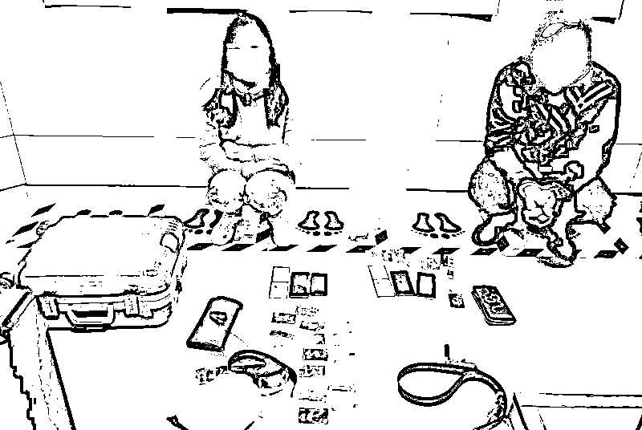
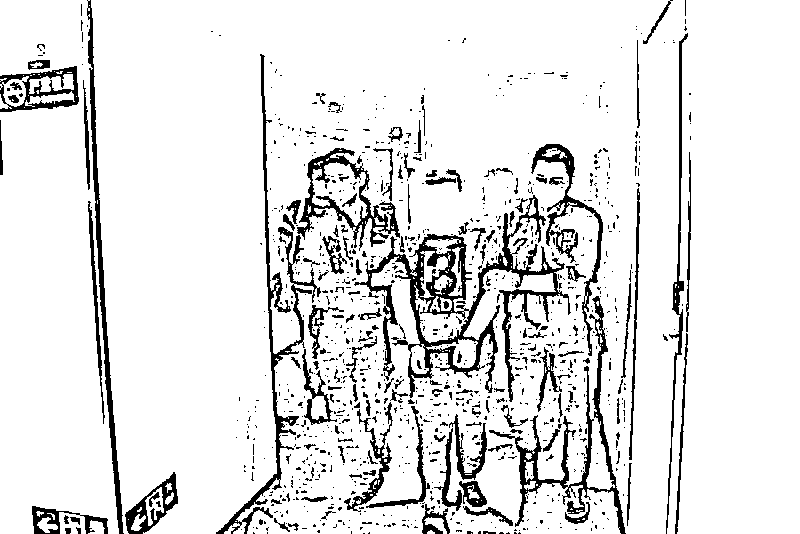
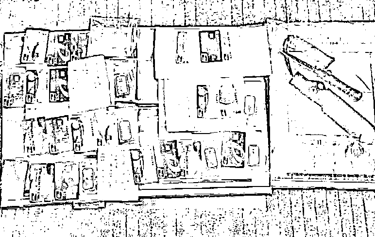
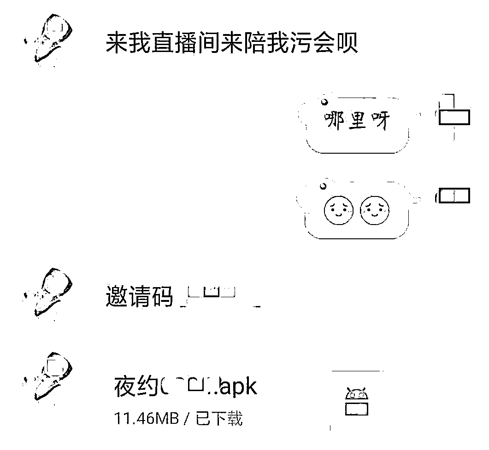
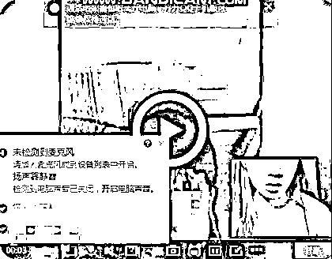
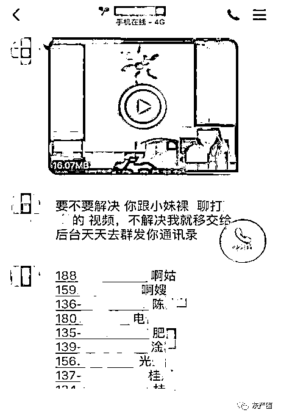
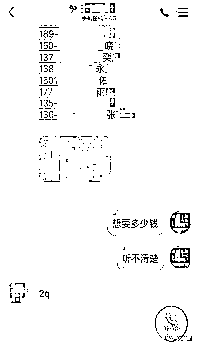

# 请别轻易脱下你的……

> 原文：[`mp.weixin.qq.com/s?__biz=MzIyMDYwMTk0Mw==&mid=2247499884&idx=3&sn=c85b3b3c67c836e1e517a6e635ab4d99&chksm=97cb0b54a0bc8242336ec66de8e9469112298518505d8ce8067ec41562f92cf243fb377593f9&scene=27#wechat_redirect`](http://mp.weixin.qq.com/s?__biz=MzIyMDYwMTk0Mw==&mid=2247499884&idx=3&sn=c85b3b3c67c836e1e517a6e635ab4d99&chksm=97cb0b54a0bc8242336ec66de8e9469112298518505d8ce8067ec41562f92cf243fb377593f9&scene=27#wechat_redirect)

**点击上方蓝色字体免费订阅“灰产圈”**

长夜漫漫，寂寞难耐

微信添加好友的提示音打破了宁静

陌生“妙龄少女”或 “美艳少妇”主动搭讪

惊不惊喜？意不意外？

可是怎想事情后来的发展 

竟然会变成这样

……

[`mp.weixin.qq.com/mp/readtemplate?t=pages/video_player_tmpl&action=mpvideo&auto=0&vid=wxv_1379863202892316673`](https://mp.weixin.qq.com/mp/readtemplate?t=pages/video_player_tmpl&action=mpvideo&auto=0&vid=wxv_1379863202892316673)

广州公安公益微电影《一脱成恨》（粤语版） 

[`mp.weixin.qq.com/mp/readtemplate?t=pages/video_player_tmpl&action=mpvideo&auto=0&vid=wxv_1379905409435271169`](https://mp.weixin.qq.com/mp/readtemplate?t=pages/video_player_tmpl&action=mpvideo&auto=0&vid=wxv_1379905409435271169)

广州公安公益微电影《一脱成恨》（国语版）

**网络“裸聊”又称视频裸聊、激情视频**

是利用互联网视频聊天等从事淫秽色情活动

参与者多为单身、离异或空虚无聊的人士

以网络“裸聊”方式敲诈勒索

是指不法分子引诱事主下载安装特定社交 APP

窃取事主手机通讯录

继而以发布事主“裸聊”视频来恐吓敲诈事主

达到获取钱财目的的违法犯罪行为

**本质上是一种传统的敲诈勒索类犯罪线上化的犯罪**

**目前以视频“裸聊”方式最为常见**

广州市公安局新闻办公室今天（6 月 11 日）通报：为营造健康、文明的网络社交风气，市公安局刑警支队会同越秀、荔湾、白云、增城等区公安分局，成立打击以网络“裸聊”方式敲诈勒索犯罪的专案组，历经一个多月的调查和部署，重拳出击，**于近日分别在广东、浙江、四川、青海等省开展行动，共抓获 43 名以“裸聊”方式敲诈勒索犯罪嫌疑人，破获 100 多宗相关案件，涉案金额人民币近 1000 万元。**

专项打击行动开展以来，广州市以“裸聊”方式敲诈勒索的警情同比下降 4 成，印证了此次行动的显著成效，进一步净化了网络道德风气。针对以“裸聊”方式敲诈勒索犯罪，广州市公安局新闻办公室专门制作了**公益微电影《一脱成恨》**，并在今天举行了首发式。

2019 年下半年以来，广州警方网警部门通过网络巡查、市民报警、微博网友反映等途径收集犯罪线索，并通过比对分析，**发现广州市以“裸聊”方式敲诈勒索犯罪行为时有发生。**

个别事主被敲诈巨大金额，财产损失超过 50 万元，但因自身存在违法行为（非法裸聊等）和羞耻感，从而选择不报警处理。这样不仅事主自身财产遭受损失，也在一定程度上助长了违法犯罪分子的嚣张气焰。

今年 3 月 14 日晚，越秀区的事主胡某在家中用手机在 QQ 号上的交友软件与一女子加为好友。**该“美女”称自己打字太慢，建议事主通过视频聊天，进而引诱事主干脆“裸聊”，期间又发出带有木马病毒程序的网址链接给事主（目的是盗取事主的有关个人资料例如通讯录等）。**之后“美女”来个“大变脸”，从一开始暧昧温柔的态度变成凶恶贪婪的嘴脸，向事主要钱，否则要将之前录制的事主“裸聊”视频予以公开，发到互联网和事主通信录里所有朋友。事主十分害怕，被逼向对方提供的二维码转账共**17900 元**。

为消除扰乱互联网风气的安全隐患，尽快将犯罪嫌疑人绳之以法，市公安局刑警支队联合网警部门和越秀、荔湾、白云、增城等区公安分局成立专案组，对已掌握的各类以“裸聊”方式敲诈勒索线索进行了长达一个多月的深入调查，并精密部署对犯罪嫌疑人的抓捕工作。今年 4 月下旬，广州警方开展多次收网行动，先后在广州、佛山、惠州、东莞、浙江义乌、四川成都、青海西宁等多地，抓获**孙某（男，45 岁，前科人员）**在内的**43 名**犯罪嫌疑人，打掉**6 个**以“裸聊”方式敲诈勒索团伙，破获**100 多宗**相关案件，缴获台式电脑**10 台**以及账本、银行卡、作案手机等一大批，冻结账户**50 余万元**。

**网上艳遇“小姐姐”**

**其实中了“美人计”**

在相关案件的调查中

警方发现

**以“裸聊”方式敲诈勒索的作案手法几乎一样**

犯罪嫌疑人通过**微信、QQ 等常用社交网络软件**，利用肤白貌美的美女头像账号不断发送一些挑逗勾引话语，例如“小哥哥在干嘛”“交个朋友吧”“裸聊吗”等，在互联网寻找相信天上有掉下“艳遇”的事主。

**犯罪嫌疑人以微信、QQ 网络视频太卡为借口，发来一个 APP 链接，引诱事主上该 APP 直播间玩“裸聊”。****该类 APP 不是正常软件，而且均会要求事主同意访问手机通讯录。**

图片来源：真实案例

面对刺激的邀请，血气旺盛的事主于是开始脸红心跳的视频交流。不久事主就会收到两条信息，**一条是事主赤裸身体的截图，另一条是事主手机通讯录号码截图。**更可怕的是，对方发来语音聊天，事主一直认为的“美女”居然是一个男的！生生惊出一身冷汗！**对方表达“自己只为求财，不想毁你名声”“花钱消灾”“不能好好谈，立马让你身体截图在通讯录名单上面挨个传”等恐吓敲诈话语。**紧接其后，对方就会发来一个微信二维码图片，要事主在上面转入 3000 至 30000 元不等的金额。

图片来源：真实案例

如果事主觉得转钱后真的能了事，那就会再次陷入套路。对方会继续敲诈，继续逼事主转钱，直至把事主支付宝、借呗、备用金等一系列钱财敲诈勒索完。多数事主为了不让自己“丑事”外传，选择破财消灾，忍气吞声，不作报警处理。

图片来源：真实案例

此类“裸聊”敲诈勒索团伙的幕后操纵者多在境外，敲诈后将资金迅速转移到海外账户。该类团伙通常在境外不同国家、不同城市间流动，窝点隐秘不固定。

**“裸聊”交友套路深**

**果断拒绝才是真**

网络“裸聊”敲诈勒索是

不法分子导演的把戏闹剧

花样百出，伎俩繁多

事主大多以为遇上文艺作品中**美好的“爱情邂逅”**

毫不意识到自己在不知不觉中

跌入不法分子的“心跳陷阱”，频频中招

如果在社交网络上遇到以“裸聊”方式敲诈勒索时 

市民群众该如何防范和处理

**有哪些方法可以避免自己的权益不受侵犯？**

**警方提示要做到以下三点：**

一是不要轻易相信网友说辞，不要轻易答应网友要求。市民群众在日常网上社交活动中，如果遇到有陌生女子主动添加和邀约时，首先要自觉提高警惕，洁身自爱，以免不法分子有可乘之机。不要轻易相信并接受对方“激情”邀请，不要轻易安装陌生人发来的 APP 链接。一旦遇到类似“裸聊”敲诈勒索发生时，一定要冷静分析，不回复对方信息，不接受私了，不转账，不删除，立即并坚持报警处理，防止上当受骗而导致经济损失。

二是要提高自身抵抗诱惑能力。打拼的单身青年工作忙碌，无时间谈恋爱，在加紧时间找对象成家立业时，要注意方式方法，现实中真爱可遇不可求，更别说网络虚拟空间里，真爱概率更是无限的小。不要相信网络社交“艳遇”，天上没有掉下这样的“馅饼”，往往套路就等你跳。

三是不要冲动，冷静保留证据。以“裸聊”方式敲诈勒索的嫌疑人不会留给事主很多思考判断时间，都是连环出招，事主很容易被套路，在极度恐慌状态下转钱被骗。一旦出现上述情况，要冷静保存好所有相关聊天记录，不冲动，不隐藏，不删除，立即打 110 电话报警，将相关证据交予警方处理，便于警方及时掌握开展打击，警方并一定会严密保护公民的个人隐私。

**广州警方呼吁，**警民共同努力，形成强大打击网络非法行为氛围，最大程度压缩此类犯罪的活动空间，共同维护健康、文明的网络社交风气环境。

来源：广州公安，菲凡烽火台

← 向右滑动与灰产圈互动交流 →

**点击****阅读原文****加入灰产圈高端社群**

