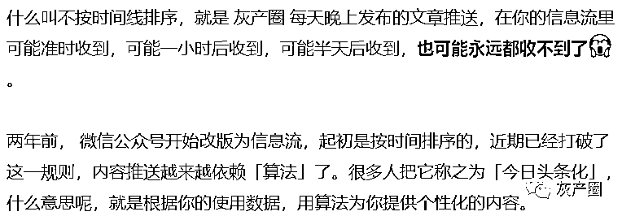
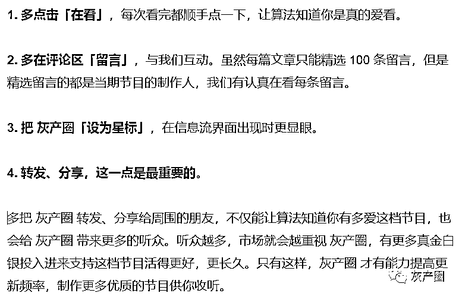

# 假如有一天，你看不到灰产圈了

> 原文：[`mp.weixin.qq.com/s?__biz=MzIyMDYwMTk0Mw==&mid=2247499884&idx=4&sn=648c9c2585af826c9297148a1a049264&chksm=97cb0b54a0bc8242f535f2330977c62346f3a1d7d964a9a64e89b17df8da4e30a7e77ddc641c&scene=27#wechat_redirect`](http://mp.weixin.qq.com/s?__biz=MzIyMDYwMTk0Mw==&mid=2247499884&idx=4&sn=648c9c2585af826c9297148a1a049264&chksm=97cb0b54a0bc8242f535f2330977c62346f3a1d7d964a9a64e89b17df8da4e30a7e77ddc641c&scene=27#wechat_redirect)

**点击上方蓝色字体免费订阅“灰产圈”**

最近，有一件事情让我们很关注——**微信推送的信息流不按时间线排序了**。这事对你有什么影响呢？主要体现在「算法」对你行为的识别上。如果你很喜欢 灰产圈，但极少**通过「在看」「留言」「转发」「设为星标」等行为，让算法知道你真的很喜欢**。结果就是，在「算法」主导的内容推荐里，灰产圈 的出现频率越来越低，有一天你可能再也看不到 灰产圈 的推送内容了。是的，我们肯定注意到了这点，也列出一些你可以尝试的行为，以降低它对你的影响。**你可以做下面这几件事，让 灰产圈 不从你的订阅号信息流里消失：**

***说了这么多，就是希望用你的使用行为去反馈算法，**让 灰产圈 出现在你****「****常读的订阅号****」****里面**，这样你就可以和之前一样，准时收到我们的更新，不再错过。好了，朋友们，赶快行动起来，快去「驯化和反馈」你的算法吧！** 灰产圈 **

← 向右滑动与灰产圈互动交流 →

**点击****阅读原文****加入灰产圈高端社群**

