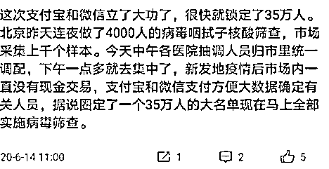
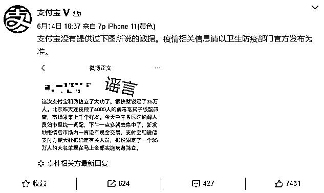
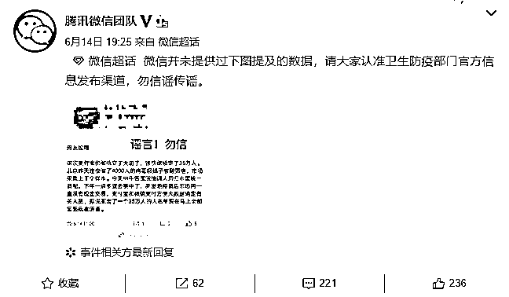
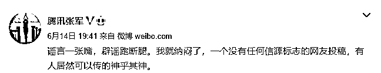

# 微信、支付宝同时辟谣：没干过这事！

> 原文：[`mp.weixin.qq.com/s?__biz=MzIyMDYwMTk0Mw==&mid=2247499899&idx=2&sn=d9c30c9dc9265cfa60f85c41055dcac3&chksm=97cb0b43a0bc825546da60f60477d68d3649902cdae7e03ce004f40979b2a128d7bad3e7e5fc&scene=27#wechat_redirect`](http://mp.weixin.qq.com/s?__biz=MzIyMDYwMTk0Mw==&mid=2247499899&idx=2&sn=d9c30c9dc9265cfa60f85c41055dcac3&chksm=97cb0b43a0bc825546da60f60477d68d3649902cdae7e03ce004f40979b2a128d7bad3e7e5fc&scene=27#wechat_redirect)

**点击上方蓝色字体免费订阅“灰产圈”**

近日，北京新发地新冠疫情复发，在短短两天公布了更多确诊感染病例，并且实行了不少管控手段。

周日上午在微博上看到：

这个说法在微博上有多个大 V 转发，并且评论区也有许多人表示信了。不过，在前天傍晚，这件事情突然反转，并且**惊现支付宝、微信梦幻联动。**支付宝和微信**相继辟谣**了这一传言。支付宝表示，没有提供过相关数据，疫情相关信息以卫生防疫部门官方发布为主。

微信同样表示，微信并未提供过下图提及的数据，请大家认准卫生防疫部门官方信息发布渠道，勿信谣传谣。

此外，腾讯公司公关总监张军转发微博怒斥，“**谣言一张嘴，辟谣跑断腿**。我就纳闷了，一个没有任何信源标志的网友投稿，有人居然可以传的神乎其神。”

虽然有些人看到辟谣后还不太相信，分析得头头是道。不过，小狐想说，这种事情我们还是以官方为准吧。**不造谣、不信谣、不传谣****，就是此时的我们对疫情防控工作的最大支持！**

← 向右滑动与灰产圈互动交流 →

**点击****阅读原文****加入灰产圈高端社群**

