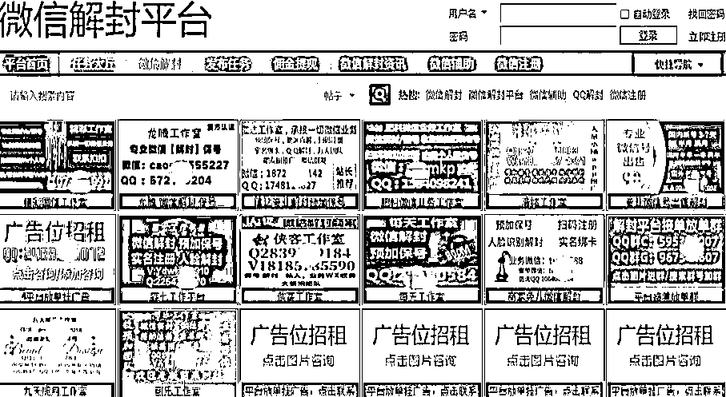
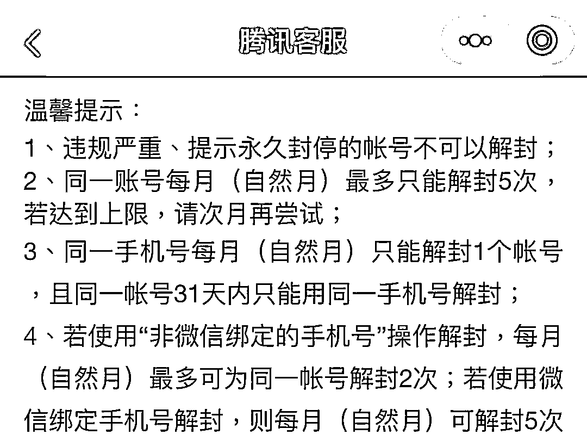
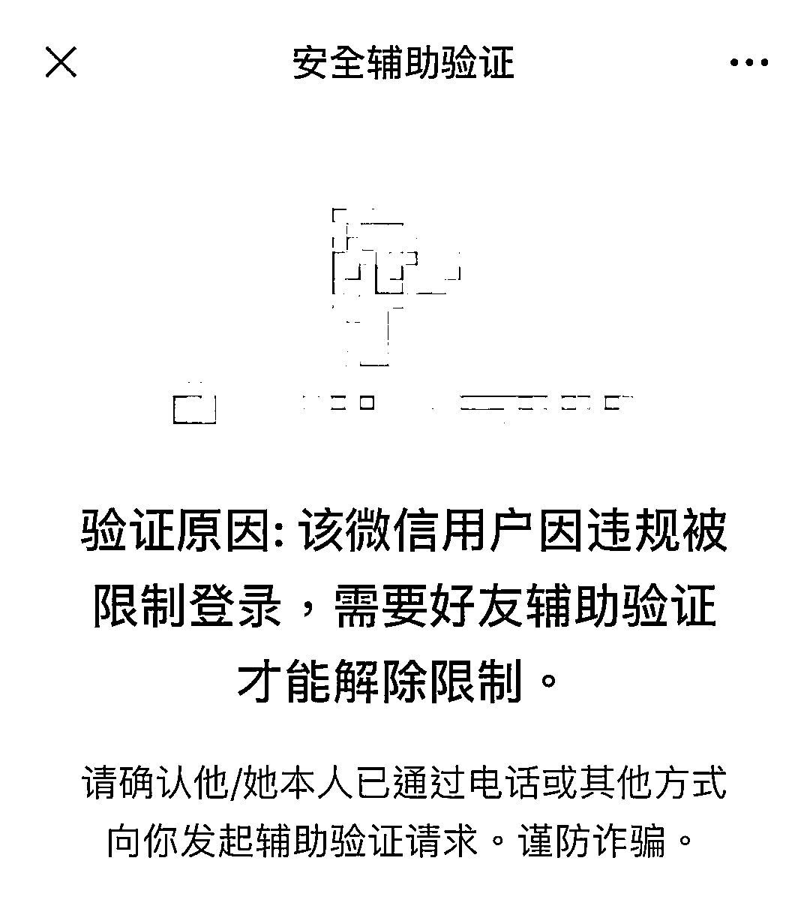
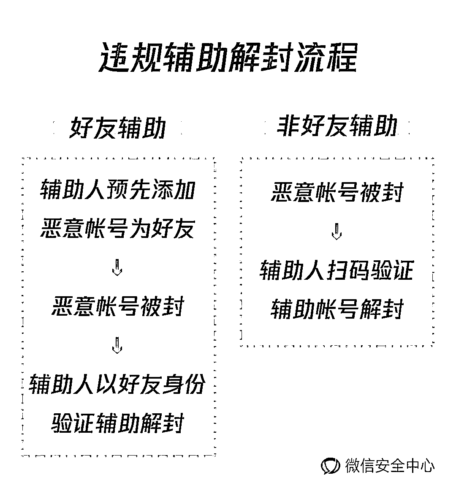
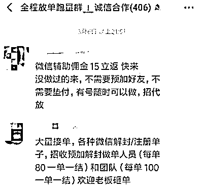
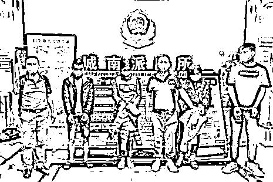
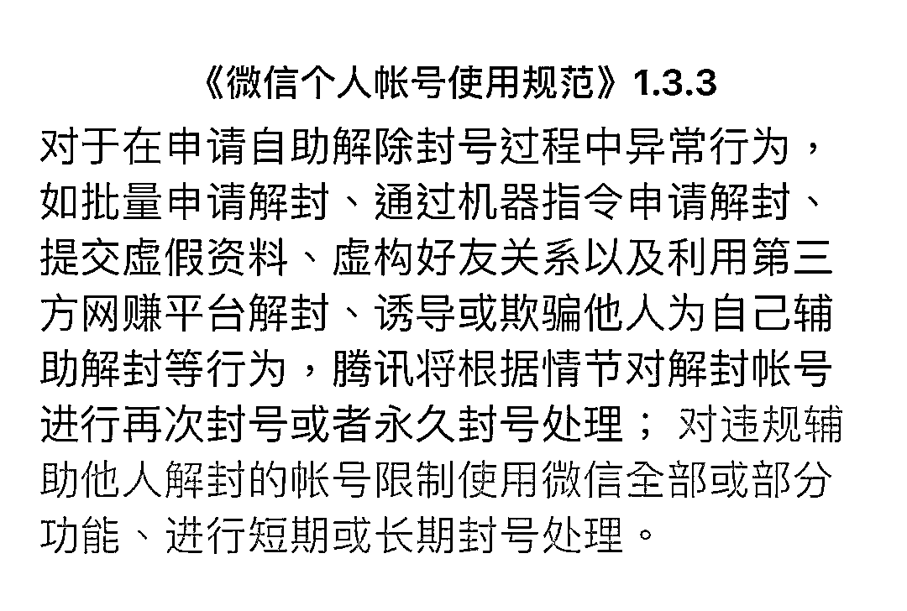

# 抓住了！辅助黑产解封帐号的坏人

> 原文：[`mp.weixin.qq.com/s?__biz=MzIyMDYwMTk0Mw==&mid=2247499934&idx=1&sn=b2dec81dcb1adaee3eac89e1769228ce&chksm=97cb0ba6a0bc82b0f266d5e9e89743d0110be16d98055bd51a2c650d01ef04ce8142feacc95e&scene=27#wechat_redirect`](http://mp.weixin.qq.com/s?__biz=MzIyMDYwMTk0Mw==&mid=2247499934&idx=1&sn=b2dec81dcb1adaee3eac89e1769228ce&chksm=97cb0ba6a0bc82b0f266d5e9e89743d0110be16d98055bd51a2c650d01ef04ce8142feacc95e&scene=27#wechat_redirect)

**点击上方蓝色字体免费订阅“灰产圈”**

网络诈骗在这两年发展迅猛，也催生出一系列灰色产业链，**“微信辅助解封”**就是其中一颗迅速升起的“新星”。

违规辅助解封平台

**辅助解封灰产衍生**

随着微信监管力度增强，大批违规帐号被封停，新号的购入成本又持续攀升，解封旧帐号因此成为黑产维持经营的重要需求。

根据规定，微信帐号因违规被短期限制登录的用户，可以在处罚期满后自助解封。但解封条件有严格限制，次数达到上限后需要好友辅助解封，且对辅助人本身也有严格要求。

微信个人帐号自助解封限制

自行解封受限，不法分子便转移目标，利诱符合辅助条件的普通用户，帮助他们解封，**辅助解封灰色产业**随之形成。

**"动动手指就能赚钱"**

为了吸引普通用户参与辅助，这类团伙将他们的不法勾当包装成网络兼职，以派单形式发布，并承诺一定报酬。

他们搭建沟通渠道，撮合有解封需求的黑产和解封人，通过**好友辅助**和**非好友辅助**两种手法开展辅助解封。

好友辅助验证

前者，解封团伙安排解封人提前添加黑产帐号为好友。等该帐号作恶被封后，通过好友辅助的形式解封，然后给解封人支付报酬。

后者，解封团伙让辅助人以非好友身份，扫码辅助帐号解封，同样给解封人支付报酬。

“动动手指就能赚到钱”，少数用户被诱惑参与其中，一些在校学生甚至长期兼职，却不知已经触犯法律，成为诈骗等违法犯罪的**“帮凶”**。

**线上线下 重拳出击**

针对这一乱象，今年 4 月，平台在《微信个人帐号使用规范》中明确规定：**对违规辅助他人解封的帐号限制使用微信全部或部分功能，并进行短期或长期封号处理。**

在持续加大线上打击力度的同时，微信依法配合杭州警方，围绕打击治理电信网络新型违法犯罪开展了**“百日攻坚战”**专项行动，取得了一定成效。

据调查，此类团伙成立专门工作室团队，**直接对接境外黄、赌、诈骗团伙，资金从境外经国内洗钱团伙流入，形成比较成熟的产业链闭环。**在国内分多层代理，呈树状结构扩散，每单利润较低，通过跑量来获得高昂的利润。

辅助解封派单群

5 月 20 日，杭州网警牵头上城、江干、西湖、建德、钱塘共 5 个分局 150 余名警力，分赴全国 5 省 7 市针对此类违法犯罪行为进行抓捕。在山西大同、河北邢台、山东枣庄、江苏宿迁、重庆等地统一收网，**共抓获犯罪嫌疑人 48 人，刑拘 21 人，取保 27 人，**扣押作案用电脑、手机若干。目前案件正在进一步侦办中。

涉案人员已被抓捕归案

警方提醒，《刑法修正案(九)》增设**帮助信息网络犯罪活动罪**，针对明知他人利用信息网络实施犯罪，为其犯罪提供技术支持、广告推广、支付结算等帮助的行为独立入罪。希望广大用户不要为了蝇头小利知法犯法，试探法律的底线。

此外，辅助陌生帐号解封本身存在欺诈风险，用户使用灰产搭建的辅助解封平台极有可能**泄露个人隐私或落入诈骗陷阱**，请广大用户注意避免。

**最后，微信团队重申：微信上线安全辅助功能是为了对违反国家或平台相关规定的用户进行警示教育，保护广大正常用户的合法权益。如发现任何个人或组织蓄意帮助黑产违规解封，微信必将拿起法律武器，维护平台绿色健康的生态环境。**

**同时，希望广大用户在帮助他人进行安全辅助验证时**仔细核实对方身份，****不要辅助陌生帐号解封，切勿因贪图小利沦为网络黑灰产的“帮凶”。****

****

**来源：微信安全中心**

****

**← 向右滑动与灰产圈互动交流 →**

********点击****阅读原文****加入灰产圈高端社群****

****