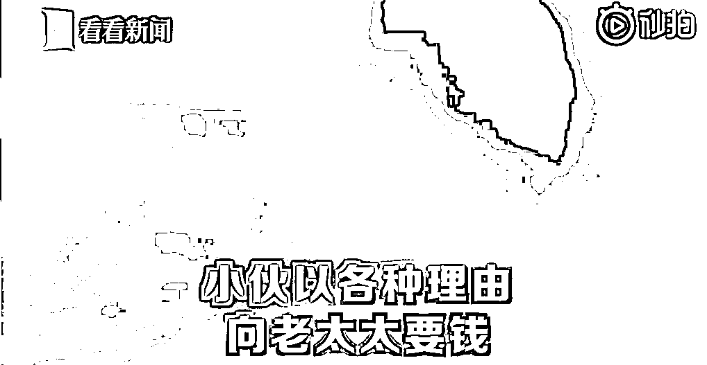
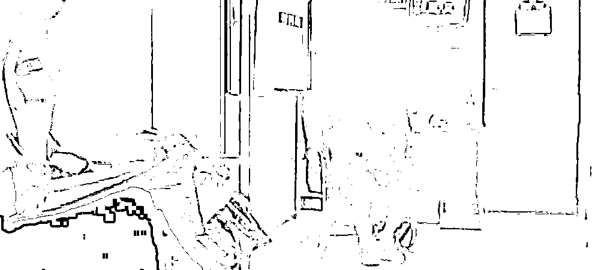

# 61 岁老太恋上 18 岁男孩拍摄私密照后被敲诈 40 万

> 原文：[`mp.weixin.qq.com/s?__biz=MzIyMDYwMTk0Mw==&mid=2247499934&idx=2&sn=606663c5d80e7a42349a2c0580106d0e&chksm=97cb0ba6a0bc82b0e7584eb26641bd72db06209fe5e6ffac4902d0906b440d01878cc664cbd2&scene=27#wechat_redirect`](http://mp.weixin.qq.com/s?__biz=MzIyMDYwMTk0Mw==&mid=2247499934&idx=2&sn=606663c5d80e7a42349a2c0580106d0e&chksm=97cb0ba6a0bc82b0e7584eb26641bd72db06209fe5e6ffac4902d0906b440d01878cc664cbd2&scene=27#wechat_redirect)

**点击上方蓝色字体免费订阅“灰产圈”**

最美不过夕阳红

随着社会的进步

“黄昏恋”也越来越被大众所接受

但 61 岁老太

恋上 18 岁男模

这种混杂着百万利益的恋情

你看好吗？

**被 18 岁“男友”用私密照敲诈**

****

近日，河南警方接到一位 61 岁老太太打来的报警电话，称在去年的时候，被一个十八九岁的年轻小伙用私密照片威胁了，这是怎么回事？

据老太太回忆，去年两人通过交友软件相识，相谈甚欢，没多久就确定了恋爱关系。

交往过程中，老太太知道小伙经济状况不是很好，便主动给小伙子一些钱补助小伙子的生活，甚至还给他租了一套房子。小伙子说啥老太太就听啥，甚至把自己的支付宝账号密码给了对方。

在之后一年里，小伙子便以各种理由向老太太要钱，一年内从老太太手里拿走了七、八张信用卡。

等收到银行账单，老太太一看这几十万的还款也急了，赶忙质问小伙，这小伙子竟然提出要将老太太的一些私密照发布在网上，以此为要挟继续向老太太要钱，被害人也没办法，只能继续给他转账，最终从老人手里骗取 40 多万元。

民警根据几张信用卡的消费记录锁定了嫌疑人，最终在一家宾馆内将其抓获。

目前，小伙已被警方采取刑事措施。

**网友评论**

****

有网友表示：无论是真爱还是各取所需，敲诈勒索就是犯罪。

还有网友调侃：世界总会刷新你的认知。

**警方提醒**

****

一位生活阅历丰富的花甲老人，竟被一个 18 岁小伙子利用感情诈骗钱财，可见打着爱情幌子的骗局是不分年龄的，所以网络交友需谨慎，谈恋爱可以，但是如果涉及到金钱问题，可就一定要提高警惕心，不要让一时热烈的情感蒙蔽了自己的理智，不要轻易上了犯罪分子的套。

相关法律规定

那么以私密照敲诈勒索，这种行为在法律上如何定义？

根据《中华人民共和国刑法》第 274 条，敲诈勒索公私财物，数额较大或者多次敲诈勒索的，处三年以下有期徒刑，拘役、管制或者单处罚金；数额巨大或有其他严重情节的，处三年以上十年以下有期徒刑，并处罚金；数额特别巨大或者有其他特别严重情节的，处十年以上有期徒刑，并处罚金。如果构成黑恶势力犯罪将依法受到更加严厉处罚。

**警方提醒：如果个人信息隐私遭受威胁并且受到敲诈勒索，应该第一时间拨打 110 报警求助。**

来源：深圳网警巡查执法、江苏网警

← 向右滑动与灰产圈互动交流 →

**点击****阅读原文****加入灰产圈高端社群**

