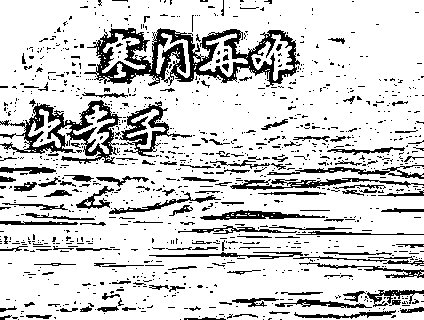

# 山东女孩被冒名顶替，牵扯出背后的利益链条，还有更多“灰产”浮出水面

> 原文：[`mp.weixin.qq.com/s?__biz=MzIyMDYwMTk0Mw==&mid=2247499978&idx=1&sn=82e2adf541f2bb93a65ab124ecca94e8&chksm=97cb0bf2a0bc82e43997b7b19f7ce28b49efe1eec1bf8f602a36fd401a7d4e29bd6e8037c697&scene=27#wechat_redirect`](http://mp.weixin.qq.com/s?__biz=MzIyMDYwMTk0Mw==&mid=2247499978&idx=1&sn=82e2adf541f2bb93a65ab124ecca94e8&chksm=97cb0bf2a0bc82e43997b7b19f7ce28b49efe1eec1bf8f602a36fd401a7d4e29bd6e8037c697&scene=27#wechat_redirect)

**点击上方蓝色字体免费订阅“灰产圈”**

  

当年一位中学老师发表了一篇文章《寒门难再出贵子》后，引发社会和网络的广泛讨论。

他说的是富贵家庭拥有更好的学习资源和更加多元化的学习途径，使得寒门出身的学子在先天的外在条件上就差了一大截，从而导致如今学习好的学生越来越偏向于富裕阶层。

虽然这篇文章有待争议，属于一家之言，但也不无道理。

如果说上面的仅仅是寒门难出贵子，那么下面就是即使你是贵子也不属于你，因为你被替身了。

最近一则 16 年前被冒名顶替上大学的新闻闹得沸沸扬扬，故事主人公叫陈春秀。

她出身在贫困的农村家庭，她还有一个哥哥，因为小时候陈春秀的学习成绩比哥哥好，所以父亲就决定只供她读书，初中辍学的哥哥就外出打工了。

时间来到 2004 年陈春秀高考，高考结束后一直没有等来录取通知书的她以为落榜了，为了考虑家庭，她选择不再复读，而是出去打工供给家用。

外出打工期间做过服务员、收银员、工厂工人等等。

结婚后回到了老家，在当地做起来一名幼儿园老师，工资最开始也只有 1 千多。

因为她一直保持学习的习惯，又在丈夫的支持下报考成人高考，没想到这下暴露了隐藏 16 年的秘密。

她考试后成功考入曲阜师范大学，在今年办理学籍的时候才发现学籍系统有她当年的录取信息。

而她发现学籍信息里那名和自己同名的人除了照片不同外其余信息完全一样，而且在 2004 年被山东理工大学录取。

随后陈春秀向山东理工大学举报和向警方报案处理，在调查后得知的确是被冒名顶替，而那名顶替者（原名陈艳平）高考分数比陈春秀低了整整 243 分，连专科分数线都达不到，也就是说顶替者根本就无法成功考入大学。

然而，现实充满着魔力，让有能力者无法有所作为，庸者却时运亨达。

冒名者在毕业后成功进入事业单位，成为一名公务员，享受着国家的福利。

但是，当被问及为何要冒用陈春秀身份的时候，被陈艳平委派过来的中间人向她说明，当初是陈艳平的父亲通过中介花了 2000 元为女儿“买了个学籍”入学。

就是这个简单理由让陈春秀一家无法接受，因为疑问太多，仅仅 2 千元就能打通从学籍到入学中间一系列的审查过程。

虽然中间人没有透露更多的消息，但是已经在向我们放出一个信号——高考考生信息买卖的黑幕。

之前很多的新闻报道过高考考生信息被泄露的问题，从人民网、新华网的国家级媒体，到各地的地方媒体，都逐一报道过。

从这些的报道可以看到，一般获取高考考生信息的渠道主要分为两种。

第一种是黑客直接利用教育网站的漏洞和植入病毒等方式盗取数据库中大量的考生信息。

还记得 2016 年山东女孩徐玉玉事件吗？

一位才高考完被南京邮电大学英语专业录取的年轻女孩，因为被诈骗分子知道个人的高考信息后，通过利用准确的信息获取信任，又以学校会发放助学金为由，向其骗取了 9900 元的所有学费，因为徐玉玉在报案后太过于自责和伤心，在回家的路上突发心脏骤停，抢救无效死亡。

而这起事件的原因之一就是作为黑客的杜天禹利用自身技术，通过植入木马等方式，非法侵入山东省 2016 年普通高等学校招生考试信息平台网站，窃取 2016 年山东省高考考生个人信息 64 万余条，并对外出售牟利，其中就有徐玉玉的信息。

第二种就是内外勾结。

也就是从教育机构、学校、招生、教育主管部门之间存在的利益链条。

这个利益链条如今已形成了稳定的结构，一般一手的考生信息是通过中间人向教育主管部门、招生办或者学校获取，教育主管部门和招生办都是属于官方机构，里面的就是"内鬼“窃取学生信息向外售卖，而学校方面更是公开的秘密，也就是班主任或整个学校的勾结下向外提供信息来获得好处。

那么这些信息的价格如何呢？

如果按照一名学生一条的信息来算不贵，能卖到最贵的也才 5 毛钱。

但是贩卖集团基本都是打包向外出售，例如之前报道的一起案件中，16 万条山东省考生的信息，打包出售的价格为 3000 元。

其中这些考生信息可以更加多元的利用，而往往会被一些诈骗团伙利用。

第一个就是“准考证”骗局。

高考前有些学生的准考证是一定会有遗失的可能性，有些诈骗团伙就在网上还有线下（例如：电线杆）到处散发”xxx 遗失准考证，这孩子一定急死了，捡到赶快联系 159xxxxxxx"。而一旦捡到准考证的好心人看到这条信息打了过去，就会落入早已设计好的吸费陷阱，也就是天价电话费。

第二个就是“助学金”。这个在上面的徐玉玉案件中已经说明，代价也是非常大，对于贫困学子来说几千块的学费是一家人省吃俭用来的，而骗取穷人的钱更是法律和道德不能容忍的。

第三个就是查分网站或软件。这是提供一种可以提前查分功能，让考生或家长预付费用得知分数，其实分数是否为真不是重点，重点是往往这些网站和软件存在病毒，一旦感染自己的电脑和手机，就会盗取账号密码、银行卡号等等隐私信息。

第四种就是考题泄题。这个一定有人遇到过，每逢高考前夕就有不法分子打着绝密真题的幌子，来骗取那些存在侥幸心理，想要获得高分的考生和家长，但是考生和家长不清楚的是，高考试题属于国家绝密材料，保管和运送有严密的措施，所有接触试卷的人都要实行封闭式的管理，想要提前知道考题那是绝对不可能，而骗子正是利用人们的无知以及投机心理。

第五种就是低分高录。何为低分高录呢？就是当你的考分很低，无法考取好大学的时候，骗子就过来向你宣传可以通过缴纳一定的费用买到“内部名额”，进而实施诈骗。其实这还是利用人们不知道高考的录取的流程，就是在考分出来后，高校的录取工作全部是网上自动筛选完成，分数够的学生档案就自动传给学校，“低分高录”听起来就是可笑的。

其实这还是通过获取高考考生信息实施诈骗的冰山一角，识别这些信息真假的方法也很简单，直接咨询学校和教育主管单位这些官方渠道，而不是一味的相信这些街边所言。

高考是很多寒门学子实现梦想的重要的一步，也是知识改变命运很重要的一步，如果不能实现教育的公平是现在中国顽疾的话，那么连高考这个在一定范围内能体现绝对公平的地方也出现了不公平的现象，实在是令广大底层学子和家庭寒心。

期望陈春秀这起被冒名顶替上大学的事件有更加深入的调查，而不仅仅是对冒名者的简单处罚，更重要的是挖出里面的”靠山“和”大伞“，里面的利益链条，然后再对症下药，完善现有的信息保密措施。

[`v.qq.com/iframe/preview.html?vid=o3100rdos97&auto=0`](https://v.qq.com/iframe/preview.html?vid=o3100rdos97&auto=0)

**4 起“冒名顶替上学”事件梳理：客观漏洞与人为因素都是什么？**

← 向右滑动与灰产圈互动交流 →

**点击****阅读原文****加入灰产圈高端社群**

