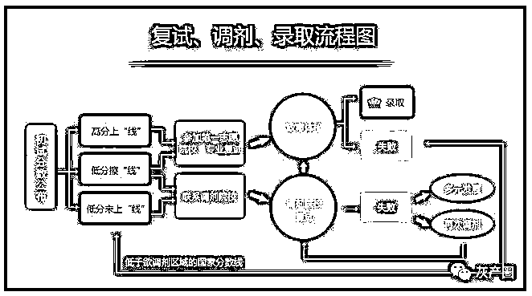
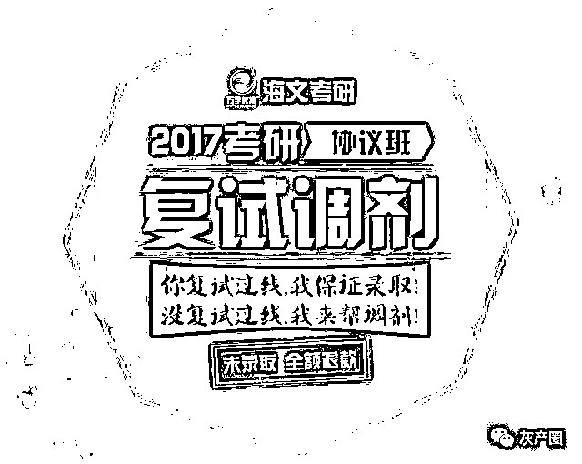
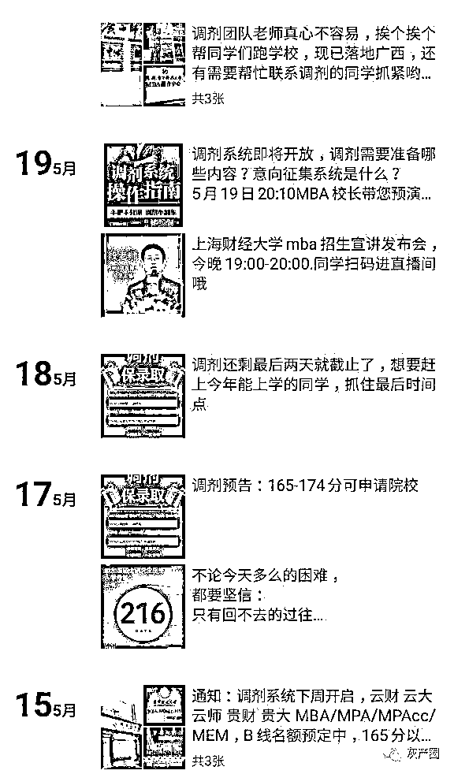
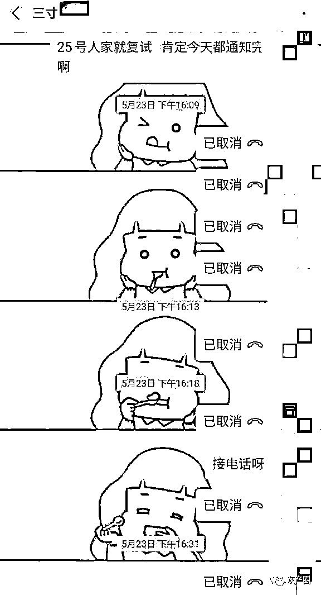
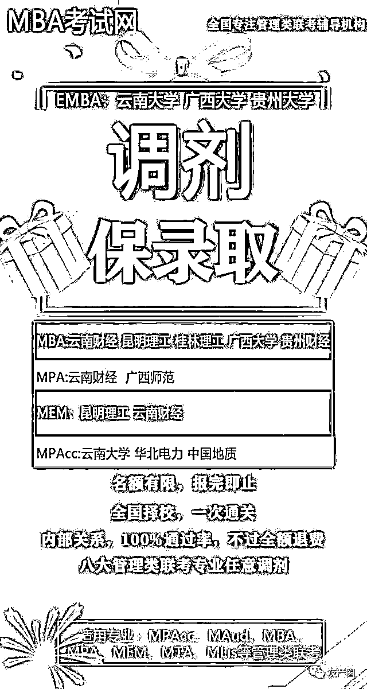

# 起底考研调剂黑产：我们老师就在院长旁边，快打钱运作

> 原文：[`mp.weixin.qq.com/s?__biz=MzIyMDYwMTk0Mw==&mid=2247499978&idx=2&sn=c7a37e6c651c2426f3745940f0d15d4b&chksm=97cb0bf2a0bc82e4ab00b98a81ac6dbf2d5cf7f7a0830e681110c18d82be27d4bb1dca1a94aa&scene=27#wechat_redirect`](http://mp.weixin.qq.com/s?__biz=MzIyMDYwMTk0Mw==&mid=2247499978&idx=2&sn=c7a37e6c651c2426f3745940f0d15d4b&chksm=97cb0bf2a0bc82e4ab00b98a81ac6dbf2d5cf7f7a0830e681110c18d82be27d4bb1dca1a94aa&scene=27#wechat_redirect)

**点击上方蓝色字体免费订阅“灰产圈”**

1

“调剂保录取，内部关系，100%通过率”。正是看到这样的广告语，参加研究生考试的同学才会动心，才会选择交纳一万多的费用“保安心”。可结果往往是造成“人财两空”。

近日，研究生考试录取结束，有多位考生反映，他们曾报名通过中介公司调剂录取，结果并未达成预期，而公司在此前曾承诺“包退费”，但真到了退费时又一拖再拖。这些考生在感到自己上当的同时，也希望以后不要有同学再被骗。

2

**花一万多找中介 “什么忙都没帮上”**

于静（化名）是 2019 年研究生考试的考生，她从打算参加考试开始就接触了不少的中介公司，其中一个名为“MBA 考试网”的公司一直跟她联系了半年多，态度非常诚恳和热情，于静觉得能坚持这么久跟踪客户，应该不是一个骗子公司，于是便跟这个公司签订了协议，帮她处理考试的各种事宜和考试结束后的调剂工作。

某一调剂中介朋友圈

于静说，她给中介公司交了 15000 元后，她开始觉得这家公司并不靠谱。该公司给她开了一个 MBA 考试网的账户，然后让她下载了一个 APP 注册，接着又拉了一个名为“学习小组”的微信群，连续两天发了一些考试复习题，到第三天就不再发了。于静问起来，对方说，“放心，不会不管你的，以后还有”。

但是一直到考试，对方也没发过几次复习题。临近考试最后一天，于静几次联系对方才联系上，对方给她发了几个题和答案，于静打开题发现里面的内容一点条理都没有，根本没办法用作复习参考。“他们之前说可以给内部题，说可以缩小范围，但其实什么都没有。我找中介是为了让自己少点麻烦，结果反而给自己带来了麻烦。”

考试结束后，于静的成绩还不错，过了专业分数线，但又怕自己上不了，为了“图心安”，便让这家中介公司帮忙调剂。可真的到了调剂那天，她再怎么联系中介的人都联系不上，偶尔能联系上，对方也一直说忙，就让她“再等等”。

直到于静已经收到了学校的录取通知，于静联系对方，对方仍旧让她“再等等”。“你别躲我了，我都已经被录取了，你们拿了钱什么也没做。”于静说，这时对方表现出了很惊讶的语气，根本不知道于静已经被录取的事。

虽然被录取了，但是于静觉得自己还是上当了，这家中介公司考试的时候没有提供什么帮助，调剂的时候也没有做什么工作，于静觉得一万五千块钱白交了，她便打算跟对方讨要费用，但对方又是爱答不理的态度，迟迟没有回复她。

无奈之下，于静报警并向有关部门进行了举报，但截止记者发稿前对方仍旧没有退款。

3

**打钱就录取****” ，****信以为真却落榜**

于静觉得在自己录取的过程中中介公司根本什么都没有做，她觉得自己上当了。而另一位同学赵珺（化名）则是给中介交了两次的钱，但却仍旧没有录取上，最终的结果是“人财两空”，她想要退款也遭到对方的拖延。

赵珺报名了 2019 年 12 月末的研究生考试，考试之前就有中介加她的微信，向她进行了研究生考试的宣传，包括考前压卷、考试保过卷等等，赵珺一直没有相信这些，她还是想通过自己的能力来完成考试。

考试结束后，赵珺的成绩不算高，只是压在了分数线上，第一志愿没有被录取，她本身就是在职人员，利用业余时间复习，各方面压力都很大，觉得辛苦了一年，若是能够调剂一个学校上课也就行了。

这时候她在朋友圈里看到了“MBA 考试网”的中介发布的宣传海报，上面写着“调剂保录取”，“名额有限，报完为止，全国择校，一次通关，内部关系，100%通过，不过全额退费”的广告语，让赵珺动了心。

赵珺跟中介的人员了解了一下，对方说以赵珺这个压线的分数，必须得找中介，否则肯定录取不了，赵珺被说动了，交给了机构 14400 元。

在等待调剂的过程中，赵珺也曾怀疑过是不是上当了，交钱后没几天，她就想找中介退款，但中介公司这边爱答不理，提起这个事情来就说“在忙，等一等”。这一拖就拖到了调剂开始的日子。

到了 5 月 22 日，中介公司还没有动静，赵珺又催着让中介公司退款，“你要是不退钱你就给我调上也行啊”。

赵珺这句话刚说完，中介公司就发来信息告诉她：我们的老师就在你报考的学校院长旁边，正在运作这个事情，你赶快再打过来两万块钱，我们好跟院长办事。

这句话让赵珺颇为心动，她说，自己还没来得及细琢磨，对方又告诉她，你可快一点，马上就要下班了，过了这个机会，你就得重读一年了。

想到这一年考研的压力，赵珺觉得希望就在眼前了，她脑子一热，又转给了中介公司两万块钱。但是，直到调剂系统关闭，她也没有收到录取通知。最终，赵珺这次考研还是落榜了。

赵珺打电话给她报名调剂的学校，学校老师告诉她，根本就不存在中介所说的“我们有人在院长旁边”这样的事情。

赵珺再想找这家中介要求退钱，对方又是爱答不理。先前交的 14400 元尽管签署了协议，但中介一直不主动提及此事。而后来的两万块钱，连协议都没有，中介跟她说只能退一半。

截止记者发稿时，赵珺仍然没有拿到全部退款。

随后，赵珺也报了警，警方表示要在 30 个工作日后确定是否立案。

没考上还损失了钱，赵珺心情郁闷却也不敢跟亲朋好友说，她怕亲朋好友笑话。可是这些钱是自己这几年上班攒下来的辛苦钱，也不能白白就扔了。

“我承认我自己有责任，但是当时那个情况，他们抓住了我的心理，让人不由自主的就相信他们。”赵珺说。

目前，赵珺还在跟中介机构协商能否退款。

4

**招生院校发声明：不实宣传**

于静和赵珺两名考生介绍，在考研调剂的微信群里，有不止一个考生抱怨自己交了钱却没有被录取上，有的考生还能够拿到退款，有的连退款都拿不到。

“后来我们相互交流了一下，问了问业内人士，他们都说，这些中介其实就是在利用调剂的概率赚钱，因为调剂虽然有可能失败，但是也有可能成功。十个考生里如果能够成功两三个，中介就赚到钱了，反正中介什么也没做，工作也没有什么成本。”赵珺说，只不过，有的中介会给调剂失败的退钱，留下个相对的好名声，有的退费很困难，让考生人财两空。“希望通过我们的教训给大家提个醒，不要在上当受骗了。”

记者注意到，赵珺报名的某大学招生办公室于日前发布声明称，“近期，我校发现有个别招生机构和个人冒用我校名义，进行 2020 年硕士研究生招生宣传，甚至向考生及家长收取费用并做虚假承诺，已经严重干扰了我校正常的硕士研究生招生工作。为避免部分不明真相的考生和家长上当受骗，确保我校硕士研究生招生工作正常进行，特此严正声明。”

在声明中，该校称：我校 2020 年硕士研究生招生工作从未授权任何公司或单位，凡以我校名义承诺录取考生的行为，均为不实宣传。同时，该校声明中最后一条还称，对于社会上假借我校名义开展任何形式非法招生活动的单位和个人，我校将保留追究其法律责任的权利。

5

**网站：“考研调剂保录取”， “学校有渠道”**

北京青年报记者随后在网上找到了这家“MBA 考试网”，网站首页滚动播出的就是“管理类联考考研调剂保录取”的宣传，在“复试调剂”的选项中，还写道：院校人脉精准推荐。

记者通过网站的在线咨询，添加了一位业务员的微信，对方在了解了记者的考研需求后表示，“我可以帮你调剂，保证调剂上”。

记者询问如何能够保证调剂录取？对方称，“当然是学校这边有渠道了。”

随后，对方表示要和记者电话中细说。该名业务员电话中告诉记者，他们和一些非 211 院校都有良好的关系，只要考试分数达到国家专业线以上，保证都能调剂上，如果调剂不上的话，可以按照协议全额退款。

此外，对方还向北青报记者推荐了研究生考试复习的课程，交费后他们会发一些考试提纲，并安排一名在读的研究生，给记者做一对一的考研辅导。“为什么不安排老师呢，因为老师要避嫌，同一专业的在读研究生，其实也是一样的。”

宣传广告

最后，这名业务员还说：“你要是今年想考试就要赶快交费，必须要赶紧开始复习了，不然我们帮你辅导，你也来不及考试，最迟不要超过这星期就赶紧把钱付了。

6

**MBA 考试网：“保录取”是个人行为，不代表公司**

6 月 14 日，“MBA 考试网”一名男性工作人员告诉北青报记者，上述学员所指不实。其表示，公司和学院签署合同收钱后，没有达成目标，一直在积极退款，只是走流程需要一定的时间。目前公司已经将 14400 元费用退还给该学员。至于后来交的 2 万元，当时学员同意即便不成功也只能退一半，现在是学员返回要求全额退款，所以才一直在跟学员协商。

该人士还称，公司确实与报考学校有“内部渠道”，他们可以拿出当时给学校老师打电话、发信息的记录和截图证明，因此校方发布的声明并不能作为质疑公司业务能力的证据。“他们声明中虽然是这么说，但并不代表没有做。”

该人士还认为，公司业务员在微信、朋友圈等网络渠道发布的广告宣传海报，并非是公司官方发布，而是广告公司为了谋求利益发布的，与 MBA 考试网无关。而公司业务员在介绍业务时承诺的“保调剂”、“保录取”的言辞，只代表其个人意识，并不代表公司。“而且我们这个行业人员流动性很大，不排除有人打着我们的旗号去给客户承诺。”

对于以上关于“给学校老师打电话发信息”、“学员认可 2 万元只需退费 1 万元”的说法，北青报记者希望 MBA 考试网能够将有关证据传给记者予以证实，但截止发稿时，记者邮箱并未收到对方的有关证据。

7

**“每年都有考生反应上当受骗。”教育考试院的工作人员说。**

需要特别提醒大家，根据国务院办公厅关于规范校外培训机构发展的意见，校外培训机构必须经审批取得办学许可证后，登记取得营业执照，才能开展培训。培训机构不符合办学资质的可以向教育主管部门反映。

在培训过程中未按合同约定提供服务或退费的，还可以向消费者协会或市场监督局投诉。

记者 | 张子渊 编辑 | 蒋敏玉 统筹 |白 龙

← 向右滑动与灰产圈互动交流 →

**点击****阅读原文****加入灰产圈高端社群**

