# 暗链整治开始，解读黑色流量背后的地下王国

> 原文：[`mp.weixin.qq.com/s?__biz=MzIyMDYwMTk0Mw==&mid=2247499978&idx=3&sn=6ce717985611949307222eb63213adf6&chksm=97cb0bf2a0bc82e44797a60949d7e808112ba16863de309056dd4f692b7407352d54025dbdf0&scene=27#wechat_redirect`](http://mp.weixin.qq.com/s?__biz=MzIyMDYwMTk0Mw==&mid=2247499978&idx=3&sn=6ce717985611949307222eb63213adf6&chksm=97cb0bf2a0bc82e44797a60949d7e808112ba16863de309056dd4f692b7407352d54025dbdf0&scene=27#wechat_redirect)

**点击上方蓝色字体免费订阅“灰产圈”**

本文作者

**腾讯安全战略高级研究员**

**吴延鸿、张文涛**

近期，浙江绍兴网安部门结合本地实际，开展了**涉赌博类“暗链”整治清理行动**，督促 53 家被挂“暗链”信息，企业网站落实整改，依法处罚 21 家未履行法定义务的企业。

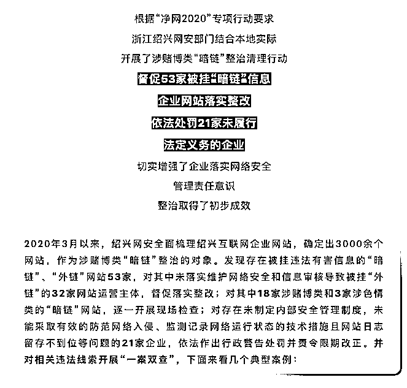

**来看其中一个典型案例：**

“

2020 年 1 月，浙江绍兴越城区某信息有限公司的网站被非法链接至赌博网站。经查，该公司未采取任何防范计算机病毒和网络攻击、网络侵入等危害网络安全行为的技术措施。公安机关依据《网络安全法》第二十一条、第五十九条第一款之规定，对该公司处以行政警告处罚并责令限期整改。

”

**网站被挂非法链接，本应属于受害一方，为什么公安机关也要对其进行处罚呢？**且听鹅师傅给你详细解答。

互联网时代信奉流量为王，即使是正当互联网公司开展的业务，也在积极追求自身产品的流量，为企业带来实际的经济利益。**网络黑****产同样需要流量，其通过**引导或制造流量等不正当手段获取恶意流量，**触达更多目标群体**，然后再将流量通过诈骗、赌博、传播淫秽物品等黑产手段变现，获取不法利益，我们称这种手法为“恶意营销”。****

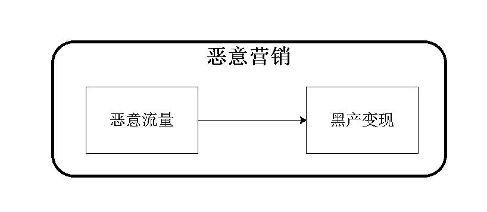

比如，疫情期间“华商难”、“ XX 国家渴望回归中国”、“XX 地区女性渴望嫁到中国”等一系列批量复制的自媒体文章在网络上病毒式传播，其本质是黑产团伙利用疫情热点进行炒作，通过包装、混淆真实和虚假信息，采用断章取义、偷换概念、打时间差信息差等方式，编造虚构他国华商的处境，引发民众恐慌和国际关注，变相增加账号的关注度，然后再设法将流量变现的恶意营销行为。

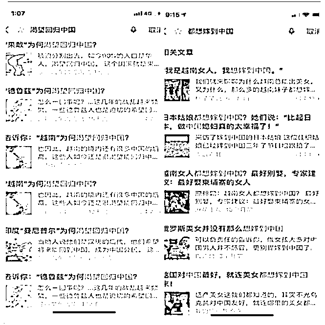

图片来自网络

鹅师傅今天想给大家讲的是恶意营销中的恶意流量环节，至于如何变现，黑产团伙的脑洞真的太大，只有你想不到，没有他们做不到，实在是无法一一列举。

上面疫情的例子中，黑产团伙是**利用虚假内容引起读者猎奇心理，从而吸引流量，除虚假内容外，常见的还有利用误导、煽动、低俗、淫秽等不同内容的方式。**这种套路鹅师傅称之为恶意流量的**内容流派**，以内容引导流量，以假乱真，摄人心魂，可谓是恶意流量中的九阴真经之移魂大法。

恶意流量还有另一流派——**技术流派**，以技术引导或制造流量，其招法千变万化，形如鬼魅，当属恶意营销中的葵花宝典之辟邪剑法一脉，与其内容流派是各有所长，同样是危害极大，不可小觑。

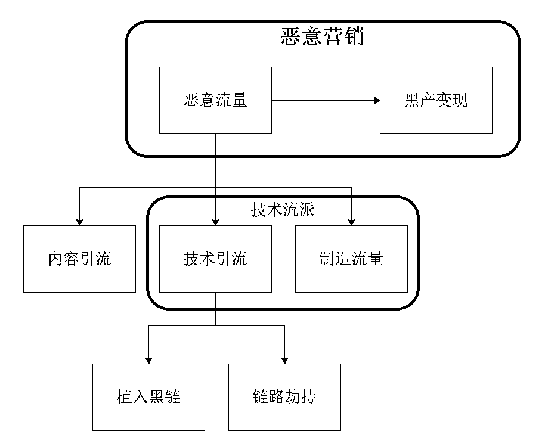

1

**植入黑链**

**黑链，是指利用非法手段，获取高权重网站的管理权限，篡改目标网站的重要页面，添加的非法链接代码。**

黑链按访客是否可见，**分为明链和暗链两种**，这里的分类特指黑链，不考虑正常链接。

明链，是指在页面上**能清楚显示出来的非法植入的链接**，通常是伪装后藏身于网站底部的友情链接等不易被发现的区域。

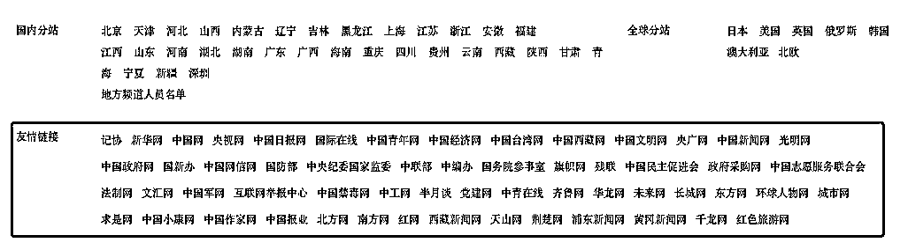

明链示意图，图片来自网络

而暗链是指**不在页面上显示的非法链接**，访客不可见，但对于百度等搜索引擎却是可见的，搜索引擎能通过分析网页的源代码收录这些链接。

暗链常见的隐身方式有以下几种：

**1、把链接放在页面可见范围之外**

一般来讲，网页是以左上角为原点、横竖坐标均为正数的坐标系，通过把链接的坐标均设置为负数，就可以把链接放置在页面可见范围之外。

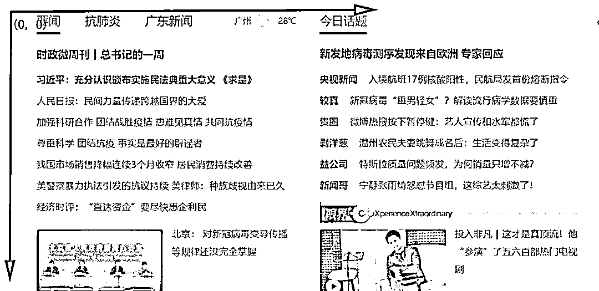

**2、把链接颜色设置为与背景色相同**

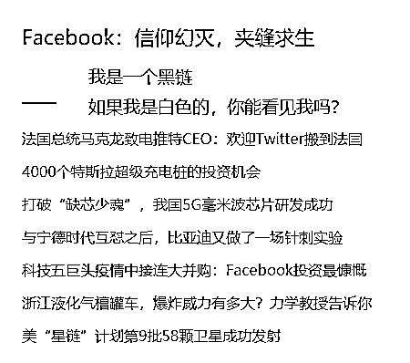

**3、链接以跑马灯形式迅速闪现**

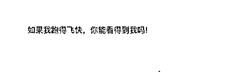

**4、利用重定向机制实现快速跳转**

在进入要访问的正常页面之前，先极快速地跳转到黑链所指的页面，再跳回至正常的页面，中间时间极短，用户无法觉察。

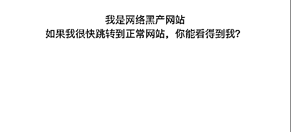

黑链是如何实现恶意流量的？

**1、搜索引擎优化，提升排名**

前面已经提过，虽然黑链在网页页面上不可见或者不易被发现，但是搜索引擎仍然可以通过分析网页的源代码收录这些链接。

如果有大量网站甚至一些高权重的网站都链向它们，搜索引擎会认为该网站内容质量较高，被网友广为传播，于是在搜索引擎的搜索结果中，**该网站就可以获取靠前的排名，迅速提高权重，从而获得高额流量，这是黑链引导恶意流量的主要方式。**

**2、点击黑链直接跳转**

**对明链进行伪装直接吸引访客点击，或者访客误操作点击暗链，**这种方式虽也可实现引流，但引导的流量较少，且容易暴露，不是黑链引流的主要方式。

不知道你是否有过这种经历，本来好端端地打开网站浏览信息，不知道手抽碰到哪里，屏幕中突然出现不可描述的广告，还在众目睽睽之下发出奇怪的声音，你很可能就是点到页面上的黑链了。

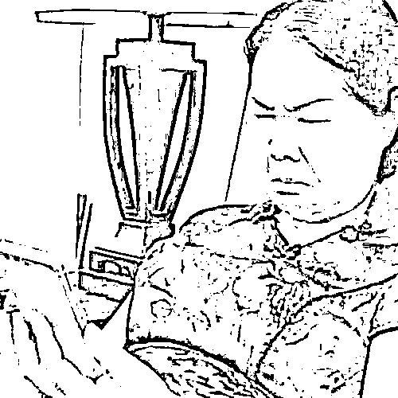

2

**链路劫持**

链路劫持，是**通过在用户至服务器之间，植入恶意设备或者控制网络设备的手段，侦听和篡改用户和服务器之间传输的数据。**

链路劫持有很大的危害，一是用户的隐私数据，如账号、密码等可能会被窃取，二是用户访问的页面会被篡改甚至替换。

比如，鹅师傅曾经习惯在正儿八经的门户网站上看新闻，然而新闻页面上却会经常出现一些不可描述、谎言连连的广告。

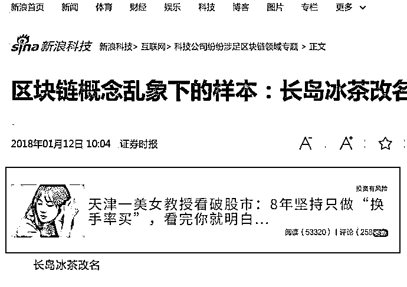

有时是美女股神荐股，有时是推荐号称能够“增大增粗延时”的某产品，鹅师傅一度怀疑自己上的是假网站，然而仔细看浏览器里的域名，没有问题呀！这是被劫持后，普通用户最常遇到的情况，黑产团伙篡改别人家的正经网站在里面插入了恶意链接，为自己家的网站做广告推广，吸引流量，此为链路劫持实现恶意流量的方式之一。

更有甚的，黑产团伙直接把用户要访问的整个页面替换掉，假如你要访问 A 站点，结果他让你访问他的赌博网站；你要访问 B 站点，他还是让你访问他的赌博网站，直接绑架用户流量，此为链路劫持实现恶意流量的方式之二。

此外，链路劫持通过篡改或替换页面也能实现像黑链一样的搜索引擎优化、提升网站排名的效果，从而获取高额流量，此为链路劫持实现恶意流量的方式之三。

3

**恶意制造流量**

恶意制造流量与上述两种方式则有所不同，它不引导或劫持正常用户的流量，而是**自己制造虚假流量，人为刷取流量指标**，如文章的阅读量，点赞数，投票，评论，网店交易量，视频播放量等，从而进一步吸引更多真实流量，实现恶意流量的目的。

在早期，恶意制造流量的原始手段是**“协议刷”**，即**直接采用代理 IP+用户登录态来模拟协议，简单、直接、技术含量低。**

随着互联网企业防御策略的升级，“协议刷”逐渐被黑产淘汰。随后各个社区平台上开始涌现大量的人工接单派单群，制造出含金量极高的**“人肉流量”**。

再后来，为了跟上业务量的爆发式增长，“群控”和“挂机”相继被引进产业协作中，效率和质量得到进一步提升，产业链条愈趋完善。近期演化出**“人工众包类刷量”**——**由平台自动派单，以网络兼职名义招揽普通网络用户执行刷量任务领取报酬的“机器+人工”的组合模式。**

4

**恶意营销的危害**

说了这么多，鹅师傅猜大家也都清楚，这种以恶意流量驱动恶意营销的做法是极其恶劣的，给整个互联网行业带来极大的危害。

**1、容易形成劣币驱逐良币的恶劣市场经济环境**

当“刷量”成部分企业的思维惯性和常态做法，会导致商业竞争从提升内容品质的主航道偏离，演变为不择手段、没有底线的丛林法则，从比拼质量、服务、创意、价格、内容滑向比拼道德底线、黑产投入。

**2、破坏了商业诚信体系，大幅推高社会交易成本，严重扰乱市场经济秩序**

流量是电商平台，甚至互联网经济的基石，如果由流量形成的信用体系变得不可靠，就会导致交易成本上升，阻碍行业进一步发展，甚至导致互联网信用体系崩溃。

**3、为赌博、色情及诈骗等违法犯罪活动输送大量流量**

恶意营销带来的大量流量，其中很大一部分最后都是通过赌博、色情或者实施诈骗的方式变现，恶意营销使得这些违法犯罪活动门槛更低、成本更小、危害范围更广、犯罪效率和效益更高。

**除上述的情况外，技术流派的恶意营销还有其独特的****危害：**

**1、隐蔽性更高、欺骗性更强**

内容流派是用特定的内容来引导流量，随着网络安全教育进一步宣传普及，网民安全意识也在逐渐提升，因此很多人对于各种“脑洞大开”的内容也开始有了辨别和免疫能力，不再那么容易成为被操控的流量直至最后被变现榨干。

而技术流派则是用一般用户无法察觉的技术手段来恶意引导、劫持或制造流量，提高恶意网站排名，用排名来引导流量，出于对排名的信赖以及从众心理，更容易让人上当受骗。

**2、受害方更多元**

内容流派的直接受害方一般是被引流变现的普通网民，而技术流派除普通网民外，被恶意植入黑链、流量劫持的网站平台一方也深受其害。

这些平台多为政府、教育、大型门户等权重较高的网站，黑链的存在、流量被劫持，常常导致其网站被降权、信誉权威受损害，甚至有被处理、关停的风险。

同时为了实施技术引流，黑产团伙往往需要取得相应网站的管理权限，导致这些网站长年遭受各种网络攻击，稍有不慎就会被黑产团伙趁虚而入，安全风险极大。

5

**法律责任**

恶意营销行为不仅严重骚扰网络用户，使其权益遭受损害，而且危害整个互联网行业生态，因而法律对其的打击势在必行。除严厉打击其黑产变现的各种违法犯罪手法外，对恶意流量环节也必须加强整治和惩处。

对于内容引导型的恶意流量，早在 2013 年两高公布的**《关于办理信息网络实施诽谤等刑事案件的司法解释》**中就有相关的规定：

如果是通过捏造损害他人名誉的事实来恶意引流的，涉嫌构成诽谤罪。 

如果是通过编造虚假信息恶意引流，造成公共秩序严重混乱的，涉嫌构成寻衅滋事罪。

除此之类，根据引流内容的不同，还可能构成损害商业信誉、商品声誉罪，编造、故意传播虚假恐怖信息罪等。

而对于技术流派，有关机关在打击此类行为时往往是采取**“一案双查”，甚至“一案三查”**的严厉手段。

**首先是获取恶意流量一方****，**其使用的技术手段往往需要入侵、控制甚至破坏平台方计算机信息系统，因而涉嫌构成非法获取计算机信息系统数据、非法控制计算机信息系统罪，破坏计算机信息系统罪等。

**而对于恶意制造流量的**，目前多是对其手段行为、或事后骗取费用的行为进行打击，对于恶意制造流量本身是否构罪，目前还存在相当的争议。

鹅师傅认为，实践中已经有以**非法经营罪**、**破坏生产经营罪**对“刷单”行为进行定罪处罚的相关判例，而恶意制造流量与“刷单”在本质上存在一致性，建议也可在类似罪名的适用上作一些理论研究和实践探索。

**其次是对于宿主的网站平台一方**，对于未按《网络安全法》安全等级保护制度的要求，履行网络运营者安全保护义务，保障网络免受干扰、破坏或者未经授权的访问，防止网络数据泄露或者被窃取、篡改的，即使是受害一方，也会受到有关主管部门相应的行政处罚，这也是本文开头案例中提到的浙江绍兴越城区某信息有限公司被处罚的原因。经责令改正而拒不改正，情节严重或者造成严重后果的，还涉嫌构成**拒不履行信息网络安全管理义务罪**。

最后，现在很多网站都是直接部署在云上，因而**对于云服务提供商**来说，其也有采取相关技术措施履行《网络安全法》规定的安全保护的义务，不履行或履行不到位者，将有可能成为监管、司法机关**“一案三查”**的处罚对象。

← 向右滑动与灰产圈互动交流 →

**点击****阅读原文****加入灰产圈高端社群**

