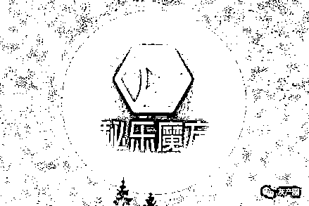
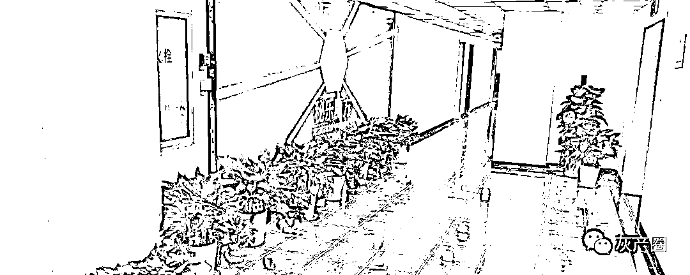
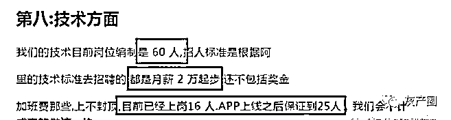

# 说“秘乐魔方”不是传销的人，你们发财了吗？

> 原文：[`mp.weixin.qq.com/s?__biz=MzIyMDYwMTk0Mw==&mid=2247500020&idx=1&sn=2f753607ca2682b061dbbf5abf09d624&chksm=97cb0bcca0bc82da2f149d7f97e1ef0678f57428b8f8df070f5ab6c32f93f146e2819e907245&scene=27#wechat_redirect`](http://mp.weixin.qq.com/s?__biz=MzIyMDYwMTk0Mw==&mid=2247500020&idx=1&sn=2f753607ca2682b061dbbf5abf09d624&chksm=97cb0bcca0bc82da2f149d7f97e1ef0678f57428b8f8df070f5ab6c32f93f146e2819e907245&scene=27#wechat_redirect)

**点击上方蓝色字体免费订阅“灰产圈”**

“趣步”被长沙市公安局立案之后，“趣步”涉嫌传销已经板上钉钉。

但是仿“趣步”的 APP 却像雨后春笋一样，纷至沓来。

尽管趣步 App 似乎已经“凉凉”，但手机端如今仍有不少“看新闻赚钱”“刷短视频赚钱”“看书赚钱”等“赚钱”App 存在。

对此，专家提示广大市民应对这类 App 保持警惕，切勿贪图小利吃了大亏。

**秘乐短视频、秘乐魔方靠谱吗？是传销吗？**

如今，各种旗号的传销，招摇过市！比如“秘乐魔方”，只要你把“趣步”模式一复制，然后杜撰一套说辞，再经过精心包装……再加上一些鸡血当佐料，就可以拉人头分钱。

如果趣步 app 的模式能够被法律认可所允许，那么在未来，中国将出现无数此种模式的互联网公司，然后所有的中国人从此将走上“走路挣钱，跑路发家、运动财富自由”的路上去，过上躺赚的生活。

如果钱这么轻松得来，谁来提供社会所需的劳动力？谁来支付这笔费用？

它如何制造经济价值？靠商城？如果它被法律认可，那么中国人人手机上下载这个 app 或者类似，到时候我有糖果，你有糖果，他有糖果，大家都用糖果换？

经济靠谁来支撑？靠这样的 app 吗靠走路吗？靠睡觉吗？

另外，如果全中国人都下载拥有糖果，然后以糖果换物，那法币的作用是什么？

思考过这个问题吗？细思极恐，这是一个恐怖的思考。

“秘乐魔方”跟“趣步”如出一辙，所有的利润来都自于用户的投资，整个项目没有资金的增值和再生。

也就是你赚多少就意味着有人赔了多少，甚至赔了更多；你赔了多少，就有人赚多少。

这类的平台的参与者，有一部分人是不知道这是分钱游戏的，被平台那些说词所蒙蔽，有的是知道的，但是投机心理很重。

据有关资料显示，秘乐短视频的技术岗位编制是 60 人，月薪 2w 起步（不包含奖金等）。

那么该公司每年仅需支付的技术员工资为一千五百 w 左右，再加上客服、运营、公司的日常支出推广及 9 名股东的收益等，粗略的计算下该公司的每年总支出超过四千万。（部分会员推广资料）

而这千万的资金又如何而来，大家也都明白。现在去玩这种烂大街的模式，不是明智之选。

从福音、吉柚、火趣等现在哪个不是这种模式，都是宣传自己是短视频+区块链的结合体，未来的“王者”。

请问真的如此吗？有关部门三令五申区块链≠虚拟货币（糖果），而现在流窜在市面上的都是做个短视频软件，然后在里面发行一款糖果（虚拟货币），就变成了当今社会的发展潮流“短视频+区块链”。

像秘乐魔方短视频这类的盘，短的盘两三个月就崩盘，长的可能两三年，留下一地的传销难民，有的恍然大悟，有的还不清醒，继续做同类的盘，刚出狼窝又入虎穴。

你想想，你参与到别人坐庄操盘的分钱游戏当中，赚钱的可能性大，还是赔钱可能性大？

很多人赌博的心理很重，损失钱财之后，反而又称自己是受害者，但是你投钱的时候又在想什么呢？

大量的用户采用了第 2、3、4 种玩法，发展下线，缴纳入门费，多层次计酬，这是典型的传销模式。

所有的人目的并不是为了看视频，而是为了赚钱，那么秘乐短视频 APP 是看视频的，还是用来圈钱的呢？虽然秘乐拿抖音做对比，但是这是典型的挂羊头卖狗肉。

这种涉嫌传销的模式怎么可能有阿里支持？！

宣传说可以打造网红达人，但是有几个人玩秘乐短视频，是为了看视频？！

真实的短视频+区块链是短视频平台结合区块链技术，让用户上传的原创短视频得到有效保护，每条原创短视频都会进行上链，从而保护原创者合法权益，减少盗版短视频泛滥。

现在秘乐短视频，97%都是盗版视频，没有减少，只有增多，反而害了这个行业，还不知廉耻的和抖音、快手等一系列的短视频做对比，请问你有资格吗？

而所宣传的注册资金五千万，并不是实缴，而是认缴，并没有像宣扬的强大资金注入，实际、缴资本为零。

秘乐宣传不产生任何泡沫，而秘乐本身就是泡沫，当大家都认识到这是骗局之后，手里的秘豆价值就等于零，泡沫就会崩盘。

来源：资金盘的套路，反传防骗快讯

← 向右滑动与灰产圈互动交流 →

**点击****阅读原文****加入灰产圈高端社群**

