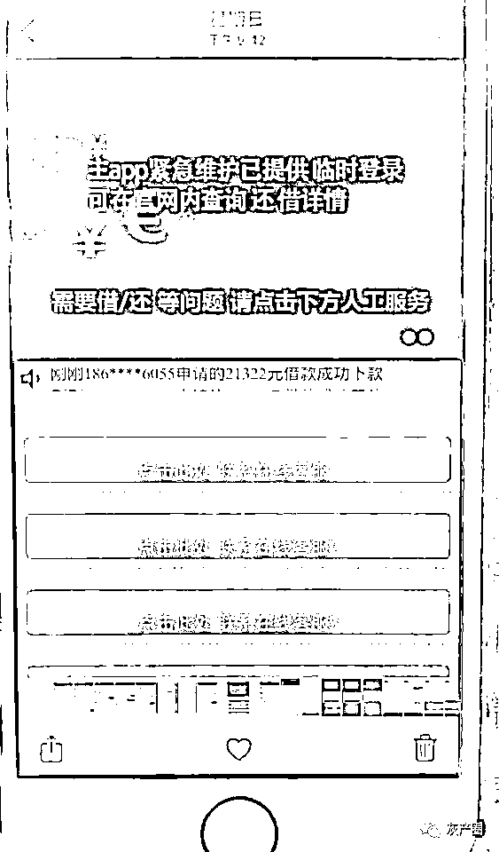
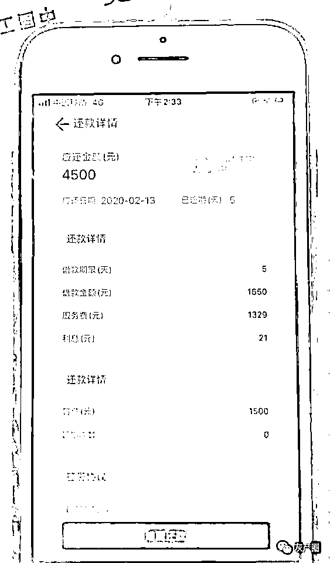
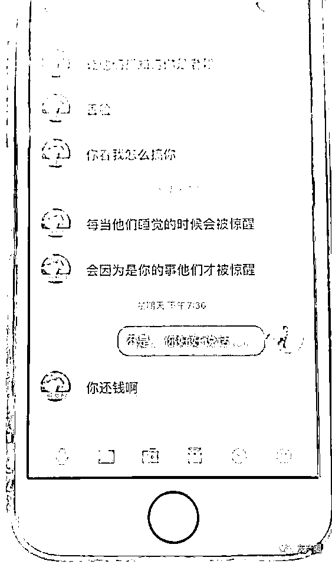
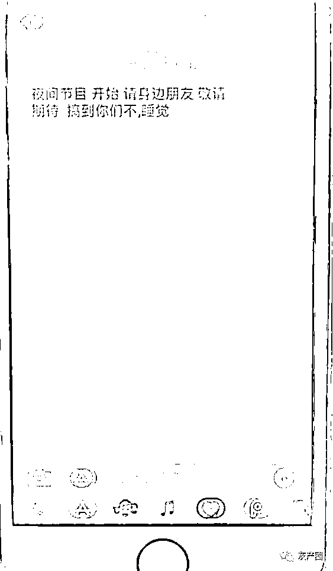
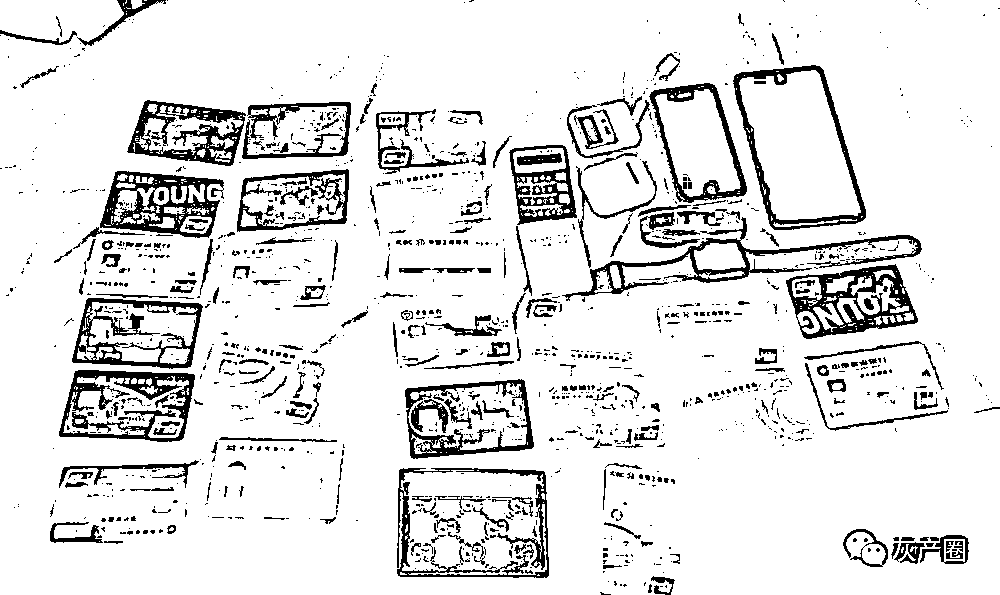
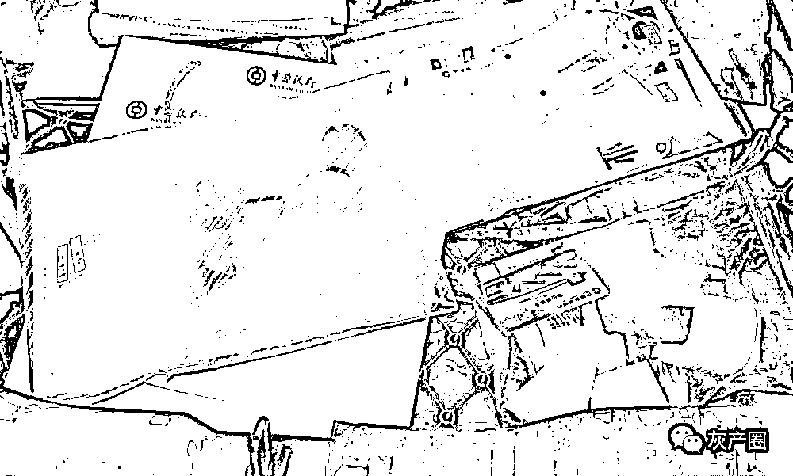
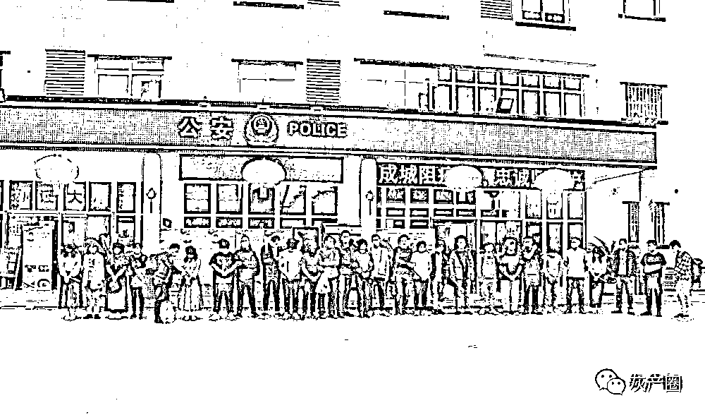
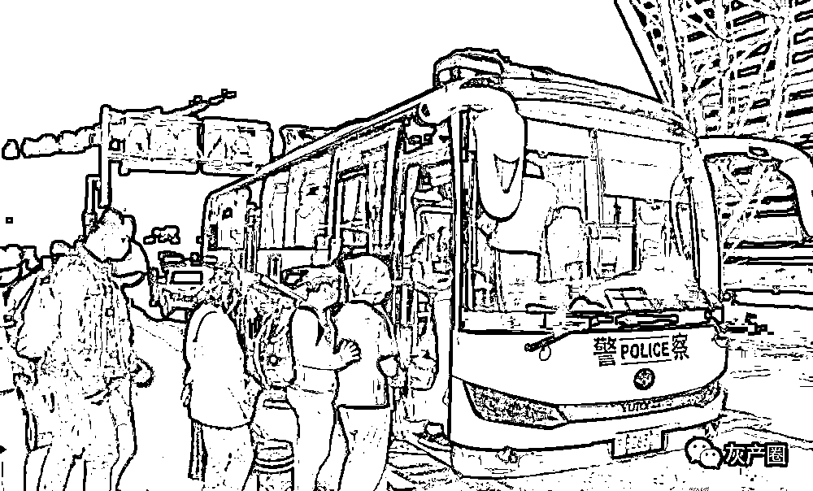
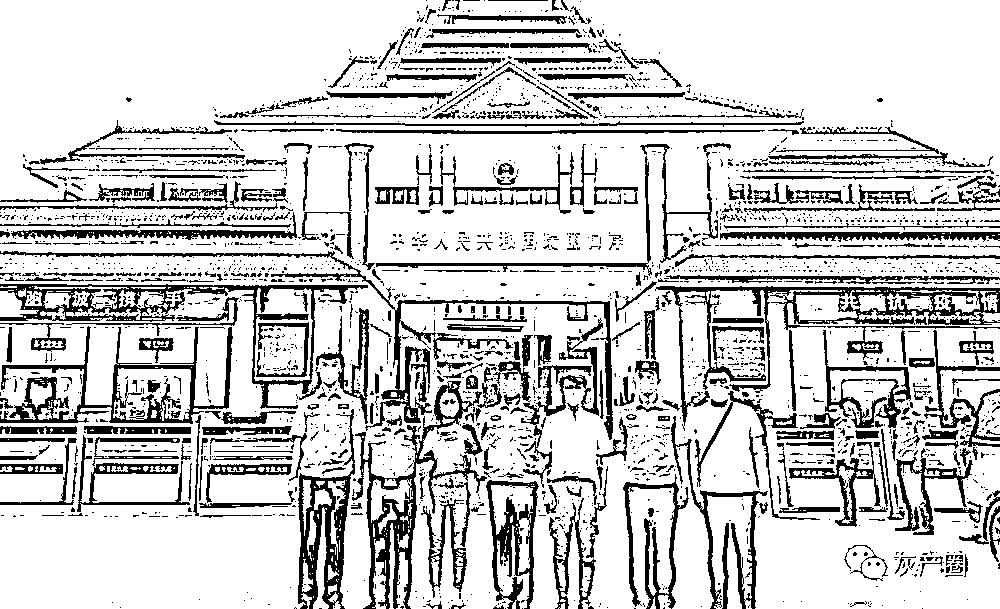
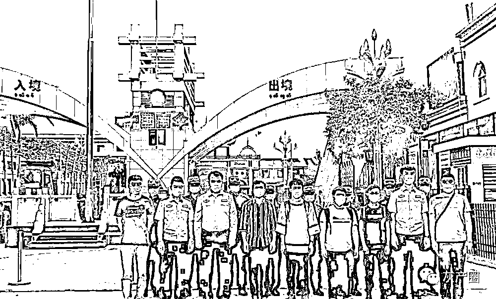

# 火牛支付被团灭！协助网贷诈骗超 21 万人

> 原文：[`mp.weixin.qq.com/s?__biz=MzIyMDYwMTk0Mw==&mid=2247500020&idx=3&sn=d96dd5e1d18101fa6c6c4870e83b3545&chksm=97cb0bcca0bc82dad86a04282b35c742d647ab38fe2091037834cb86272c4e8250997271f1e8&scene=27#wechat_redirect`](http://mp.weixin.qq.com/s?__biz=MzIyMDYwMTk0Mw==&mid=2247500020&idx=3&sn=d96dd5e1d18101fa6c6c4870e83b3545&chksm=97cb0bcca0bc82dad86a04282b35c742d647ab38fe2091037834cb86272c4e8250997271f1e8&scene=27#wechat_redirect)

**点击上方蓝色字体免费订阅“灰产圈”**

昨天，张家港市公安局通报，该局在推进“净网 2020”专项行动和网络重案攻坚专项行动中，斩断了一条集“上游资金供给-非法‘第四方支付’-下游黑灰产业”于一体的完整犯罪产业链，先后抓获涉案人员 70 余人，查扣作案用电脑 41 台、手机 210 余部，冻结银行卡 2100 余张，涉案资金 4.8 亿余元。

1

**接到报案：一笔无法还清的网络贷款**   

2020 年 2 月 18 日下午 3 时许，张家港市公安局塘桥派出所来了一名神色焦虑的女子，她是家住塘桥镇的居民顾女士。见到民警后，顾女士发出求助，希望民警帮她了结一笔如梦魇般纠缠的网络贷款。 

民警一边安抚顾女士，一边了解情况。据顾女士介绍，2 月 9 日下午，她在浏览手机时，下载了一款名叫“有米有品”的贷款类 APP，由于资金有些紧张，她便登录 APP、填写个人信息、银行卡账号。

当输入预期贷款 3000 元后，扣除服务费 1329 元、利息 21 元，剩下的 1650 元立即汇入顾女士的银行账户。“APP 贷款界面上没有提供相关收费标准，也没有确认贷款的按钮，贷款却放下来了！”顾女士感觉收费过高，随即登录 APP 想提前还贷，令她意外的是，APP 始终无法提供还款操作。

由于贷款的还款期限是 5 天，一心想提早还款的顾女士通过微信公众号查询到自称“有米有品”客服的人员，在对方的指导下，她向指定账户汇款 1350 元。

汇完款，顾女士发现贷款信息始终没有变化。再次通过微信询问，对方称因其转账格式不对，要求再次汇款，完成贷款销户。

感觉有些不对劲的顾女士没有再汇款，在 5 天后，她发现该贷款 APP 自动生成了一笔每日 200 元的违约金。此后，不仅还款金额每日上涨，言语粗暴的讨债短信、电话也纷至沓来，手足无措的顾女士选择报警求助。

接到顾女士报警后，张家港市公安局高度重视，对标苏州市公安局“188”提升计划，强化主体责任、启动办案程序。苏州市公安局网安支队也随即介入，联合张家港市公安局成立由多个警种部门共同参加的专案组，第一时间开展线上线下侦查工作。

2

缜密侦查：“第四方支付平台”浮出水面

涉案资金流向哪里？贷款 APP 设在何处？

围绕资金流向，专案组对涉案虚拟账号进行调查。经过梳理，侦查员发现顾女士支付的还款到达对方账户后，立即转至位于全国多地的 10 个对公账户上，这些对公账户的所有者均为空壳“皮包公司”，随后，账户资金又分别流向位于境外的一个庞大资金池。

围绕涉案网络贷款 APP，另一组侦查员也有了收获，他们锁定了网络贷款 APP 的推广团队，对相关人员进行调查后，一名负责 APP 资金往来的财务人员黄某“浮出水面”。

围绕黄某，侦查员继续开展工作。随着调查深入，更多的线索表明，黄某并不是一条“大鱼”，在她背后，是一个名叫“火牛”的第四方支付平台。

侦查员发现，该平台分工明确，黄某等财务人员负责收放贷款，被称作“承兑商”；

此外，还有专门负责贷款催债、资金池运维、APP 推广等业务的工作人员。该平台的负责人叫王某，他与黄某等平台核心人员藏匿在缅甸果敢地区，剩余人员分散藏匿在国内各地。

所谓第四方支付平台，是指未获得国家支付结算许可，违反国家支付结算制度，依托第三方支付平台，通过大量注册商户或个人账户非法搭建的支付通道。

“第四方支付平台收取‘金主’资金，为黑灰产业犯罪提供资金结算。”苏州市公安局网安支队民警张震豪介绍。

资金是网络黑灰产业的命脉，无论是网络诈骗、网络赌博，还是网络色情服务等网络违法犯罪，这些为网络黑灰产业提供资金的人员便是“金主”，而第四方支付平台则充当他们的“马前卒”与“中间商”，不仅直接实施相关违法犯罪，避免“金主”与受害人接触，更从每一笔资金往来中收取手续费，以此牟取暴利。

3

“四省六地”：全链条同步抓捕精准打击

第四方支付平台的浮出水面，让一个跨境网络黑产链条逐步清晰、明朗。

经查，90 年出生的安徽籍人员王某伙同两名“金主”以及自己的大学同学袁某一起入股，开设了“火牛”第四方支付平台。“金主”负责提供运维资金、袁某负责 APP 开发和技术保障、王某负责日常的平台运转和工作人员管理。自去年 12 月以来，王某带领团伙成员先后在越南岘港和缅甸果敢作案。

经过两个多月的昼夜奋战，专案组终于成功还原了案件的组织构架、作案流程、团伙分工、人员信息等核心线索，收网条件已经具备。4 月 25 日，专案组组织来自苏州市公安局网安支队、张家港市公安局的 116 名警力分赴广东广州市，广西北海市，四川成都市、遂宁市、浙江杭州市、温州市等地开展收网行动。

4 月 28 日清晨，在相关地区公安机关的大力协助下，收网抓捕同步开展，成功抓获“金主”、平台工作人员等涉案人员 72 人，实现了从 APP 金主、第四方支付平台、APP 开发人员、APP 推广人员的全链条打击。

截止案发，在“火牛”第四方支付平台内注册的 APP 商户超 100 家，放款记录超过 20 万条，涉及的网络贷款诈骗受害者超过 21 万余人。平台按照 1-1.5%对每笔往来资金收取手续费，经初步统计，王某等人已累计敛财 9000 余万元。

如此暴利，让人惊叹。开发该平台的袁某已在杭州落网，而王某与黄某等团队核心人员仍藏匿在缅甸果敢地区，暂时未能抓捕归案，这给案件的进一步查证带来了被动，但专案组的工作仍在继续，不会让任何一个涉案人员逍遥法外。

4

深挖彻查：7 名嫌疑人主动归国投案

由于疫情影响，以及国际警务合作的相关制约，在短时间内，警方无法对王某等人实施跨境追捕。为此，警方“双管齐下”开展工作。

一方面，继续扩大战果，深挖下游犯罪，从资金方面切入，查扣涉案资金 4000 余万元，彻底摧毁涉案人员的经济网络；另一方面，从王某等人的境内关系切入，开展劝返工作。

侦查员发现，国内知名大学计算机专业毕业王某原本有一个安稳的工作，他的妻子和孩子均生活在浙江杭州，受到金钱诱惑，他竟然走上了违法犯罪的道路。黄某不仅是平台的“承兑商”，还通过亲朋好友，从自己的老家四川遂宁为王某招募平台工作人员。

由于经济来源被切断，加上反复地工作沟通，王某、黄某以及其他 4 名涉案人员表示愿意回国投案。

接到这个信息后，专案组立即组织民警连夜赶往中缅边境。“由于王某等人的入境地点比较偏远，到达云南后，还要开车 7 个多小时才能到达。”张家港市公安局网警大队民警蔡浩说。

一边是高耸的怒山山脉，峰峦叠嶂，由于连日阴雨，松动的沙石不时滚落在车边；一边是奔腾的怒江河谷，深不见底，稍有不慎，就会车毁人亡，即便小心翼翼，还是差点与一辆大货车相撞。回想起当时的情形，侦查员们依然心惊胆战，但这些危险与困难，阻挡不了侦查员破案追凶的决心。最终在国合部门与当地边检部门的帮助下，王某等 6 人顺利回国投案。近日，另一名嫌疑人也主动回国投案。

自此，这起跨境网络黑产案件终于取得了阶段性胜利。王某等 36 人被依法采取刑事强制措施，境外“金主”与相关案情仍在进一步追查中。

来源：支付界

← 向右滑动与灰产圈互动交流 →

**点击****阅读原文****加入灰产圈高端社群**

