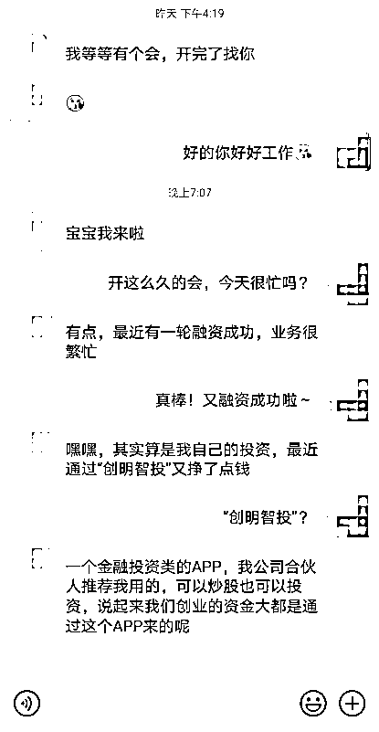
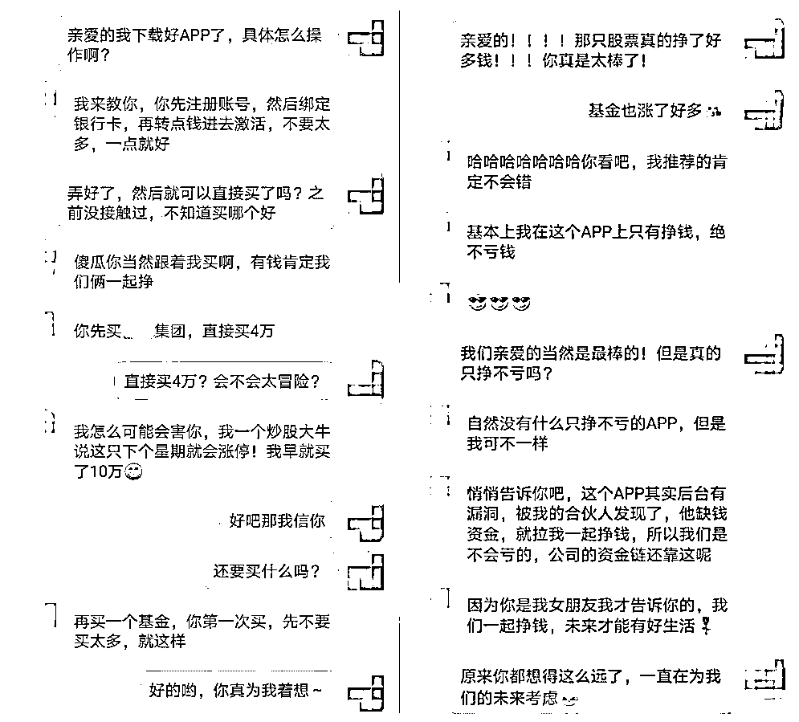
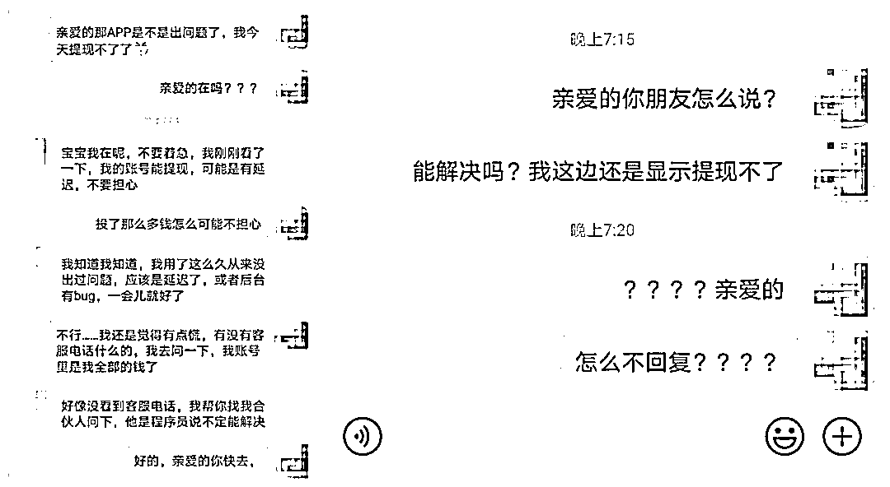
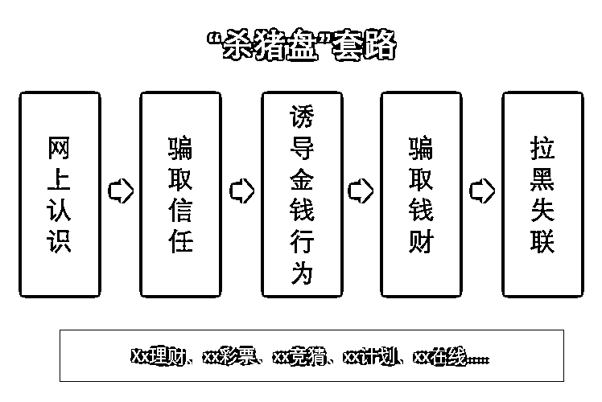

# 恋爱还是陷阱？揭秘让你人财两空的“杀猪盘”

> 原文：[`mp.weixin.qq.com/s?__biz=MzIyMDYwMTk0Mw==&mid=2247500035&idx=1&sn=911409f2a84ba5b45ff83b9eb71f0080&chksm=97cb0a3ba0bc832dd90d95e0eb77e747889b7e10855323f5b3ce0d88a4f283ac35f415d1dfcb&scene=27#wechat_redirect`](http://mp.weixin.qq.com/s?__biz=MzIyMDYwMTk0Mw==&mid=2247500035&idx=1&sn=911409f2a84ba5b45ff83b9eb71f0080&chksm=97cb0a3ba0bc832dd90d95e0eb77e747889b7e10855323f5b3ce0d88a4f283ac35f415d1dfcb&scene=27#wechat_redirect)

**点击上方蓝色字体免费订阅“灰产圈”**

在网络上你可能遇到这样的人：

他的声音充满磁性，那么摄人心魄。

他的语言温柔体贴，带着满满柔情。

他的事业蒸蒸日上，同时热爱生活。

当你遇见他时，你尘封已久的内心逐渐被打开，产生了奇妙的反应，不禁感慨：“爱情来得太快就像龙卷风~”

但其实，爱情从未到来，你可能正遭遇“杀猪盘”骗局，网络那头令你魂牵梦萦的人可能目标只是你账户里的资金。

01

**向往的“金钱爱情双丰收”**

**不过是杀猪匠的“温柔一刀”**

李女士平时忙于工作，一直单身，常常感到压力巨大在现实中却又找不到人倾诉，一次偶然的机会下在网上结识了男子陈某。陈某介绍自己以前创业失败后，总结经验和团队吃了很多苦，最终取得了成功，开了公司，业绩良好。 

聊天中李女士还发现，陈先生是个近乎完美的人，高大帅气、温柔体贴还幽默风趣，于是两人聊天越来越频繁，李女士也喜欢把生活中的小事分享给他，不到一周的时间两人就确定了情侣关系，感情也在嘘寒问暖中火速升温。 

1

骗子的温柔刀，对女人的迷魂药 

感情的升温稳定，为 “杀猪”提供了锋利的作案工具，陈某的“温柔一刀”，缓缓架上了李女士的脖子。陈某开始在聊天当中有意无意的透露自己在一款叫“创明智投”的金融 APP 上投资，并且收益不低！

2

稳赚不赔的投资，竟是糖衣炮弹

出于对男朋友的信任和高收益的诱惑，李女士逐渐放松警惕，下载了“创明智投”APP，并在陈某的指导下开始投资。前期不过是几万元的小金额，每次都能小有收益，有时候甚至能得到成倍回报，李女士向陈某表达过疑惑，陈某却解释说这个 APP 存在漏洞，公司合伙人发现了这个漏洞并和自己分享了利用方法，保证稳赚不赔。

陈某倾囊相授的架势和坦荡的态度说服了李女士，彻底打消疑虑，相信陈某是真心带自己一起挣钱，只要是陈某介绍的，无论是投资还是赌博都能挣钱，李女士越发信任陈某，下注时也越来越大胆，金额越来越高。帅气温柔的恋人加上稳赚不赔的投资，一时间爱情和金钱的双丰收使李女士开心不已，似乎能看见未来幸福的生活。

3

梦醒时分夜，人财两空时

然而好景不长，在一次大额下注后，李女士突然发现自己无法提现！慌张的李女士立马找到陈某询问，得到的不过是“APP 后台操作有点问题”“你再等等看”“我已经联系公司那个程序员帮忙解决了”之类的敷衍。

恋人冷淡的态度和亏损的金钱像一盆冷水，让李女士发热的脑袋逐渐冷静，再也联系不上陈某之后，李女士不得不承认自己被骗了，立马报了警，而此时前前后后投入的金额，累计高达 240 多万。

报案之后警方立刻开展调查，发现李女士并不是唯一受害者，该诈骗集团总部设在境外，在湖北、山东、广东、新疆等 10 余省份实行诈骗案件 80 余起！目前已有 31 名骨干成员落网，该案冻结涉案账户 50 余个、冻结涉案资金 100 余万元。

02

**放长线钓大鱼**

**乘虚而入，防不胜防**

毫无疑问，李女士这是遇到“杀猪盘”了。“杀猪盘”是近年来兴起的混合骗局，在不法分子的眼中，受害人就是用“爱情”圈养的“猪”，待养肥后就应该被“杀掉”。 

不同于其他骗局的“短平快”，杀猪盘最大的特点就是放长线“养猪”，养得越久，杀得越狠，“找猪-养猪-杀猪”是“杀猪盘”的一般流程。

犯罪分子“找猪”的策略清晰明确，将受害者锁定在 30+的单身女性，一是因为这个年龄段的女性一般都有不错的经济基础——“够肥”；二是因为这类型的单身女性对于感情的需求较大，犯罪分子有可乘之机——“好得手”。在李女士的案件中，诈骗集团虽然总部位于菲律宾马尼拉，但团伙成员均从国内招聘，通过多个社交平台在国内寻找女性目标。

成功添加好友之后，犯罪分子就开始了“养猪之旅”。劣迹斑斑的罪犯摇身一变，成为高大帅气，温柔多金的“优质单身男”，在受害者空窗期时乘虚而入，对受害者展现全天 24 小时 360 度无微不至的关怀，偶尔采用“半糖主义”若即若离让受害者深陷温柔乡不可自拔，只要让受害者信任和依赖自己，犯罪分子的“养猪”目的就达到了。

经过一段时间，“猪”养熟了，也养肥了，就到了犯罪分子“杀猪”的时候。依靠着之前建立的信赖，引诱受害人通过犯罪团伙搭建的赌博平台进行投注。一开始受害人均能获取一定数量的盈利，在加大投资金额后，犯罪团伙就通过修改后台数据的方式，使受害人逐步将投资金额输尽，然后拉黑受害者的联系方式，携款潜逃。

不单单是 30+单身女性，各个年龄层的男女都有可以成为“杀猪盘”的受害者，女装大佬诈骗青年单身宅男、空巢老人“养儿”痛失百万等等案件屡见不鲜，大家千万不能掉以轻心，一定要擦亮眼睛，保护好自己的财产安全。 

03

**谨慎交友**

**协力打造绿色网络环境**

犯罪分子善于造梦，无论是“幸福美满的爱情”还是“唾手可得的金钱”，只要你有需求，他们都可以为你编织一个完美的梦境，但梦终究是虚无，他们真正的目的是让受害者“赔了夫人又折兵”，如果你在交友过程中，发现了以下几个典型特征，注意了！那你可能已经成为了“杀猪盘”的目标猎物。

1、相识于网络，没有任何现实接触；

2、对方为莫名出现的“优质对象”，迅速陷入爱河；

3、对方找一切借口拒绝视频、见面等提供真实身份信息的要求；

4、在恋爱过程中，对方有邀请你一起进行投资、挣钱、做副业等一切需要你掏钱的行为。

“杀猪盘”之所以屡禁不止，是因为犯罪分子利用了人们渴望感情和对金钱的欲望。如何才能避免落入“杀猪盘”的陷阱？腾讯守护者计划安全团队这里有一份防骗小贴士:

 守护者计划温馨提示：

1、在使用网络的时候，一定要保护好自己的个人信息，避免信息泄露，不给犯罪分子可乘之机； 

2、提高甄别能力，对于网络上陌生人的接近保持警惕，没有确认身份情况下绝对不进行“金钱交易”； 

3、保持正确的金钱观，不要奢望“天下掉馅饼”，不要轻信别人的投资建议，通过自己努力获取的财富才是最安全可靠的。 

通讯网络诈骗手段愈发多样化，生活中的诈骗防不胜防，大家一定要小心谨慎，如果真的不慎被骗，要立刻报警，争取将损失降到最低。

来源：中国互联网协会

← 向右滑动与灰产圈互动交流 →

**点击****阅读原文****加入灰产圈高端社群**

