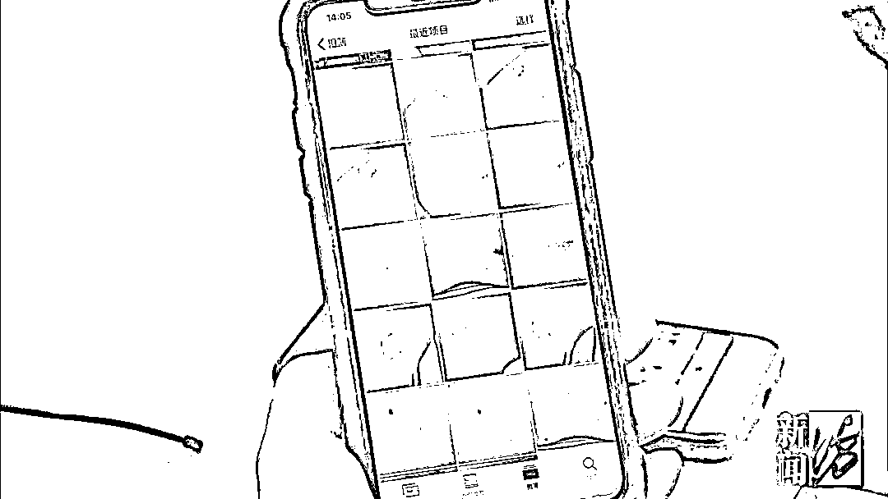
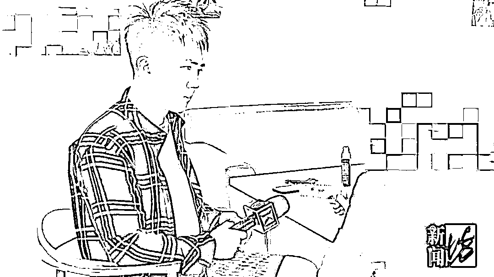
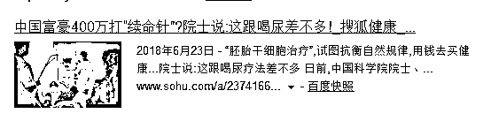

# 70 岁老头为“美容”花掉 576 万！美容院的“套路”太深了！

> 原文：[`mp.weixin.qq.com/s?__biz=MzIyMDYwMTk0Mw==&mid=2247500035&idx=2&sn=8588c32ebf9a2965c170e8237a7e0996&chksm=97cb0a3ba0bc832dc0c855f42f3bea616669a2d5c1bcdaa694871b92c5c492bd84621183b89c&scene=27#wechat_redirect`](http://mp.weixin.qq.com/s?__biz=MzIyMDYwMTk0Mw==&mid=2247500035&idx=2&sn=8588c32ebf9a2965c170e8237a7e0996&chksm=97cb0a3ba0bc832dc0c855f42f3bea616669a2d5c1bcdaa694871b92c5c492bd84621183b89c&scene=27#wechat_redirect)

**点击上方蓝色字体免费订阅“灰产圈”**

美容美发套路多，
近年来，年轻人被“套路”的新闻常常见诸于媒体，如今，老年人也被盯上了？近日，上海的韩女士爆料称丈夫程先生背着她，往香港国际美容美发的 SPA 会所及某知名医疗美容机构**共充值 576 万！** ****据程先生介绍，对方声称可以“治疗”**前列腺、哮喘****……****这到底是怎么回事？**2 个月往卡里豪充 242 万元韩女士夫妇都年近 70 岁，已退休，女儿定居国外。2019 年年底，韩女士去海南三亚参加同学聚会，不料因故滞留到今年 3 月回沪，而这段时间，丈夫程先生独自一人留在上海。**那些一笔笔的大额转账、消费，****也基本就在这个时候****被程先生充进了“香港国际”的会员卡里。********那么程先生****是如何被“套路”的呢？**原来， 2019 年 3 月 20 日，程先生在香港国际美容美发店充了 1000 元的卡，第一次去**做理发**的时候，就被理发店的美容小姐忽悠到楼上去**做一次身体按摩**……2019 年 10 月 9 日，程先生独自去美容院，在认识了这家店的孙姓高管后，**2 个月内挥挥手中的卡，****霸气豪充 242 万元。** 程先生挥金如土的大气劲，“惊动”了另一位经理代某，代经理是一位貌美的 30 多岁女性，她表示自己要完成业绩，就给程先生设计了各种项目，让程先生天天去。

在代经理和其他小姑娘的软磨硬泡下，程先生再次大手一挥，**充了 74 万元**。至此，

程先生**一共向对方充值 316 万元。**

**程先生大笔汇款记录****↓↓↓**

“私人订制”？两“医生”开价 199.6 万元**到底做了什么项目****可以有如此惊人的消费？**程先生说，他有哮喘疾病，孙姓高管就以给程先生治病的名义，为其设计了**“私人定制”项目**，请了店外的**“安医生”**、**“高医生”**到店里给程先生治疗，**“****安医生”开价 133 万，高医生开价 66.6 万。****“私人定制**”**项目明细****↓↓↓**这位孙姓高管还声称：“我妈妈的哮喘就是这两位看好的，花了 70 多万呢。”程先生说，他也觉得 **这两位“医生”有水平！**“

程先生：“那个医生给我搭脉后，说我前列腺、腿都不好，我一听，这医生有点水平嘛，我就比较信任她了。”

而当记者问起程先生这两位“医生”是如何治疗前列腺的程先生支支吾吾地：**反正我都说不出口了****……** 从早到晚待店里，还买了 1000 片面膜此外，程先生还做了**心肺项目****淋巴项目****苹果干细胞项目****火龙灸项目**……每天到店里程先生还会享受到更多**“****豪华”的待遇**从早上九点半一直待到晚上六、七点**一天三顿三菜一汤**都在店里解决在整个按摩治疗的过程中，店员们还不忘向程先生推销各种护肤产品。当韩女士从三亚回来，看到丈夫**买了****200 盒 1000 片“医用”面膜，**才发现程先生与香港国际之间的消费往来。韩女士说：**“****快 70 岁的老头，****她还给他做去眼袋，****他还跟我说****1000 份面膜慢慢贴！****”**87 天 174 次“火龙灸”，阿伯老伴：“差点没灸死”更令韩女士气愤的是店里给丈夫做的“火龙灸疗养”**把他灸得极度虚弱**！**“**87 天给他做了 174 次******差点没灸死！”**连正规针灸医院的医生看了都说：**你看你先生被折磨成啥样了**看着眼前这一张张巨额账单，再加上丈夫的病情，韩女士是既气愤又着急。今年 6 月 8 日，韩女士和丈夫程先生决定向香港国际美容美发店要回所有剩余款项。香港国际美容美发店表示，去掉已经做的各种项目费用**24 万元**，剩余**292 万元**，但他们只能退款**200 万元**，并且需写进和解协议书内**分为 2 次退还**。至于**另外的 92 万**，**现已发放给股东及店员，不会退回，**该争议款项也不可在协议书内备注。对此，程先生一家无法接受。 令人惊讶的是，这家香港国际美容美发店还把程先生**引导介绍到上海另一家知名医疗美容机构，充值 260 万元**。好在这 260 万元目前已全额退回。当地监管部门介入随后，记者陪同程先生夫妇向嘉定区市场监管局反映了此事，工作人员表示会与属地市场监管所联系。程先生又将此事反映给了嘉定区卫健委，工作人员很快赶到现场，但由于该店三楼有顾客正在体验项目，执法人员仅对一楼和二楼进行检查，并表示：“没看到有行医的迹象，也没有相关药品和器械。”美容店高管：“安医生和**高医生不是医生，是老师”**此外，记者联系了程先生说的那位孙姓高管，她表示：**“安医生和高医生不是医生，是老师。”**而当记者提到，为何在给程先生特别定制的众多项目中，**有些项目高达 1 万 3 千多****却没有具体名称时，对方也回答****不出。**目前，程先生已将相关材料递送至区市场监管局，接下他希望在弄清两名所谓的“医生”安某和高某的具体身份的同时，拿到已消费 24 万元的发票及具体明细。至于余下的 292 万元能否退回，记者也将持续跟踪报道。**相关新闻：老人到美容院治腰痛病情却加重，法院这样判**据中国消费者报 2018 年 11 月 26 日报道，辽宁大连消费者江女士常年腰腿疼痛，在大连市中山区尚樽美容院做完护理后，腰痛加重走路出现困难，不得不住院治疗。由于双方对退款金额未能达成一致，江女士将美容院起诉到法院。大连市中山区人民法院判决尚樽美容院向江女士退款 1.8 万余元。2017 年 11 月 10 日，江女士在大连市中山区一家商厦门口被一个小伙子拉住，称看老人腿脚不太好，可以到他们的养生堂治病。小伙子把江女士带到附近一家名为大连市中山区尚樽美容院的地方。美容院工作人员对江女士说：**“在我们这里，医院治不好的病都能治好，之前坐轮椅的现在都能走路了。”****江女士治病心切，当天就办理了一张白钻美容卡。**不到一个月的时间里，她先后向美容院交了 5 次款，合计 2.2 万元，分别做了腿部保养、腰部保养、胶原蛋、花蕊能量、面部补水、固肾培元等服务。江女士原本腰部不适，在美容院做了几次服务后，**症状不但没有好转，反而越发严重，疼痛难忍，甚至连走路都出现困难。**家人赶紧带江女士去医院检查。医生嘱咐她不能再做按摩，应卧床养护。江女士找到美容院要求退款。因双方不能就退款一事达成共识，江女士将美容院起诉到大连市中山区人民法院。2018 年 10 月，大连中山区人民法院一审判决，尚樽美容院退还江女士美容护理款项 1.8 万余元。**当心！这些坑人的美容项目，千万别再做了**爱美之心人皆有之。近年来，各种美容院如雨后春笋般出来。据商务部统计，截至 2017 年底，美容企业数量为 13.7 万家，营业收入高达到 1687.0 亿元。而各个美容院为了经济效益推出了各种各样式样繁多的保养项目，原本保养美容是一件好事，一些不良的商家为了赚钱，用一些看起来高大上的项目来欺骗你，不仅骗钱还让你达不到美容的效果，甚至伤害身体。**坑人项目一：卵巢保养**不少美容院都会宣传“卵巢保养”的种种好处：健康卵子、延缓衰老、调节痛经、良好睡眠、增强性趣……看到这么多功效，大家都会心动一下。然而实际上，“卵巢保养”不仅没有用，甚至还暗藏风险。 **专家：正常的卵巢，是按摩不到的。**很多美容院所说的卵巢按摩，其实就是抹点精油或药膏，按摩一下。实际上，因为卵巢位置在盆腔深处，一般按摩是根本触及不到卵巢的。这些“美容按摩师”们真的只是在给你揉肚子。如果真的摸到了，那说明卵巢可能已经出问题，随意乱揉不仅不能保养，反而可能会按出事。卵巢位置示意图**坑人项目二：乳房保健**乳房保健或者乳房按摩，也是很多美容院的热门项目之一。很多美容院都宣称：乳房按摩可以治疗乳腺增生、乳腺纤维腺瘤等疾病并且还有丰胸项目。这些听起来很美好，但是事实上，乳房按摩不能治病，反而可能越按越糟。**专家：乳房乱按是会出事的。**乳腺增生，它主要是月经周期的激素水平变化有关，临床上 95% 的乳腺小叶增生不会癌变，绝经后也会慢慢好转，并不需要所谓的按摩保养。如果只是没用那还好，但娇嫩的乳房，乱按是会出事的。**坑人项目三：排毒养生**“排毒养生”也是很多美容院的重头戏，从肾脏排毒、肝脏排毒再到大肠排毒，火疗、水疗、汗蒸……可谓是花样百出。**专家：实际上人体不需要所谓的“排毒”。**首先，人体并没有什么毒 。出汗、排便……都是正常的新陈代谢过程，一些代谢废物会随之排出，但和排毒没什么关系。其次，就算环境中有一些有毒有害的物质，我们还有皮肤、肝脏、免疫系统等器官来帮我们抵抗或清除它们。**坑人项目四：黄金焕肤**中国人喜欢黄金，又传说黄金具有各种各样的护肤作用。于是美容院里也都有奢华的黄金美容项目。他们宣称可以抗炎，提亮肤色，排毒，抗老，美白...**专家：基本没有任何作用。**实际上涂在你脸上的黄金是食用金箔，它的厚度是 0.08 毫米左右，金本身的化学性质很稳定，所以上脸也不会有太多致敏问题。但也正因为它无法被皮肤吸收，所以也根本不会对皮肤有什么改善作用。好比你在脸上带个面具，你期待它能带来抗老美白效果，那真的是想多了。传说中的“黄金焕肤”**坑人项目五：淋巴排毒**淋巴如果出了问题，那么人体的免疫系统也会遭到威胁，所以淋巴排毒这种护肤疗程也是美容院常客。他们声称能排毒，刺激微循环，提升免疫力，舒压...**专家：这些功效都是想象出来的。**淋巴被病毒入侵的确会产生各种问题，但是想要把病毒排出也不是靠按摩淋巴就能获得的，护肤品更不可能从皮肤渗透到淋巴里杀死细菌病毒。^②**坑人项目六：注氧美肤**给皮肤注入氧气，让皮肤更好呼吸，同时可以加快肌肤的代谢，可以起到活化细胞，补水，镇静的作用。**专家：这里的所谓的含氧只是品牌的一个噱头。**所谓的氧气也都是以水的形式存在的，因为护肤品公司认为一氧化二氢也算含氧的一种形式。**坑人项目七：干细胞美容**通过给皮肤注入动物植物干细胞，让肌肤细胞达到重生修护的目的。可以抗老，抗皱，提拉，紧致..**专家：在目前化妆品法规的控制下，谁标榜自己含有干细胞活细胞那就是违反化妆品法。**首先大家要明确一点，那就是护肤品中添加的成分必须都是“死”的，也就是说它们都是没有生命活动的。而所谓的干细胞一旦死亡，那么也就起不到所谓的护肤效果了。其次，即便真的有活的干细胞加入护肤品中，你涂抹以后到底是希望它在你脸上是长出植物细胞还是其他牛羊组织器官呢？这些都是骗人的把戏罢了。此前有专家称干细胞疗法和喝尿疗法差不错**坑人项目八：快速美白**中国女性对美白的痴迷程度可谓疯狂，所以可以不计一切代价去美白。而且又没有耐心，所以号称能快速美白的项目和产品就出现了。**专家：这样的产品分外涂和内服，都有副作用。**外涂的产品大多含有铅汞，甚至激素，所以近年来皮肤科有越来越多激素依耐性皮炎患者。表现为面部皮疹，发炎，发红，发烫，对热越来越不耐受，出现红血丝等症状，当皮肤屏障受损，还会爆发黄褐斑。^④而内服的其实就是美白丸，但实际上也有巨大安全隐患。美白丸一般都含有氨甲环酸，谷胱甘肽，半胱氨酸，vc 等成分。但氨甲环酸、谷胱甘肽、半胱氨酸作为药物都是有副作用的，一定要谨慎使用。

**美容院套路大揭秘**

很多人都知道美容院坑人、坑钱，为什么还是那么多人掉入陷阱？健康时报曾总结了一份美容院套路↓↓↓1\. 你或许是在剪头发，或许是在街边走着，突然送你一个免费美容体验，你想着“不用白不用”，就去吧；2\. 带你上二楼，办卡，一个疗程有好几次，这保证了你在美容院的时间足够长，慢慢给你“洗脑”；3\. 每次你去做都会告诉你：“你真幸运，我们最近在搞活动，原价 1800，现在 600……”，让你觉得自己碰上了这家美容院，真是前世修来的福气；4\. 请一堆“专家”“教授”给你各种“检查”，让你知道自己的问题有多严重，再不美容人生就要毁掉了；各种高大上仪器摆出来，让你感觉相当专业，以为自己一下子接受了国际水平的治疗。5\. 如果你做完一次疗程没达到理想的效果，他们会说：“你的问题比较严重，需要再多几次疗程。”万一出现了问题，你想去看医生，他们甚至会说：“不要去看医生，这些小事我们能治好。”6\. 没钱？不要紧，有学生优惠，原价 4888，现价 2888；你还可以分期付款，买了再说啊。**看清楚了这些套路，****下次一定小心！**

编辑：单镜宇 责任编辑：马涛

来源：、广州日报、新闻坊、看看新闻 Knews、健康时报、中国消费者报、南国今报

← 向右滑动与灰产圈互动交流 →

**点击****阅读原文****加入灰产圈高端社群**

