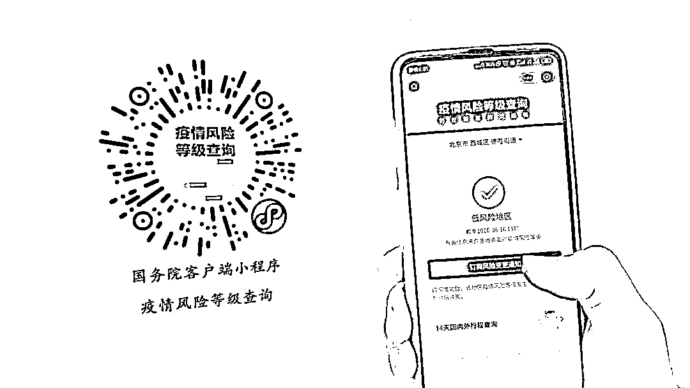
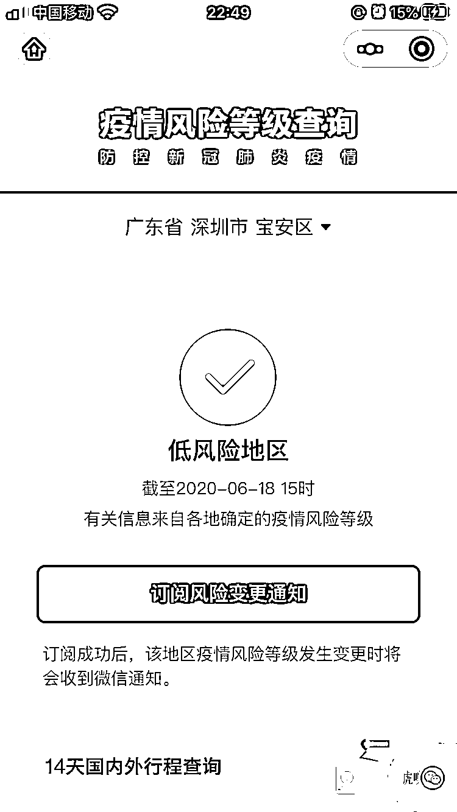
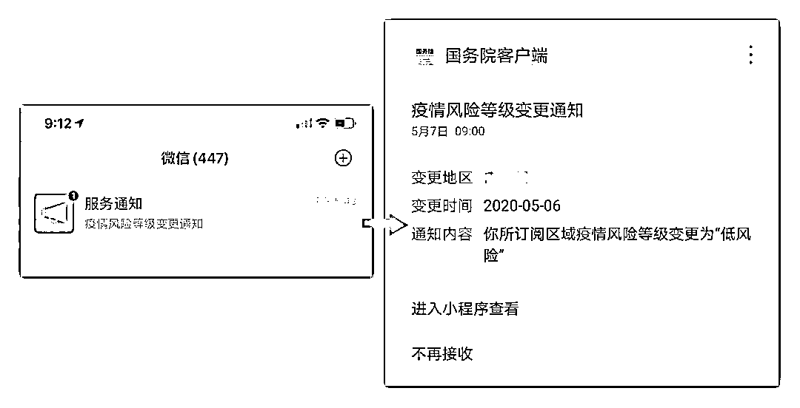
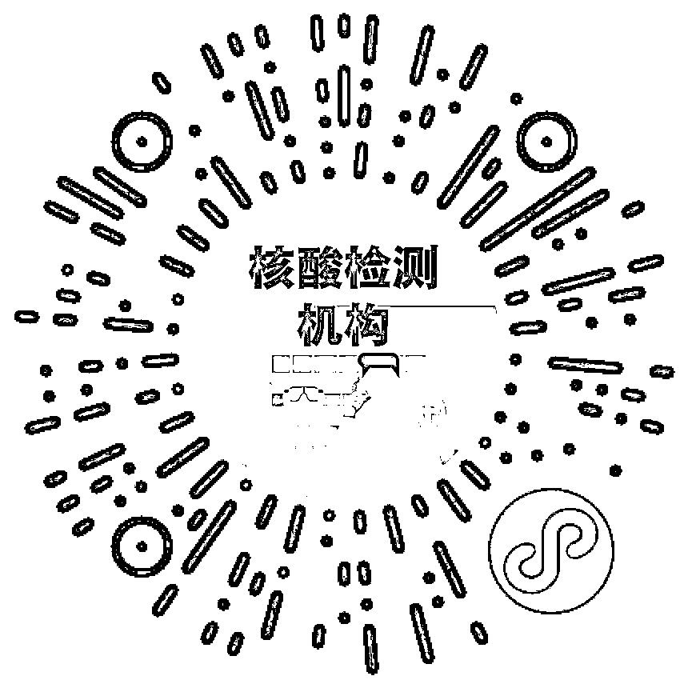
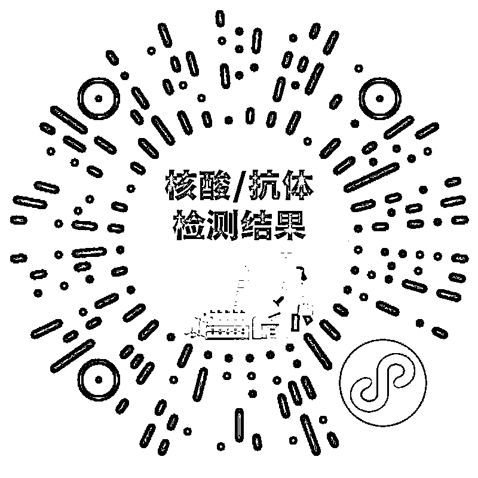

# 赶紧查查！你家附近疫情风险等级变了吗？

> 原文：[`mp.weixin.qq.com/s?__biz=MzIyMDYwMTk0Mw==&mid=2247500064&idx=2&sn=9162c4f6ef64642e9f2b342b0def59f6&chksm=97cb0a18a0bc830e676cd0a6b6a4e3ca968e6534b08424a7075c7ba5e0c0bf7d58a187322680&scene=27#wechat_redirect`](http://mp.weixin.qq.com/s?__biz=MzIyMDYwMTk0Mw==&mid=2247500064&idx=2&sn=9162c4f6ef64642e9f2b342b0def59f6&chksm=97cb0a18a0bc830e676cd0a6b6a4e3ca968e6534b08424a7075c7ba5e0c0bf7d58a187322680&scene=27#wechat_redirect)

**点击上方蓝色字体免费订阅“灰产圈”**

疫情还没过去，绝不可掉以轻心！截至 6 月 18 日 15 时，据小程序疫情风险等级查询，**全国有 1 个地区为高风险地区，32 个地区为中风险地区。**
想及时了解你所在地区的疫情风险等级变化？你试着扫扫下面的二维码。为更好地抗疫防疫，国务院客户端小程序疫情风险等级查询服务上线**订阅功能**，可以订阅全国各地疫情风险等级变更通知。订阅的地区疫情风险等级如果发生变更，将会收到微信即时通知，靠谱！

想要了解**核酸检测**的朋友，还能用到小程序里的这两个功能。

**【核酸检测机构查询】**👇** 快速查找附近核酸检测机构**

**【核酸/抗体检测结果查询】**👇**精准查询检测结果**

来源：中国政府网

← 向右滑动与灰产圈互动交流 →

**点击****阅读原文****加入灰产圈高端社群**

