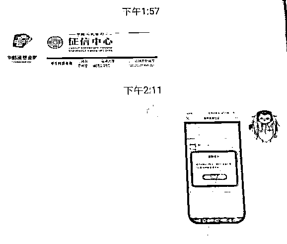

# “注销校园贷款账户”被割韭菜，大学生：我太难了！

> 原文：[`mp.weixin.qq.com/s?__biz=MzIyMDYwMTk0Mw==&mid=2247500154&idx=2&sn=c835a75d0abc33eff414757203a39b41&chksm=97cb0a42a0bc8354d68af1927ca32c871c094015ec08dab8e2edfc7e2215c632bf495489f595&scene=27#wechat_redirect`](http://mp.weixin.qq.com/s?__biz=MzIyMDYwMTk0Mw==&mid=2247500154&idx=2&sn=c835a75d0abc33eff414757203a39b41&chksm=97cb0a42a0bc8354d68af1927ca32c871c094015ec08dab8e2edfc7e2215c632bf495489f595&scene=27#wechat_redirect)

**点击上方蓝色字体免费订阅“灰产圈”**

对于网贷

很多大学生心里已经有所防备

然而万万没想到的是

躲过了网贷平台的坑

还有可能遇上以**“注销网贷账号”**为套路的诈骗

你注册过 xx 网贷平台，上面有你的个人信息和贷款记录

是啊是啊

若不及时销户，会影响你的个人征信

啊？那可怎么办......

而且你办理过的校园贷，现在相关部门要收回额度，如果需要注销，我们可以帮你操作

那可太好了

近期

骗子利用以上话术大肆行骗

受害人多为 90 后毕业生或在校生

该骗局被称为

**“注销校园贷账户”**诈骗

**1**

**典型案例**

居住在上海**九亭镇瀛华苑**的蔡美丽（化名）

接到了一个陌生电话

对方自称是某银行的“中邮消费金融客服”

并声称查到蔡女士在大学期间

曾经在某网贷平台注册过帐号

**随后，对方又在电话里报出了**

**蔡女士当时在平台上填写的个人信息**

蔡女士信以为真 

便按照对方的指引走“销户”流程

而为了**清空平台内的“贷款额度”**

在“中邮消费金融客服”的提示下

蔡女士从中邮钱包网贷平台**借贷 36000 元**

转账到了指定的**私人账号**

转账后，蔡女士越想越不对

怀疑自己遭遇电信诈骗于是报警求助

**2**

**典型案例**

就在蔡女士来所报案的前段时间

家住上海**闵行区联明雅苑**的黄帅帅（化名）

也向警方报案了

他的遭遇，跟蔡女士如出一辙

先是一个自称某网贷客服找上门

然后让小黄配合销户

不过这次，为了唬住小黄

对方竟然还拿个人征信做文章

然而，个人征信明明是由

中国人民银行征信中心统一管理的

任何人无权删除或修改

可惜当时的小黄不了解这些信息

又急于维护自己的个人利益

于是在不明真相的情况下
相信了对方的这套说辞

**并根据对方的指引开始“注销帐号”**

**对方诱导小黄从网络贷款平台上借款**

**然后转到指定的账户中 27900 余元**

简单概括此**诈骗套路**

就是先拼命骗你去贷款

再骗你把钱打给他

**0****1**

**伪装"平台客服"联系受害人**

不法分子通常冒充京×金融、36×借条、AI 学贷、分 QI 乐、小 MI 金融等贷款平台客服，电话联系受害人，并通过伪造的“平台营业执照”、“客服工作证”等消除受害人的疑虑。

**0****2**

**能够说出受害人的身份信息**

为了获取受害人信任，不法分子会利用非法渠道获取的个人信息，在电话中准确报出受害人的姓名、身份证号、家庭住址、贷款等信息，实施精准诈骗。

**0****3**

**编造理由让受害人陷入恐慌**

当受害人放松警惕后，不法分子谎称根据国家相关政策需要配合注销校园贷账号，否则会影响个人征信或产生严重后果。若是受害人未曾注册过校园贷，不法分子则谎称其身份信息被盗用注册了网贷账号，也需要配合注销。

**0****4**

**要求转账完成"清零"和"销户"** 

当受害人放松警惕后，不法分子谎称根据国家相关政策需要配合注销校园贷账号，否则会影响个人征信或产生严重后果。若是受害人未曾注册过校园贷，不法分子则谎称其身份信息被盗用注册了网贷账号，也需要配合注销。

**防**

**警  方  提  示**

       不存在注销网贷账户的操作，只要你按时还清货款，就不会影响到个人征信。接到此类自称网贷平台工作人员的电话，务必提高警惕。遇到疑问时，应当及时向警方或者官方客服咨询核实，避免财产受到损失。

来源：深圳市反电信网络诈骗中心

← 向右滑动与灰产圈互动交流 →

**点击****阅读原文****加入灰产圈高端社群**

