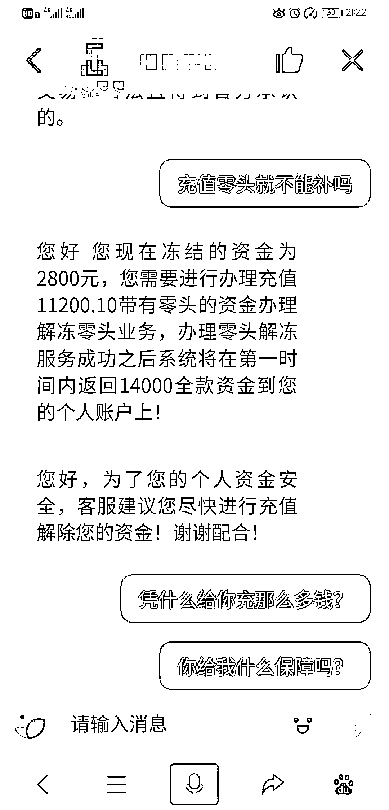

# 防骗必修课，你能考多少分？

> 原文：[`mp.weixin.qq.com/s?__biz=MzIyMDYwMTk0Mw==&mid=2247500154&idx=3&sn=b433cdc6286dcdb225617361ea8dfc3d&chksm=97cb0a42a0bc8354bd70491e9558cb93292cd7b10675253a35b33bb7ac19756b971f913662eb&scene=27#wechat_redirect`](http://mp.weixin.qq.com/s?__biz=MzIyMDYwMTk0Mw==&mid=2247500154&idx=3&sn=b433cdc6286dcdb225617361ea8dfc3d&chksm=97cb0a42a0bc8354bd70491e9558cb93292cd7b10675253a35b33bb7ac19756b971f913662eb&scene=27#wechat_redirect)

**点击上方蓝色字体免费订阅“灰产圈”**

疫情后期，随着开学日期的临近，一些学生重新走进了熟悉的校园。但这也是骗子借开学向学生“要业绩”的时候。学生群体尤其需要警惕疫情后期，面临开学之时骗子的各种动作，切勿还未走进校园，就让开学季成为自己的“受骗季”。

那么，今天和大家说的是开学季要特别注意的三种诈骗类型。你是否听说过？或是曾经经历过？

**一、兼职类诈骗：受骗人数居高不下，诈骗手法变化多端；**

**二、注销学生贷款账户：贷款诈骗新思路；**

**三、游戏账号买卖诈骗：买家也能骗卖家。**

这些诈骗危害究竟有多大？一起了解一下。

**一、兼职诈骗，套路总在变**

先给大家看一个数据统计：

**猎网平台五月份共接到 754 起兼职类举报数据，我们选取了学生年龄段（13-23 岁），经过统计发现，这一年龄段举报数量为 493 起，占到了总数的 65.3%。**

为什么很多人被兼职诈骗所蒙蔽？这些兼职信息的来源渠道你又遇到过几种？看看以下三位同学的举报描述，或许也有你似曾相识的话语。

**一、熟人介绍：**

“经同学介绍可以做兼职赚钱，然后进去发现是类似刷单 APP，但是同学说他做了好久都可以提现，抱着试一试心态试了试，结果被骗了”。

**二、社交平台兼职广告：**

“在豆瓣看到兼职，联系对方后，对方发来教程，说是由对方企业代付，扫描二维码后，金钱就自动转到对方的账户”。

**三、邀请进群、群内推荐：**

“被邀请进群在 QQ 群里网络刷单，加了派单原职后给我了个链接，我进去了，然后下载了个软件，提供了支付宝账号和支付密码，钱就出去了”。

兼职诈骗离不开互联网，而多种多样的传播途径是不法分子实施诈骗的第一步，也是相当重要的一步。

可能你的朋友在做兼职，觉得能赚钱就好心推荐给了你，你感觉朋友推荐的没什么问题，既然能赚到钱，又是好友推荐，为什么不做呢？

可能你平时经常浏览各大社交平台，对于“XX 兼职小组”的广告偶尔看到过，也想参加一次，提前感受一下社会生活。

也可能你被拉进了兼职刷单群，架不住群里各种“晒”战绩的，你也跃跃欲试，为了能买下自己喜欢许久，却一直苦于资金不足没买的心仪好物。

但这一切都建立在学生群体对于“兼职”、“赚钱”这两个词没有深入的了解，“兼职”是否为正当的职业？“赚钱”是否是安全的，无风险的？社会套路深，无论城市和农村。这里面的套路，绝对不是纸面上的词语那么简单。

近期兼职刷单套路中，“企业代付”字样频繁出现，声称不花自己一分钱，还能赚佣金。这又是怎么一回事？

**“说是给商家代付，不需要花我的钱”**

近期，猎网平台接到多起关于兼职刷单类诈骗的相关举报，而很多举报描述中，都不约而同的提到了**“企业代付”。**

图片来源于猎网平台举报信息

对于“企业代付”的过程，引用一位用户的举报描述，我们先了解一下。

“在豆瓣看到兼职信息，加 QQ 联系说是刷单，要截图芝麻信用和花呗额度，然后加了派单的人做单，他发了一个支付宝二维码说是企业代付，教了如何操作，结果扫支付宝二维码是直接扣我花呗的钱，没有企业代付。”

而花出去的钱怎么退还？一位用户这样说道：

“之后又联系说退款，退款又说我的信用有问题，提供了三个贷款平台让我提供所谓的信用证明”。

**说好的企业代付，但为什么却成了个人支付？退款为什么还要提供贷款平台借款验证信用？**

其实这都是骗子对于兼职刷单诈骗开发的新套路，我们可以看一下。

在这种新型的“企业代付”模式刷单诈骗中，总结骗子的诈骗步骤，可分四步：

**1、 要求截图查看花呗额度。**

**2、 发送企业代付视频教程。**

**3、 诱导输入密码支付。**

**4、 客服介入，假意引导退款，实际要进行二次诈骗。**

那么这每一步的目的是什么呢？我们可以对每一步进行解析：

1、 查看花呗额度：骗子实际是想了解你有多少额度，多少资金可用。

2、 发送视频教程：让你了解企业代付的过程，增加可信度，其实根本没有企业代付这个方式，视频是骗子私自伪造的一个误导视频。

3、输入密码支付：需要输入支付密码，其实刷的是受害人自己的花呗。

4、 客服引导退款：骗子假意介绍客服为你退款，但在退款前，骗子继续以各种理由诱骗受害人继续支付，进行二次诈骗。

归根结底，这种“企业代付”刷单诈骗，受骗的根源就在于**“企业代付”**环节，前期骗子大张旗鼓的宣传“不用自己出钱”的理念，并发送教学视频，从不知名的个人、及刷单作坊，升级到“企业”层次，貌似安全系数大大增加，的确能增加一部分人的信任心。实际骗子通过剪辑制作的虚假教程视频，加上新话术的配合宣传，**其核心是：制造支付事端 **→ **客服假意挽回 **→**退款循环诈骗的模式。**

但与常规刷单的区别是，常规刷单是一种“滚雪球”模式，从小单到大单，先返现佣金，等刷单累积的金额差不多了，骗子再以“卡单”等突发事件要求循环刷单从而骗取本金。

而“企业代付”模式下，受害人最开始就会遇到突发事件，按照骗子的要求做，谁知却成了自己用花呗支付，佣金就更不用提了。

“我明明按照你的要求做，为什么最后出现了问题？”这正是骗子想要的结果，不是你不细心，而是你不管怎么细心，也很有可能会掉进骗子早已挖好的陷阱，不是智商不行，而是你不知道套路。

所以说，不管是“企业代付”，还是“个人垫付”，骗子尽管诈骗套路花样百出，只要看到，听到**做任务、刷单**这种敏感词，自动屏蔽，不去理会才是最根本，最有效的防御措施。

**二、注销学生贷款账户，为什么要先贷款？**

如果你的卡里只有 100 元，骗子知道了银行卡的账号密码，那么骗子就会盗刷 100 元。

如今的骗子已经不屑于去盗刷银行卡，因为个人的信用是一笔远比银行卡账户余额更大的财富。

诱骗办理贷款并转账，这样的诈骗方式越来越多，骗子从心理层面攻破受害人防线，再通过一步步指导，让受害人把贷款的金额心甘情愿的转给自己，为了达到这个目的，骗子的理由也是五花八门，无论你是在校学生、还是毕业生、或是早已毕业，都会被骗子盯上。

那么我们再来看看，好端端的“学生账户”为什么需要注销？这和贷款，又有什么联系呢？

图片来源于猎网平台举报信息

先看图，对方会发给你这个“代办客服”的工作证以证明客服身份，但是，这个工作证其实是假的。

图片来源于猎网平台举报信息

那么对方如果又给你发来了“中国银监会”、“教育部”、“人力资源社会保障部”联合发布的红头文件来证明，其实这份文件同样也是假的。

那么对方给你打来的这个电话，声称要你配合注销学生时期注册的金融贷款平台账号，如果不注销，会对你今后的个人征信产生严重影响，你会不会配合？其实这件事本身就是假的。

一个电话，两份早已伪造好的“证据”，骗子就可以堂而皇之的成为的金融贷款平台工作人员。他们就可以用“响应国家、教育局号召”、“国家对校园贷管控，要开展注销贷款账户”的理由帮你注销账户，实则诱骗你去各大贷款平台贷出数笔款项，再要求你将贷款转账给他，实现“回收教育授信额度”这其实就是一个荒唐的借口。

很多被骗的同学，事后询问贷款平台官方客服，得到的答案均是“没有该注销账户的事情”的回答，但当时为什么会相信并且去贷款，犹如“着魔”一般？这与骗子的两个证据，一个话术产生的心理波动有很大关系。我们来总结一下：

**一、话术攻势，关键词“影响个人今后征信”，关于后果，网络上有比较明确的说明。**

1、无法申请贷款：

无法进行贷款创业、日常消费、资金周转，申请房贷、车贷、网贷都会被拒之门外。

2、不能再办理信用卡：

一旦你征信有不良，在各家银行都是一样，因为各个银行能查到你的征信记录。

3、严重会影响个人生活：

不能乘坐飞机、无法入住星级酒店、子女就学等等。

4、未来对另一半有影响：

新版征信不仅会显示个人信用记录，还会显示丈夫或妻子的信用，如果有不良记录会影响一个家庭。

这样的后果，想必任何人也不愿意摊在自己头上，那么受害人如果听到这样的一个关键词，在没有相关防骗意识的前提下，势必要考虑不配合工作的后果，这个阶段为心理打击的第一阶段；

**二、证据攻势，关键道具：伪造的工作证。**

骗子当然知道塑造自己真实身份的重要性，他们会将照片，工号，职位等信息全部整合到一个工作证上，然后发图片给受害人，证明自己是官方专业人员，结合电话里说的“影响征信”的话术，受害人心理上再次产生波动，从而相信骗子的身份，这个阶段为心理打击的第二阶段。

**三、加强证据攻势，关键道具：红头文件。**

骗子最后使用的是伪造的红头文件，以银监会、教育局等名义来施加最终的心理打击，以“配合国家来办事”的理由来让受害人配合工作。伪造的“国家文件”比起话术来说，更有说服力，受害人最终完全相信了这个“注销学生贷款账户”的事情，从而被骗。

现在互联网的发达不言而喻，我们可以在上面查到各种各样的信息。可能有很多同学会说，这种诈骗手法从来没有听说过，所以不知道怎么防御。其实很简单，我们可以在网上搜索该事件，看看搜索出来的结果是否显示有负面的信息，或是对方如果表明自己是 XX 公司的工作人员，那么我们可以先咨询官方客服了解该事件的真实性，核对后再做决定。毕竟虽然事情紧急，但不至于几分钟内就要办完。

“三国杀”游戏中，孙权在释放技能的时候有一句台词，我们可以借鉴一下。

“容我三思”

**三、游戏诈骗角色大反转，买家套路卖家**

有想买号的玩家，也有想卖号的玩家。

现今的网络游戏、论坛里存在买卖账号、装备、道具的玩家，真的都是诚心卖号、买号吗？

常规的游戏诈骗，骗子都是寻求卖号的卖家，吸引人去事先准备好的仿冒网游交易平台交易。

而如今，出现了不少“买家”，在买卖账号的时候，推荐卖家访问事先准备好的仿冒网游交易平台交易，角色身份来了个反转。

而不变的，就是仿冒网游交易平台这个作案工具。

那么卖家是如何被骗的呢？

**关键词：账号冻结，充值加零头**

步骤解析：

**一、骗子的身份为买家，寻找到需要卖号的玩家。**

**二、骗子通过与卖家取得联系，推荐一个“安全可靠”的交易平台。**

**三、卖家访问，注册后，挂上商品，买家下单。**

**四、卖家提现金额，发现账号被冻结，需充值解冻。**

**五、客服指出卖家解冻金额未添加零头，解冻失败，需要再次充值解冻。**

图片来源于猎网平台举报信息

首先我们要明确的是，陌生人大力推荐的网站，很可能不是一个安全的网站，即使对方一再声称“安全可靠”。

其次，角色的变化，不代表付钱的买家处于一个被动的位置，因为骗子可以用“提现不成功”来制造“账号冻结”的情况，而卖家通过卖号的收入，只能待在平台内，无法提现。

只要账号被冻结，那么卖家就处于了一个极其被动的局面，为了能提现，拿到属于自己的钱，卖家只能选择充值解冻。

而在这个环节上，骗子又发明了新名词：添加零头，也就是如果卖家充值了 500，这是无效的，按道理需要充 500.10 元才可以解冻，因此卖家违反了平台规定，需要再充值解冻，而这次的解冻金额，要远远比 500 元高得多。

**游戏诈骗的核心手段之一就是仿冒的游戏交易平台，而骗子费尽心机的目的，就是为了把玩家引诱到该平台中。**

因此，无论是买家，还是卖家，虽然通过共同的游戏相识，但本质上，他对你来说，依旧是陌生人，通过正规途径访问的官网可以放心交易，而陌生人推荐的网址、交易的步骤等，还是需要多留神，多思考才是上策。

网络上有一句流行语：没有遭受过社会的毒打。对于广大在校学生来说，还没有很多机会去接触社会，去体验社会上的方方面面。而对于骗子来说，他们不会由于学生的身份而手下留情，钱才是他们最终的目的。学会网络安全这一课，提高防范意识，才可免遭社会上骗子的毒打。这门课虽然不在必修课范围，但它对于保护自己而言，已经上升到了与必修课同等高度的重要性。

防骗必修课，你觉得自己可以拿多少分？

← 向右滑动与灰产圈互动交流 →

**点击****阅读原文****加入灰产圈高端社群**

