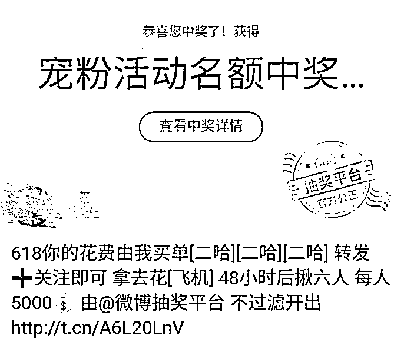
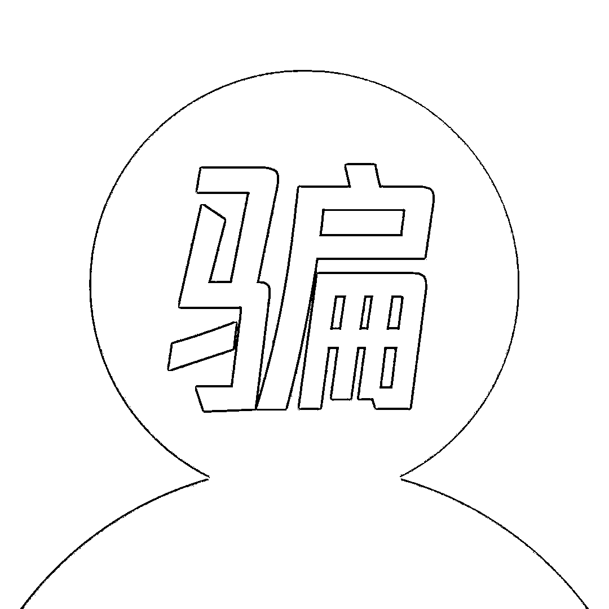
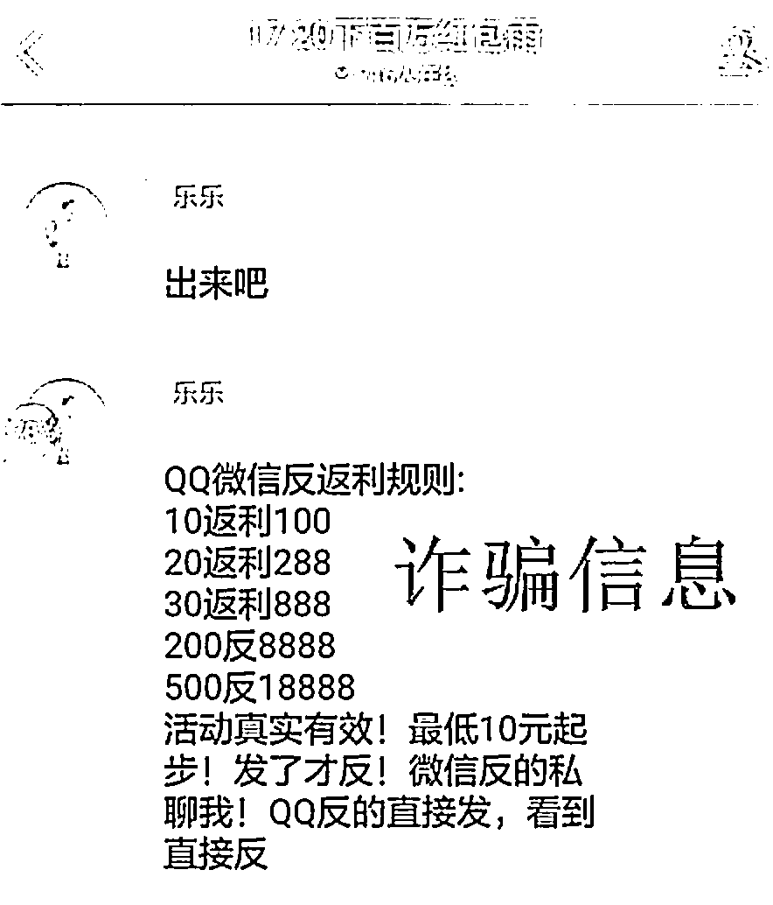
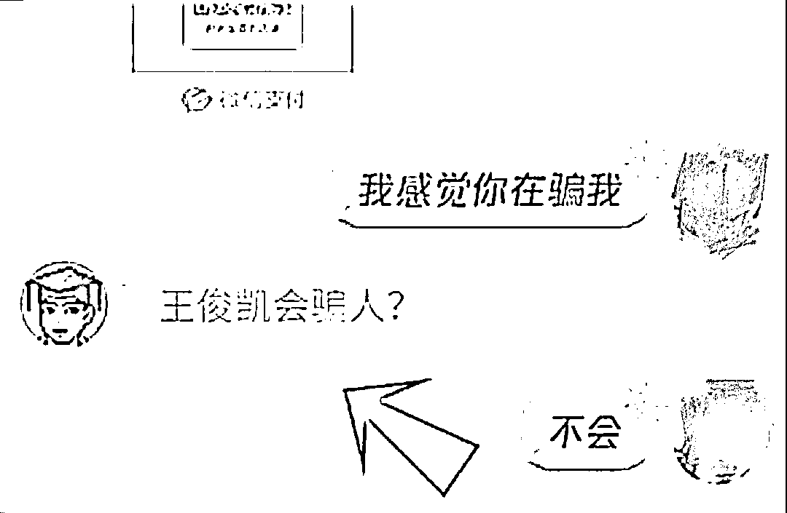
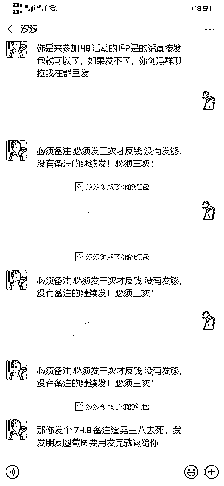
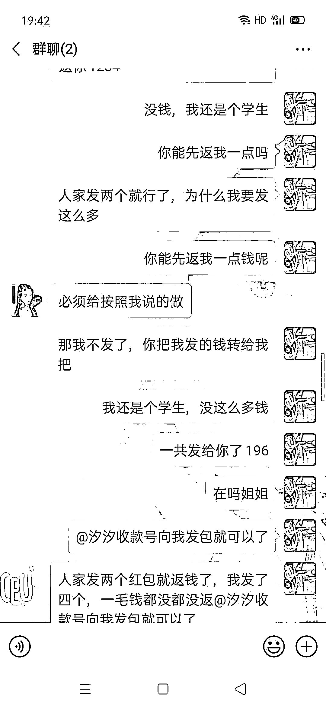
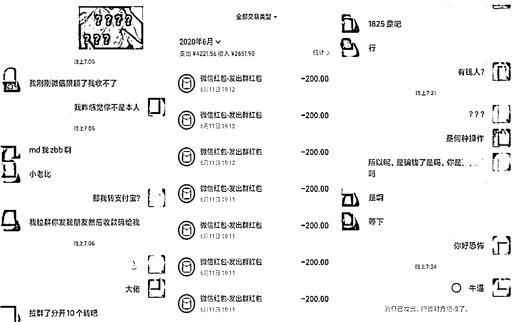
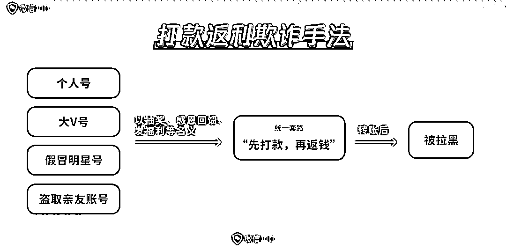

# 转发承包你一年零花钱 : 转账 1000 返还 10000？

> 原文：[`mp.weixin.qq.com/s?__biz=MzIyMDYwMTk0Mw==&mid=2247500187&idx=2&sn=abcdbde1c8c740f5cef9180510e3182c&chksm=97cb0aa3a0bc83b52eed9d4321efb9b8cb205467b9f1683a0a969b7810e33db5b1231f4b5737&scene=27#wechat_redirect`](http://mp.weixin.qq.com/s?__biz=MzIyMDYwMTk0Mw==&mid=2247500187&idx=2&sn=abcdbde1c8c740f5cef9180510e3182c&chksm=97cb0aa3a0bc83b52eed9d4321efb9b8cb205467b9f1683a0a969b7810e33db5b1231f4b5737&scene=27#wechat_redirect)

**点击上方蓝色字体免费订阅“灰产圈”**

前两天，还在读书的表弟突然炫耀，说自己被大 V 抽中一等奖，只要支付一点手续费，就能拿到一年的零花钱返现，真是一夜暴富！

一哥一听，一个马步向前就阻止了他：**这是一种返利骗局，不要上当！**

最近一哥接到的不少投诉，就是关于这种返利骗局，各位乘风破浪的家长们和兴风作浪的少年们都要提高警惕了。

**天下没有免费的午餐**

骗子利用豪华抽奖为诱饵，轻则骗取流量，在累积了大量关注之后清空帐号内容，改名换姓再卖出去；重则利用丰富奖品设下陷阱，让你亏得血本无归。

当你以为自己幸运中奖的时候，套路已经悄悄开始。

亲，你中的是宠粉活动名额哦

就是你给我转多少，返还你双倍

通知你“中奖”后，对方会声称这是一个福利活动，必须先转账才能有双倍甚至十倍现金返还。**当你打款过去，对方却在收款后火速将你拉黑。**

其实这种返利骗局已经不新鲜，但是狡猾的骗子会披上各种外皮，来欺骗不同的对象。**而社会经验少的学生群体，也更容易被这种高额返利诱入圈套。**

** 小同学，赚零花钱吗？**

疫情期间，全国的中小学生都开启了网课模式，骗子们却钻了空子，针对涉世未深的孩子设下返利陷阱。

一开始，他们会往群里发些小额红包，骗取学生们的信任，同时群里还有很多人“证实”能拿到返利，并配上收到转账的截图。

对于生活阅历较浅的孩子们，500 返 18888 这种夸张的数字是很有诱惑力的，很容易就上了当。

2020 年 5 月 19 日，警方成功抓捕了这起特大跨省电信网络诈骗团伙，抓获犯罪嫌疑人 16 名，冻结涉案资金 187.5 万元。

家长们教育孩子警惕网络上的陌生人的同时，**也要****做好自身手机支付的安全措施，莫轻易告知孩子手机支付密码、银行支付密码等重要信息。**

**爱豆竟然加我好友了？**

“易烊千玺”“迪丽热巴”“李易峰”亲自加你好友，并告诉你现在有个粉丝福利，参加活动不但可以和明星视频聊天，还能立刻拿到 3 倍于原金额的返利哦。

**醒醒，这种好事不存在的！**

冒充明星或明星工作室虚构活动，这又是一种针对学生群体的返利欺诈。

骗子将昵称改成明星的姓名后，就会有粉丝“上钩”主动加他为好友，他就虚构“粉丝福利”，让被害人扫描微信二维码转账，之后又以“名额不足，必须参加更高金额档次的活动”、“返利退款要等财务结算”等诸多借口拒绝返利、退款。

同学们想一想，爱豆们每天行程那么满，怎么会有时间亲自通知你参加活动，**遇到自爆明星牌的陌生网友，对方十有八九是骗子。****美女报复渣男，转账返十倍！**

朋友圈一位漂亮姐姐突然大吐苦水，控诉劈腿渣男并扬言要报复他，只要备注“520 ”“1314”并给她转账相同数额，她就会用渣男的钱返还你十倍。

当你信以为真转了账，对方却突然人间蒸发或者直接把你拉黑。

最后才会发现，哪有什么美女姐姐，背后不过是个抠脚大汉在利用你的同情心和一时贪念。

**熟人送福利，也是骗我？**

值得注意的是，这种骗术还有一个升级版：**盗取熟人帐号，学熟人说话方式骗取你的信任。**

案例如下：用户小 A 的表姐突然在朋友圈发了一张图片，表示自己正在做活动，只要转账给她就能双倍返款。

小 A 马上就心动了，试探着私聊了一下，“表姐”也用平时的说话方式回复她，所以小 A 没有多想就转账了。

 

原来，这位表姐被盗号了，骗子还学习了原用户的惯用语气进行欺诈，导致小 A 损失惨重。

**在微信和亲友涉及金钱往来时，大家务必要通过可靠方式确认是否本人，以免上当受骗。** **无事送钱，多半有诈**

骗子的话术虽然花样繁多，但是背后的套路都是一样的。

不管所用的理由是新店活动也好，宠粉福利也好，为了报复前男友也好，都是想诱骗你转账，之后再将你拉黑。

只要能记住天上不会掉馅饼，不起贪念，就能辨别出这些骗局。

**简言之，只要看到“转账给我，返还双倍”这种字样，前方 99%有个坑！**

所以同学们，放弃一夜暴富、天上掉馅饼的念头，踏踏实实搬砖才是正道呀！

最后，一哥也提醒大家，如果发现此类骗局，可以通过客户端和进行投诉，我们将在核实证据后尽快处理，一起维护健康的网络环境。

来源：微信 110

← 向右滑动与灰产圈互动交流 →

**点击****阅读原文****加入灰产圈高端社群**

