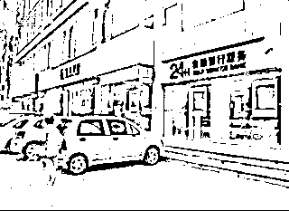

# 夜深了，银行卡被隔空盗刷了

> 原文：[`mp.weixin.qq.com/s?__biz=MzIyMDYwMTk0Mw==&mid=2247500187&idx=3&sn=478db5836223ceb4865b1ae432594d5a&chksm=97cb0aa3a0bc83b5c6c685eab63623b4c50bfe1df73678eba8fc4e62dcc0691a2549a25fabcf&scene=27#wechat_redirect`](http://mp.weixin.qq.com/s?__biz=MzIyMDYwMTk0Mw==&mid=2247500187&idx=3&sn=478db5836223ceb4865b1ae432594d5a&chksm=97cb0aa3a0bc83b5c6c685eab63623b4c50bfe1df73678eba8fc4e62dcc0691a2549a25fabcf&scene=27#wechat_redirect)

**点击上方蓝色字体免费订阅“灰产圈”**

1

[`v.qq.com/iframe/preview.html?vid=v310281h8cc&auto=0&width=500px&height=375px`](https://v.qq.com/iframe/preview.html?vid=v310281h8cc&auto=0&width=500px&height=375px)

近日央视焦点访谈栏目播发三亚警方侦破利用“嗅探”盗刷银行卡案，涉案金额 300 余万元的案件。

据报道，2019 年，三亚市公安局多警种协作，破获一起利用“嗅探”设备盗刷银行卡案，侦破案件 21 起，抓获犯罪嫌疑人 15 名，涉案金额 300 余万元。

2

**深夜，银行卡被隔空盗刷**2019 年 7 月 4 日 4 时许，被害人宋女士到三亚市公安局天涯分局三亚湾派出所报警，称手机突然收到两条短信，显示她的银行卡在第三方支付平台上无卡消费了 5 万元，为防止银行卡内资金继续被盗刷，她立即进行挂失，并第一时间报案。接到报警后，警方立即展开止损工作，快速联系中国银联查询资金走向。**经查，被盗刷的 5 万元进入了第三方支付公司——**通联支付网络服务股份有限公司**，目前仍在对方的对公账户上。民警立即采取相应措施，于当日 9 时许将被盗钱款冻结。**经侦查，**这笔资金是**第四方支付公司——广州冠晟网络信息技术有限公司**旗下的“米智付”代收业务模块发起的一个收款请求，**之后犯罪嫌疑人使用被害人宋女士的银行卡进行了支付。**虽然宋女士被盗刷的 5 万元已被冻结，但是谁盗取了她的钱？又是谁掌握了她的身份证号码、手机号码、支付动态验证码等信息？**带着这些疑问，三亚湾派出所副所长赵成良立即调取了犯罪嫌疑人在第四方支付平台注册的收款人信息。经查，在该平台上注册的张某曾于 2006 年遗失身份证，犯罪嫌疑人冒用了张某的个人信息实施作案。为侦破这起案件，三亚市公安局成立“7·4”盗刷案件专案组，根据线索开展缜密侦查，经过视频追踪和数据研判，最终掌握了第一名犯罪嫌疑人栾某的真实身份信息，并于 2019 年 7 月 17 日在广东惠州将其抓获，缴获大量作案工具。

3

**犯罪分子如何盗刷银行卡****三亚警方通过侦查发现，犯罪嫌疑人是通过一个叫“嗅探”的技术设备辅助实施盗窃的。****经查，“嗅探”是一个由笔记本电脑、手机、嗅探信道机射频天线组成的设备。该设备启动后，可以“吸附”方圆 1．5 公里内 2G 网络下非移动的手机，获取被害人手机实时收到的短信息、获取被害人手机的电话号码。犯罪嫌疑人再通过一些网站、APP 的漏洞和撞库的方式获得被害人的姓名、身份证号、银行卡号等信息，结合实时监测到的动态验证码，**在第三方、第四方支付平台上实施盗刷**。专案组民警通过大量的数据分析研判，一个藏匿在湖南益阳，同伙涉及海南、四川、山东、广东等地，利用“嗅探”技术实施盗刷的特大网络盗刷团伙浮出水面。****2019 年 7 月 28 日，专案组民警在湖南娄底将正在实施盗刷的陈某等 4 名犯罪嫌疑人抓获，并掌握了陈某下线周某的藏匿窝点。同年 8 月 8 日，民警在三亚开展抓捕工作，抓获了正在实施盗刷的周某等 4 名涉案人员，缴获“嗅探”设备 26 个。******

**4**

****谁提供了盗刷设备？**** **专案组民警经过进一步侦查得知，该团伙使用的“嗅探”盗刷设备均来自赵某。民警通过梳理线索，成功锁定了赵某的藏匿地点，并于 2019 年 10 月 8 日将其抓获。经查，赵某在网上购买手机主板、射频天线等设备后，自己焊接组装调试，再以每套 5000 元的价格出售。****此外，民警在陈某作案使用的电脑内发现几十万条包含银行卡号、手机号码、家庭住址等内容的公民个人信息。通过研判分析，民警锁定了涉嫌售卖公民个人信息的犯罪嫌疑人侯某。2019 年 11 月 11 日，专案组民警赶赴山东青岛、聊城开展侦查工作，将贩卖公民个人信息的犯罪嫌疑人侯某抓获归案。****至此，利用“嗅探”技术设备盗刷银行卡的 15 名犯罪嫌疑人全部落网，警方查获嗅探设备、银行卡、电话卡等一批作案工具，侦破案件 21 起，****涉案金额达 300 余万元。目前，陈某、栾某等 8 名犯罪嫌疑人被依法移送起诉；赵某等 4 名犯罪嫌疑人被批准逮捕；侯某等 3 名犯罪嫌疑人被依法刑事拘留。**

**5**

****如何防止手机被“嗅探”？********犯罪嫌疑人使用“嗅探”设备窃取一定范围内的手机用户短信信息，从中获取具体的手机号，然后用获取的手机号**登录一些支付平台**，再使用嗅探设备截获验证码，进而获取用户的姓名、身份证号、银行卡号信息，最后**登录第三方平台实施盗刷**。**********警方提醒，防止被“嗅探”盗刷，一定做好以下几点：**********1、平时要做好手机号、身份证号、银行卡号、支付平台账号等敏感私人信息的保护。********2、如果自己的手机信号忽然从 4G 降到 2G，有可能手机会受到攻击，请马上暂时启动飞行模式。********3、假如收到不明短信验证码，要马上意识到可能已被劫持攻击，并可考虑暂时关机。********4、如果早上起来，看到半夜收到奇怪的验证码短信，一定要想到可能是遇到短信嗅探攻击，如果发现钱被盗刷了，火速冻结银行卡，保留短信内容，报警。*********来源：焦点访谈、央视网、三亚发布*、支付界******************************

****← 向右滑动与灰产圈互动交流 →****

**************点击****阅读原文****加入灰产圈高端社群******

********