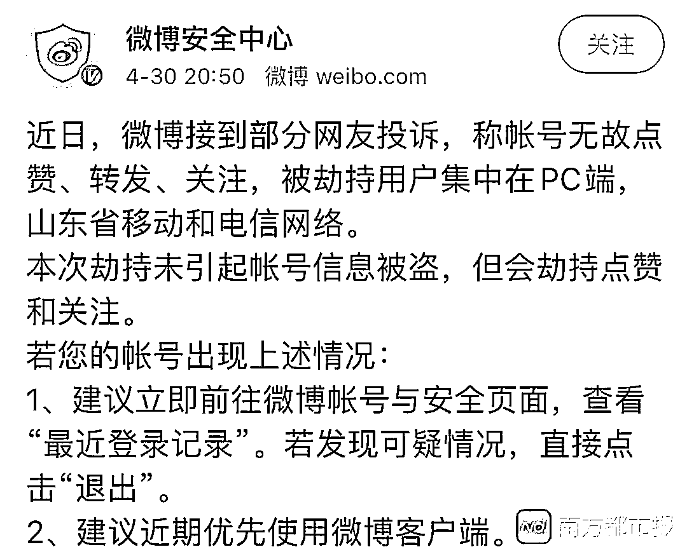

# 微博异常点赞调查：有人莫名点赞色情内容 20 元可买 500 粉丝

> 原文：[`mp.weixin.qq.com/s?__biz=MzIyMDYwMTk0Mw==&mid=2247500231&idx=4&sn=c553729b4cdb2a77bf2e0dcc9eef42b2&chksm=97cb0affa0bc83e992de8270673bb93f8f5e6b42a009939f743a2c32b42ee3805233352088fe&scene=27#wechat_redirect`](http://mp.weixin.qq.com/s?__biz=MzIyMDYwMTk0Mw==&mid=2247500231&idx=4&sn=c553729b4cdb2a77bf2e0dcc9eef42b2&chksm=97cb0affa0bc83e992de8270673bb93f8f5e6b42a009939f743a2c32b42ee3805233352088fe&scene=27#wechat_redirect)

**点击上方蓝色字体免费订阅“灰产圈”**

近日，有新浪微博用户反映，在不知情的情况下，自己的账号莫名自动点赞营销账号甚至色情内容。该用户表示，在尝试了微博客服中心给出的解决办法之后，异常点赞的情况并未得到改善。

南都记者发现，类似情况从 2017 年以来就频频发生。有安全专家表示，可能是网络被劫持、被不安全的第三方应用劫持、被撞库等造成的。用户避免使用统一密码、谨慎使用第三方授权、使用加密链接访问等方法或许可以改善这一情况。

文|李慧琪编辑|石莹

1

**微博用户莫名自动点赞色情内容**

近日，来自广东的小可（化名）在使用新浪微博时，发现自己的点赞记录里出现了很多非本人操作的异常点赞。点赞对象既有大 V 和公共机构，也有营销号，内容则涉及明星、最近大火的综艺、私家侦探广告等等，甚至还包括一些露骨的淫秽色情内容。

异常点赞内容包括最近大火的综艺《乘风破浪的姐姐》。受访者供图。

在微博上搜索“买赞”可以发现，近些年有过类似遭遇的网友数不胜数。有网友晒出截图，异常点赞大量集中在代购、修眉、丰胸、减肥、婚纱照等广告贴，以及关于明星的营销内容。而且，这些微博还有一个特点，虽然点赞数都在几千以上，但大都只有零星评论。

此外，南都记者在知乎、豆瓣等平台上也看到关于“为什么微博上会发生异常点赞事件”的讨论，很多网友都描述了自己的经历。

“（我的微博）从 18 年就开始有了，”小可告诉南都记者，“最近还是我朋友从我的微博主页看到的，她说‘你怎么点赞了一些关于色情的内容？’”小可认为，异常点赞对她的个人形象造成了影响，而且也侵犯了她的个人隐私。

小可认为异常点赞的色情内容对自己的形象造成了很大影响。受访者供图。

对于此类情况，微博客服中心建议用户升级客户端，及时更换密码，开启双重认证，清除第三方应用权限等操作。

“我按照提示，该做的都做了，但点赞的情况还在持续。”小可说。更让她生气的是，当她将上述情况投诉给客服中心之后，至今没有得到任何回复。

2

**专家：被网络劫持、被撞库可能是主要原因**

明明账号密码都掌握在自己手里，为什么会被别人拿去点赞？南都记者梳理发现，类似问题从 2017 年就时有发生。

微博官方账号@微博安全中心在 2017 至 2018 年间，公示过 3 批、近 400 个存在严重点赞异常的账号。当时微博称主要原因是“用户接入不安全的网络后被劫持”。

2018 年，浙江绍兴警方就曾破获一起黑产利用运营商管理漏洞劫持流量的案件，全国 96 家互联网公司用户数据被窃取，微博是其中之一。

据了解，该犯罪团伙将自主编写的恶意程序放在运营商内部的服务器上，当用户的流量经过运营商的服务器时，该程序就自动运行，从中清洗、采集出用户 cookie（用户登录网站论坛之类的账户密码等数据记录）等关键数据。下游公司就会利用已泄露的数据操控用户账号在微博等社交平台上点赞、关注等。

今年 4 月 30 日，@微博安全中心再次发通告表示，近期被劫持用户集中在 PC 端，山东省移动和电信网络。虽然未引起账号信息被盗，但会劫持点赞和关注。

对于出现异常点赞的其他可能原因，全知科技 CEO 方兴告诉南都记者，有些是用户账号已经被盗，有些是用户自己的密码比较弱被猜解了，还有些可能是第三方的问题。比如，被不安全的第三方应用劫持；再比如被撞库，也就是黑客利用第三方已经泄露的个人信息去撞库，如果密码相同的话就可以匹配成功。

3

**20 元可买 500 个“真人”粉丝**

不为盗号，而是被“借”去给其他号点赞、加关注，其实是制造虚假流量的一种常见手段。

“点赞是和流量直接相关的”，北京汉华飞天科技有限公司技术总监彭根告诉南都记者，有一些专门做刷量的公司，专门通过给特定账号涨粉、点赞、转发、评论挣钱。

南都记者搜索发现，买微博粉丝等灰色手段现在仍然存在。比如一名卖家将微博粉丝分为初级、高级、顶级和精品等各种级别，其中顶级和精品均为真人微博，自带粉丝和博文，高级微博只有头像，初级则仅为凑数。其中，最贵的顶级活跃粉丝 500 个 20 元，而且卖家承诺 1 小时内就可以完成涨粉。

被测微博一小时内涨粉 500。

该卖家还告诉南都记者，即使微博自动清粉，这些粉丝也不会被清理。南都记者实测发现，在使用微博的“修正粉丝”功能后，新增的 500 个粉丝中，只有 30 个粉丝被清理掉。

此外，南都记者还从新增粉丝中随机挑选了 10 个，并向对方发去私信，结果一天之内没有任何粉丝进行回复。有熟悉黑产的安全专家告诉南都记者，卖家所称的“真人粉丝”虽然经常更新博文，像是真人在操作，但其实也是黑灰产从业人员用机器刷出来的。

在去年 7 月的腾讯安全沙龙上，腾讯网络安全与犯罪研究基地高级研究员张宝峰曾介绍，随着整个互联网产业技术策略对抗的不断升级，虚假流量的黑灰产运作也在更新。

他讲到，最新的刷量手法为人工刷和机器刷相结合——先通过人际网络渠道搜集、雇佣或租赁大量真实账号，将这些账号与下游的刷量平台相对接，再通过刷量平台自动进行涨粉、转发、打卡以及点赞、打榜等。

**安全小贴士：**

为了预防微博异常点赞等风险，隐私护卫队建议：

**1\. 避免使用统一密码**。我们建议大家在填写密码时，可以按照重要程度进行区分，避免因一个网站信息泄露而影响其余应用的账号。

**2\. 谨慎使用第三方授权。**在通过微博、微信、QQ 等账号登录一些网站和 App 进行第三方授权时，该网站并不会获取你的密码，但很有可能向你索取一些看似必要实则涉及隐私的信息，有些网站可能会利用这些信息进行不正当行为。

**3\. 使用加密链接访问。**为防止网络通信劫持，在电脑上访问网站时，如果该网站支持 HTTPS（超文本传输安全协议），就要尽量使用加密链接访问。具体方法就是，在网址前手动加上“https://”。

来源：隐私护卫队

← 向右滑动与灰产圈互动交流 →

**点击****阅读原文****加入灰产圈高端社群**

