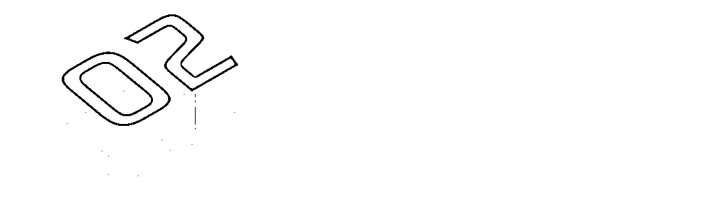

# “孩子，这并不酷”！在奔涌的路上，你们可能会遇到这些险滩

> 原文：[`mp.weixin.qq.com/s?__biz=MzIyMDYwMTk0Mw==&mid=2247500295&idx=1&sn=c769497bc7e4d05025b15dd882ab8e39&chksm=97cb093fa0bc80297307d00e66dba3e791728b18fcec58cca7be20f16160dfa086a725b8d290&scene=27#wechat_redirect`](http://mp.weixin.qq.com/s?__biz=MzIyMDYwMTk0Mw==&mid=2247500295&idx=1&sn=c769497bc7e4d05025b15dd882ab8e39&chksm=97cb093fa0bc80297307d00e66dba3e791728b18fcec58cca7be20f16160dfa086a725b8d290&scene=27#wechat_redirect)

**点击上方蓝色字体免费订阅“灰产圈”**

**香甜可口的“奶茶”、好玩有趣的“跳跳糖”、另类奇特的“邮票”、色彩斑斓的“彩虹烟”…… 看到这些新奇古怪的新鲜玩意，你是否也曾“跃跃欲试”？** **“尝一口，不会上瘾的”、“这就是一种新型的小零食”、“连这都不敢，是不是瞧不起我们”……听到这些“热情的邀请”，你是否会选择“加入队列”？**然而，哪怕只是一次好奇的尝试，留下的却将是终生难愈的身体伤害和追悔莫及的人生。因为，这些看似“酷炫”的物品，其实都是可怕的**新型毒品**！近年来，新型毒品裹上了“装酷神器”“放松药剂”“社交用具”的外衣，不断变换包装形态，以**青少年**为主要目标受众，潜入了 KTV、网咖、酒吧、歌舞厅等娱乐场所，甚至流通至校园之中……

[`v.qq.com/iframe/preview.html?width=500&height=375&auto=0&vid=l31040l3ggm`](https://v.qq.com/iframe/preview.html?width=500&height=375&auto=0&vid=l31040l3ggm)

**变换形态伪装升级****新型毒品、伪装毒品瞄向青少年***“一瓶小小‘开心水’，只要喝上一口，轻松自在，精力十足！”*刚才视频中主人公的遭遇可真不是胡编出来的，现实中真的出现过相关案例。近日，一名女高中生向警方举报说，之前收到朋友的生日邀请，约她去 KTV 喝酒。到了包厢，她跟大家敬了几杯酒后，朋友让她喝点饮料，说是芒果汁兑雪碧，她尝了尝确实没有什么不妥，便一口气喝完，没过多久，**视线开始变得模糊，身体有点飘**，她怀疑被下药，赶紧离开。后来她问朋友，朋友告诉她这其实是“**开心水**”，喝了能够**变得“开心”**，**缓解压力，感到“精力十足”**。她在网上搜索后发现，朋友所说的“开心水”，其实就是**毒品**。**“开心水”也被叫做 HAPPY 水**，是一种无味、透明、液态的毒品，一般含有冰毒、氯胺酮、苯丙胺、MDMA 等毒品成分中的一种或者几种。 不同案件缴获的 “开心水”中的成分不尽相同，有的甚至存在较大差异。由于“开心水”的成分多为中枢神经兴奋剂，服用后可以兴奋人的中枢神经，具有欣快、警觉和抑制人食欲等一系列作用，重复使用会使人上瘾。 “开心水”中毒一般表现为**多话、头痛、错乱、高烧、血压上升、盗汗、瞳孔放大、食欲丧失**等。如果大剂量使用会引起人**精神错乱**及**思想障碍**，有人会出现类似于妄想性精神分裂症的情况，变得多疑并出现种种幻听。而接下来的这类新型毒品，因其**异常“上头”**，造成的危害更不能小觑。
*“一支小小电子烟，一罐黄色液体，只要吸上一口，就能出现‘飘飘然’的眩晕感，贼上头！“*5 月 13 日，新疆乌苏市查缉民警在开展日程工作时，缉毒犬对一辆小轿车反应强烈，随后警方在车内查获到内有黄色液体的电子烟杆一枚，经询问，车主是一名“**未返校大学生**”，查获的电子烟正是从朋友那购买的特制“**上头电子烟**”。经了解，这种“上头电子烟”之所以在一些青少年群体中流行，是他们觉得这是一件“很酷”的事情，可以在朋友前吹嘘、“耍帅”。这种特质的“上头电子烟”外观看似与普通“电子烟”无异，抽起来反应却异常强烈，具有“**令人舒适的奇特功效**”。**但****“上头电子烟”****，****其实就是臭名昭著的“大麻电子烟”****！**“上头电子烟”烟油内含有稀释的四氢大麻酚或合成大麻素，这类物质正是“毒品大麻”的有害成分。**致幻能力**和**成瘾性**极强，吸食后可引起**判断力下降**、**意识模糊**和**精神障碍**，诱发车祸、自残及暴力行为，过量吸食可导致昏迷甚至死亡，长期使用还会增加患心血管系统疾病及癌症的风险。早在 2017 年，媒体就曾报道过，新西兰的奥克兰地区一个月内接连出现了**9****起吸食合成大麻后死亡**的事件，足见此类毒品的恐怖之处。根据《**2****019****年中国毒品形势报告**》，截至 2019 年底，中国现有吸毒人员 214.8 万名，**18 岁到 35 岁 104.5 万名，占 48.7%**。同时新类型毒品不断出现，如含 LSD 成分的 “**邮票**”、向学生兜售的“**聪明药**”以及逐渐蔓延的“**0 号胶囊**”、“**G 点液**”、“**犀牛液**”等色胺类物质，品种五花八门。

为了吸引消费者、迷惑公众，不法分子对新型毒品进行了以下三大升级。
1、**食用方式日趋简易**，大多为片剂或粉末，吸食者多采用口服或鼻吸式；2、**包装外形“迷惑性”强**，植入寻常物品之中，降低消费者警惕性；3、**以“娱乐性”掩盖“毒性”**，利用“酷炫有趣”的外表和功能吸引年轻人注意。以下这些，也是类似“上头电子烟”、难以辨别真身的新型毒品：“彩虹烟” 像香烟一样包装新奇、颜色丰富的“彩虹烟”，吸起来能散发出浓浓的香气，而且还有特殊烟雾，看起来极其酷炫。实质上它是一种由**毒品混合而成的新型毒品**，**少量吸食即可成瘾**，且危害比一般毒品都要大。 “奶茶”“奶茶”类毒品外观与平时所见的速溶奶茶几乎一模一样，是粉状类的混合毒品，有浓郁的奶茶香，实际上主要成分是氯胺酮，能让人**极度亢奋并且持续时间长，非常容易上瘾**。**吸毒→成瘾→以贩养吸****穿着无害的伪装服、戴上绚丽有趣的面具，经过毒贩精心打造的新型毒品，纵使是心智成熟的成年人也很难单从外表就准确分辨，而**缺乏社会经验、自我保护能力较弱**的青少年们更是极易中招。****更可怕的是， 一旦沾染上毒品，不仅会遭受身心健康的双重摧残，还可能坠入**以贩养吸**的深渊，成为不法分子犯罪的工具……********小肖是一名 18 岁的在校大学生，一次朋友聚会上，他认识了一位出手阔绰的“大哥”，大哥常请小肖喝酒吃饭，两人相谈甚欢；不久后，在大哥的鼓吹和诱惑下，抱着“好玩”的心态，小肖开始食用一种“**饮料**”，每次喝完小肖都觉得自己“**快乐兴奋、飘然欲仙**”。**

****

**几次之后，小肖发现，自己已经离不开这种“饮料”了；而这时，大哥早已不愿意再免费提供。为了能继续喝到“美味神奇”的“饮料”，小肖开始**介绍同学来购买“饮料”以此赚取抽成**，并且在大哥的安排下，协助他完成“饮料”的进货、出货。** 

**这种所谓的“饮料”，实际上是一种混入摇头丸的人工合成毒品。最终，小肖因涉嫌“**贩卖毒品罪**”，被判处有期徒刑三年。大好前途就此断送，花样年华只能在狱中度过。********事实上，为了谋求更大的利润，近年来，不少不法分子会将这些新型毒品做为“引导性角色”来诱惑受害者，目的是待受害者“毒瘾”日益加深后，成功控制对方，再利用其进行“**扩客**”、**贩毒**，**将毒品产业链条延伸至青少年群体之中**。**** 整个作案流程大致是这样的👇****1、**主动搭讪，诱导吸食**：首先，不法分子会潜入 KTV、酒吧等娱乐场所，以“结交好友”等理由，瞄准青少年群体进行搭讪，并主动提供酒水、饮料、零食、香烟等藏有毒品的物品诱导其吸食。 ****2、**获取信任，加深毒瘾**：随后，逐步与受害者培养感情，并在这之中免费提供一些“软性毒品”，让其感受致幻快感，待获得信任后，再逐步诱导吸食成瘾性更强、毒性更高的毒品。 ****3、**成为代理，以贩养吸**：等这些青少年上瘾后，不法分子便要求他们支付高昂费用购买，由于大部分青少年财力有限，往往不久后便“难以支付”。这时，不法分子便告知只要“协助推广”就可以免除一些费用，吸纳受害者成为自己的下级代理。 ****4、**发展下线，扩散传播**：接着，再指导这些成为“一级代理”的青少年利用自己的人际关系进行传播，例如在学校内分发含有毒品的糖果、奶茶、果冻等食物、饮品，诱导更多青少年吸食毒品，不断发展“下线”。 ****根据**《中华人民共和国刑法》**第三百四十七条规定，走私、贩卖、运输、制造毒品，**无论数量多少，都应当追究刑事责任，予以刑事处罚。****

> **2020 年 5 月，杭州警方通报了一起整治“笑气”案件，涉案人员中，“90 后”占七成、“00 后”占二成。女大学生小梁为筹钱吸“笑气”，不惜卖身，甚至介绍他人“卖淫”抽成。****2019 年 10 月，被告人覃某因吸毒成瘾无钱购买毒品，竟对一名出租车司机实施了抢劫、杀害，最终被最高人民法院判处死刑。****自 2011 年起至今，广西玉林市的宁某为了吸食毒品，一次次盗窃财物，前后已有五次进牢房的经历。**

**一旦被毒品控制意志，伴随而来的犯罪不仅仅只有贩毒，还有**盗窃、卖淫、抢劫、诈骗……************“随波逐流”不叫“酷”********敢于拒绝诱惑才是真“酷”*******“我只是好奇，想着只吸一口应该没事。”******“朋友们都在吸，我不吸就是不合群！”******“爸妈常年在外都不管我，他们不让我干啥我就偏做。”*****我们一定要正确认识到，**“吸食毒品不仅不酷，更是一件危害自己、亲友、社会的事，敢于拒绝才是真酷”**，只要触碰到毒品这条底线，等待着吸毒者的就唯有自我的毁灭和法律的制裁。** **同时，我们也要提升自我保护能力，做到以下几点免于毒品危害：**** **∇**********1、识物****** **与时俱进，父母与孩子都要不断了解新型毒品的相关资讯，学习有关毒品的相关知识，同时，对于一些新鲜事物保持警惕，不随便尝试。********2、识人****** **学会如何辨别吸毒人员，不随便靠近闲杂人等，对于突然接近的陌生人，不随便接受他们的任何东西。********3、识****地********酒吧、KTV、网吧、迪厅，都是涉毒高频场所。在外吃饭，饮品、食物勿离开自己的视线。********4、识法********主动了解、学习有关毒品的政策和法律法规，明白涉毒违法犯罪的危害和后果。掌握涉毒线索要及时举报。**********面对毒品诱惑不上当********面对他人怂恿不动摇********面对吸毒贩毒敢举报****

****那才是真正的酷****

**做“最酷“的年轻人，正值 6·26 国际禁毒日之际****让我们一起，对毒品大声说**“ NO，你不酷”！******守护青春，不仅要远离毒品危害，还要记得修炼“识毒功力”！想知道面对“毒品”，你有几成“功力”了吗？****快扫描下方**二维码**或点击“**阅读原文**”，获取国家禁毒办官方微信中国禁毒微信、央视社会与法频道《亮剑行动 2020》、腾讯守护者计划、和平精英联合为大家送上的“防毒知识锦囊”，一起 get 禁毒新知识！********来源：守护者计划**************

**← 向右滑动与灰产圈互动交流 →**

********点击****阅读原文****加入灰产圈高端社群****

****