# 抖音小姐姐请“喝茶”背后，我们翻出了一整条 O2O 招嫖涉黄产业链

> 原文：[`mp.weixin.qq.com/s?__biz=MzIyMDYwMTk0Mw==&mid=2247500295&idx=3&sn=452be19389371525c39fb7c57403b1fc&chksm=97cb093fa0bc80296861bc7265c815427ecd9fda8ac5c2f73ef4bd7ea7c13fd36d5a3eb85eee&scene=27#wechat_redirect`](http://mp.weixin.qq.com/s?__biz=MzIyMDYwMTk0Mw==&mid=2247500295&idx=3&sn=452be19389371525c39fb7c57403b1fc&chksm=97cb093fa0bc80296861bc7265c815427ecd9fda8ac5c2f73ef4bd7ea7c13fd36d5a3eb85eee&scene=27#wechat_redirect)

**点击上方蓝色字体免费订阅“灰产圈”**

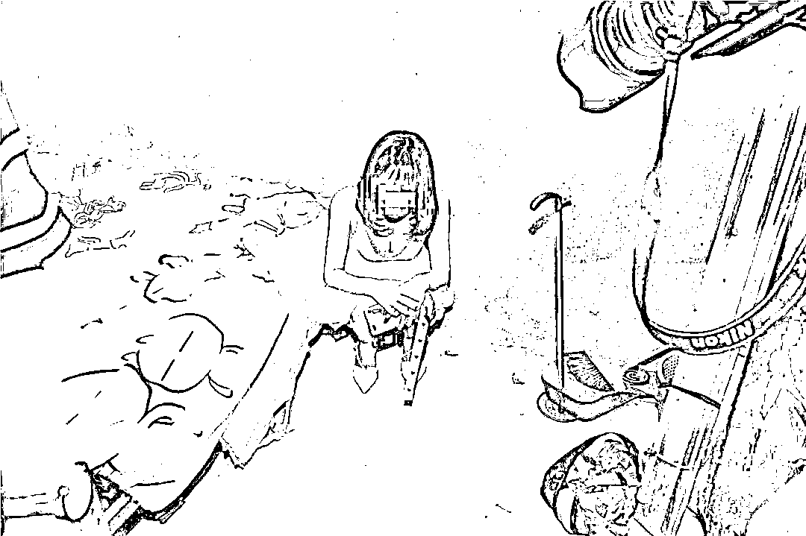

图片来源于网络

6 月 23 日，据国家网信办信息，“疯播直播”、“欢乐直播”、“花椒直播”、“虎牙直播”、“斗鱼直播”、“哔哩哔哩”、“映客直播”、“CC 直播”、“西瓜视频”、“全民小视频”存在传播低俗庸俗内容等问题，未能有效履行企业主体责任。

国家网信办、北京网信办、广东网信办则宣布先后约谈了 10 家网络直播平台，并要求“花椒直播”等平台限期整改，这次针对的主要是直播乱象问题。

而在不久前，公众号”凤凰 WEEKKLY 财经”在《暗访网络色情直播......》一文中揭示了色情直播产业链的疯狂。**足见当下直播、短视频等网络平台上乱象横生。**

**而相比直播平台的低俗、色情直播而言。通过抖音等短视频平台以 O2O 模式进行网络招嫖则更具隐秘性，监管执法难度不小。**

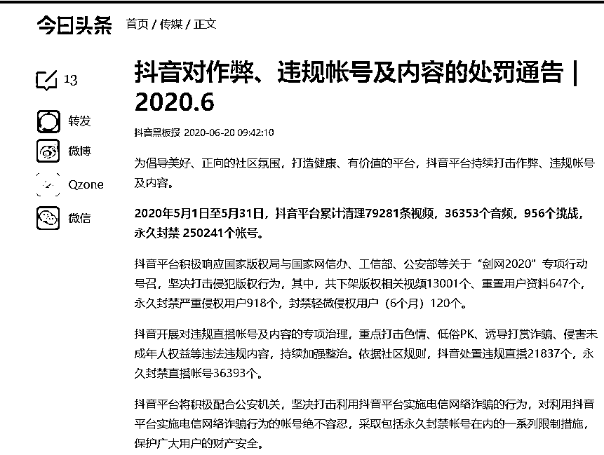

6 月 20 日，抖音官方公布了对作弊、违规帐号及内容的处罚通告。

为了了解平台打黄扫非的进展，以及 O2O 招嫖的更多信息，6 月 21 日晚，我重新装上卸载已久的抖音。。。。。。

不想，我发现不少抖音账号居然在卖“茶”，一时间，睡意全无。

**01**

**我在抖音上看见新的“茶”文化**

有时候，不得不感慨中国文化，博大精深。

2019 年 11 月，郑州警方打掉一个网络招嫖团伙，抓获犯罪嫌疑人 20 多人，揭开了网络“喝茶”的神秘面纱——原来很多时候在网上与人搭讪，“喝茶”和“茶叶”并非指常说的“喝茶”和“茶叶”，它们跟“你今天来喝茶吗？”、“最近茶叶怎么样？”、“最近有新茶”等一起成了网络招嫖暗语。

让我诧异的是，昨晚在抖音首页同城随便逛了逛，就发现不少账号或明或暗都在以“茶”为名，干“卖茶”之事。

这里随便放上几个账号给大家看看，大家就能看出其中的相似之处。

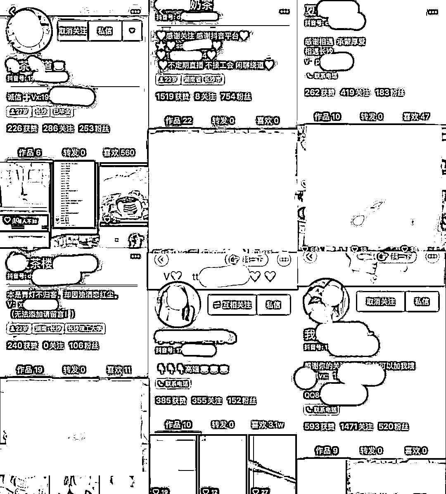

**首先，从账号名和账号介绍来看，“茶”是共同的重要关键词。**

比如有的账号名自带“茶”字，如“茶 X 卉”、“XX 茶楼”、“品茶 X 道”；有的账号在介绍中有“茶”的暗示，如放上一个“喝茶”的表情符号。

**其次，从联系方式来看，这些账号都会留有其它渠道的联系方式，主要有微信号、QQ 号以及电话号码****。**以微信号为例，有的直接以“VX”作为提示，有的则是放上一个红心表情。有些直接出现在账号介绍中，有的则放在账号背景图上。

**再者，从账号内容上来看，账号内容普遍不多，内容形式也大同小异。**一般就是晒各种大胸、长腿妹子的性感照片，其中有很多是从网上扒下来的，在抖音账号介绍有些会特别注明。并且在内容留言中，也不乏有懂的用户在留言咨询，有些留言更是充满暗示。

不过，看到这里，我还是很好奇，难道这么简单就可以喝到“茶”？怀着将信将疑的态度，我试着加了几个微信号，没想到出乎意料的顺利。

**02**

**“喝茶”毫无门槛，小白也能轻松上手**

说实话，作为茶道小白，本人并无网上“喝茶”经验。因此，加第一个抖音账号上提示的微信时，心中比较忐忑，担心会不会通过，会不会有很多我不懂的暗语，会不会搞错被人骂色狼。毕竟我只是一个只知道“喝茶”这个关键词的小白。

但是，现在看来担忧纯属多余。

当我按照提示微信号搜索，搜到的是头像为大胸妹子的公司 A 的女业务员，在好友添加界面没有其它提示，按下添加按钮后，几秒钟就通过了。对方很有礼貌喊了我一声“哥”，当时觉得心里就很甜。

不过，回复时我犹豫了。

我先是打上“喝茶？”，但在点发送按钮时又觉得不妥，心想万一对方是良家宠粉小姐姐，就有点唐突佳人了。

想了片刻，觉得还是改成“喝茶”的表情符号更恰当，并且再三斟酌，还在表情后加上“？”。毕竟文字太露骨，表情就好说很多。万一搞错，晚上送杯茶最多算是个不恰当的问候，无伤大雅，尚有回旋余地。

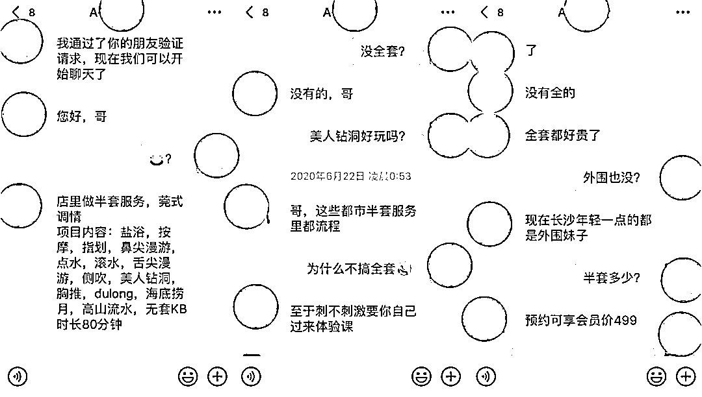

**没想到进展非常顺利。**

妹子非常善解人意地给了我想要的答案“店里做半套服务，莞式调情，项目有盐浴、按摩、美人钻洞、高山流水、海底捞月......”其中有些项目我看得懂，有些我完全是看不懂的，有些像是常规按摩项目，有些则好像有点“超纲”。

由于不太确定是不是我想的那样，于是弱弱地问了一句“没全套？”并试图搞懂“美人钻洞”是啥意思。随后被告知没有全套，全套好贵的，而“美人钻洞”则是都市半套服务常规流程，让我这个小白汗颜不已。

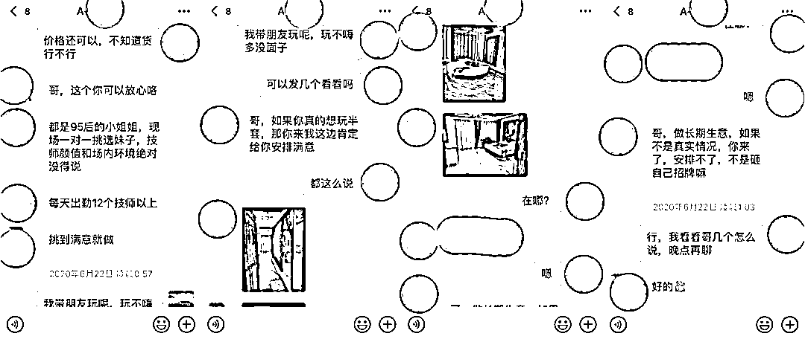

为了证明我不是小白，我又接着问有没有外围，毕竟外围女这个词我还是知道的。很遗憾，外围也没有。

好在价格还算公道，预约会员价 499 元，80 分钟。**并且对方告诉我都是 95 后小姐姐，每天出勤 12 个以上。**

**美中不足的是，当我提出要先看小姐姐照片时，被告知只能现场一对一挑选，并表示只要过去，保证安排满意，毕竟是做长期生意，不能砸自己的招牌。**交谈中对方还发了几张环境图给我看了看，随后把地址连带也发给我。

**这番交谈下来，给我最大感触是，通过抖音”喝茶”简直毫无门槛，像我这样的茶道小白也能轻松上手。**

不过，从对方介绍的服务来看，好像是介于按摩与网嫖之间。因此，我并不确定，是否如我所想，于是我又顺着抖音账号上的线索加了另外几个微信。

**03**

**从“到店”到“到家”差异化服务，团队化、在线化揽客成主流**

如果说前面那位小姐姐给我开了一扇通往抖音茶馆的“窗”，那么接下来成功添加的这几个业务员则为我打开了一扇门，他们让我彻底走进了这个“云茶馆”，并感受到了其中的磅礴“生机”。

**第二个加好友的是公司 B 的男业务员。与上一个女业务员相比，男业务员显然要更主动。**

在微信好友通过后，他就直接问我过去玩吗。我也不含糊直接问他在哪，对方便发了一个酒店地址给我。接着又问我去不去，并且直接报价格——**1300 到 2000 不等莞式全 T90 分钟不限次。其中价高的妹子长得好些，并有相应的的特色服务，当然外围也能安排。营业时间从下午 2 点到凌晨 3 点。**

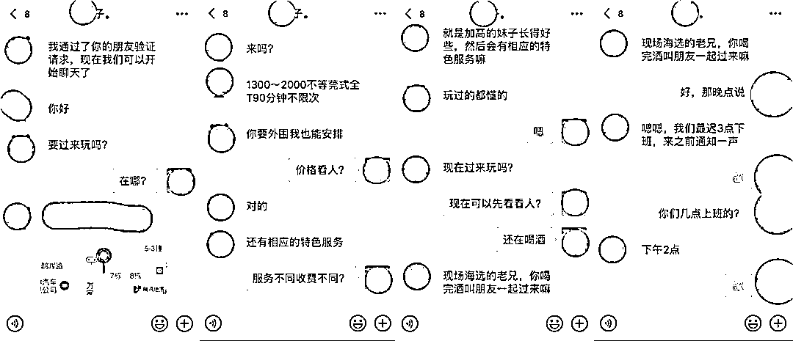

**从运营模式来看，相比 A 公司只提供半套服务，B 公司提供的是全套服务，这是两者业务上不同点；相同点在于两者既支持到店消费，也支持“到家”（外围）服务，并且都只能现场选“茶”。**

**接下来加的这个公司 C 的小姐姐表示只做外围，即“到家”服务。**

最开始，我以为是她个人接单，便在她朋友圈里找到一张照片，问是不是她。结果人家告诉我那是妹子，她只是业务员。

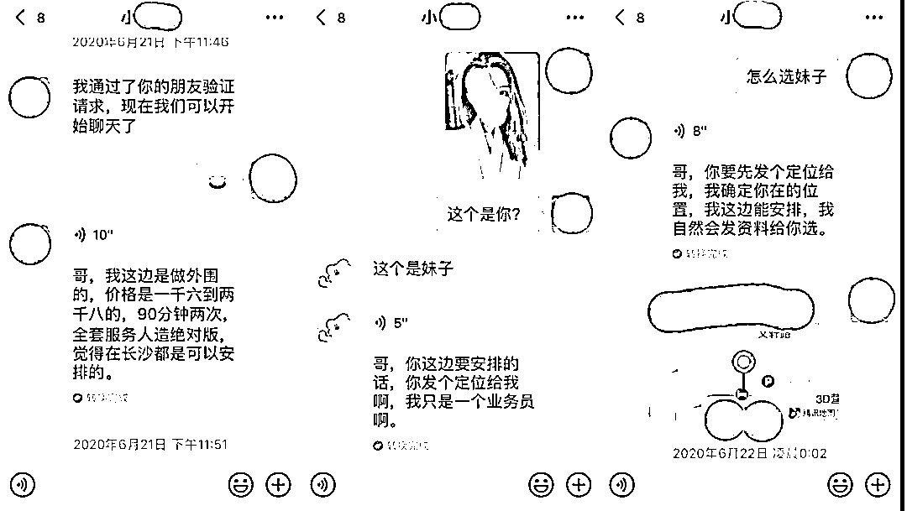

由于是专做外围，不用想着引流到店消费，C 公司在选妹子非常方便。当我问她怎么选妹子，对方让我先提供住处，然后丢给我一个腾讯小程序，里面满满的都是妹子，其中信息是被加密的。

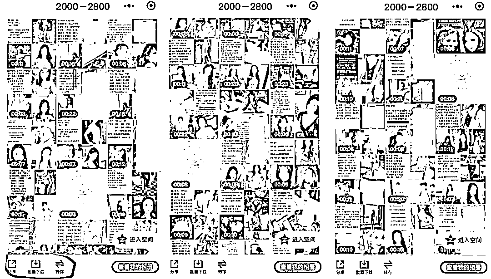

通过对方提供的密码，我顺利解锁查看妹子信息。在这里面，我大致数了下，有不下一百个妹子的信息，并且每个妹子都采用图片、文字和小视频三种方式予以介绍，非常详尽。

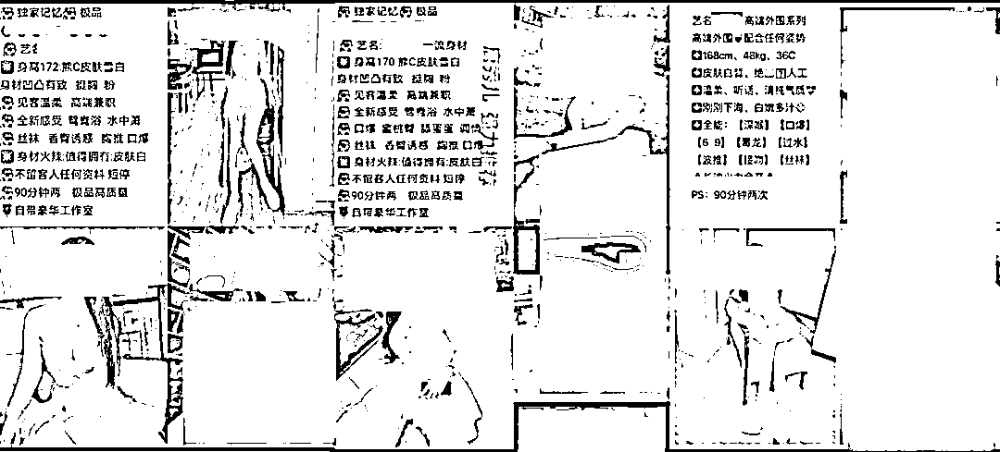

以上图为例，左上角是文字介绍妹子艺名、身高、身材、皮肤、服务项目等。其中包括是暂时停留（短停）还是常驻，是否自带工作室，是否是高端，接受正常服务还是各种特色服务。如第三个妹子文字介绍为高端外围、全能、配合任何姿势，并且重点标注是刚刚下海。

在左下角和右上角则分别是妹子的清凉照片，右下角则是妹子的小视频，一般在 8-20 秒之间，视频中，妹子会带有一定的撩人动作。值得一提的是，妹子信息是可以下载（含批量下载）、保存和转发的。

**相比 A 公司和 B 公司，C 公司已经完全实现了在线化揽客，从获取服务内容和地址，到选人都能在网上完成，最后只差线下消费了。这将大大提高揽客效率，并且进一步降低消费门槛，更具有隐秘性。**

**随后加的 D、E、F 公司业务员都表示，既可以提供到店服务也提供到家服务（外围）。**给我印象最深的是一个号称能解决深广南京长沙上海多城市的连锁服务 D 公司。

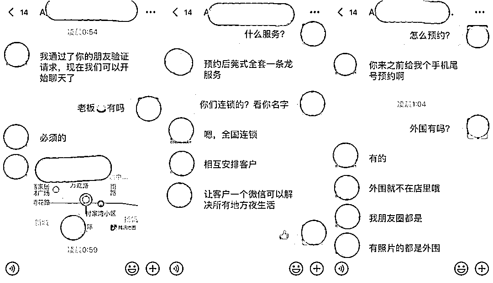

**在交谈中据其业务员介绍，他们是全国连锁，可以相互安排客户，让客户一个微信可以解决所有地方的夜生活，这是前三家公司没有提到的。**

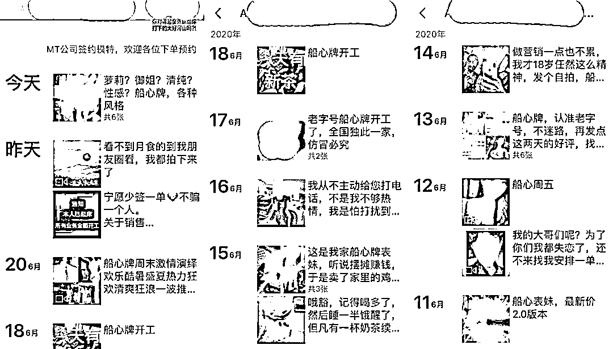

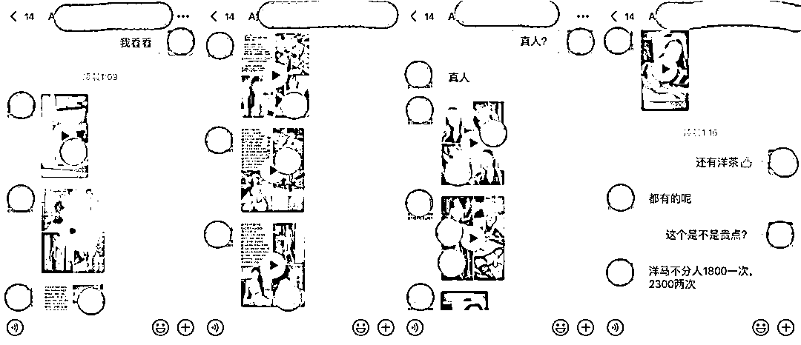

此外，D 公司可以通过朋友圈和微信直接选妹子，我看见他微信号上给这些妹子的介绍是“**MT 公司里的模特**”。

对方表示他朋友圈有照片的都是外围，随后还通过微信给我发送了一些妹子的视频，其中还有几个外国妹子。当我问是不是外国妹子要贵点，对方表示价格都一样——1800 一次，2300 两次。并且预约非常简单，只需提供手机尾号即可。

E 公司同样支持场子玩和外围玩，其中外围是高端兼职，价格为 1600-2600。如果包夜的话，价格是双倍。

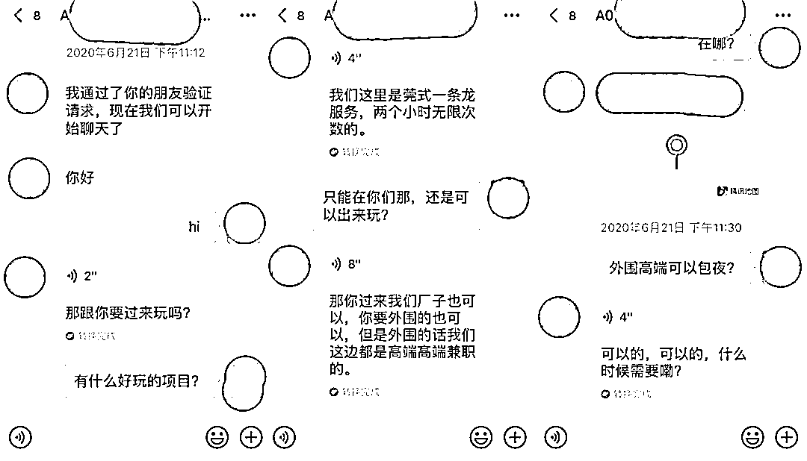

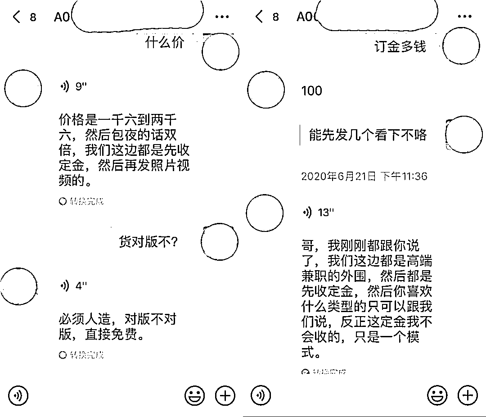

**不过与 D 公司不同的是，E 公司预约需要先交 100 元定金。**当时我在想，如果定金交过去，对方不退，手中又有你的招嫖聊天记录，是不是又会是另一种套路，当然这个我并未证实。另一家 F 公司同样支持到店和“到家”两种服务，并且支持多人运动，价格是双倍。

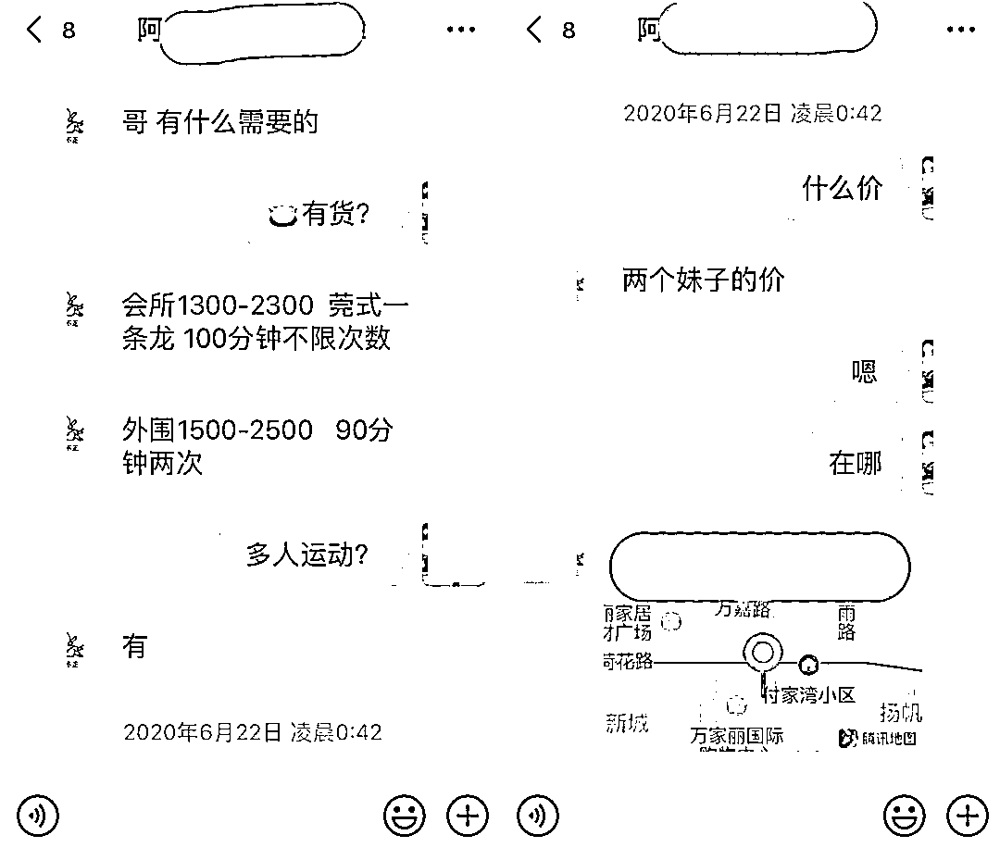

纵观上述这几家公司，虽然同样干着“卖茶”的活，但从服务内容、方式到揽客方式各有异同，具体体现在以下几方面。

**首先，服务内容不同。其中 A 公司只提供半套服务，其它公司都提供全套服务。**

**其次，服务方式不同。如 A 公司只提供到店服务，C 公司只提供到家（外围）服务，其它公司则既提供到店服务，又提供到家（外围）服务。值得一提的是 D 公司还支持多地连锁服务。**

**最后，揽客方式在线化程度不同。虽然都是通过抖音引流到微信，但在选人方面有所差异。**

如 A 公司和 B 公司不能在线选人，属于半在线化揽客。**不过这并非它们不能，而是它们提供的只有到店服务。**而其它公司基本可以完成线上揽客，只等线下消费即可。

**此外，上面联系的六家公司，都是公司化操作，并无个人。这说明通过抖音“招茶客”团队化作战是主流。**

**04**

**猫捉老鼠的旧游戏，O2O 模式下网络招嫖几时休？**

看来，这场猫捉老鼠的旧游戏，如今有了新难度。“螳螂财经”认为主要体现在以下方面：

**第一、多级网络渠道跳转，让传播链条更具隐秘性。**

客观来说，平台监管肯定是存在。比如在我随机关注的十几个抖音账号中，有些账号提供的微信号添加不了，大约占总数的三分之一左右。

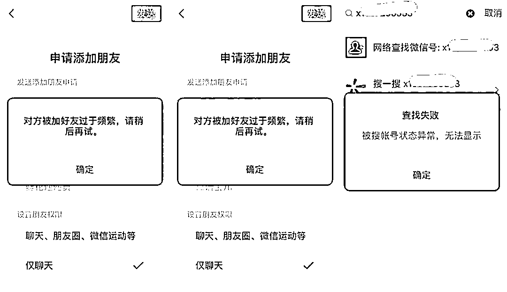

**但是，上有政策，下有对策。**

很多抖音账号对此早有预料。如留电话，则可以直接通过电话获客；还有留下多个微信、QQ 号；有些抖音账号提供的微信号手段则更高明，它们把关键信息留在头像上。因此，只要能被搜索到，能不能添加都不影响揽客。

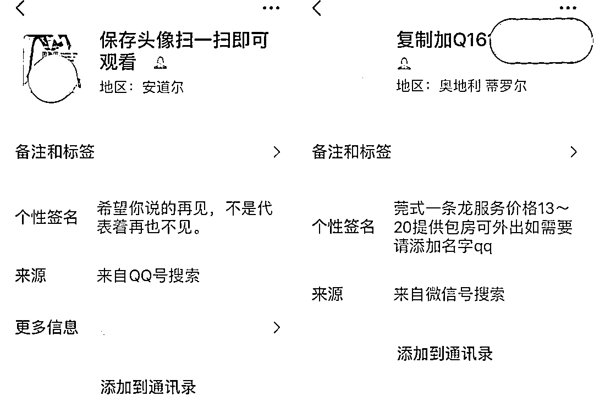

比如上图中显示的两个微信号，并不能直接添加微信好友，但是在头像上有一家放了 QQ 号，有一家则在头像中放了二维码，顺利地完成了引流工作。我就通过 QQ 加了一个 G 公司的业务员。

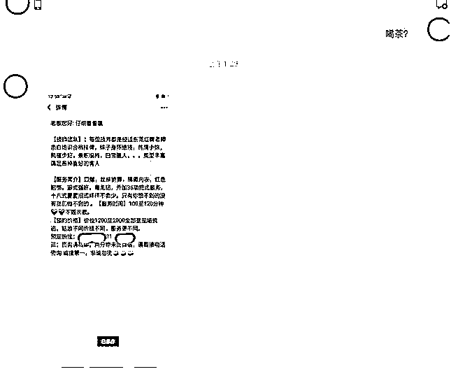

而当我放大那个带二维码的头像时，又有了新发现——原来这是一家视频网站。按照提示扫描后，发现内容非常劲爆。对，这就是一家重口味的成人在线视频网站。

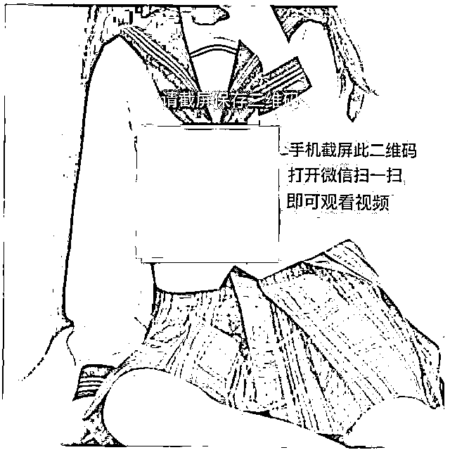

在其网站主页上有各种不堪入目的视频内容，我随手点击一个视频，提示要支付才能观看——其中支付 6.6 元可看一个视频，支付 28 元可在一天内观看全部视频。

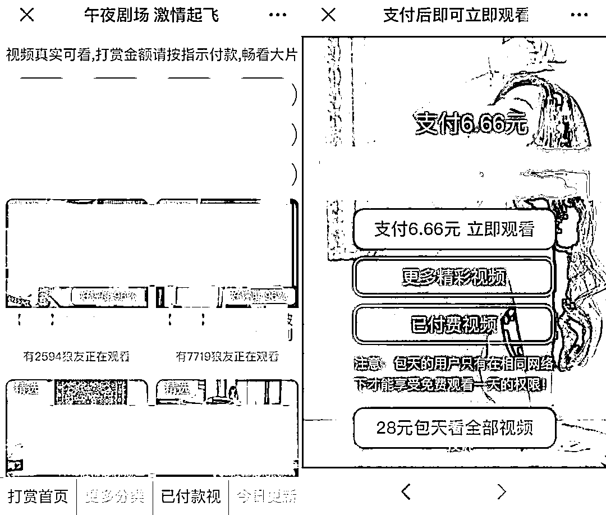

**可见通过抖音到微信的聊天，不止能找“喝茶”的小姐姐，还能轻松找到在线成人网站。**

值得一提的是，相比一些直播账号通过露点踩红线，这类账号发布的内容看起来更健康，不会有太过暴露的内容。而正是这种表面看很正规，加大了平台删选难度。

此外，多级网络渠道跳转，也给不同平台之间提供了推卸责任的空间，即在整个链条当中，到底哪个平台该负主要阻击责任呢？

**第二、网络的便捷让犯罪成本更低。**

**相比线下揽客，通过线上揽客、线下消费的 O2O 模式，揽客成本大大降低。**从上文提供的抖音账号可发现，这些账号内容并不多，粉丝也不多，这意味着此类账号运营成本很低。

事实上，此类账号一般都是批量运作，即使有少数账号被封，也可以迅速补充新账号，几乎不影响揽客。再加上通过互联网，可进行大范围互相推荐，也间接降低了揽客成本。**比如在 2019 年 1 月长沙警方破获的涉恶涉黄网络招嫖犯罪案件中，案件涉及到包括北京、上海、广东在内的 8 省 12 地市。**

而且很多账号一边招嫖，一边还打着模特公司、直播公司的名号招聘新人。

**第三、大数据智能算法推荐+直播短视频展示，让成功率大大降低。**

**在我刷抖音短时间内就找到诸多“喝茶”账号，其实也有抖音算法的“功劳”。**众所周知，刷抖音之所以停不下来，是因为智能算法推荐会投你所好——将相似类容放到你面前，这间接给寻找类似信息提供了方便。

而通过小视频或者直播间真人展示（有账号不定期直播），也能让潜在“嫖客”所见即所得，提高了真实性和诱惑性，从而提高了转化率。

**第四、线下交易还会引发抢劫、涉恶等其它犯罪。**

**相比网络色情直播，直接通过线上支付完成交易。O2O 模式的招嫖犯罪隐藏的问题更多。**

据之前破获的网络招嫖案显示，这些团伙常见的做法是，先通过抖音、微信等基于位置信息发布招嫖联系方式获取“猎物”；“猎物”上钩后再由专业“聊单人”谈妥价格和交易地点；随后模仿网约车模式派单让“车手”、“马仔”护送“小姐”与招嫖人见面；见面后马仔除了收取“嫖资”，有些还以收“出台费”、“车费”为由，对招嫖者威胁、恐吓、欧打，强迫后者付款，或对其实施抢劫。

综上可见，相比网络色情直播，四大挑战提高了打击 O2O 招嫖的难度，净网之路依然任重道远。目前“螳螂财经”已对相关账号和网站都进行了举报。

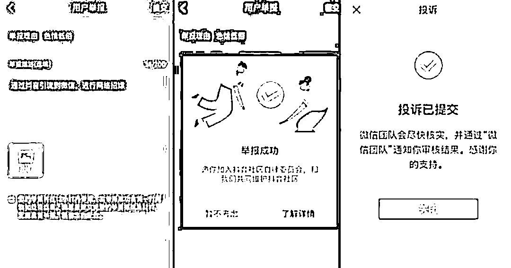

此外，“螳螂财经”还跟抖音方面取得了联系，并反馈了相关问题。截至发文时，平台方以“抖音对作弊、违规帐号及内容的处罚通告 |2020.6”作为回复。

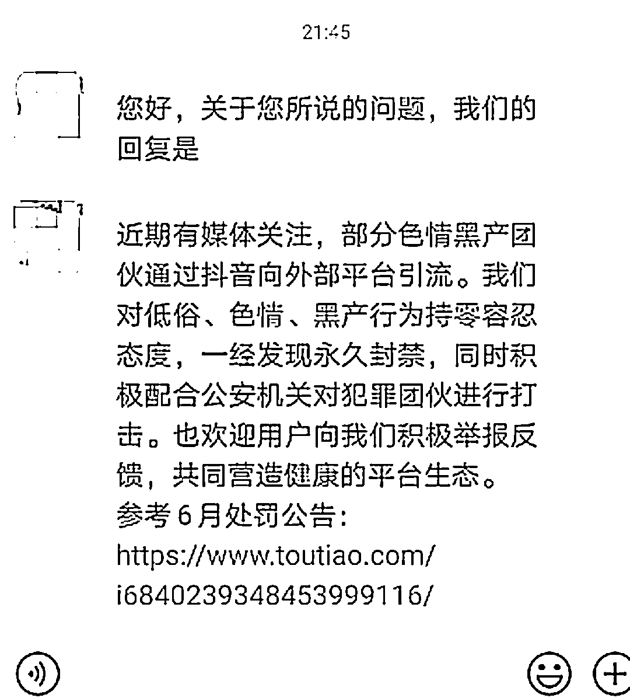

但显然，抖音官方的积极处理，并没有将所有违规内容清除干净。我们也会继续跟踪，期待干净的抖音更好地为用户服务。

**05**

**写在最后**

在电视剧《铁齿铜牙纪晓岚 4》大结局中，和珅因贪污事发，乾隆将其先是关进大牢待了一段时间，随后罚其在宫中清扫茅厕，最后还是让其官复原职。

对此，纪晓岚心知肚明——虽然和珅贪污巨多，但乾隆不忍心杀他，这中间有感情因素，也有利益纠葛——和珅虽然贪，对朝廷有害，但同时他也能干事，也给乾隆个人和朝廷带来很多利益。

于是，在剧末结尾三人喝茶时，乾隆坦言自己对“为君之道”陷入了迷茫。

一方面如果朝廷净是纪晓岚之流，那么不仅他少了很多乐趣，很多不那么光明正大的政策执行纪晓岚也干不了。如果真要杀和珅，继续深查贪腐，估计朝中过半大臣都要被收监处罚。另一方面如果朝廷都是和珅之流也不行，那么便会贪污横生。乾隆最终的选择是两个都要。

**乾隆对待和珅的态度从某种程度上讲，跟平台对待灰产有类似之处。**

各大平台上屡见不鲜的擦边球，如直播短视频平台中的色情、暴力、低俗等内容，电商平台中的刷单等。一方面这会给平台生态带来伤害，另一方面实际也给平台带来了流量。毕竟水至清则无鱼，很多平台甚至在起步初期，就是靠擦边球起量，这样的例子为数并不少。

**最终，在电视剧中，乾隆留下了和珅。那么现实中，平台又该如何对待这些灰产呢？**

文|茶道小白

来源 | 螳螂财经（ID:TanglangFin）

← 向右滑动与灰产圈互动交流 →

**点击****阅读原文****加入灰产圈高端社群**

