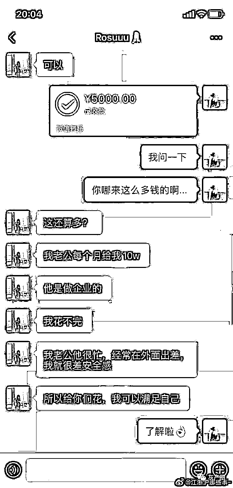

# “我加了一个 ATM 奴，一言不合就打钱，付钱报销还主动求虐？”

> 原文：[`mp.weixin.qq.com/s?__biz=MzIyMDYwMTk0Mw==&mid=2247500407&idx=1&sn=89c71477fe03951e60a0f690dd4fa26f&chksm=97cb094fa0bc80597a482b389abca13c6f6a211a5db369a1f7bd8da3cfd749201f183875b22c&scene=27#wechat_redirect`](http://mp.weixin.qq.com/s?__biz=MzIyMDYwMTk0Mw==&mid=2247500407&idx=1&sn=89c71477fe03951e60a0f690dd4fa26f&chksm=97cb094fa0bc80597a482b389abca13c6f6a211a5db369a1f7bd8da3cfd749201f183875b22c&scene=27#wechat_redirect)

**点击上方蓝色字体免费订阅“灰产圈”**

当你没钱的时候，

有人给你打钱，

帮你报销所有的花销，

这是每个人都曾梦想过的事情。

然而，这却真的能成为现实，

ATM 奴一言不合就转账，

让你肆意花钱。

　　

　　▽

　　看下图先热热身

      ↓↓↓↓↓↓↓↓↓↓↓↓↓

一切都来源于一次粉丝投稿：

顺着粉丝提供的线索，

我在微博找到**@江浙沪那些事 **

　　

　　

相信你看完了也和我刚看到时一样　　

作为吃瓜群众的你们

心里是不是也这么想？

如下图心理活动：

　　▽

　　我特意百度了以下，

ATM 奴竟然还有百度官方词条：

继续调查，其实 ATM 奴很早就出现在网络上了，

而且有此经历的网友竟然还不少，

我们拿出其中几个网友的经历分享以下。

分割线

近日，有杭州的网友爆料，一名陌生人通过社交媒体联系她，可以给她打一点钱吗？

这名女生刚开始以为这就是在说笑，没想到，这个陌生人真的就给她转了账。

并且，打钱的次数很多，每次几百块到几千块不等，这名陌生人还告诉女孩，如果有什么想买的奢侈品，他可以给报销。

遇到这种天降横财的事，女生以为这是曾经的同学或者是朋友，想要捉弄她。

但是这一情况已经持续了 2 个月，打钱的人也没有告诉女孩到底是谁。女孩虽然心有疑问，但是没有去问对方，毕竟，白给的钱，不要白不要。

逐渐，女孩开始依赖这位陌生人，买什么东西都会找他报销。

但不禁得也会在心里想，这会不会是一种新的骗局，为了防止越陷越深，女孩便将自己的经历在网上公开。

这一公开，才发现与她并不是唯一的被金钱砸中的人，有相似经历的人还很多。

来自北京的一名网友表示，自己已经接连几个月受到了陌生人的大额转账。

而且这个陌生人有受虐倾向，在日常的交谈中，陌生人称她为主人，自己是奴才。

打钱的时候，也是卑微的，经常说“主人，您今天的晚餐可以给您报销了吗？、今日的开销能截个图我给您打钱”，诸如此类的话。

分割线

态度诚恳，又无限制打钱，难道世界上真的有这等好事？

有心理学家对于这种现象进行了深入的分析，表示这并不是骗子，这一类人是 ATM 奴，也就是报销奴。

通常都是社会的中上层人士，他们已经获得了金钱上的满足与快感，为了能让自己心理产生幸福感，他们想着另一个目标前进，就是挥霍自己的钱给别人带来快感。

据相关资料显示，ATM 奴最早出现在美国。

一位法裔美国女孩深究心理学，并通过控制心理的方法，让世界范围内 300 余名的富豪成为他的报销奴，每月定时打款。经过多年的发展，报销奴的现象在世界范围内均有出现。

ATM 奴在心理学上被称为恋物癖，追求精神上的奴役。

他们为陌生人提供金钱，将其作为自己的“主人”。类似一种角色扮演游戏，当一个人控制别人太久，他就会产生被别人控制的畸形想法。

在对话过程中，会不断地压低自己的身份。形成了给钱的人低声下气，收钱的人骄横跋扈。

这就是互联网上盛传的一种角色扮演游戏，沉迷扮演人力 ATM 机的大部分都是 30 到 50 岁的上层人士，他们控制别人太久，开始期待权力天平的转移。

从网友们分享的截图来看，打款人与收款方维持着一种微妙的奴役关系——收钱者骄横跋扈，打钱的人毫无自尊。

不仅如此，这一类人还有严格的规则，例如不能违背主人的命令，不能质疑，不能过问隐私等。

给报销，还卑微的听你的话，很多网友表示太羡慕了，简直就是把梦境搬到现实了，哪有 ATM 奴想要一个。

但是还要提醒大家，这还是有风险的，拿了别人的钱，万一会要求你做一些**有偿服务**呢？

← 向右滑动与灰产圈互动交流 →

**点击****阅读原文****加入灰产圈高端社群**

