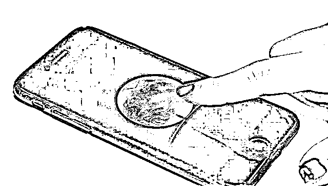
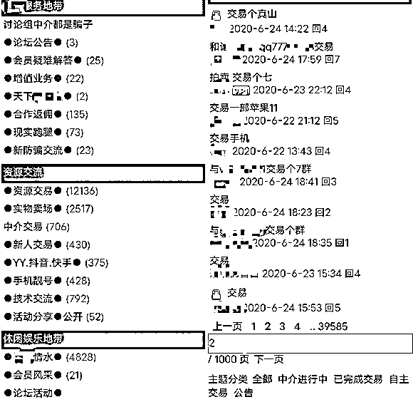
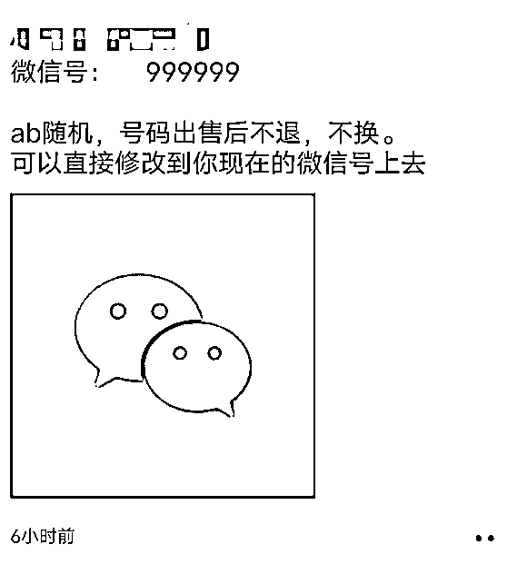
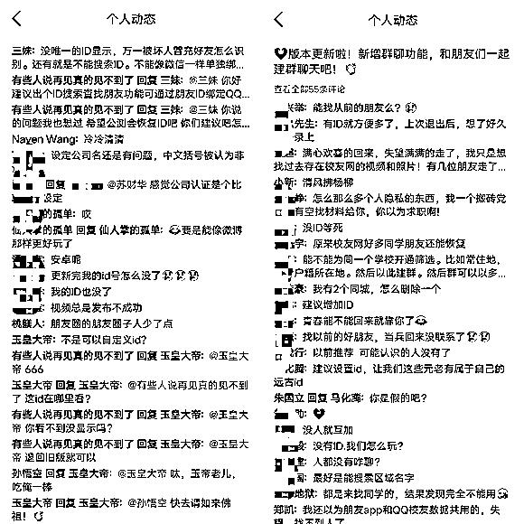

# 起底微信「养号」产业链：有人身家千万，赚了几套房

> 原文：[`mp.weixin.qq.com/s?__biz=MzIyMDYwMTk0Mw==&mid=2247500407&idx=2&sn=7c93df373c7d185d570fb6f3d6cb0df8&chksm=97cb094fa0bc8059baf63ece5a55b4cd6a0847ebae594aa49fdaf027508154a6c058a69877cb&scene=27#wechat_redirect`](http://mp.weixin.qq.com/s?__biz=MzIyMDYwMTk0Mw==&mid=2247500407&idx=2&sn=7c93df373c7d185d570fb6f3d6cb0df8&chksm=97cb094fa0bc8059baf63ece5a55b4cd6a0847ebae594aa49fdaf027508154a6c058a69877cb&scene=27#wechat_redirect)

**点击上方蓝色字体免费订阅“灰产圈”**

图片来源：Unsplash 本文来源：Tech 星球 陈桥辉“ 

微信生态背后的隐秘灰产。

”微信作为一款国民 App，月活高达 11 亿，可以说，微信俨然成了一个巨大的流量池和生态，在这片广阔“肥沃”的生态中，诞生了诸如微信 MCN、微商、微店等商业场景，让一些创业者获得了丰厚的回报。
除此之外，微信背后还隐藏着一些鲜为人知的产业，比如“养号卖号”的生意，这个生意经过了十多年的发展，已经造就出一个庞大的商业生态。近日，张小龙在朋友圈里宣布视频号月活超 2 亿。在微信庞大的流量背后，存在着一个非常隐蔽的产业链。在这链条上，有人瞄上了其中的“商机”，他们大量开通视频号，抢注极品视频号昵称，比如行业词、城市名等，再倒卖给运营买家，或者通过自身所掌握的成百上千个微信号，为视频号运营方提供刷粉业务，从中赚钱丰厚利润。而且，这还只是他们诸多业务中的一种。由于视频号的交易是虚拟的，所以买家被骗也是常有的，微信官方也采取了措施，在还没有开通视频号用户的“个人中心”里，标注了一段“不要相信任何可以购买或者加速开通视频号的方式”的提示。但是，这并不能杜绝交易，只要有利可图，都会有人铤而走险。除了最近爆火的微信视频号，微信号也被瞄上了。微信近日改版，微信号可以进行修改。于是，有很多网友都希望，能重新起一个好记的微信靓号。因此，倒卖微信靓号也就成了一些人的牟利手段，并形成了一个产业链。业内人形容这些从事养号、倒卖账号的人为“养号人”，或者“玩号人”，他们经常拿“币圈”来类比，把微信号看作 BTC（比特币），把 QQ 号看作 ETH（以太坊），“好比是赌徒。”

### **神秘的「养号人」：倒号赚了几套房，身家千万**

说到“养号人”的由来，不得不提到早期注册倒卖网站域名的玩家。玩域名的人，在业界俗称“米农”（域名亦称玉米，取其谐音）。早期的知名“米农”，不乏 58 同城 CEO 姚劲波、美图 CEO 蔡文胜等互联网圈的大佬，靠注册交易网站域名赚取了第一桶金。1999 年，互联网热潮兴起，学计算机专业的姚劲波大学毕业，工作之余做了一个以域名注册交易为主业的“易域网”。几次域名交易，让他名声鹊起，曾拍出 1100 万元高价的极品数字 52.com，便是出自姚劲波之手。后来创办 58 同城时，资金几乎断裂，姚劲波卖了个域名，换了几十万给员工发工资。蔡文胜在 2000 年从一份香港报纸得知，business.com 域名卖了 750 万美元，天价交易额，让蔡文胜醍醐灌顶，随即他开始做起了域名的生意。凌晨 3 点，从睡梦中醒来，抢注域名成为了蔡文胜的日常。但好看的域名实际上很难注册到，而且没有人买的前提下，每年还要续费，所以亏得多、赚得少。蔡文胜把大部分精力，放在抢注那些有价值的域名上。经过短短两年，他就卖出了 1000 多个域名。像爱奇艺、优酷土豆、新浪微博、360 等优质域名交易都出自他的手，而 360.com 域名卖了一个亿，入选史上十大最贵域名交易名单。“米农”们争先恐后地入局，优质的域名越来越少，投入大量金钱却赚不到钱，是当时乃至现在的“米农”的真实写照，于是“米农”纷纷转到抢注极品 ID 账号的行列。极品 ID 账号，包括好看的 QQ 号、邮箱、微博号、微信号、抖音号、快手号、手机靓号等等，这些稀缺的 ID 账号之所以具有价值，是因为除了好看、好记之外，还可以让人在虚拟或者现实生活中，得到身份和荣誉上的心理满足。在早期的互联网中，有些“米农”或者其他从业者，就嗅到了 QQ 靓号的价值和“投资前景”。在 QQ 刚出来时，他们就开始疯狂注册 5 位、6 位 QQ，随着 QQ 注册的人越来越多，短位号资源也逐渐变少，到了 2000 年，QQ 号增加到了 8 位数，现在更是长达 10 位数，他们手中的短位号价值也随之暴涨。在微信问世之前，QQ 是国内第一大社交产品，也是用户量最大的产品。一个短位的 QQ 号，或者排列组合好看的 QQ 号，就像一张漂亮的社交名片，会让许多人去主动加你。腾讯也是看中了这点，所以自己也做起了 QQ 靓号的生意。一位行业资深人士告诉 Tech 星球（微信 ID：tech618），2003 年他曾在 QQ 的官方靓号站上，花了 240 元购买了一张 QQ 靓号卡，可以随机获得一个 5 位的 QQ 号，当年凭着这个 5 位 QQ，有很多人加自己，让自己在虚拟的互联网世界中，备受“尊重”。‘哪怕是现在，也有很多人加他，但是更多人加他的目的，是为了买他的 5 位 QQ 号，而这些人其实就是“养号人”。据他介绍，当时“养号人”报价 1 万收他的 5 位 QQ，但被他拒绝了。Tech 星球在网上搜索 5 位 QQ 号，发现有很多卖 QQ 号的网站，这些 QQ 靓号网站中，对 5 位 QQ 号的标价都在 2 万元以上，而且不乏卖家。假如按“养号人”的 1 万收，2 万卖出去，就可以赚取万元的利润，这怎么会不令人心动？资深“养号人”陈琨向 Tech 星球（微信 ID：tech618）表示，这些收购短位 QQ 的“养号人”，实际上赚的并不多。像那些早期注册 5、6 位 QQ 的“养号人”，靠买卖手中的 0 成本短位号，现在已经赚下几套房了，身家千万的也有。

### **产业链：收号、倒卖、拍卖、代理、抽佣**

而且，“养号人”经过十多年的发展，已经成了一条完整的 QQ 号交易产业链。“养号人”李勇介绍，像 QQ 号的交易，一般会在各种数字论坛中进行，其中交易的 QQ 号不计其数，从 5 位 QQ 到 10 位 QQ 都有，而且像抖音号、YY 号等也可以交易，通常每天的交易量在 1000 以上。论坛中的“养号人”叫做号商，他们提供账号资源，每一单至少可赚取 3 成的利润，所以收号的“养号人”，一般按照现在 QQ 号市价的 7 折收购，然后倒卖。而数字论坛作为平台方，可以赚取交易的手续费，一单至少 5 元，还有网站的广告费、会员费等等。行业人士估算，一个数字论坛每年能赚到至少百万以上。

李勇还透露，像 QQ 号的交易，一般能够赚大头的“养号人”，都会发展自己的代理，有些收费，有些不收费，代理可以获得头部“养号人”的号码资源，再通过加价卖出。“要是勤奋些，一天一般可以赚 200 元以上，最少也能赚几十元，我身边有朋友靠卖 QQ 号，月赚 2 万元，还有一个兼职卖 QQ 号，一个月也能赚 2000 元”，李勇说。有利可图，因此参与的人越来越多，不乏 00 后也参与其中。他们会创建一个 QQ 拍卖群，并成为群管理，卖家通过群管理在群中拍卖 QQ 靓号，拍卖成功后，买家会将中介费给群管理，等 QQ 号成功换绑手机后，群管理将买家的钱打给卖家，完成交易。Tech 星球（微信 ID：tech618）通过与一个 00 后管理员聊天得知，拍卖会通常在晚上进行，“一个群一天会走 100 个成交量，一般一单交易的中介费 5 元，由于每个群管都会独自开拍卖单，所以一天所获得的中介费各不相同，但是一个月至少会有 1000 元进账。”但是，买卖 QQ 靓号的红利期，在持续十多年后，受到了前所未有的影响，一方面，来自腾讯对这类灰产的严厉打击，另一方面，来自于腾讯的另外一款社交产品微信的诞生。

### **微信号修改新规催生商机，出租靓号月赚 3 万**

2011 年，微信的出现，让 QQ 的社交地位受到影响，也让 QQ 号交易行情受到冲击。一位“养号人”向 Tech 星球（微信 ID：tech618）表示，现在的 QQ 靓号是有价无市，而且 QQ 靓号也开始降价出售，自己当时投资的 20 万元，已经赔了一半进去。但他并没有放弃这个行业，“现在已开始进军买卖微信号的市场”。同 QQ 号一样，好看易记的微信号也受人青睐，特别是销售人员以及老板们，他们会钟情好看的微信号。近期，微信改版，新的微信号修改规则，允许用户可以自定义至少 6 位的短位微信号。按照“养号人”的说法，他们会注册 6 位好记的微信号，比如 AAAAAA 这类的微信号，业内叫做“全 A 号”；还有 ABABAB 这类“AB 号”，只要是好看易记的微信号，都会争抢注册，然后拿去卖。今年 6 月，微信开放微信号可以一年一修改的功能，这对于“养号人”来说，是一次难得的机会，他们可以把手里的囤积的微信靓号，卖给那些想要靓号，但却注册不到靓号的买家。最近，“养号人”的朋友圈中，也多了许多迁移微信号，或者直接代注册微信号的生意，一单在 80-150 元之间。

当然，好看的微信号也并不都是通过直接修改而来的，有部分来自手机号，还有部分来自 QQ 号。为什么会来自手机号和 QQ 号呢？这就要说到微信加好友的机制了。由于当时，微信可以绑定手机号和 QQ 号，在微信中，用户可以直接搜索对方的手机号或 QQ 号加好友，才形成了现在的微信社交关系链。如今的微信中，仍然保留这两个加好友的功能，那么像短位以及排列组合好看易记的 QQ 号，成为了争抢的对象，而手机靓号同样也成为了商人们的选择，微信号的交易不仅变得多样化，而且也越加繁忙起来。据 Tech 星球（微信 ID：tech618）了解，部分手中掌握 5、6 位 QQ 的“养号人”，在倒卖 QQ 号的同时，也开始对一些买家出租 5 位 QQ 号在微信中的“绑定权”。5 位 QQ 号的出租费，根据类型的不同，价位也不同，一般的 5 位 QQ 号每月 500 元，像尾号是连着相同数字的，俗称豹子号，每月出租费可达上万，买家多为销售人员以及玩号的人。一个“养号人”凭着手里短位 QQ 号的出租，一个月可以赚 3 万元。而倒卖手机靓号的从业者，同样会在出售手机号时，打上通过手机号加微信好友的标签，一些尾号 4 连（比如手机号 12345678888）的价格在 3 万左右，尾号的连号越多，价格也会越高。

### **灰产的延伸：代点赞、投票、刷粉，跨平台抢注**

在“微信靓号”的生意之外，有“养号人”开启了另外的生意，比如代刷。一位不愿具名的专注微信代刷人员告诉 Tech 星球（微信 ID：tech618），微信代刷服务的出现，是由于许多平台进行投票、点赞等活动时，可以选择微信第三方登录，那么也就意味着，一个微信号等于一票。像他手里有上千个微信号，可以提供成百上千的点赞、投票和刷粉业务，比如点一个赞的价格是 0.1-0.3 元左右，由于积少成多，所以一个月的成交额在 7000 元。他表示，自己做的规模比较小，规模做得大的“养号人”，其微信号会更多，而且会买上千个二手手机，每天登陆上千个微信号保持活跃，“因为不活跃的微信号会被腾讯微信平台收回，或者封禁”，同时也能保证生意到了，就可以接单干活，避免一个手机多次换号的繁琐操作。这位代刷“养号人”还向 Tech 星球介绍说，除了上述外部业务外，微信生态体系内的业务也做，“比如，通过手里的微信号，去抢注极品视频号账号昵称，还有微信圈子昵称等等，然后把这些账号昵称卖给需要的人，同时为他们提供配套的点赞刷粉业务。由内到外，只要能够赚到钱，都会去做。”基于微信号的灰色生意，链条还在继续延伸。微信号可以作为第三方，登录许多 App。所以，“养号人”也会将号码生意转移到其他 App，由于一些 App 也有着和微信号一样的功能，每当互联网大厂上线新的 App 产品，“养号人”就会通过微信号登录该 App，进行 ID 或者昵称的抢注，比如抖音号、快手号。有些养号人，甚至会为此“铤而走险”。媒体曾报道，抖音公司发现，数据库内至少 2900 余个抖音账号被修改了，后经调查，付某应下家需求，以 1 万元的价格定制抖号“88888888”，下家以 1.5 万元的价格卖给了实际使用者。由于养号本身是灰色产业，所以平台会对这类行为予以打击。据“养号人”张伟介绍，去年底，腾讯推出了一款名为“朋友”的社交 App，上线当晚他注册了几百个好记的 ID 账号，而且许多“养号人”也蜂拥而至赶来抢注。“朋友”App 官方发现了这个问题，于是取消了 ID 账号的显示，虽然打击了“养号人”，但也带来了诸多不便，比如用户无法通过 ID 加好友。因此，大量用户在官方动态下留言评论，表达对 ID 重新显示的诉求。

其实，这只是平台方对养号行为的一种打击办法，像抖音、腾讯以及微博等平台，会不时的对这类灰产行业采取封群、封号的处理办法。而“养号人”也会与这类平台进行周旋，继续从中牟利。现如今，越来越多的“养号人”开始向微信转移，并凭着微信号多点散发，账号交易逐渐成为他们日常收入的主要来源。“有利益的地方就有恩怨，有恩怨就有江湖，养号人就是江湖，你怎么退出？”这也成为了养号人的写照。随着今年《民法典》的颁布实施，以及民商事法律对虚拟财产的规定不断细化，合法的网络虚拟财产，和普通现实财物一样，成为买卖、赠与或者继承的标的。这也就意味着，网络账号交易这个行业，将会被赋予新的意义，但作为平台方，如何在法律框架界定养号的行为，也将会成为他们考虑的一个重点。但是，养号毕竟是一个灰产，一不小心就会触碰红线。养号的生意和产业，正在变得越来越大，但这种产业的不少行为的界定，还处于模糊地带，对于“养号人”来说，未来充满了未知数。

应受访者要求，陈琨、李勇、张伟为化名。

← 向右滑动与灰产圈互动交流 →

**点击****阅读原文****加入灰产圈高端社群**

