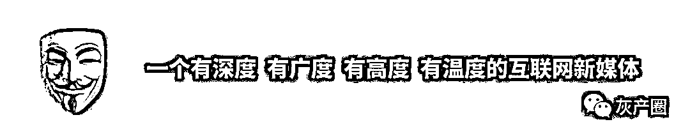
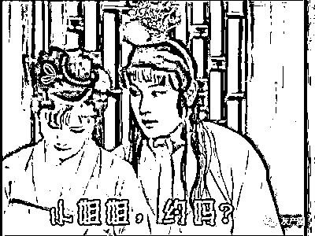
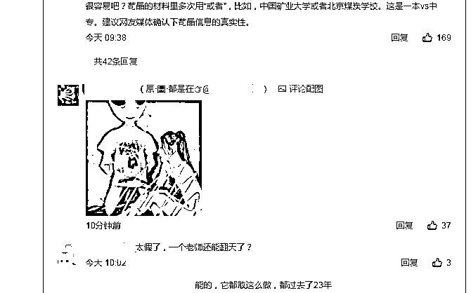
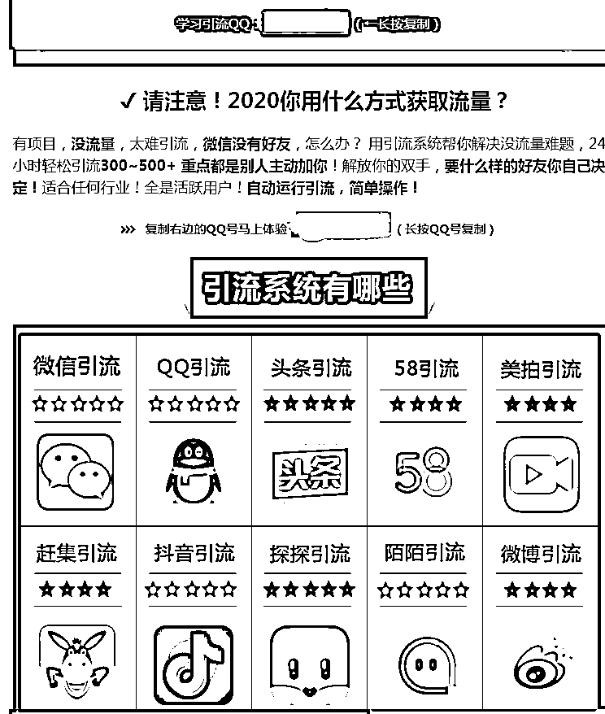
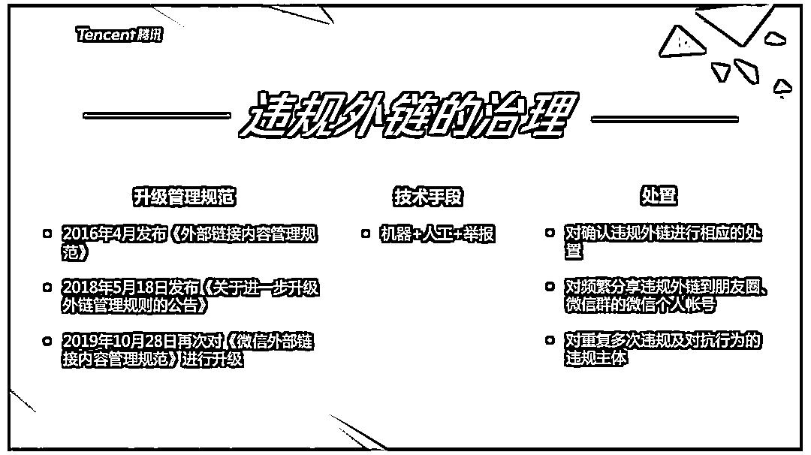

# 你被卖片的盯上过吗？揭秘微博评论区“小黄文”泛滥背后

> 原文：[`mp.weixin.qq.com/s?__biz=MzIyMDYwMTk0Mw==&mid=2247500407&idx=3&sn=40f7f6624b9f31f9c8ea86d5ce169658&chksm=97cb094fa0bc8059ed812990952219f5137c9d73c1bd67658526751cd47a7cf02b0ba8057364&scene=27#wechat_redirect`](http://mp.weixin.qq.com/s?__biz=MzIyMDYwMTk0Mw==&mid=2247500407&idx=3&sn=40f7f6624b9f31f9c8ea86d5ce169658&chksm=97cb094fa0bc8059ed812990952219f5137c9d73c1bd67658526751cd47a7cf02b0ba8057364&scene=27#wechat_redirect)

**点击上方蓝色字体免费订阅“灰产圈”**

在评论区“小黄文”泛滥的背后，是一条隐秘的违规引流产业链。

****

**经常刷微博的人可能都会有这个烦恼：在微博、微信、QQ 等社交软件中，不少“卖片哥”以评论、关注、发私信等方式为违规网站引流，其发送的不雅内容已经成为了网络世界的“牛皮癣”。

如今，“卖片哥”的行为受到了限制。

微博整改后，对互联网黑产的打击更严，6 月 12 日，微博设置了关注七天才能评论的规则，并表示这一措施旨在打击非法网站引流，进行涉黄视频交易的违规内容。这限制了部分用户体验，也让一些在热门微博评论中以诱导文字卖片卖药的违规广告发布者们失去了一个重要的引流场所。

随着各个平台对这类广告行为的打击， “卖片哥”们的手段也不断翻新，而这些恶意引流行为的受害者往往是想要清净网络环境的普通用户，以及不谙世事的好奇未成年人。

新京报记者调查发现，在评论区“小黄文”泛滥的背后，是一条隐秘的违规引流产业链，而在评论区审核日趋严格之后，这样的恶意引流行为也可能出现在普通用户的私信、关注甚至点赞的背后。

“引流产业其实就是营销黑产，其特点是大量利用正常公民的身份信息，绕过平台限制规则，发送大量涉黄涉政、低俗广告等引流内容，并最终以诈骗等形式变现。”反欺诈实验室专家李柚（化名）告诉记者。** 

*******评论区“卖片”遭严打后，*******

*******以“楼中楼”等方式规避审查*******

 ****“好好反思一下，为什么你会被卖片的盯上。”这句话曾是微博评论中网友经常调侃的句式，但一旦评论区真的被各种黄评淹没，绝大多数网友都会感到不适。

网友“姜姜姜姜呢”就在 5 月发微博抱怨称，自己的微博“被搞黄色的盯上了”，并贴出了不少在其评论区发布的恶意评论，不少网友表示这些卖片哥“无处不在”，只要微博上了热搜拥有流量，评论区往往会吸引来这类具有引流性质的评论。

记者发现，不少黄评打着例如“公公儿媳”、“大长腿绿茶 biao”等关键词，吸引用户点击，点击后往往会跳转至色情网站，并要求用户付费。

目前，虽然微博严控评论区评论，但不少“卖片哥”仍然能钻到空子。

6 月 27 日，新京报记者在某热门微博评论区中发现了“卖片哥”的踪迹，但其“卖片”的手法变得颇为复杂：首先其并没有直接在热门微博下评论，而是在热门微博评论区中排名靠前的评论中回复，属于“评论中的评论”，评论内容则是一张半裸美女的图片，并配以文字：原图在@XXX。记者点击该评论@的微博用户，发现其主页有大尺度的色情图片，并附有网站链接，点击网站链接发现其跳转至了某“卖片”网站，表示 28 元可以购买色情影片，并提供了支付宝的付款方式。至此，通过微博评论区引流至色情网站的流程完成。**** 

********

****新京报记者发现，受微博“严打”黄评的影响，该“卖片哥”只能评论已发布的评论，以“楼中楼”的方式实现引流，过程相比此前直接在热搜中回复不雅评论更加曲折，这增大了恶意引流的成本，但也说明无论平台如何封禁，违规者们总能找到方式对抗平台的封禁规则。

“平台与恶意引流黑产处于动态对抗的过程中。”李柚告诉记者，“如果规则过严，会发生误删，影响用户的体验，做到完全封禁灰黑产引流行为并不现实，除非让所有人都不能评论。但规则放松又会被灰黑产趁虚而入，只能逐渐加大灰黑产的引流成本，让他们知难而退。”**** 

*********评论、私信频现色粉引流“机器人”，*********

*********价格 1 元到 388 元不等*********

********微博并非“卖片哥”们唯一的战场。QQ、微信、陌陌、抖音等不少具有社交性质的 APP 均是这类“卖片哥”们活跃之地。

有网友反映，其在 QQ 上发布的说说总有陌生用户评论，评论内容通常是随机的文字，但若点击该陌生用户头像，通常“别有洞天”。

6 月 23 日，新京报记者点击一个“先看我头像”的 QQ 用户的评论，发现若进入该用户的空间，会跳转至腾讯微云文件分析页面，但文件内容只有一张附有二维码的图片，使用扫一扫识别该二维码，又会跳转至另一张附有二维码以及露骨内容的图片，再扫这张二维码，则会跳转到色情网站，若想要看网站视频，必须支付 6 到 25 元的费用。

一家号称提供“各个平台色粉引流”的黑产工作室表示，可以 2 元一人的价格提供引流服务，但只能引流到记者提供的微信号上。“如果直接打网站地址容易被封，我们会通过话术把粉丝先引流到你的微信号或 QQ 号，你自己再以发私信的方式进行引流。”

新京报记者发现，这些引流的工作室几乎都采用机器脚本批量发送私信。6 月 26 日，记者以相关关键词搜索发现多家从事引流服务的“工作室”，有工作室还兼职出售“引流机器人”脚本，这些脚本涉及微信、微博、QQ、头条、抖音、陌陌、58 同城、赶集网、美拍、Soul 等多个平台，价格从 1 元（单个平台）到 388 元（多平台打包价）不等。******** 

****************

********为进行调查，记者以 35.2 元的价格在一个商家手中购得一套包含喜马拉雅、微信、抖音、美拍、微博、探探等 22 个平台在内的“定制版引流脚本”。打开该脚本后，记者发现其“功能设置”中包括视频评论、粉丝私信、粉丝关注、评论私信、评论关注、评论点赞、好友私信共 7 项功能，在该页面，用户可以手动输入评论话术与私信话术，此外，还可以进行发图设置、重复发送、添加关注、双话术等常规设置，亦可筛选男女。

对此，北京盈科（杭州）律师事务所方超强律师对新京报记者表示，通过言语诱导等方式将不同平台的用户引流到微信号上的行为至少涉及虚假广告，“如果这一行为最终售卖的是正当商品，涉嫌营销手段违规，毕竟这属于虚假广告。而如果售卖的是淫秽物品或者进行诈骗，那么提供引流服务的也要作为同案犯被抓，因为哪怕只是商业上的委托关系，也提供了商务上的合作，对于淫秽物品的扩散是发挥了作用甚至是主要作用的。”******** 

***********多次跳转对抗平台封禁，***********

***********恶意外链如何治理？***********

 ********新京报记者注意到，无论是评论、私信还是关注，从正规社交平台引流至违规网站必然经历的过程就是跳转至外链，这一步往往会成为平台重点打击的地方，因此不少黑灰产不惜通过多次跳转的手段对抗封禁，如上文中通过 QQ 头像引流至违规网站的整个过程跳转了三次才“进入正题”。

“这是没有办法的事。”在外网的某黑灰产交流论坛中，一名灰黑产从业者表示，“早期可以直接发送 H5 链接进行引流，（色情）APP 还鼓励用户通过微信 QQ 推荐人下载，拉新引流，但后来我们发现平台的监管越来越严，如果直接发送下载 APP 或者网站地址的外部链接，会被微信直接封禁，所以现在引流在正规平台上越来越难做。”

微信安全风控中心总监、安全专家钟广君告诉记者，外链在展现形式上包括卡片链接、图片二维码。“根据《微信外部链接管理规范》，我们把违规的标准划分为 19 个大类，包括常见的诱导分享、低俗垃圾广告、集赞、欺诈等。今年一月份以来，我们共计对超过一百万条已经取证确认的违规外链进行了处理，违规外链整体下降 35%，诱导分享类的链接下降 40%，红包欺诈类持续下降 60%。”

“我们的愿景就是希望微信朋友圈和微信聊天都是分享生活点滴的场所，但是一些黑灰产的场所就是利用外部链接大做文章，诱导强制用户分享传播，这些违规外链中往往大概率会包含一些垃圾营销、低俗、欺诈等恶意的内容，严重破坏了我们正常用户的正常体验甚至影响平台健康生态。另外，这类大量的违规外链又延伸出一系列的黑灰产产业，例如违规外链为了躲避微信的安全策略和打击需要，需要储备大量的 URL，储备大量的网络域名，这不仅仅严重危害微信平台，甚至影响整个互联网的发展顺序和规范。”钟广君表示。******** 

****************

********新京报记者注意到，为打击非法网站引流行为，微博也进行了技术升级。日前，微博公告称，近期微博评论中出现较多向站外非法网站引流，进行涉黄视频交易的违规内容。站方对此类互联网黑产行为进行了集中和快速处置，同时也引发了黑产组织对微博安全措施的激烈对抗。为了有效遏制互联网黑产对平台和用户的骚扰，微博将进一步升级技术识别体系。同时，微博已经开展了为期两个月的恶意营销账号专项整治行动。仅在 6 月 12 日至 18 日，微博就处置了 80 多个涉黄低俗类粉丝较多的营销大号，以及 21 万个涉黄低俗类小号。

“可以看到,恶意流量其实包含非常多的问题，如果仅凭一个互联网公司或者网络平台的工作或者是依靠主管机关的打击我感觉是远远不够的，构建一个清朗的网络环境不仅需要我们大的网络体系还需要互联网平台、普通用户以及多个监管部门、主管机关的多方参与进行社会共治。”钟广君表示。********

********值班编辑 花木南新京报记者 罗亦丹 编辑 李薇佳 校对 张彦君********

************************************************

********← 向右滑动与灰产圈互动交流 →********

**************************点击****阅读原文****加入灰产圈高端社群**********

****************