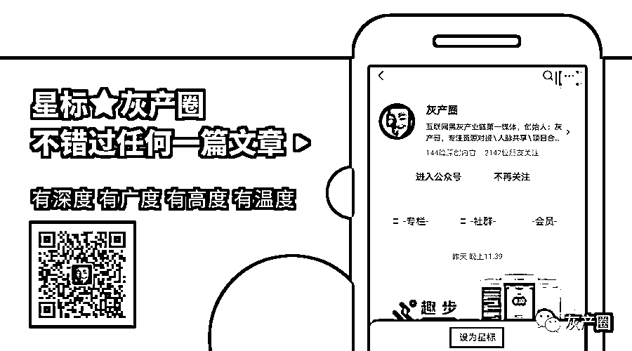

# “虚拟货币” “区块链” “消费返利” 三剑客

> 原文：[`mp.weixin.qq.com/s?__biz=MzIyMDYwMTk0Mw==&mid=2247500460&idx=1&sn=7f48e8502251cb50cebd245422d18f37&chksm=97cb0994a0bc8082d027f258e9ddafe78005a0deaace88fec5309ee3bed3cfb2eed8bfb740d3&scene=27#wechat_redirect`](http://mp.weixin.qq.com/s?__biz=MzIyMDYwMTk0Mw==&mid=2247500460&idx=1&sn=7f48e8502251cb50cebd245422d18f37&chksm=97cb0994a0bc8082d027f258e9ddafe78005a0deaace88fec5309ee3bed3cfb2eed8bfb740d3&scene=27#wechat_redirect)

**点击上方蓝色字体免费订阅“灰产圈”**

投资“虚拟货币”“区块链”

或者参与“消费返利”获高额回报？

当心，这可能是非法集资！

近年来

各种非法集资、金融诈骗

假借金融创新、区块链概念等之名

行**非法集资**、**金融诈骗**之实

给人民群众造成巨大经济损失

严重影响了经济社会秩序

下面，请各位和小编一起擦亮双眼

识破非法集资常见套路

了解非法集资相关知识

金融业是特许经营行业

必须持牌经营

俗称的金融牌照是指相关机构经国家金融监管部门批准，从事特定的金融业务的许可证，由人民银行、银保监会、证监会颁发。必须经许可才可开展的金融业务主要有银行、保险、信托、证券、期货、金融租赁、公募基金、第三方支付等。资产管理业务，属于金融业务范畴，必须持牌经营，必须纳入金融监管。

居民如有理财需求，应当选择银行、信托、证券、基金、期货、保险资产管理机构、金融资产投资公司等持牌金融机构发行的资产管理产品等。

**未经金融监督管理部门许可，任何非金融机构和个人不得代理销售资产管理产品。**

投资“虚拟货币”

“区块链”靠谱吗？

一些不法分子打着“金融创新”“区块链”的旗号，通过发行所谓“虚拟货币”“虚拟资产”“数字资产”等方式吸收资金，侵害公众合法权益。此类活动并非真正基于区块链技术，而是炒作区块链概念行非法集资、传销、诈骗之实，主要有以下特征：

**1、网络化、跨境化明显。**

依托互联网、聊天工具进行交易，利用网上支付工具收支资金，风险波及范围广、扩散速度快。一些不法分子通过租用境外服务器搭建网站，实质面向境内居民开展活动，并远程控制实施违法活动。一些个人在聊天工具群组中声称获得了境外优质区块链项目投资额度，可以代为投资，极可能是诈骗活动。这些不法活动资金多流向境外，监管和追踪难度很大。

**2、欺骗性、诱惑性、隐蔽性较强。**

利用热点概念进行炒作，编造名目繁多的“高大上”理论，有的还利用名人大 V“站台”宣传，以空投“糖果”等为诱惑，宣称“币值只涨不跌”“投资周期短、收益高、风险低”，具有较强蛊惑性。实际操作中，不法分子通过幕后操纵所谓虚拟货币价格走势、设置获利和提现门槛等手段非法牟取暴利。此外，一些不法分子还以 ICO、IFO、IEO 等花样翻新的名目发行代币，或打着共享经济的旗号以 IMO 方式进行虚拟货币炒作，具有较强的隐蔽性和迷惑性。

**3、存在多种违法风险。**

不法分子通过公开宣传，以“静态收益”（炒币升值获利）和“动态收益”（发展下线获利）为诱饵，吸引公众投入资金，并利诱投资人发展人员加入，不断扩充资金池，具有非法集资、传销、诈骗等违法行为特征。

**此类活动以“金融创新”为噱头，实质是“借新还旧”的庞氏骗局，资金运转难以长期维系。请广大公众理性看待区块链，不要盲目相信天花乱坠的承诺，树立正确的货币观念和投资理念，切实提高风险意识；对发现的违法犯罪线索，可积极向有关部门举报反映。**

消费返利这种模式

可以参与吗？

近期，一些第三方平台打着“创业”“创新”的旗号，以“购物返本”“消费等于赚钱”“你消费我还钱”为噱头，承诺高额甚至全额返还消费款、加盟费等，以此吸引消费者、商家投入资金。此类“消费返利”不同于正常商家返利促销活动，存在较大风险隐患：

**1、高额返利难以实现。**

返利资金主要来源于商品溢价收入、会员和加盟商缴纳的费用，多数平台不存在与其承诺回报相匹配的正当实体经济和收益，资金运转和高额返利难以长期维系。

**2、资金安全无法保障。**

一些平台通过线上、线下途径，以“预付消费”“充值”等方式吸收公众和商家资金，大量资金由平台控制，存在转移资金、卷款跑路的风险。

**3、运营模式存在违法风险。**

一些平台虚构盈利前景、承诺高额回报，授意或默许会员、加盟商虚构商品交易，直接向平台缴纳一定比例费用，谋取高额返利，平台则通过此方式达到快速吸收公众资金的目的。部分平台还采用传销的手法，以所谓“动态收益”为诱饵，要求加入者缴纳入门费并“拉人头”发展人员加入，靠发展下线获取提成。平台及参与人员的上述行为具有非法集资、传销等违法行为的特征。

**此类平台运作模式违背价值规律，一旦资金链断裂，参与者将面临严重损失。按照有关规定，参与非法集资不受法律保护，风险自担，责任自负；参与传销属违法行为，将依法承担相应责任。请广大公众和商家提高警惕，增强风险防范意识和识别能力，防止利益受损。同时，对掌握的违法犯罪线索，可积极向有关部门反映。**

养老领域非法集资有哪些？

一些养老服务机构、企业打着养老服务、健康养老名义，承诺高额回报，以向老年人收取会员费、床位费，欺诈销售“保健品”等手段，实施侵害老年人合法权益的非法集资、传销等犯罪，给老年人造成严重财产损失。此类活动不同于正常养老服务，存在较大风险隐患：

**1、高额返利无法实现。**

返利资金主要来源于老年人缴纳的费用，属于拆东墙补西墙。多数养老服务机构、企业不存在与其承诺回报相匹配的正当服务实体和收益，资金运转难以持续维系，高额返利仅为欺诈噱头。

**2、资金安全无法保障。**

一些养老服务机构明显超过床位供给能力承诺服务，或超出可持续盈利水平承诺还本付息，并以办理“贵宾卡”“会员卡”“预付卡”等名义，向会员收取高额会员费、保证金或者为会员卡充值，吸收公众资金。大量来自公众的资金未实施有效监管，由发起机构控制，存在转移资金、卷款跑路的风险。

**3、健康需求无法满足。**

一些企业通过会议营销、健康讲座、专家义诊、免费检查、免费体验、赠送礼品或者不合理低价旅游，以及电话推销、上门推销、网络销售等形式，向老年人进行虚假或者引人误解的商业宣传，推销所谓“保健品”，因“保健品”概念无法律定位，经常被采用偷梁换柱、偷换概念的手法，与合法注册批准的药品、医疗器械、保健食品等进行混同，骗取消费者信任，但所声称的保健功能未经科学评价和审批，往往不具备保健功能，甚至贻误病情。 

**4、运营模式存在违法风险。**

一些养老服务机构销售虚构的养老公寓、养老山庄，或者以投资、加盟、入股养生养老基地、老年公寓等项目名义，承诺返本销售、售后包租、约定回购、销售房产份额等方式吸收资金。部分企业不具有销售商品的真实内容或者不以销售商品为主要目的，而是以免费旅游、赠送实物、养生讲座等欺骗、诱导方式，采取商品回购、寄存代售、消费返利等方式非法吸收公众资金。相关机构及参与人员的上述行为存在非法集资等风险。

**按照有关规定，组织实施非法集资应承担相应责任，参与非法集资风险自担。请广大老年人和家属提高警惕，增强风险防范意识和识别能力，自觉远离非法集资和传销，防止利益受损。如发现涉嫌违法犯罪线索，可积极向有关部门举报。**

“炒汇理财”

是靠谱的投资渠道吗？

目前存在大量面向境内用户、以“外汇交易”为旗号进行融资分红的平台，都不靠谱！近年来，已有多起外汇理财平台崩盘跑路、突然关闭或被定性为传销诈骗等风险的事件发生，它们的风险主要有四类：

**第一类是业务牌照涉嫌造假。**

部分外汇理财平台为了吸引投资者往往声称自己受权威机构监管，或宣称拥有授权。近期，就有公司声称“获得英国 FCA 认可并受其全面监管的金融机构”，并附上了 FCA 代码，但经查询发现，代码对应的网站与该公司并不一致。

**第二类是交易过程不透明。**

部分外汇理财平台对外宣称“资金安全，只赚不赔”。这些平台资金并未依法购汇并汇至境外投资，而是在交易过程中被“暗箱”操作、不断蚕食。例如，部分平台就是其客户的交易对手方。新手往往能够获得较高的收益，但投资者加大投入后会慢慢出现亏损的情形，在平台的建议下操作或者采用自动跟单的模式也会出现这样的情形。

**第三类是利用“传销模式”发展客户。**

部分外汇平台以“互助理财”的名义，发展下线，按层级返利的方式不断吸引新投资者加入，这种模式涉嫌传销。例如，外汇平台沃尔克（http：//walkert.cc）声称“自己是一家百年历史的英国金融公司，受 FCA 监管，保证客户本金安全，投资者每个月可获得最低比例收益和三次分红，同时投资者可以通过发展线下获得提成，一般可以获得 10 层下线一定比例的分红。”该平台通过这种业务模式迅速吸引了大批投资者。经核查发现，沃尔克并不在 FCA 的监管范围，且该平台已无法正常提现。

**第四类是打着“外汇交易”旗号“持续高额分红”。**

部分平台以“外汇交易”为旗号融资，进行“持续高额分红”。这类模式成立的前提是建立在“外汇交易”盈利始终大于“分红”的基础上，而盈利有不确定性，这类平台宣称的持续盈利绝不可能，极可能就是“庞氏骗局”。

个人投资私募基金

需要注意哪些？

投资前，建议到**中国证券投资基金业协会网站(http://gs.amac.org.cn)**查询该私募基金公司是否登记，该私募产品是否备案。

同时，购买私募产品必须符合法定合格投资者条件，具备相应风险识别能力和风险承担能力，投资者金融资产不低于 300 万元或者最近三年个人年均收入不低于 50 万元。单只私募基金产品的投资金额不低于 100 万元。实际投资这只私募产品的总人数不能超过 200 人。私募产品不能向不特定对象销售。

** 所以遇到以下情形请注意：**

1、如果你投个 5 万元就买到了私募产品，那一定是遇到骗子了；

2、如果你接到一个陌生推销电话或者短信，或者看到宣传单，然后买的私募产品，那一定是骗子；

3、如果有人拉你免费旅游 ，然后在度假酒店开投资报告会，从此搭上了私募的幸福便车，那么你上当了！

**天上不会掉馅饼**

**保住你的血汗钱**

****防范“非法集资”！****

来源：省市场监管局信用监管处，利箭在行动

编辑：广东市场监管

← 向右滑动与灰产圈互动交流 →

**点击****阅读原文****加入灰产圈高端社群**

